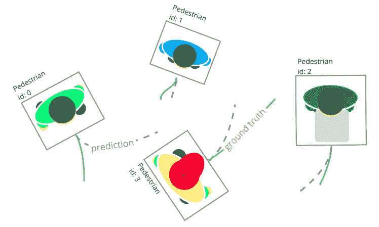
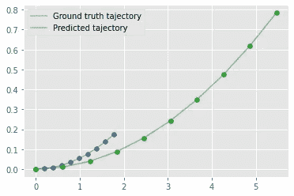
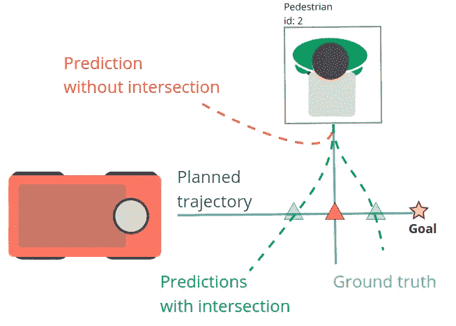
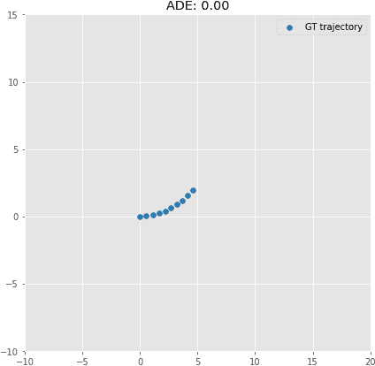
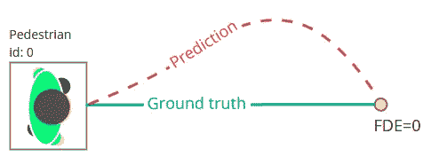
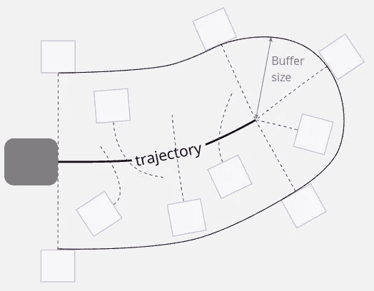
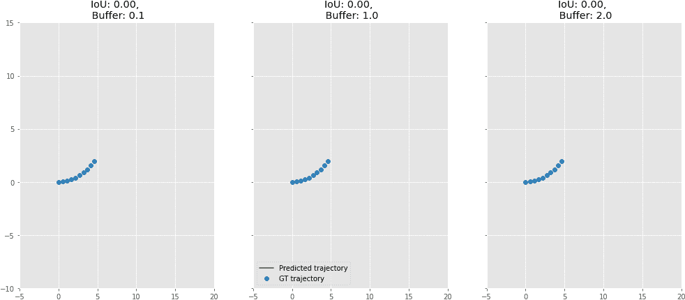

# 为什么阿德和 FDE 不是运动预测的最佳指标

> 原文：<https://towardsdatascience.com/why-ade-and-fde-might-not-be-the-best-metrics-to-score-motion-prediction-model-performance-and-what-1980366d37be?source=collection_archive---------6----------------------->

## [行业笔记](https://towardsdatascience.com/tagged/notes-from-industry)

## 最流行的运动预测度量的缺点和可能的替代方法。

[图片由作者提供]

## 介绍

现代自动驾驶技术通常意味着三种任务:感知、预测和规划任务。感知提供关于周围环境、静态和可移动障碍物的信息。预测提供了观察到的可移动物体的未来轨迹。在规划期间，该信息被处理，然后创建相对于机器人目标的未来轨迹。

首先检测周围物体(感知)，然后预测其未来轨迹(预测)然后规划机器人路径(规划)[图片由作者提供]。

预测方法有很多种，大部分都是产生一个或几个预测轨迹。为了获得预测的质量度量，应该将预测轨迹与地面真实轨迹进行比较，为了做到这一点，有多种可能的度量可用。原则上，它可以是任何能够比较两个时间序列的函数，例如，[最长公共子序列](https://en.wikipedia.org/wiki/Longest_common_subsequence_problem)或[豪斯多夫距离](https://en.wikipedia.org/wiki/Hausdorff_distance)。

预测和地面真实轨迹的例子。为了评估预测的质量，应该将它们与一些度量标准进行比较。

最常见的度量是平均位移误差(所有轨迹点之间的平均 L2 距离)和最终位移误差(最终轨迹点之间的 FDE - L2 距离)。

平均位移误差(ADE)和最终位移误差(FDE)[图片由作者提供]。

这些指标很容易计算，也相对容易解释，但是它们有一些潜在的缺点，我想在这篇博文中讨论一下。首先，让我们从平面的角度来看一个预测轨迹的质量。

## 规划者视角

一般来说，规划者的任务之一就是避免与周围物体发生碰撞。从这个角度来看，如果预测的轨迹导致与自我-智能体路径相同的交集，这是一个很好的预测。在这种情况下，规划者可以根据预测采取行动，避免进一步的碰撞。如果预测的轨迹与未来的自我-代理路径完全不相交，但地面真相相交，则可以视为最坏的情况。在这种情况下，计划者可能不会行动并击中目标。介于两者之间的情况可能会导致更安全的情况(如预测更早的交叉口)和更危险的情况(如预测更晚的交叉口)。

机器人可能会与有交点的轨迹对齐，而忽略没有交点的轨迹[图片由作者提供]。

因此，这里的要点是，预测应该提供与机器人的规划路径尽可能接近地面事实的交集。

## 艾德和 FDE 怎么了

阿德和 FDE 没有考虑所提供的交叉点是否接近地面真相，此外，这两种度量标准可以对指向相反方向的轨迹进行相似的评分。为了说明这一点，我们来看下面的动画:

具有相同 ADE 分数的轨迹子集[图片由作者提供]。

考虑一些任意的地面真实轨迹(蓝点)。有一个具有相似 ADE 分数的轨迹子集，该分数在动画的每一步都从 0 到 5m 变化。可以看到，有许多轨迹指向不同甚至相反的方向，但这些轨迹与更长但指向正确方向的轨迹得分相同。FDE 度量表现类似。

此外，FDE 还有一个额外的缺点，它可以完全错误的轨迹得分。考虑下面的图像:

两条轨迹都有一个相似的终点[图片由作者提供]。

在这里，FDE 得分的值最低，为 0。但是预测的轨迹并不完美。这些缺点使得创建另一个没有这些属性的指标成为明智的选择。

## 我们能做些什么呢？

把轨迹的“相交能力”考虑进去，似乎是合理的。最直接的方法可能是测量到地面真实交点的距离，但这很难，因为它取决于机器人的规划路径。此外，这种度量没有考虑没有交叉点的轨迹的质量。那么如何才能在交集能力上建立代理呢？

我们可以把一个轨迹的相交能力看作它可以相交的轨迹集的大小。这样一个集合是无限的，为了使它易于处理，我们可以通过限制离轨迹的距离来考虑它的子集。通过这样做，可以在轨迹周围创建一个缓冲区，该缓冲区可以作为相交能力的代理。

可作为轨迹相交能力代理的轨迹周围缓冲区示例。缓冲区越大，可以相交的轨迹就越多。

通过这种方式，轨迹可以表示为由轨迹本身和缓冲区大小定义的多边形。因此，可以计算地面真实值和预测轨迹之间的交集联合分数来比较它们。

将轨迹表示为多边形。现在可以计算 IoU 来比较轨迹[图片由作者提供]。

这种度量具有几个期望的属性:

1.  它始终在范围[0，1]内。1 是最佳匹配。
2.  如果预测轨迹指向与地面实况相反的方向，则得分为 0。这就像有一个内部失误率，并惩罚完全错误的预测。
3.  人们可以改变缓冲区的大小，改变它对错误预测的惩罚力度。

缓冲器的大小可以由自车的典型规划范围来确定，然后可以针对期望的属性进行调整。例如，让我们来看看三种不同缓冲区大小具有相同分数的轨迹子集:

具有相同 IoU 分数的轨迹子集[图片由作者提供]。

只有非常接近地面实况的轨迹对于小的缓冲区大小具有高的分数。缓冲区的大小越大，分数相同的轨迹范围就越大。具有低 IoU 的分数对应于至少前几个点接近地面真实情况的轨迹。等于 1 的分数总是对应于与地面真实情况完全匹配的轨迹。这种度量没有上述阿德和 FDE 的缺点，可以从另一个角度用于预测比较。

## 结论

理解性能指标的行为总是很重要的，运动预测任务也不例外。最常见的度量标准，如 ADE 和 FDE，提供了关于模型性能的有用信息，但也有一些限制和缺点。为了将这些限制考虑在内，人们不应该只受这些度量的限制，而应该从不同的角度，尤其是从那些可以相互补偿的角度来估计预测性能。所提出的度量可以用来代替经典的 FDE 或 ADE，或者作为评分预测的补充度量。根据您的应用程序的特定需求创建一组指标，并可视化一组具有相似分数的轨迹以更好地理解您的指标，这可能是一个好主意。