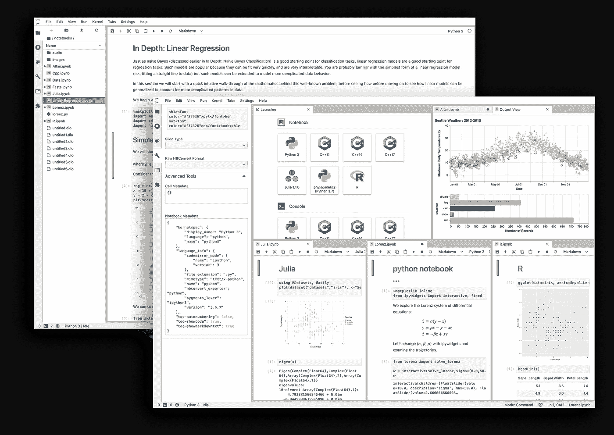
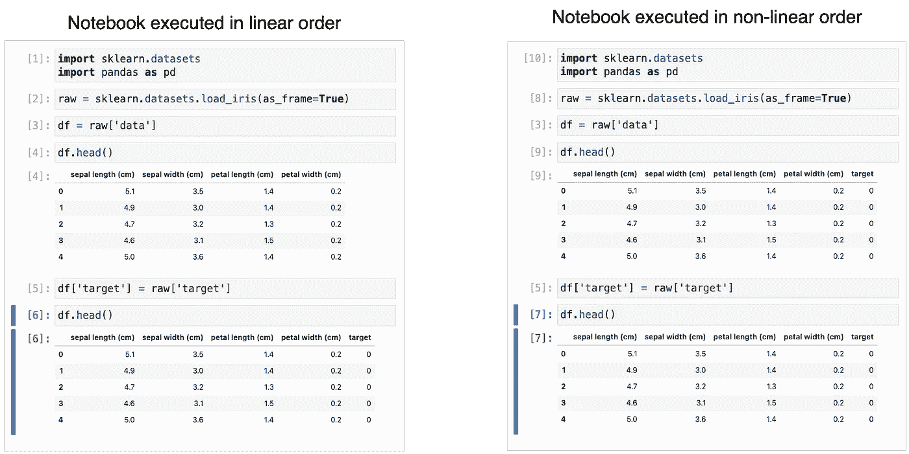
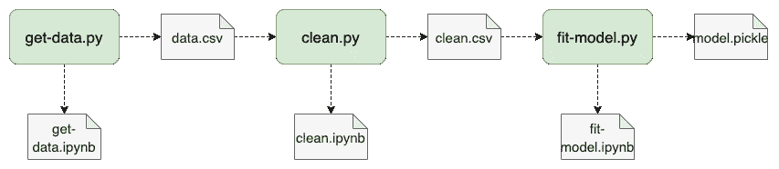

# 为什么(以及如何)将笔记本投入生产

> 原文：<https://towardsdatascience.com/why-and-how-to-put-notebooks-in-production-667fc3979dca?source=collection_archive---------8----------------------->

## 使用现代开源工具部署、测试和调试 Jupyter 笔记本电脑。

Jupyter 实验室截图(鸣谢:【jupyter.org】T2)

将*笔记本*和*生产*放在同一个句子中，肯定会引发一场激烈的网上辩论。这个话题经常出现，经常听到团队完全放弃笔记本电脑，因为*它们不是用于生产的*。不幸的是，讨论经常集中在当前工具已经解决的问题上，但是对于许多从业者来说，解决方案仍然是未知的。这篇文章展示了如何克服 Jupyter notebook 的一些限制，提出了一个工作流程来简化它们在生产中的使用，并讨论了仍然需要解决的问题。

# 笔记本的简史

计算笔记本的起源来自唐纳德·克努特介绍的识字编程。其核心是，这种思想提倡编写将源代码和文档交错的程序，以使程序更具可读性。笔记本电脑通过添加其他功能，如嵌入式图形和交互式代码执行，扩展了这一理念。

结合这三个元素(将代码与文档交错、嵌入图形和交互性)为数据探索提供了一个强大的界面。真实世界的数据总是带有特殊性；交叉文档有助于指出它们。数据模式仅在通过嵌入图形可视化数据时出现。最后，交互性允许我们迭代我们的分析，以避免每一次改变都要从头开始。

# 笔记本的问题

到目前为止，我还没有特别提到任何笔记本的实现。有[多种风格可供选择](https://en.wikipedia.org/wiki/Notebook_interface#cite_note-2)，但是对于这篇文章的剩余部分，我将参考 Jupyter 笔记本。

为了支持交错文档，Jupyter 支持 Markdown 单元格。对于嵌入式图形，Jupyter 使用 [base64](https://en.wikipedia.org/wiki/Base64) 序列化图像，对于交互性，它公开了一个 web 应用程序，允许用户添加和执行代码。

这种实现决策有很大的副作用:

1.  **文件大小。**如果笔记本包含图像，文件大小会大大增加，很快就会破坏 git 存储库。
2.  **版本控制。** `.ipynb`文件是 JSON 文件。`git diff`输出版本之间难以辨认的比较，使得代码审查变得困难。
3.  **隐藏状态。**由于用户可以以任意顺序执行代码，这可能会产生中断的代码，当顺序运行单元时，其记录的输出不匹配。
4.  **测试/调试。鉴于笔记本的交互性，代码行增长很快。很快，你就会得到一个有一百个难以测试和调试的电池的笔记本。**

# 文件大小和版本

前两个问题是`.ipynb`实现的结果。幸运的是，它们很容易用当前的工具解决。例如，如果我们可以在 git 上存储相对较大的文件，我们可以配置 git 使用不同的算法为`.ipynb`文件生成 diff 视图， [nbdime](https://github.com/jupyter/nbdime) 允许我们这样做。

如果我们关心 git 版本*和*文件大小，我们可以完全替换`.ipynb`格式。 [Jupytext](https://github.com/mwouts/jupytext) 允许 Jupyter 将`.py`(以及其他)文件作为笔记本打开；警告是任何输出都会丢失，因为`.py`文件不支持嵌入图形。但是，您可以使用 jupytext [配对特性](https://jupytext.readthedocs.io/en/latest/paired-notebooks.html)将输出保存在一个单独的文件中。

大多数人都不知道 Jupyter 不知道底层的文件格式。**感觉像笔记本的东西并不意味着一定是** `**.ipynb**` **文件。**改变底层文件格式解决了大小和版本问题；让我们来关注一下真题:*隐藏状态*。

# 隐藏状态

Jupyter 允许用户交互地添加和执行代码单元。当处理新数据集时，这非常有用。它使我们能够探索和清理我们的数据，同时保留迄今为止我们所执行的记录(代码和输出)。但数据探索过程多是试错；我们经常修改并重新执行以前的单元格，导致单元格的历史不是线性的。最近，一项对 GitHub 上 1000 万台笔记本的[分析](https://blog.jetbrains.com/datalore/2020/12/17/we-downloaded-10-000-000-jupyter-notebooks-from-github-this-is-what-we-learned/)发现，36%的 Jupyter 笔记本拥有以非线性顺序执行的单元。

笔记本的隐藏状态是迄今为止对笔记本最重要的(也是最有效的)批评。这是笔记本的悖论:*任意的单元格执行简化了数据探索，但是它的过度使用经常产生不可复制的代码。图片作者。*

# 调试/测试

笔记本的隐藏状态是迄今为止对笔记本最重要的(也是最有效的)批评。这是笔记本的悖论:*任意的单元格执行简化了数据探索，但是它的过度使用经常产生不可复制的代码。*

但即使是完美的线性笔记本也有其他问题；主要是它们很难调试和测试。这有两个主要原因。首先，笔记本是有机进化的，一旦它们变得足够大，就会涉及太多的变量，以至于很难对执行流程进行推理。第二个原因是笔记本内部定义的函数不能进行单元测试(尽管[这正在改变](https://github.com/nteract/testbook))，因为我们不能轻易地将`.ipynb`文件中定义的函数导入测试模块。我们可能决定在一个`.py`文件中定义函数，并将它们导入到笔记本中来解决这个问题。尽管如此，如果没有正确完成，这将导致手动编辑`sys.path`或`PYTHONPATH`，从而导致其他问题。

# 笔记本中原型问题然后被重构用于生产

考虑到这样的问题，团队不允许在产品代码中使用笔记本是很自然的。常见的做法是使用笔记本进行*原型制作*，并将代码重构为模块、函数和脚本进行部署。通常，数据科学家负责原型模型；然后，工程师接手，清理代码并部署。重构笔记本是一个痛苦、缓慢且容易出错的过程，会给数据科学家和工程师带来摩擦和挫折。

在正常的重构过程中，工程师会做一些小的改动并运行测试套件，以确保一切都正常工作。不幸的是，数据科学家的代码很少附带全面的测试套件(为数据科学家辩护:当你的工作成果以你的模型有多好来衡量时，很难考虑代码测试)。缺乏测试极大地增加了重构过程的难度。

另一方面，软件项目需要维护。虽然工程师可能能够做到这一点，但数据科学家最适合完成诸如模型重新训练之类的任务。重构过程发生后，即使是编写原始代码的数据科学家也很难浏览工程师部署的重构版本。更糟糕的是，由于代码已经不在笔记本中，他们不能再交互地执行它。最终发生的是生产代码和新开发笔记本之间的大量复制粘贴。

如您所见，这是一个低效的过程，经常会导致管道中断，并大大降低部署更新所需的时间。所有这些都造成了过度的负担，在某些情况下，导致公司由于高昂的维护成本而放弃机器学习项目。

# 在生产中拥抱笔记本电脑

对于我职业生涯中完成的大多数机器学习项目，我负责端到端的过程:探索数据集以创建新的模型特征，训练模型，并部署它们。我亲身经历过这种痛苦的重构过程，我不得不在笔记本环境和产品代码库之间来回移动。在我与数据打交道的最初几年，我认为这个问题是理所当然的，并学会了忍受它。然而，随着我开始参与更重要的项目，这种方式对我来说风险太高，我无法继续工作，我开发了一个工作流程，让我在很大程度上克服了这些挑战。

在设计这个工作流程时，我把简单放在第一位。数据科学团队必须快速行动，因为他们的工作本质上是实验性的。这种方法不是最终的解决方案，但它是对当前实践的巨大改进。笔记本电脑和机器学习工具有很大的创新空间，可以支持一个工作流，为数据科学家提供交互式开发的能力，同时允许他们在部署过程中更好地与工程团队合作。

# 工作流摘要

提议的工作流程如下:

1.  将脚本用作笔记本。
2.  每个`git push`上有一个数据样本的冒烟测试笔记本。
3.  在多个小笔记本中分解分析。
4.  打包项目(即添加一个`setup.py`文件)。
5.  从笔记本之外的功能中抽象出逻辑片段，用于代码重用和单元测试。

现在让我们详细讨论每一个。

# 切换底层格式:作为笔记本的脚本

如前所述，`.ipynb`格式不能很好地与 git 兼容。然而，Jupyter 的架构允许使用替代文件格式。 [Jupytext](https://github.com/mwouts/jupytext) 使用户能够将`.py`作为笔记本打开，有效地解决了 git 版本问题，方便了代码审查。数据科学家可以从 Jupyter 交互开发他们的代码，但是存储库将只包含`.py`文件。本文的其余部分继续使用术语*笔记本*，但是请记住，我们指的是与 Jupyter 兼容的 Python 脚本。

# 隐藏状态、测试和调试

这三个问题高度相关，解决起来更具挑战性。与任何其他软件项目一样，解决方案在于开发模块化和可测试的代码。然而，面临的挑战是如何将其应用于高度不确定的环境，这种环境需要快速迭代，并采用 Jupyter 笔记本作为其主要开发工具。

我们希望实现以下目标:

1.  每一次代码变更都要做测试笔记。
2.  在多个小型笔记本中分离逻辑。
3.  模块化数据转换，并分别进行测试。

## 测试笔记本

由于运行时的原因，测试数据处理代码本身就具有挑战性。我们不能在每次变更时都运行所有的处理代码，因为这可能需要几个小时才能完成。幸运的是，我们可以用少量数据检测最常见的错误:缺少列、错误的数组形状、不兼容的数据类型等。因此，一个有效的策略是在每次推送时使用数据样本运行所有笔记本，以消除笔记本损坏的可能性。然而，由于我们没有测试笔记本电脑的输出，这是不健全的；但是随着项目的成熟，我们可以加入更多完整的测试。如果你想了解更多关于测试数据科学管道的信息，请查看我在 [PyData 2020](https://www.youtube.com/watch?v=zvnjOzvsvXw) 的演讲。

要自动执行笔记本，我们可以使用 [papermill](https://github.com/nteract/papermill) 或 [nbclient](https://github.com/jupyter/nbclient) 。注意，由于我们转换了底层格式，我们必须使用 jupytext 将`.py`文件转换回`.ipynb`，然后执行它们。

## 在多个小型笔记本电脑中分离逻辑

模块化代码是软件工程中的常规实践，因为它使代码更易测试和维护。然而，数据科学家在一个笔记本上编写整个项目的代码是很常见的。为什么？方便。一旦您将一个项目分解成多个部分，您就必须处理需要数据科学家额外工作的技术难题，在某些情况下，这种工作超出了他们的专业领域。简化模块化过程是 dbt 蓬勃发展的原因(以及许多其他原因):它允许数据分析师将庞大的 SQL 脚本分解成多个部分，组装成一个连贯的管道。我们可以把同样的逻辑应用到笔记本上。

笔记本模块化是大多数工具的不足之处。虽然许多[工作流程编排者](https://ploomber.io/posts/survey/)支持笔记本执行，但他们并没有让这个过程变得愉快。帮助数据科学家(包括我自己)编写更易维护和模块化的管道是我创建 [Ploomber](https://github.com/ploomber/ploomber) 的主要动机。

Ploomber 允许数据科学家分两步从多个笔记本电脑创建数据管道:

1.  在一个`pipeline.yaml`文件中列出笔记本。
2.  通过引用其他笔记本的名称来声明笔记本依赖关系。

例如，典型的`pipeline.yaml`如下所示:

得益于 Ploomber(和 jupytext)插件，Jupyter 将`.py`脚本识别为“笔记本”;因此，数据科学家可以交互开发。然而，在执行过程中，Ploomber 将它们转换为`.ipynb`并执行它们，从而允许我们将源(`.py`)和输出(`.ipynb`文件中的表格和图表)分开。此外，任务可以生成任何其他数量的输出，如数据文件。

要建立执行顺序，用户只需声明必须在我们正在处理的笔记本之前执行的笔记本。例如，为了清理数据，我们必须下载原始版本，所以我们将在`clean.py`中做这样的事情:

就是这样。如果我们重新加载笔记本，我们会在依赖项列表的正下方看到一个新的单元格:

Ploomber 解析我们的引用，并添加一个包含输入位置的新变量。我们可以继续以这种方式构建，并创建包含几十个任务的管道，而不必跟踪每个任务的输出。因为跨文件分割逻辑很简单，所以多人可以同时处理它。Ploomber 帮助创建可维护的管道，感觉就像一个笔记本。

通过使用`upstream`变量引用其他任务，我们还可以确定执行顺序，从而允许我们创建一个这样的管道:

为了执行整个管道，我们运行:`ploomber build`。

笔记本模块化有许多好处:它允许我们隔离运行部件进行调试，添加集成测试以检查每个输出的完整性，参数化管道以使用不同的配置运行(开发、试运行、生产)，并行化独立任务等。

## 代码模块化和单元测试

笔记本中声明的代码不能轻易从其他笔记本中导入，这导致了`.ipynb`文件之间的大量复制粘贴。因此，当部署一个模型时，工程师经常不得不处理这样的项目结构:

重构一个像上面这样的项目是一个真正的噩梦。当工程师不得不重构这样的项目进行部署时，已经太晚了:笔记本可能很容易包含数千个单元，其中有几个部分是复制粘贴的，没有单元测试。相反，我们应该致力于在项目的所有阶段保持最低的代码质量。

首先，使用*脚本作为笔记本*(如前所述)方便了代码审查，因为我们不再需要处理*不同* `.ipynb`文件的复杂性。其次，通过为数据科学家提供预配置的项目布局，我们可以帮助他们更好地组织工作。例如，一个组织得更好的项目可能是这样的:

前面的示例布局明确地将项目组织为三个部分。首先，我们用`.py`替换`.ipynb`文件，并将它们放在`tasks/`目录中。第二，将多次需要的逻辑抽象在函数中，存储在`src/`下。最后，在`src/`中定义的功能在`tests/`中进行单元测试。

为了确保该布局有效，在`src/`中定义的代码必须可以从`tasks/`和`tests/`中导入。不幸的是，默认情况下这是行不通的。如果我们打开`tasks/`中的任何“笔记本”，我们将无法从`src/`中导入任何内容，除非我们修改`sys.path`或`PYTHONPATH`。尽管如此，如果数据科学家不能避开 Python 导入系统的有限性，他们会倾向于复制粘贴代码。

幸运的是，这个问题很容易解决。添加一个`setup.py`文件，让 Python 将您的项目识别为一个包，您将能够从项目中的任何地方(甚至在 Python 交互式会话中)从`src/`导入函数。每当我与其他数据科学家分享这个技巧时，他们就开始编写更多可重用的代码。要了解更多关于 Python 打包的内容，[点击这里](https://packaging.python.org/tutorials/packaging-projects/)。

# 思考生产中笔记本电脑的未来

讨论笔记本在作品中的使用总是一场艰苦的战斗。大多数人认为*笔记本只是用来做原型*是不可否认的事实，但我不这么认为。笔记本是处理数据的绝佳工具，虽然当前的工具使使用笔记本编写生产就绪代码变得更加容易，但仍有大量工作要做。

这项工作的一部分是开发更好的工具，而不仅仅是改善笔记本体验:毫无疑问，提供实时协作、与 SQL 更好的集成或云中托管 Jupyter 实验室等功能有很大的价值；然而，如果我们不在部署代码时更重要的领域(如编排、模块化和测试)进行创新，笔记本电脑仍将被视为一种*原型*工具。

此外，这项工作的一部分是消除关于笔记本如何工作的神话。我希望数据科学领域的开发实践能够吸收笔记本电脑的精华并不断发展，而不是抛弃它们，回到前笔记本时代的相同方法。

如果您想在生产中采用包含笔记本电脑的工作流程方面获得帮助[，请联系](https://twitter.com/edublancas)，我很乐意谈论这些话题。

*特别感谢 Alana Anderson 和 Sarah Krasnik 阅读早期草稿并提供宝贵反馈。*

*最初发布于*[*ploomber . io*](https://ploomber.io/posts/nbs-production/)*。*