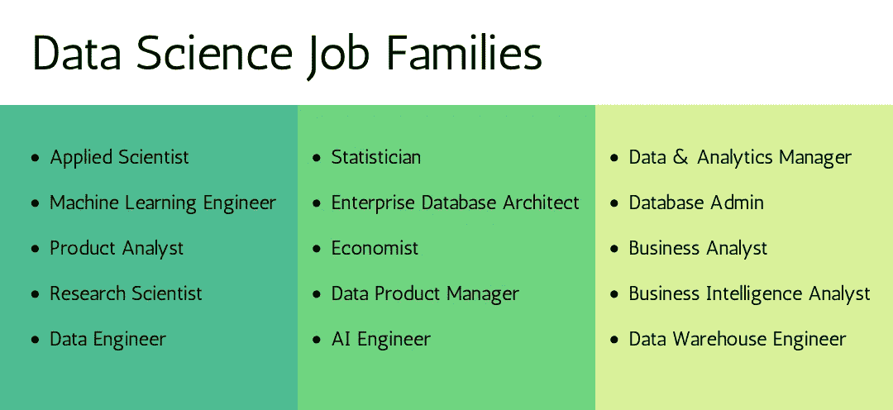

# 为什么数据科学工作最抢手的时候却很难找到？

> 原文：<https://towardsdatascience.com/why-are-data-science-jobs-hard-to-get-when-theyre-the-most-in-demand-30eda0d1b5ec?source=collection_archive---------5----------------------->

## 我想是时候解决这个问题了

纳蕾塔·马丁在 [Unsplash](https://unsplash.com/s/photos/herd?utm_source=unsplash&utm_medium=referral&utm_content=creditCopyText) 上的照片

在当今快速发展的技术世界中，来自右翼、左翼和中间派的人们正在开始他们的数据职业生涯，或者在数十年的金融经验后进行职业转变，或者回到学校获得数据科学学位。最近，我在数据科学就业市场上寻找实习和全职工作，亲身经历了我称之为“椰子田”的现实。

找工作很累；将你简历的第 496 份草稿命名为面试的最终版本，在四轮面试和无数 LinkedIn 信息联系和推荐后，公司会跟踪你——如果你足够幸运地收到了录用函，只有当你有足够的信心在第一天发布 LinkedIn 更新时，你才会平静下来。

如今，越来越多的人自称为*数据科学爱好者*。虽然数据科学候选人指数增长的主要原因被认为是数据职位空缺数量的增长，但获得数据科学工作比以往任何时候都更难。

但是，如果你正确地认识到就业市场的期望，就不会失去希望。关键是要确定什么最适合你，并利用它来帮助你找到最适合你的目标和兴趣的公司。

五六年前，当数据不是业务决策的核心时，公司会根据组织的需求制造数据专家，随着分析数据的需求不断增加，这些公司得到了学术界和具有初步技能的训练营的帮助。

# 统计是过去的事了

当《哈佛商业评论》称“数据科学家:21 世纪最性感的工作”时，请记住——那是 2012 年(显然，那一年世界本该走向末日😀)

你在网上读到的统计数据并不代表今天的动态。

一个组织的需求、要求和期望已经发生了巨大的变化。即使是关于数据科学工作的最新统计数据也至少有四分之一的历史了，而且数据科学还在不断发展。从 2016 年开始，数据科学家是美国的头号工作，但在 2020 年，它排在第三位( [Glassdoor 的](https://www.glassdoor.com/List/Best-Jobs-in-America-LST_KQ0,20.htm)年度排名)，谁知道到 2025 年，它甚至可能不会进入前 10 名。

当然，这取决于你如何看待这些统计数据，但如果一个网站上写着“2021 年 xx 百万数据科学工作岗位”，并不意味着它们都对你开放。

与其在线阅读大量数据科学市场的点播文章，我建议与你的网络中的数据科学家联系(或建立新的联系)，并从这些对话中了解更多关于环境的信息。阅读你感兴趣的公司最近正在进行的新项目，或者联系你 15 年前刚从数据科学转行到商业智能分析师的同事，听取他们的真实意见。

# 数据科学独角兽还有更多的东西

每个组织、每个业务线的数据科学工作要求每天都在变化。这个领域变得越来越生产化，越来越商业化。数据科学家有望在同一天补一个数据工程师和一个 BI 分析师。

我可以说出 50 个不涉及姓名数据的工作简介，但你从事的是数据科学生命周期中的一个流程。如果说我从我的同学(2021 届)找工作的经历中学到了什么的话，那就是，你不能把自己的求职限制在关键词数据科学家和数据分析师上。

下面是几个令人兴奋的职位，类似于数据科学家的职位，你可以为其培养技能并申请—

图片来源:作者

# 这并不总是关于候选人

候选人在面试中常常无法表达自己的价值。

通常，绩点 3.4 的候选人会在面试中击败绩点 4.0 的候选人。在面试中，理论知识可能只占你整体评估的 40%。但是，在实际项目中工作过，在团队或研究中合作过，在学校实习过——交流这些的能力，阐明你带来的独特优势和品质是让游戏适合你的能力。

虽然公司正在寻找在工作描述中列出的工具和技能方面具有丰富经验的候选人，以增加团队的价值，但简历并不总是能传达预期。在这种情况下，需要关注的不是候选人，而是他们制作简历的技巧。让候选人心动的是简历筛选后的谈话。

企业寻求擅长形成理论、检验直觉、发现模式的专业人士，这些模式能让企业预测盈利情况或解决利润低的问题；一个候选人，他有可能建议利用启发式开发的途径，从而为用户增加价值。在 6 小时的小组面试中，一名新毕业生肯定会紧张地回答财务分析问题。如果你正在招聘候选人，一次让你的候选人感到舒服的谈话将会受到高度赞赏。

公司希望他们的数据团队有独角兽；我们找一个能预测如何降低营销成本和增加客户获取的分析师怎么样？！

# 从众心理

仅仅因为人们说数据科学领域的工作很热门，似乎每个人都想通过几天的培训来赶时髦。从我三年的数据科学之旅中学到的东西来看，这不是一个 15 天课程就能帮你找到工作的领域。数据科学需要一门学科，一套学习过程。

当前就业市场中的求职者只具备足够危险的知识——关于他们知道什么和他们想做什么的知识。

在现实世界中，你看不到工商管理硕士(MBA)或计算机科学(T2)的招聘信息。它们是学位，不是工作。企业似乎更有兴趣聘用数据科学职位的原因是，他们认识到云计算、大数据、人工智能和机器学习的新兴趋势和需求。

> 是时候拓宽求职范围了，不要局限于数据科学。

这就是我的博客的结尾。感谢您的阅读！如果你在寻找数据科学工作或正在寻找工作时也遇到了困难，请在评论中告诉我。我很想知道更多关于你的旅程和想法。

如果你喜欢阅读这样的故事，并想支持我成为一名作家，可以考虑使用[这个链接](https://rashidesai2424.medium.com/membership)注册成为一名媒体会员(我可以赚取一小笔佣金，不需要你额外付费！)

数据帐篷快乐！

*Rashi 是一名来自芝加哥的数据奇才，他喜欢将数据可视化，并创造富有洞察力的故事来传达商业见解。她是一名全职的医疗保健数据分析师，周末会边喝一杯热巧克力边写博客*