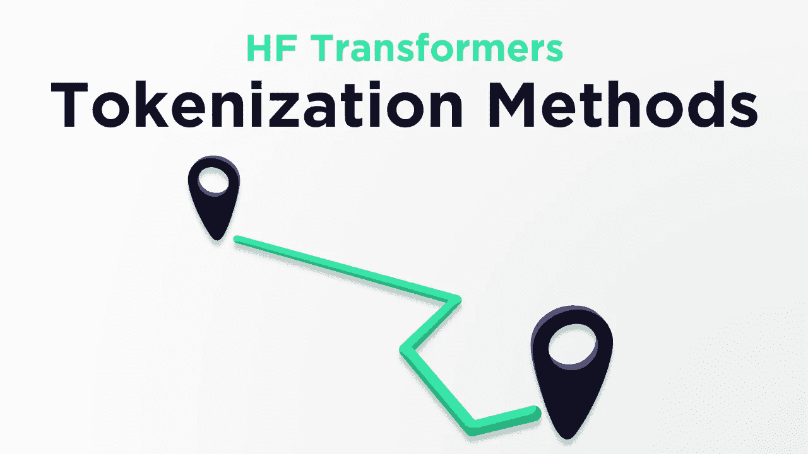
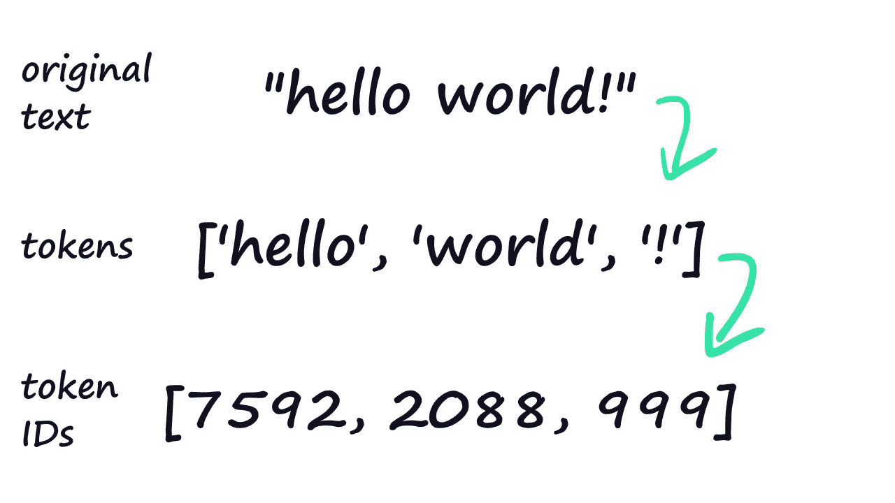
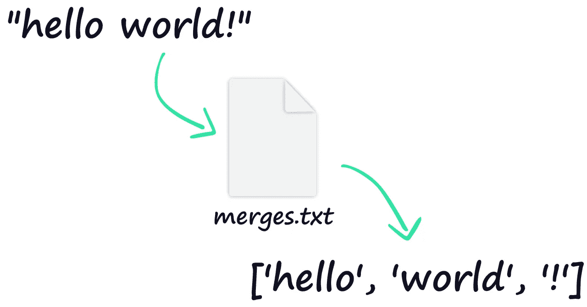
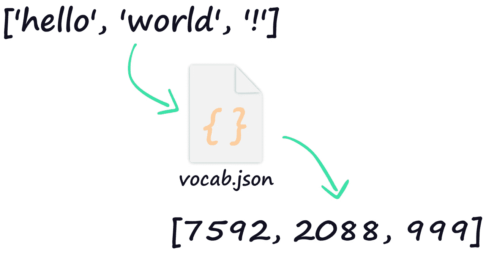
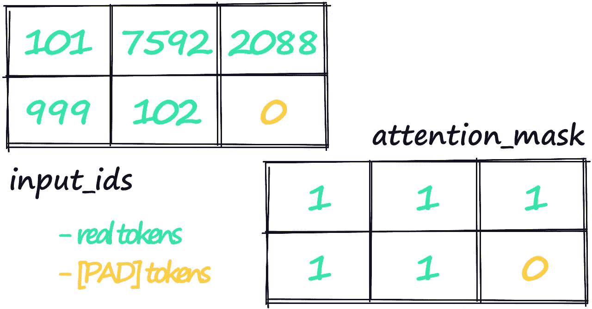

# 为什么变形金刚的记号化方法那么多？

> 原文：<https://towardsdatascience.com/why-are-there-so-many-tokenization-methods-for-transformers-a340e493b3a8?source=collection_archive---------6----------------------->

## 通往同一个目的地的五条路线？

作者图片

H uggingFace 的变形金刚库是 NLP 事实上的标准——被世界各地的从业者使用，它功能强大、灵活且易于使用。它通过一个相当大(且复杂)的代码库来实现这一点，这就产生了一个问题:

> 为什么 HuggingFace 变形金刚里有那么多的记号化方法？

令牌化是将文本字符串编码成转换器可读的令牌 ID 整数的过程。

从人类可读的文本到转换器可读的令牌 id。

给定一个字符串`text` —我们可以使用以下任何一种方法对其进行编码:

这是五种不同的方法，我们可能会误认为它们会产生相同的结果——令牌 id。然而，这些实际上是产生不同产出的不同过程。

在本文中，我们将看看这些方法之间的区别和相似之处。你也可以在这里看这篇文章的视频版本:

# 变压器的标记化

在深入研究这些标记化方法之间的区别之前，有必要理解一下标记化在 transformer 模型的上下文中意味着什么。

在构建 transformer tokenizer 时，我们通常会生成两个文件，一个是 *merges.txt* ，另一个是 *vocab.json* 文件。这两者都代表了标记化过程中的一个步骤。

我们首先采用字符串格式的文本。第一个文件 *merges.txt* 用于将单词或单词片段翻译成*标记*:

文件 **merges.txt** 将我们的纯文本转换成一个令牌列表。

一旦我们有了令牌，我们就通过我们的 *vocab.json* 文件来处理这些令牌，这只是一个从*令牌*到*令牌 ID* 的映射文件:

文件将我们的令牌列表转换成令牌 id 列表。

在推理/训练过程中，这些令牌 ID 由我们各自的转换器模型中的嵌入层读取——它将令牌 ID 映射到该令牌的密集向量表示(想象一下我们单词的*表示*的数字表示)。

## 其他输入张量

现在，我们刚刚解释了从人类可读语言到变压器可读令牌 id 的令牌化过程，但这只是变压器模型使用的几个输入张量之一。

所需的输入张量因不同的变压器模型而异，甚至因不同的变压器用例而异，但有几个常见的例子。

令牌 id(**input _ IDs**，左侧)和注意掩码(右侧)，我们已经为字符串**“hello world！”构建了令牌 id 和注意掩码张量** —添加特殊标记 101、102 和 0(填充标记)。

*   **注意力屏蔽**–注意力屏蔽张量通常是一个包含 1 和 0 的张量，其维数与我们的 token IDs 张量相同。只有当注意屏蔽张量在其各自的位置包含 1 时，我们的转换器模型才会计算记号 IDs 张量中的记号的注意。
*   **段 id**—通常在我们的令牌 id 张量中有多个“句子/部分”时使用。比如在 Q & A 中我们经常会把 token IDs 张量拆分成问题和上下文——每个段在段 IDs 张量中分别用 0 和 1 表示。

以上介绍了转换器的标记化背后的基本要素——现在让我们看看这些标记化方法的不同之处，以及为什么我们会决定使用其中的一种。

# 到令牌和 id

我们可以对文本进行标记的第一种方法是对单个字符串应用两种方法。

第一个方法`tokenizer.tokenize`将我们的文本字符串转换成一个令牌列表。

构建完令牌列表后，我们可以使用`tokenizer.convert_tokens_to_ids`方法将令牌列表转换成转换器可读的令牌 id 列表！

现在，这里没有我们可以使用的特别有用的参数(比如自动填充/截断、添加特殊标记等)，所以我们在这里的灵活性受到限制。因此，通过这种方法进行的标记化看起来总是像这样:

尽管值得注意的是，我们的其他张量如`attention_mask`和`token_type_ids`(段 id)不能使用这种方法自动创建。

# 编码和编码+

接下来我们有`encode`和`encode_plus`，它们都为单个字符串执行两个标记化步骤——输出我们的标记 id 张量。

现在，你可能已经猜到了，`encode_plus`可以做得更多一点。

其中`encode`仅输出表征 id 张量，`encode_plus`输出包含表征 id 张量*和*的字典，附加张量例如注意力屏蔽或片段 id(`token_type_ids`)张量。

这两种方法都带有常用的有用参数，如`max_length`和`return_tensors`。要将`encode`与 BERT 一起应用于 PyTorch，我们可以编写如下代码:

但是我们还没有返回我们经常需要的注意力屏蔽或段 id 张量。

因此，为了获得我们的注意力屏蔽和段 id，我们简单地为`encode_plus`编写相同的代码:

我们返回我们需要的所有张量——令牌 id、注意力屏蔽和段 id。

## 对于批次

实际上，我们不会对单个字符串进行标记，而是对大量文本进行标记——为此我们可以使用`batch_encode_plus`。

像`encode_plus`一样，encode_batch 可以用来构建我们需要的所有张量——令牌 id、注意力屏蔽和段 id。

与`encode_plus`不同，我们*必须*将一个字符串列表传递给`batch_encode_plus`，而`batch_encode_plus`将在我们之前看到的同一个字典容器中为每个编码张量返回一个列表/批次。

同样，我们也可以使用之前的`encode`和`encode_plus`方法中使用的所有参数:

# 标记器

现在我们剩下最后一个方法，`tokenizer(args)` —这里我们没有使用任何特定的方法，而是直接调用我们的 tokenizer 类。

让我们看看它会返回什么:

与我们的`encode_plus`方法完全相同的输出，如果我们尝试像我们的`batch_encode_plus`方法一样使用带有字符串列表的`tokenizer(args)`，我们将会看到:

因此，这个最后的方法执行与`encode_plus`和`batch_encode_plus`方法相同的操作，通过输入数据类型决定使用哪个方法。

当我们不确定是否需要使用`encode_plus`或`batch_encode_plus`时，我们可以直接使用`tokenizer`类——或者如果我们只是喜欢较短的语法。

这就是本文的全部内容，涵盖了高频变压器中可用的不同符号化方法。

在不同的模型记号赋予器之间，我们会看到不同的行为，但是所有这些记号赋予器都从`PreTrainedTokenizer`类继承了它们的核心功能——包括了这些方法中的每一个！

因此，尽管许多记号赋予者是不同的——他们通常会分享我们在这里讨论的内容。

我希望你喜欢这篇文章！如果你有任何问题，请通过 [Twitter](https://twitter.com/jamescalam) 或在下面的评论中告诉我。如果你想要更多这样的内容，我也会在 YouTube 上发布。

感谢阅读！

[🤖带变压器的 NLP 课程 70%的折扣](https://bit.ly/nlp-transformers)

**所有图片均由作者提供，除非另有说明*