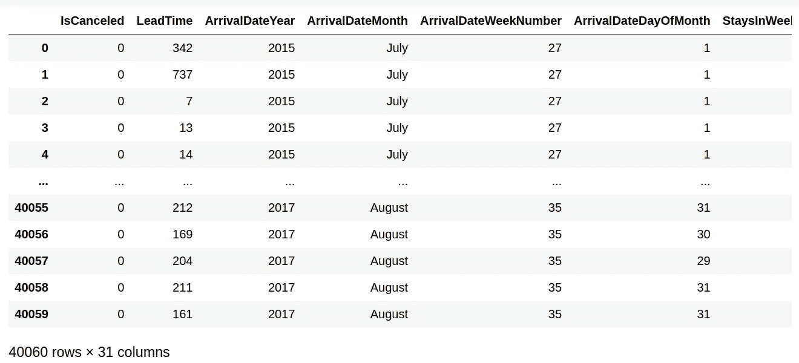
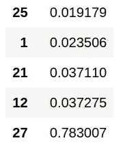
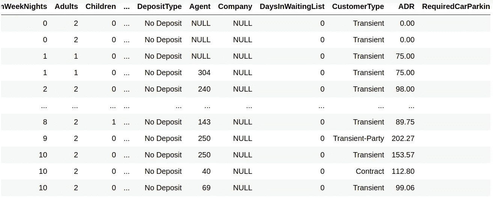

# 为什么自动特征选择有风险

> 原文：<https://towardsdatascience.com/why-automated-feature-selection-has-its-risks-363117e1a775?source=collection_archive---------40----------------------->

## 特征的理论相关性不容忽视

来源:图片由 [geralt](https://pixabay.com/users/geralt-9301/) 从 [Pixabay](https://pixabay.com/photos/apple-fruit-selection-especially-1632919/) 拍摄

来自经济学背景，我对数据建模的第一次介绍是通过计量经济学——它严重依赖线性回归来建立变量之间的关系。

在配置回归模型时，人们总是强调，虽然选择解释结果变量的特征的过程可以在一定程度上自动化，但理论应该总是胜过统计，即相关性并不意味着因果关系。

例如，[观察到](https://www.richfeenstra.com/blog/how-ice-cream-kills-understanding-correlation-and-causation)消费的冰淇淋数量和杀人率之间有很强的统计相关性。然而，很难说食用冰淇淋会直接导致更高的凶杀率。炎热的天气可能会增加人们的攻击性，从而导致更高的杀人率——冰淇淋消费量的增加只是这一现象的副产品。

# 自动化特征选择的问题

在我们生活的这个数据驱动的世界中，人们经常需要过滤成千上万个不同的特征，以确定影响结果变量的特征。

孤立地手动观察每个特征并确定它是否充分解释了结果变量是不可行的。在这方面，我们必须在一定程度上依赖自动化。

然而，当这些特征选择工具仅仅用于选择应该包括在模型中的特征时，问题就出现了，而没有手动地双重检查所选择的特征以确保它们在理论上有意义。

使用 ExtraTreesClassifier，让我们看一些例子，看看在没有经过训练的眼睛的情况下，特征选择会如何出错。

# 酒店取消

出于这个目的，让我们考虑将 ExtraTreesClassifier 作为[特征选择](/feature-selection-techniques-in-python-predicting-hotel-cancellations-48a77521ee4f)工具。

树外分类器是一种集成学习方法，它使用随机决策树来选择在解释结果变量的变化时显示出强统计相关性的特征。具体来说，对所有观察值进行随机分割，以确保模型不会过度拟合数据。

现在，想象一下这个场景。您将看到一个酒店取消数据集，如果客户取消，结果为 *1* ，如果客户不取消，结果为 *0* 。

Antonio、Almeida 和 Nunes (2019)在本例中的原始数据可在[此处](https://www.sciencedirect.com/science/article/pii/S2352340918315191)获得。

数据集中包含各种要素，包括客户的原籍国、他们的交付时间(从预订房间到入住的时间)、他们预订的房间类型等等。

来源:Jupyter 笔记本输出

您决定使用树外分类器按重要性对要素进行排序(最低值最不重要，最高值最重要):

来源:Jupyter 笔记本输出

排名最高的三个功能是功能 21(存款类型)、功能 12(来源国)和功能 27(预订状态)。

然而，让我们仔细看看特性 27。这是一个具有类别的分类变量:

*   取消
*   失约
*   退房

在这方面，任何取消预订的客户将被分配到“已取消”类别。在这点上，ReservationStatus 变量将显示与取消的结果变量接近完美的共线性。难怪 ExtraTreesClassifier 为这个特性显示了如此高的值——它有效地描述了与结果变量完全相同的东西！

然而，在现实场景中，在模型中包含这一功能是没有用的——酒店无法知道客户是否会取消预订，直到事后才知道。

在这方面，正确的决定是从最终的模型中去掉这个特性。

如果完全依赖于特征选择的自动化，这个特征将被保留在模型中——极大地扭曲了结果，并且与现实世界的场景没有理论上的相关性。

# 另一个例子:平均每日利率

使用相同的数据集，现在让我们看看不同的变量:**【平均每日房价】**。该变量描述了顾客每天在酒店的平均消费。

来源:Jupyter 笔记本输出

第一种倾向可能是使用特征选择工具来确定最能解释(至少在统计上)ADR 波动的特征。

然而，只有当我们仔细查看数据时，我们才注意到取消预订的**和**客户的 ADR 值都包括在内。

在大多数情况下，ADR 反映了取消**的顾客如果留在酒店会花费**的价值——但实际上酒店将不再从这些顾客身上赚钱。

在这点上，用 ADR 作为因变量来实现特征选择是错误的。

相反，更合理的方法是假设表明客户是否会取消预订的特征也与确定该客户的 ADR 相关。坚持预订的顾客已经比取消预订的顾客表现出更高的顾客忠诚度。在这方面，即使取消预订的客户最初有较高的 ADR 值，现在这也是多余的，因为预订不会继续进行。

考虑到这一点，建立了一个基于[回归的神经网络](/regression-based-neural-networks-with-tensorflow-v2-0-predicting-average-daily-rates-e20fffa7ac9a)模型，使用以下特征预测 ADR:

*   取消
*   原产国
*   细分市场
*   存款类型
*   客户类型
*   所需的停车位
*   到达日期:周数

该模型最终证明，相对于整个测试集的平均 ADR 105，平均绝对误差为 28。虽然模型显示的 RMSE 较高，为 43，但 MAE 被认为是衡量整体表现的更好指标，因为 RMSE 因少数客户的 ADR 远高于大多数客户而过度膨胀。

有许多重要因素会影响客户的 ADR，例如他们的年收入、货币波动、竞争链的价格等，这些都没有包括在数据集中。在这方面，包含的特征本身在能够解释 ADR 值的所有变化方面是有限的——但是考虑到这种限制，该模型表现得相当好。

# 结论

短语“垃圾输入，垃圾输出”也适用于特征选择。如果数据集中的要素是无意义的，那么要素选择工具将无法以有意义的方式解释这些要素。对数据的正确理解是最重要的，并且特征选择的自动化需要与领域知识相平衡，以便能够正确地判断特征是否适合在模型中使用。

在本文中，您已经看到:

*   树外分类器在特征选择中的应用
*   自动化特征选择的缺点
*   手动解释相关特征的重要性

非常感谢您的宝贵时间，非常感谢您的任何问题或反馈。你可以在这里找到这个例子的 GitHub 库。

*免责声明:本文是在“原样”的基础上编写的，没有担保。本文旨在提供数据科学概念的概述，不应以任何方式解释为专业建议。*