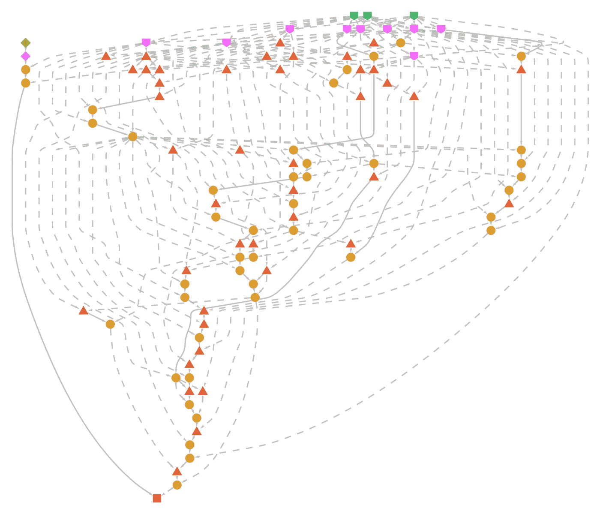
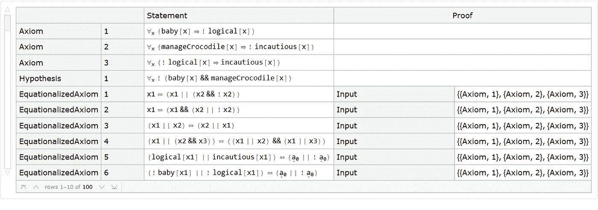
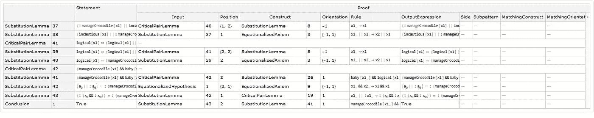

# 为什么婴儿不能驾驭鳄鱼

> 原文：<https://towardsdatascience.com/why-babies-can-not-manage-crocodiles-846df5371e47?source=collection_archive---------41----------------------->

## 用沃尔夫拉姆语讲述的警示故事

在 [Unsplash](https://unsplash.com/s/photos/crocodile?utm_source=unsplash&utm_medium=referral&utm_content=creditCopyText) 上由 [vaun0815](https://unsplash.com/@vaun0815?utm_source=unsplash&utm_medium=referral&utm_content=creditCopyText) 拍摄的照片

很少有父母会愿意把自己的孩子和鳄鱼放在一个房间里。他们知道婴儿和鳄鱼对彼此的看法非常不同。婴儿容易信任他人，并寻求探索和结交新朋友。一只鳄鱼把一个婴儿视为一顿美味的午后点心。对大多数人来说，这是故事的结尾，但对逻辑学家、解谜者和像刘易斯·卡罗尔这样的数学家来说，故事才刚刚开始。

著名的奇怪的“爱丽丝梦游仙境”故事的作者刘易斯·卡罗尔也对逻辑谜题非常感兴趣。他写了下面的“幼鳄难题”,为读者提供了许多逻辑陈述，从中可以得出结论。这个难题有三个条件语句(原文):

*   所有的婴儿都没有逻辑
*   谁能管住鳄鱼，谁就不会被轻视
*   不合逻辑的人受到鄙视

这些陈述被认为是“真实的”陈述，尽管它们在今天看起来可能很奇怪。比如，我们有可能会想象鄙视一个管理鳄鱼的人。不合逻辑的人不会被普遍鄙视。出于这个原因，我将使用“不谨慎”，因为这实际上是一个比“鄙视”更好的选择。

我们可以从标记每条语句的各个部分开始，因此:

*   b:代表婴儿
*   l:代表逻辑
*   I:代表不谨慎(以前被鄙视)
*   m:代表“能驾驭鳄鱼”

然后，我们可以将英语语句写成简短的逻辑表达式:

*   B → ~L(所有宝宝都不符合逻辑)
*   M → ~I(如果你能管住一只鳄鱼，那你就不算不小心)
*   ~L → I(如果你不符合逻辑，那么你就是粗心大意)

我们现在想从婴儿到管理鳄鱼，或者:

*   B → ~M

结合规则(1)和(3)，很容易从幼稚(B)变成粗心(I)

*   B → ~L → I

换句话说，我们可以说婴儿是不小心的(根据谜题的规则)。

第二个规则(M → ~I)也可以换成它的[反命题](https://en.wikipedia.org/wiki/Categorical_proposition#Contraposition):

*   我→ ~M

这让我们完成了这个链条，完成了我们的“证明”:

*   B → ~L → I → ~M

导致我们得出结论，确实婴儿(B)是不符合逻辑的，因此他们是不谨慎的，因此他们不能管理鳄鱼(~M)。父母会全心全意地认同这个结论。

汉弗莱·穆莱巴在 [Unsplash](https://unsplash.com/s/photos/baby?utm_source=unsplash&utm_medium=referral&utm_content=creditCopyText) 上的照片

现在逻辑证明会变得很长很乏味。甚至在上面给出的“证明”中，我们也忽略了很多细节。实际精确的逻辑证明可以通过 [Wolfram 语言](https://www.wolfram.com/language/)中的[**findcequationalproof**](https://wolfram.com/xid/0bc55zs12ddl0pv-z140k9)函数获得，这是一种内置有用函数宝库的计算语言:

函数有两个参数:第一个参数是你试图证明的逻辑陈述，第二个参数是公理列表(假设为真的逻辑陈述)。

在我们的例子中，第一个语句是:不存在婴儿[x]和鳄鱼经理[x]都为真的“x”。接下来，公理列表重复初始问题的公理。

所有的逻辑证明都可以用有向图来表示，从公理和定理开始。在 Wolfram 语言中，您可以绘制这个证明图。在下图中，顶部的绿点是三个公理，左上角的绿色菱形是你要证明为真的定理。图表底部是由最后一个红色方块代表的结论“真”。图中的所有其他步骤都是非常简单的逻辑转换，需要进行 100%可靠的逻辑证明:

(图片由作者提供)

您还可以获得逻辑证明的每个步骤的文本表示，它使用一般的逻辑公理，并将它们应用于证明所需的特定情况。证明的前十步(共 100 步！)如下所示:

(图片由作者提供)

以下是得出最终结论的最后十个步骤:

(图片由作者提供)

逻辑是我们先进文明的核心。有了无可争议的事实和精心构建的论据，我们可以得出明智的结论，帮助我们在生活中前进。错误地提出不正确的论点可能会付出很高的代价，故意提出错误的论点可能会构成犯罪行为。理解是什么让一个论点正确，会让你变得更强大，因为这有助于你发现不好的论点。

要了解更多关于等式证明和如何解决它们的知识，请查看定理证明指南页面:

 [## 定理证明-Wolfram 语言文档

### Wolfram 语言以多种形式和多个领域执行定理证明。有时定理证明是一种…

reference.wolfram.com](https://reference.wolfram.com/language/guide/TheoremProving.html)