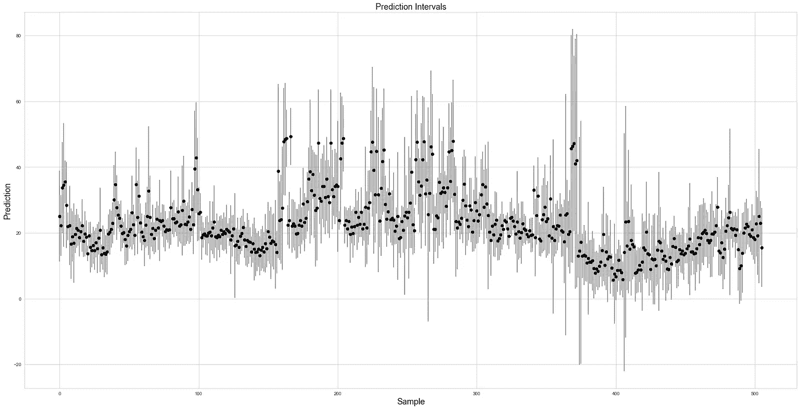

# 为什么装袋有效

> 原文：<https://towardsdatascience.com/why-bagging-works-b9961354ee73?source=collection_archive---------20----------------------->

罗斯·斯奈登在 [Unsplash](https://unsplash.com?utm_source=medium&utm_medium=referral) 上的照片

在这篇文章中，我深入探讨了打包*或*自举聚合。重点是建立对底层机制的直觉，以便你更好地理解为什么这项技术如此强大。Bagging 通常与随机森林模型相关联，但其基本思想更为普遍，可以应用于任何模型。

bagging——就像 boosting 一样——与学习者大家庭坐在一起。装袋包括三个关键要素:

1.  使学习者适应数据的自举样本
2.  对许多学习者和引导样本这样做；
3.  从所有学习者中提取预测，并将平均值/模式值作为最终预测。

当每个学习者在输入特征的不同子集上被训练时，这种方法的有效性被进一步增强(尽管对于随机森林来说，这是稍微更细微的)。 ***但为什么这种做法在实践中如此有效？***

## 什么是自举？

Bootstrapping 是从数据集中抽取替换的随机样本并计算每个样本的统计数据(例如，平均值、中值)的过程。当使用替换数据点执行采样时，原始数据中的数据点将被复制到引导数据集中。另一种方法是**粘贴**，其中数据被采样而没有替换。基本思想是通过随机生成数据*可能是的替代视图来解决采样误差/偏差。**该过程将生成感兴趣的统计结果的分布，在此基础上您可以估计标准误差和置信区间**。一般来说，引导映射过程创建的基础统计数据的估计偏差较小。*

## **学习拼图的随机部分**

在预测建模的背景下，这种想法尤其强大。机器学习的一个基本挑战是过度拟合。当模型记住了它被训练的数据时，就会发生过度拟合。然而，如果一个单一的模型从未被展示完整的数据集，它的记忆能力就会受到极大的限制。从统计角度来看，自举是实现这一目标的便捷方式。当我们在机器学习中使用 bootstrapping 时，我们避免向任何单个模型显示完整的数据集。

为每个模型(或随机森林中的每个分裂)添加随机特征选择进一步防止过度拟合。实际上，bagging 方法的**威力在于多个模型可以学习数据集**不同组成部分之间的关系——样本和特征的不同组合——而不会过度拟合。

这意味着 bagging 模型中的每个子模型将学习底层数据的不同组成部分。如果每个子模型学习相同的结构或相同的参数估计，则在该过程中没有附加值。**因此，当每个子模型不相关时，Bagging 是最有效的。**

## 提取预测区间

bagging 模型的另一个好处是你可以提取预测区间。因为每个模型都适合数据的随机子集(以及潜在的随机特征空间)，所以每个学习者都会学到输入和输出之间不同的关系集。这将为数据中的每个样本生成预测分布。

下面的代码将随机森林拟合到房价数据上，从每个子模型中提取预测，计算 95%的预测区间，并绘制每个样本的预测区间图:

图片作者。

上图显示了数据中所有样本的平均预测和 95%预测区间。**当您需要识别预测高度不确定的样本时，这非常有用。当你想在预测中加入缓冲时，它也很有用。在这种情况下，您可以对所有样本进行 P95 预测。**

我希望这篇短文有助于发展统计学和机器学习中 bagging 方法的直觉。如果你喜欢这个，你可能也会喜欢我在**“为什么助推有效”上的这篇文章。**

</gradient-boosting-is-one-of-the-most-effective-ml-techniques-out-there-af6bfd0df342>  

感谢阅读！