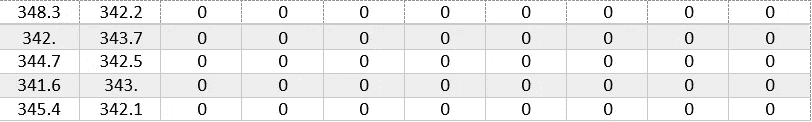
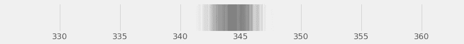
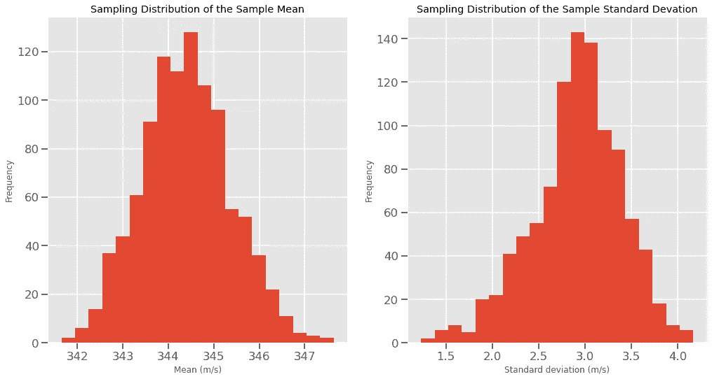
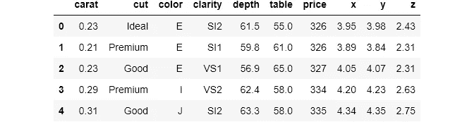
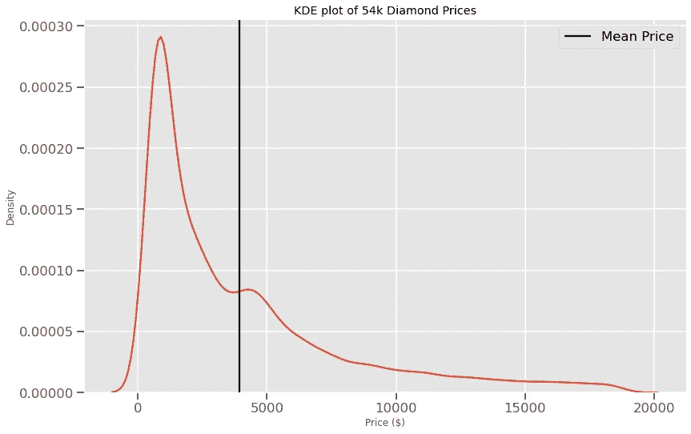
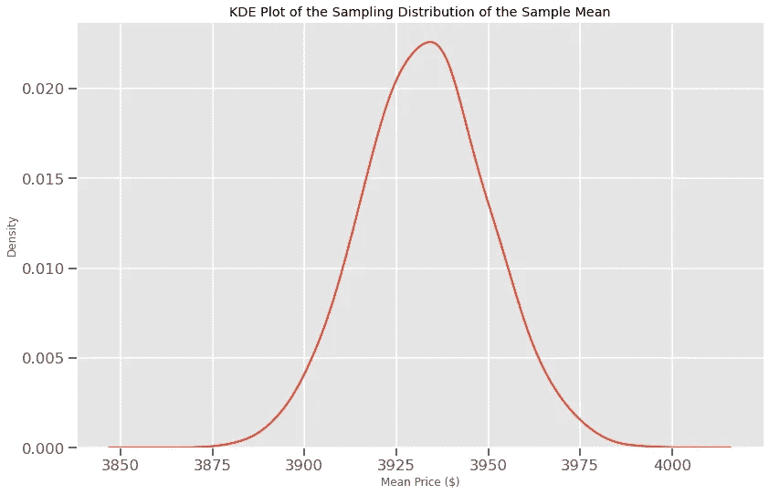

# 为什么自助抽样是概率思维的利器

> 原文：<https://towardsdatascience.com/why-bootstrap-sampling-is-the-badass-tool-of-probabilistic-thinking-5d8c7343fb67?source=collection_archive---------31----------------------->

## 以及你现在如何在实践中运用它


**照片由** [**Pixabay**](https://www.pexels.com/@pixabay?utm_content=attributionCopyText&utm_medium=referral&utm_source=pexels) **发自** [**像素**](https://www.pexels.com/photo/brown-and-black-leather-work-boots-on-brown-surface-60619/?utm_content=attributionCopyText&utm_medium=referral&utm_source=pexels)

## 介绍

你尽了最大努力，用电子设备在你的房间里测量了 50 次声速。感到非常自豪和兴奋，你看着你的结果:



好大的耳光！在前 10 次测量后，该设备出现了技术故障。它根本没有测量任何东西。你现在做什么？

你可以取可用数据的平均值，但你有多大把握呢？如果设备工作正常，你计算的平均值可能是其他数字。

事实上，测量 50 次速度的全部原因是，你可以对你的发现充满信心，并对任何环境下的声速做出有效的假设，而不仅仅是在你的房间里。

你必须经历所有的痛苦，并设置一个新的设备来记录更多的测量结果吗？见鬼，不！好吧，至少如果你知道 Python 和一个叫做 **Bootstrapping** 的神奇方法。

Bootstrapping 允许您模拟任何数据分布。这意味着您避免收集更多的数据。你可以只用一个子集对一个大得多的群体做出相当合理的估计。

使用 bootstrapping 从一个小样本到对整个群体进行预测的概念已经让人们信誓旦旦了很多年。如果在实践中使用，这似乎有点像作弊。但事实上，它只不过是很少的数学和大量计算能力的结合。

尽管这是一个非常简单的方法，但是它的应用远远超出了本文的范围。许多领先的机器学习算法，如[随机森林](https://en.wikipedia.org/wiki/Random_forest#:~:text=Random%20forests%20or%20random%20decision,average%20prediction%20(regression)%20of%20the)和[随机梯度推进](https://medium.com/p/782ea76b022e/edit?source=your_stories_page-------------------------------------)也使用它。

在本帖中，我们将了解这种方法的工作原理，以及我们如何使用 Python 实现这种方法来模拟数据分布，这有助于我们对人口进行预测，计算置信区间，并在未来进行假设检验。

<https://ibexorigin.medium.com/membership>  

获得由强大的 AI-Alpha 信号选择和总结的最佳和最新的 ML 和 AI 论文:

<https://alphasignal.ai/?referrer=Bex>  

## 术语警报

在这篇文章中，我会经常用到人口、样本、统计和参数这些词。因此，在我们继续下一步之前，理解它们是很重要的:

*   **人口和样本**:在统计学中，*人口*是指我们感兴趣的整个群体，*样本*只是人口的一个小的随机子集。例如,“走向数据科学”出版物的所有关注者可以是整个群体，而阅读这篇文章的人只是这个群体中的一小部分。对于我们的情况，我们房间中的 10 个声速测量值可以作为样本，而任何环境中的声速测量值可以作为总体。
*   **参数和统计**:如果我们为总体计算某个度量，例如平均值或标准差，它被称为总体*参数*。如果我们对一个样本这样做，它将被称为样本*统计*。

举个例子，假设你有一万个电子邮件用户。你给所有的订阅者发了一封邮件，询问他们最喜欢的编程语言。只有 2500 人回应，其中 70%的人喜欢 Python。这里:

*   **人口** : 1 万电子邮件用户
*   **样本** : 2500 人回应
*   **统计** : 70%喜欢 Python
*   **参数**:未知，我们应该只使用样本计算所有喜欢 Python 的订阅者的百分比。

既然我们就术语达成了一致，让我们继续自举。

## 自举理论

为了在实践中展示自举，我们将从声速的十个测量值开始。首先，让我们绘制数据点:


我们的目标是在任何开放的环境中正确估计声速，而不仅仅是在房间里。因为我们不太可能看到声速的异常值，所以平均值可以是代表速度的一个很好的度量。所以，让我们在图上标注一下意思:


我们得到的平均值是 344.39 米/秒(米每秒)。现在，我们引导样本:

1.  首先，我们从速度中随机选择 10 个测量值，允许重复。
2.  计算这个随机样本的平均值，并将其存储在一个数组中。
3.  重复第一步和第二步很多很多次，最好是 1000 或 10000 次。

因此，让我们从可用数据中随机选择 10 个点，我们可以根据需要多次选择任何数据点:


我使用 Python 随机选择这些点(稍后我将展示如何选择)。正如你所看到的，我们只有 7 个独特的点，这意味着有 3 个点绘制在彼此的顶部，因为我们最终有一些重复。然后，我们测量平均值并绘制出来，这次是 344.396。

以下是从最初的 10 次测量中随机抽取的 10 个点:

```
>>> list(temp)[345.59, 345.07, 340.4, 349.47, 340.92, 349.47, 340.26, 349.47, 342.91, 340.4]
```

以上称为单自举样本。它的平均值是 344.396，称为自举复制或度量。

接下来，我们应该重复这两个步骤数千次。例如，下面我将选取 1000 个 bootstrap 样本，并仅在一个图表上绘制它们的平均值:



上图是从最初 10 次声音测量中采样的 1000 个 bootstrap 复本(平均值)的图表。我用较低的透明度绘制线条，以便重叠的线条在实际估计的平均值周围创建一个更密集的背景。如您所见，样本平均值约为 344 m/s，我们可以放心地将其用作任何环境中的一般平均声速。

我们刚刚做的叫做*自助抽样*与*替换*。*带替换*是指从底层样本中随机选择一个数据点并放回原处，这样所有的数据点都有均等的机会再次被选中。

此外，重要的是每个引导样本与基础样本具有相同的长度。在我们的例子中，每个 bootstrap 样本的长度为 10，因为我们一开始只有 10 个速度测量值。

现在，问题是‘为什么我们必须假设我们用 bootstrap 抽样计算的平均值接近实际的总体参数？’。在下一节中，我们将根据一些数学知识来回答这个问题。

## 为什么自举有效

在概率论中，有一个理论叫做大数定律。它表明，如果同一个实验进行了很多次，随着实验次数的增加，实验的平均结果往往更接近真实的估计值。

例如，掷出一个公平的骰子会有六种结果 1，2，3，4，5，6。你的预期分数是这 6 个数字的平均值，即 3.5。当然，现实中你滚几次骰子也不会有 3.5 的平均分。但是，由于大数定律，随着你掷数的增加，你的平均分越来越接近 3.5。

如果你想一想，这实际上是有道理的。举一个更真实的例子，如果你参加两次 SAT 考试，你可能会得到两个非常不同的结果。然而，越来越多地参加考试会让你越来越接近你在考试上的实际技能衡量标准。

Bootstrapping 在幕后使用了同样的想法。给定一个好的样本(我将在下一节解释什么是好的样本)，从这个样本中随机抽取样本实际上会给出非常接近实际总体参数的结果。

对我来说，多次使用少量数据对一大群人进行预测，而不必收集更多的数据，这是非常令人惊讶的。

## 自举有多有效

一个显而易见的问题是这种方法的效果如何。答案是，大多数时候，你可以期待引导的结果是正确的和可用的。但是，对总体参数进行推断的准确性取决于您收集的样本。

为了使引导正确工作，您使用的样本应该准确地代表感兴趣的总体。例如，如果你想收集人的身高信息，并计算地球上所有人类的平均身高，你必须选择正确的样本。

此外，收集的数据应该是真正随机的，包括来自人口中广泛群体的数据点。只选择运动员这样的特定群体不会是一个足够好的样本。因为运动员往往比较高。

如果您确定您正在使用一个足够好的样本，那么您几乎总是可以确定从引导中获得的结果是可靠的。如果没有，你必须大胆地使用 bootstrapping，因为大多数时候你给的数据都是次要的(别人收集的)。

作为一个额外的好处，自举可以用来测量人口的其他参数的整个范围。很好的例子有中位数、众数、标准差、方差、相关性等等。

## 什么是抽样分布

术语“自举”和“采样分布”经常一起出现，事实上，采样分布是使用自举获得的。让我们用早期的声速测量来澄清这一点。

回想一下，我们从最初的 10 次测量中提取了 1000 个引导样本，并绘制了每个引导样本的平均值。这一次，我将把所有的方法存储在一个 Python 数组中，而不是绘制:

我正在显示存储在变量`means`中的 1000 个平均值中的前 20 个。在概率学中，`means`被称为样本均值的*抽样分布。相反，我们计算每个引导样本的标准偏差:*

它将被称为“样本标准差的抽样分布”。

这种分布实际上是没有用的，除非我们把它画出来。采样分布的常见图形是直方图:



我们可以看到采样分布近似为[正态分布](/how-to-use-normal-distribution-like-you-know-what-you-are-doing-1cf4c55241e3?source=your_stories_page-------------------------------------)。事实上，随着 bootstrap 样本数量的增加，在正确的 bootstrap 条件下获得的每个单个采样分布将遵循近乎完美的[正态分布](/how-to-use-normal-distribution-like-you-know-what-you-are-doing-1cf4c55241e3?source=your_stories_page-------------------------------------)。

最后，在下一节中，我们将看一下生成所有这些引导和示例发行版的代码。

## Python 中的引导

Python 中的引导通常从数据帧开始。这项技术本身广泛使用了`numpy`，所以我们将把它和`pandas`以及两个绘图库一起导入:

我将加载 Seaborn 的内置钻石数据集，我们将使用 bootstrapping 来推断整个钻石群体的平均价格:



下面是钻石价格的核密度估计图，平均值标注为黑线:



> 平均价格是 3932.8 美元。

现在，我们将把钻石价格提升 10k 倍，这样我们就有了所有可能的钻石数量:

首先，我们创建一个空的`numpy`数组来存储平均值。然后，我们用 10k 次迭代初始化一个`for`循环。在每次迭代中:

*   我们使用`np.random.choice`进行引导抽样
*   我们使用潜在分布的长度(钻石价格)作为`size`参数
*   我们使用每个样本计算平均值，并将其添加到`means`

> `*np.random.choice*`默认情况下，接受任何值序列并随机选择替换的数据点。

为了绘制样本均值的抽样分布，我们可以使用 Seaborn 的`kdeplot`或 Matplotlib 的`hist`。虽然选择权在你，但我更喜欢 KDE 的情节，因为它噪音更小，也避免了宁滨偏见:



正如所料，我们看到了一个非常接近正态分布的匹配。现在，问题是‘我们现在如何对人口参数做出假设？’。这将使用置信区间来回答。

## 置信区间

一般来说，当你看到有人提到某个指标的 *k%* 置信区间为[m，n]时，这意味着他们有 k%的把握认为总体指标位于 *m* 和 *n* 之间。

你看，当你从概率的角度思考时，你永远不能绝对肯定地说总体参数等于某个数字，因为你只用一个小样本来计算你的假设。因此，统计学家计算参数的区间，并声明参数位于某个区间内。

置信区间的常见百分比是 95%或 99%。区间本身基本上是用百分位数来计算的。例如，为了计算抽样分布的 95%置信区间，您将 2.5%作为下限，将 97.5%作为上限。

另外，记住取“中间”区间，而不是另一个像第 0 和第 95 或第 5 和第 100 百分位。实际参数总是位于更居中的区间。

为了在 Python 中实现这一点，我们将使用`numpy`的`np.percentile`函数，该函数将采样分布和百分点作为参数:

看着上面的数字，我们可以 95%确定世界上所有钻石的平均价格都在 3899 ~ 3968 美元之间。

我们本可以轻松获得 99%的置信区间:

这次我们得到**【3889.45，3977.59】**。

## 结论

恭喜你！你学到了大量的新知识，这对你的数据科学职业生涯非常有帮助。请记住，自举只是迈向更复杂的推断统计学和概率论的第一步。正如你将在我未来的文章中看到的，我们将使用 bootstrapping 来制定假设检验，这也是数据科学工作流程的一个重要部分。待[调好](https://medium.com/@ibexorigin)！