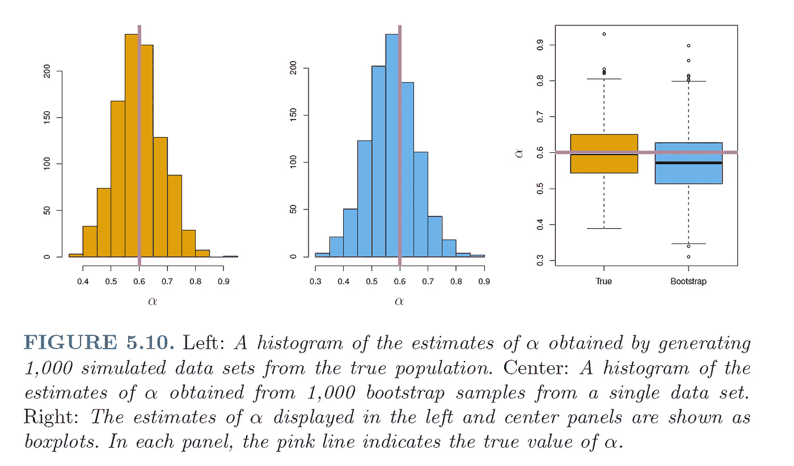

# 为什么自举真的有效

> 原文：<https://towardsdatascience.com/why-bootstrapping-actually-works-1e75640cf172?source=collection_archive---------13----------------------->

## 一个简单的门外汉解释为什么这种流行的技术在数据科学中有意义

内森·杜姆劳在 [Unsplash](https://unsplash.com?utm_source=medium&utm_medium=referral) 上的照片

我们**不**总是有丰富的项目数据。通常，由于缺乏资源来进行重复实验(例如 A/B 测试),我们只有**一个**样本数据集。

幸运的是，我们有**重采样方法**来充分利用我们拥有的任何数据。 **Bootstrapping** 是一种重采样技术，如果我们只在原始样本上拟合一次我们的模型，它可以提供否则无法获得的信息。

虽然我们可能熟悉自举背后的'**什么**'和'**如何**'，但本文旨在以通俗的方式呈现自举的' ***为什么*** '。

# 快速回顾自举

bootstrap 的目标是基于从原始样本获得的多个数据样本，为总体参数(例如总体均值 ***θ*** )创建一个**估计值**(例如样本均值 **x̄** )。

通过重复采样(替换)样本数据集以创建许多模拟样本来完成自举。每个模拟的 bootstrap 样本用于计算参数的估计值，然后将这些估计值组合起来形成采样分布。

然后，bootstrap 抽样分布允许我们进行统计推断，例如估计参数*的标准误差。*

引导程序|作者图片

# 自举为什么有效？

你一定想知道，重复**采样同一个** **样本**数据集的行为怎么能让我们对人口统计数据做出推断呢？

理想情况下，我们希望从真实人口中抽取多个独立的真实样本来理解人口统计数据。然而，我们早些时候已经确定这并不总是可能的。

因此，我们必须使用我们的样本数据集，它成为我们所拥有的关于人口的最好的(也是唯一的)信息。

合理的假设是，大多数样本(如果随机抽取的话)看起来非常像它们所来自的人群。考虑到这一点，这意味着我们的样本数据可以被视为一个**总体，我们现在假设它代表了真实的总体**。

有了这个虚拟群体，我们就可以从中抽取多个(bootstrap)随机样本。这就好像我们现在从真实人群中获得了多个样本。

*注:现实中，原始样本只是我们从真实人群中得到的* ***一个*** *样本。*

因为允许带替换的抽样，所以 bootstrap 样本也可以看作是在不同方法和假设下产生的随机样本。

从这些 bootstrap 样本中收集的样本信息将最终帮助我们获得总体参数(如总体均值)的(相对)精确估计。

图片来自[统计学习入门—第二版](https://www.statlearning.com/) |经[许可使用](https://www.statlearning.com/resources-second-edition)

那么 bootstrap 抽样有多有效呢？上图比较了真实人群中 1000 个模拟样本的参数( *α* ) 估计值与 1000 个 bootstrap 样本的估计值。

我们可以看到箱线图具有相似的分布，表明 bootstrap 方法可以有效地估计与参数估计相关的可变性。

# 摘要

在本文中，我们探索了引导背后的直觉的简单解释。希望这篇文章能让你更好地理解自举，以及为什么它在理论和实践上都行得通。

关键概念是假设原始样本代表总体。通过对该样本进行多次重采样，我们得到了总体参数样本估计的相对精确的采样分布。

当然，这里有几个注意事项。例如，在从真实人口中抽样的正常情况下，我们绝不会从整个人口中抽取同样大小的样本。但是，在引导中通常使用与原始数据集相同的样本大小。

关于众多警告的更多细节，你可以查看这个 StatsExchange 论坛线程[这里](http://StackExchange - CrossValidated)。我也期待你对这个话题的反馈。

## 在你走之前

欢迎您加入**我的数据科学学习之旅！**点击这个[媒体](https://kennethleungty.medium.com/)页面，查看我的 [GitHub](https://github.com/kennethleungty) ，了解更多令人兴奋的数据科学内容。同时，祝你自举愉快！

 [## 垂死的雷鲁问题，解释得很清楚

### 通过理解 ReLU 的缺点来保持你的神经网络的活力

towardsdatascience.com](/the-dying-relu-problem-clearly-explained-42d0c54e0d24)  [## 用字符错误率(CER)和单词错误率(WER)评估 OCR 输出质量

### 测量光学字符识别输出质量的关键概念、示例和 Python 实现

towardsdatascience.com](/evaluating-ocr-output-quality-with-character-error-rate-cer-and-word-error-rate-wer-853175297510)  [## 面向数据科学和 Python 的最受欢迎的 GitHub Repos

### 发现许多数据专业人员和 Python 程序员正在关注的非常受欢迎的回购

towardsdatascience.com](/the-most-starred-forked-github-repos-for-python-and-data-science-f8bb3de47e96)