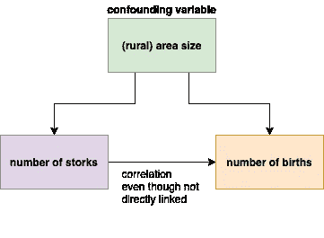
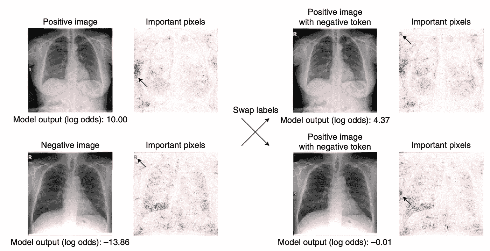

# 为什么构建黑盒模型可能是危险的

> 原文：<https://towardsdatascience.com/why-building-black-box-models-can-be-dangerous-6f885b252818?source=collection_archive---------31----------------------->

## 可解释性可以拯救生命

机器学习模型以复杂的黑盒而闻名，其输出和预测背后的推理通常是不可解释的。

由 [Unsplash](https://unsplash.com?utm_source=medium&utm_medium=referral) 上的 [krakenimages](https://unsplash.com/@krakenimages?utm_source=medium&utm_medium=referral) 拍摄的照片

# 我们需要可解释性吗？

然而，当涉及到“高风险”决策时，我们真的想相信一个黑匣子吗？例如，当涉及医疗保健决策时，机器学习模型预测患者是否可以在重症监护中接受监控或需要特殊治疗(例如，不同的药物治疗)。这些决定不应该由训练有素的医生而不是黑盒算法来做吗？在这样的领域，参与这些“高风险”决策的每个人都“参与”决策是非常重要的。

> 但是模型是高度精确的，那么我们为什么需要可解释性呢？

经常有人认为我们不需要关心可解释性，因为模型的准确性非常高。这就是它变得危险的地方！通常情况下，模型会发现它们不应该发现的东西，并通过混淆变量来提高准确性。

> *A* ***混杂变量*** *是你没有考虑的变量。它们会毁掉模型，给你提供无用的结果。他们可以暗示有关联，但事实上没有。*

# 这么说，鹳生孩子是真的了！

莫里斯·沙尔克在 [Unsplash](https://unsplash.com?utm_source=medium&utm_medium=referral) 上拍摄的照片

2000 年，马修斯发表了一篇名为“鹳分娩婴儿”的论文，他声称分娩和某个地区鹳的数量之间有着重要的关系。他发现相关系数 r=0.62，p 值为 0.008，这支持了他的发现。**当然，他只是指出，我们应该意识到混淆变量和关联因果关系:**

混淆变量-作者图片

即使两个变量可以表现出显著的相关性，但这并不意味着现实世界中存在因果关系。在这篇幽默论文的结尾，马修斯指出，读者应该更深入地研究一个国家(农村)地区的关系，看看是否与分娩有可能的相关性，而这种相关性更有可能与因果关系相关联。

# 新冠肺炎诊断中的混淆变量

Alex DeGrave 等人的一篇新论文显示，研究人员和放射科医生最近训练了 ML 模型，可以准确地检测胸片中的新冠肺炎。然而，在调查了模型的性能后，论文中的研究人员发现，该模型通过查看 x 光照片上的文本标记(文本片段)来走捷径，并将其预测建立在标记的位置而不是实际的 x 光照片上。

如果这些标记的位置发生变化(例如，由于不同的 x 光机而在不同的医院)，模型的准确性将显著下降，并产生错误的预测，这在疾病诊断的情况下可能是危险的或危及生命的！

射线照片上的文本标记通过显示新冠肺炎预测重要性的显著图来突出显示。与交换相同大小的随机补片相比，新冠肺炎阳性和新冠肺炎阴性图像之间标记位置的交换显著改变了预测——改编自 DeGrave，Alex J .，Joseph D. Janizek 和 Su-In Lee。"射线照相新冠肺炎检测的人工智能选择捷径而不是信号."

> 如果你的模型有很高的准确性，甚至可能拾取训练有素的专家看不到的东西，问“为什么它表现得这么好”是非常重要的如果你不问这个问题，你的模型可能不能很好地概括，给你带来很多麻烦！辛西娅·鲁丁

# 可解释性与准确性

> “为了可解释性，我们不得不牺牲准确性！”

为了可解释性，我们必须牺牲准确性，因为我们必须使用不太复杂的模型，这是一个有害的神话。由[辛西娅·鲁丁](https://users.cs.duke.edu/~cynthia/papers.html)(可解释 ML 的倡导者)提出的一个论点是，建立可解释的模型实际上可以提高准确性。当构建一个可解释的模型时，我们开始质疑和研究它，而不是黑盒模型，并提出更多的问题:

*   (确定的)因素真的是推动最终决策的最重要因素吗？
*   我的结果没有任何意义，可能是数据集有问题？也许更多地关注数据而不是模型会提高准确性？
*   如果这些变量很重要，也许它们中的一些可以组合成更有意义的东西(“特征工程”)。

通过了解您的模型并能够解释其预测，您可以通过在数据和特征工程上花费更多的时间来迭代地提高模型的准确性，而不是像构建黑盒模型那样将大部分这些部分从您身边带走。

> 一旦你开始做更多的数据科学，你就开始获得更多的性能！

# 那为什么我们还有黑盒模型呢？

所以你可能会问，为什么我们需要黑匣子。嗯，根据辛西娅·鲁丁的说法，这其实很简单:

*   人们喜欢黑盒，他们喜欢这种想法，即这些复杂的算法可以揭示数据中没有人能够理解的秘密。
*   黑盒保护商业！公司通常对构建可解释的模型不感兴趣，因为他们更喜欢没有人可以复制/窃取并且难以挑战的黑盒。
*   黑盒模型不需要任何或很少的领域知识，几乎任何具有基本机器学习知识的人都可以实现。

如果一个模型是一个黑盒，那么很难争论它是否有意义，因为没有人能看到里面发生了什么。你经常剩下的唯一衡量标准是准确性——这是非常成问题的！

> 如果你有一个简单的可解释的模型，那么人们会争论和质疑它！—然而，可悲的是，这通常不是 ML 工程师和公司想要的。

# 更多材料

**【1】**数据怀疑论播客——不需要黑盒——辛西娅·鲁丁:[https://dataskeptic . com/blog/episodes/2020/不需要黑盒](https://dataskeptic.com/blog/episodes/2020/black-boxes-are-not-required)

辛西娅·鲁丁——请停止“可解释的”ML:[https://www.youtube.com/watch?v=I0yrJz8uc5Q](https://www.youtube.com/watch?v=I0yrJz8uc5Q)

**【3】**罗伯特·马修斯—“鹳接生(*p*= 0.008)”:[https://online library . Wiley . com/doi/ABS/10.1111/1467-9639.00013](https://onlinelibrary.wiley.com/doi/abs/10.1111/1467-9639.00013)

**【4】**Alex de grave 等人，“用于射线照相新冠肺炎检测的人工智能在信号上选择快捷方式。”*自然机器智能*(2021):[https://www.nature.com/articles/s42256-021-00338-7](https://www.nature.com/articles/s42256-021-00338-7)