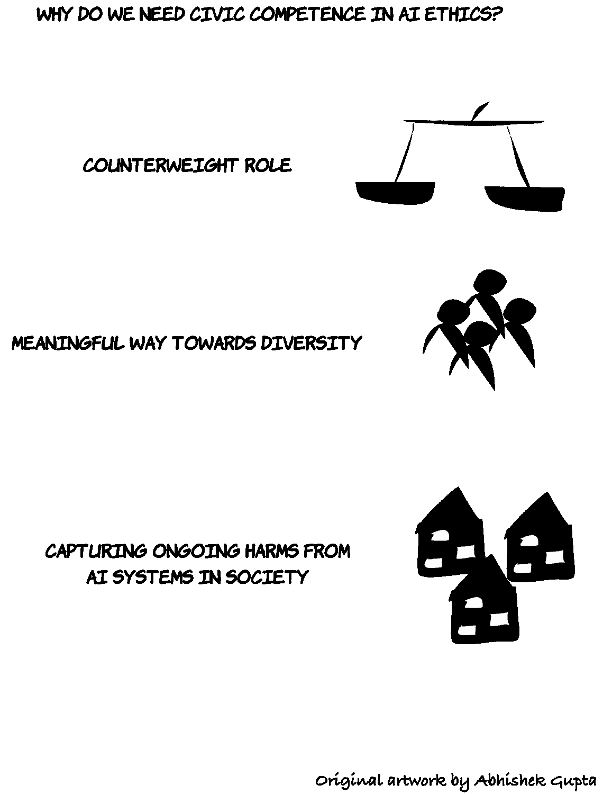
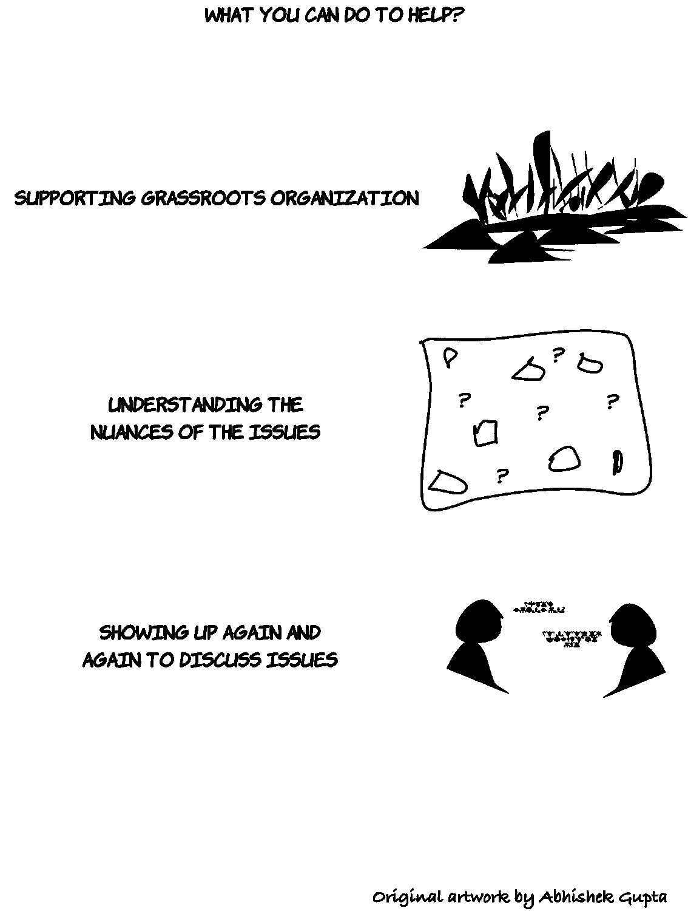

# 为什么 2021 年需要人工智能伦理方面的公民能力

> 原文：<https://towardsdatascience.com/why-civic-competence-in-ai-ethics-is-needed-in-2021-697ca4bed688?source=collection_archive---------35----------------------->

## [变更数据](https://towardsdatascience.com/tagged/data-for-change)

[Jukan Tateisi](https://unsplash.com/@tateisimikito?utm_source=unsplash&utm_medium=referral&utm_content=creditCopyText) 在 [Unsplash](https://unsplash.com/s/photos/steps-child?utm_source=unsplash&utm_medium=referral&utm_content=creditCopyText) 上的照片

> “因此，不仅参与这一技术未来对你来说很重要，而且要考虑另一种未来，在这种未来中，你的想象力可以塑造我们正在构建的技术。”
> 
> 蒂姆尼特·格布鲁博士
> 
> [文丘里管](https://venturebeat.com/2020/12/10/timnit-gebru-googles-dehumanizing-memo-paints-me-as-an-angry-black-woman/)

从许多不同的角度来看，2020 年无疑是书籍的一年。我们不需要提醒所有出错的事情。感觉人工智能伦理领域本身就是周围发生的一切的缩影。接近年底的时候，我觉得 Gebru 博士在谷歌工作期间所经历的不公正和麻烦确实为我们蒙特利尔人工智能伦理研究所的使命增添了更多的燃料，我们呼吁建立人工智能伦理方面的公民能力。这在上面引用的 Gebru 博士的话中得到了恰当的体现，我希望我们把这句话作为我们进入 2021 年的战斗口号。

添加替代文本

*照片由* [*马特·博茨福德*](https://unsplash.com/@mattbotsford?utm_source=unsplash&utm_medium=referral&utm_content=creditCopyText) *上* [*下*](https://unsplash.com/s/photos/voice?utm_source=unsplash&utm_medium=referral&utm_content=creditCopyText)

什么是公民能力？

公民能力是指日常生活和各行各业的人能够有意义地参与某一特定主题的讨论的能力。在这里，有意义的参与是指带着解决方案的心态，对问题有基本的了解，以前尝试过什么，以及我们可以采取什么实际行动来以富有成效的方式推进讨论。

至少，这是我对它的工作定义，也是我通过在蒙特利尔人工智能伦理研究所(T21)的工作努力帮助社区发展的东西。

# 在 AI 伦理学领域意味着什么？

人工智能伦理领域，无论你是一个完美的内部人士还是一个关心的公民，都充斥着许多不同的讨论，涉及隐私、偏见、公平、问责、透明度、治理、责任等主题，以及更多不同的想法，其中一些想法彼此有重叠，另一些则没有。

这里需要考虑的一件重要事情是，无论你是否选择直接接触人工智能，所有人都会感受到它的影响。因此，如果我们想要塑造该领域的技术和政策措施，以使我们走向一个技术创造积极变化的世界，我们需要以一种细致入微的方式参与其中，而不是对任何领域应用一刀切的方法。这种一刀切的做法将导致该领域的措施要么扼杀创新，要么使该领域过于不受监管和监督，从而继续对人们造成伤害。

添加替代文本

# 我们为什么需要它？

我认为人工智能伦理中的公民能力很重要，主要有三个原因:

1.  平衡角色
2.  更有意义的多元化之路
3.  从人工智能系统中捕捉社会危害的持续基础

# 1.平衡角色

有许多来自政府、学术界、工业界和民间社会的人工智能伦理倡议。它们中的每一个都有特定的议程，这些议程决定了用于管理技术及其部署的技术和政策措施。

但是，由于它们的组成、资金来源、调查方法等原因，它们经常遗漏某个方面。拥有基础广泛的公民能力可以帮助更多的人以批判的眼光看待问题，并以某种方式发现盲点，而当我们有几个(通常)背景相似的人时，这是不可能的。

# 2.更有意义的多元化之路

我们来自不同的生活领域，有着不同的生活经历、文化、语言、能力、心态，以及我们所有人都是独一无二的，创造一个能够捕捉所有这些丰富性的单一工具是一个失败的秘诀。

我们不经常考虑这个问题，但是当你有很多人众包时，通常会有这样的印象，我们会得到很多低质量的建议，可能是因为不熟悉领域，钓鱼行为等。但是，这也导致了一些宝石，否则将去探索和阐明。我们已经在蒙特利尔人工智能伦理研究所举办的研讨会上亲眼目睹了这种情况，在那里，“专家小组”本应在讨论中提出(但没有)绝对精彩的建议。

多元化有许多方面(有许多学者在这方面受过更好的教育，他们清楚地阐述了多元化的维度)，这是单个个人甚至一群人无法预见的。为此利用群众肯定是一种可以帮助我们尽可能彻底的方法。

# 3.从人工智能系统中捕捉社会危害的持续基础

最后，实时监控人工智能系统的危害并不是一件容易的事情。当然，当我们有许多不同的方式可以在现场部署像人工智能这样的多用途技术时，无论是良性还是恶意行为者，情况都是如此。

增强人们的能力，让他们能够更批判性地思考常见的伤害模式，可以帮助他们成为众包监管者，可以发现可能出错的地方，与记者分享(例如)，并吸引研究和开发人员的注意，以便我们可以开始解决问题。

添加替代文本

# 我能帮什么忙？

有许多方法可以实现这一点，下面的列表只是思考其中一些问题的起点:

1.  支持基层组织
2.  逐渐熟悉其中的细微差别
3.  即使你觉得辩论没有进展，也每天出现

# 1.支持基层组织

有很多方法可以帮助你在这个领域建立公民能力。一个简单的方法是支持你当地的组织做这种工作。这包括正式和非正式的努力，无论是通过对门票销售的捐款，还是通过认捐款项来支持他们的使命的更正式的承诺。经常有人问我，少量的钱是否会有所作为，对于那些由志愿者或自筹资金的组织来说，你可以放心，每一美元都会有所作为。

你不需要总是把财政支持视为唯一的途径；奉献时间和其他实物支持也是帮助当地努力的好方法。

# 2.变得熟悉细微差别

当谈到建设公民能力时，我们需要考虑的一个关键问题是保持必要的细微差别，以有意义地推进对话。这意味着要认真关注问题，不要妄下结论，花时间谨慎行事，以获得必要的跨学科视角，帮助我们做出明智的决策，并为生态系统所需的正确变化而努力。

这来自于相互接触和从更广泛的人群中学习，而不仅仅是一个人通常所习惯的。这可能很麻烦，但这种投资的长期回报是值得的。

# 3.即使你觉得辩论没有进展，也每天出现

这可能是最难的要求，但最终也是最有影响的:即使短期结果令人失望，进展缓慢，没有多少人支持你的使命，我们也需要继续推动公民能力的建设。

在蒙特利尔人工智能伦理研究所的工作中，我亲自面对了这个问题。在疫情会议之前，我们的活动和研讨会在很大程度上仅限于与蒙特利尔的一系列社区合作伙伴共同举办的现场活动。从那时起，我们已经成为一个数字优先的研究所，汇集了来自不同学科和机构的研究人员，并欢迎来自世界各地的参与者和合作者

我鼓励每个人在 2021 年人工智能伦理学的所有工作中保持这一理念，为今年和未来几年的成功奠定基础。

> **想了解更多我的作品，可以访问:**[**https://ATG-abhishek . github . io**](https://atg-abhishek.github.io/)