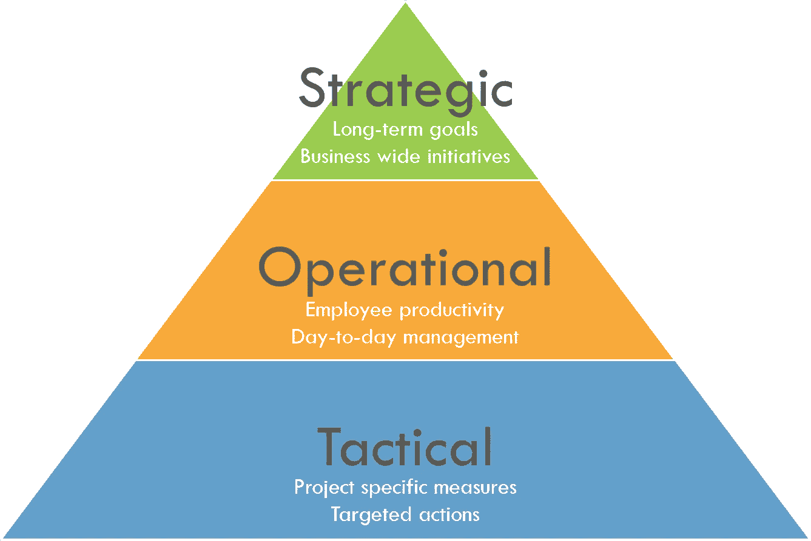

# 为什么不断查看指标会让公司走向失败

> 原文：<https://towardsdatascience.com/why-constantly-looking-at-metrics-sets-companies-up-for-failure-a7a2d91ee7fd?source=collection_archive---------17----------------------->

## 仅仅因为某些东西是可以衡量的，并不意味着它有助于实现你的目标。

照片由 [Unsplash](https://unsplash.com/?utm_source=unsplash&utm_medium=referral&utm_content=creditCopyText) 上的 [Praveesh Palakeel](https://unsplash.com/@praveesh?utm_source=unsplash&utm_medium=referral&utm_content=creditCopyText) 拍摄

你正在路上开车，这时一个警察在你后面停下来，没有闪灯，只是拐上了高速公路，而你恰好在前面。你没有超速，没有喝醉，没有打电话，也没有其他任何令人担心的事情。只是从一个地方到另一个地方，但你还是会瞥一眼速度计，以防万一。此时此刻，你不关心你的发动机温度，你有多少汽油，或者你的机油压力低。你只是在检查与你当时的情况相关的主要指标，以确保你没有给这位官员一个借口来完成他这个月的配额。

这个逻辑同样适用于商业。

我经常看到高管和经理试图将他们所知道的每一个指标都塞进一个仪表板中，试图确保他们对自己的业务“了如指掌”。我很欣赏你的意图，但这将不可避免地让你的生意偏离正轨。让我们回到前排座位，假设我们现在采取的立场与我们热切的执行官相同。你注意到了警察，但同时你开始检查你的油箱还剩多少英里，轮胎压力看起来好吗，后座的孩子们在说什么，哦，那些肯定是我身后明亮的闪光灯...

恭喜你，你设法在最糟糕的时候超速了一会儿，并得到了法庭授权的机会，向你所在的乡镇捐献 125 美元。或者在商界，你现在已经错过了你的季度目标，因为你的注意力分散在小事上，你没有对真正重要的事情给予足够的关注。

## 设置通知阈值

试图一直关注每一件事意味着你不能把注意力集中在重要的事情上。这并不是说不应该进行监控，只是你不应该一直盯着它。因为我不知道你是做什么生意的，所以在这个例子中，当我们把注意力集中在引擎温度上的时候，你要迁就我。如果你的车开始过热，你会得到通知，当然，你会停下来补救。没有人会反驳你的发动机融化不是最理想的情况，但你没必要每次出行都把眼睛粘在温度计上。一旦正常的门槛被突破，那么你就可以把注意力集中在它上面。在那之前，没什么好担心的，你明明还在前进。

请记住，通知不会在发动机熔化后出现，一旦有东西不再正常范围内，您就会收到通知。离开这个门槛后，你的注意力就被吸引到这个问题上，以免它变成一个真正的问题。这也正是您应该如何处理您的业务指标。不管你的指标是大幅波动还是周环比稳定；它会经历一些“正常”的版本，因此相应地设置触发器。确定一个合适的阈值通常既是科学也是艺术，所以你可以问一些问题来帮助你设定一个合适的水平:

*   指标需要达到什么值才能引起警报？
*   是否有一些上限或下限是不可接受的？
*   一旦指标超过某一水平，它会开始影响其他指标或过程吗？
*   简单地打破当前目标是一个足够好的通知吗？
*   趋势比实际值更重要吗？

如果你对以上至少一个问题没有答案，那么你真的应该问问你为什么要看这个指标。然而，如果你处于别无选择的情况下，那么我至少会建议你采用某种[控制限制](https://en.wikipedia.org/wiki/Control_limits)。如果你想要更多的提示，你可以下降到 2.5 或 2 个标准差，但这都取决于指标的波动性。还要记住，趋势或斜率可能与实际表现一样重要，甚至更重要。因此，通知可以根据反复的下跌或上涨趋势来设置，而不是达到某一水平…或者两者都有。

> 一周又一周地审查绿色记分卡没有任何价值，因为这是在浪费会议时间。

无论如何，我们不可避免地会扫描任何红色的东西或丢失的目标，所以当事情得到控制时，为什么要浪费时间呢？这并不是说你应该改变目标。你能做的最糟糕的事情就是仅仅因为事情似乎在控制之中就改变目标。你完全可以探索在下一个级别操作的机会，但是这要从回顾你的过程能力开始，而不是要求任意的%改进。例如，期望发动机在比正常温度低的温度下运行是荒谬的——它应该变暖。不要忽视一些指标在一个范围内运行得最好，不应该不断地被进一步推动。

## 自动通知

您已经在查看记分卡，因此有能力定期获取这些数据。很可能已经有一些红/绿格式的目标了。从那时起，检查指标 A 是高于还是低于设置的阈值是一个简单的工作。没有理由不在您的仪表板中自动显示警报。重点是将会议中手动扫描记分卡的工作转移到让计算机扫描记分卡上。

不再审查不太重要的指标所节省的时间可能看起来微不足道，但想想所有因误解无关紧要的指标而发生的兔子洞讨论和衍生会议。对于一些领导者来说，不给出一些指导就离开运营回顾可能很难，所以很容易要求“双击”那个“关闭”的指标。见鬼，领导者很有可能忘记了它是如何计算出来的。你已经对汽车的温度计有足够的信心，可以安全地把你从一个地方带到另一个地方。信任这些新的阈值将是一项更容易、风险更小的任务。

## 高管和经理可能不会评审相同的指标

KPI 层次结构-按作者排序的图像

战略度量与运营度量相同是不常见的，这不是什么新鲜事，但人们往往会忘记。你可能不关心汽车的详细诊断结果，但你的机械师会关心。就像经理们可能不需要关注公司的营业利润率，但高管们需要。也就是说，经理们仍然会被问到为什么会出现某些趋势，所以确实需要在战略指标和运营指标之间进行一些转换。

例如，如果高管需要维持特定的服务水平，那么经理可以考虑员工的生产力。不难看出，同一周生产率的下降很可能是服务水平下降的原因。这种简单的分离允许管理者使用他们直接控制的和特别相关的度量。然而，强迫经理解释他们无法控制或理解的指标会导致审查期间出现虚假的答案，这些答案可能与问题无关或基于轶事信息。

## 允许自治

让我们回到车上，这次是和一名乘客。一条短信进来，你有一个选择 A)拿起电话读它 B)请乘客读它。在负责任的成年人的世界里，每个人都选择选项 b。明知故犯地选择选项 A 会让你处于暂时的风险之中，不管你认为自己能多好地保持对道路的关注。乘客完全有能力阅读文本，并让你知道它是否需要你的注意。是关于你的汽车延长保修期的垃圾短信，还是一个朋友的父母刚刚去世？无论哪种方式，乘客都会通知你，如果需要采取行动，不管最初是谁读了它，它都会发生。

> 这确实需要信任他人去做他们应该做的事情，但是如果你不能信任他们去做，那么你可能会遇到比管理度量更大的问题。

对于任何不能自动化或复杂到需要人工审查的事情，引入项目经理或 SME 没有坏处。给予项目经理或 SME 监控与其领域相关的运营指标的自主权，将使领导者的注意力集中在关键的业务计划上。这些中小企业将对趋势有适当的背景，并更适合于知道什么时候真的是一个问题，并在需要时提出来。在业务回顾期间保持讨论，避免对无关紧要的 KPI 趋势进行不必要的猜测。

## 随着关注点的转移，改变或重新评估指标

随着时间的推移，每个业务都会改变方向，因此仪表板也应该相应地改变。例如，当行驶在一条土路上时，速度表不再重要，取而代之的是，你的注意力集中在避开路上的岩石或坑洼。不要仅仅因为遗留指标在记分卡上一直有一席之地就抓住它们不放。如果他们不直接支持你前进的方向，那么就把它放回自动化上，把它交给 SME 来监控，或者完全摆脱它。别浪费时间了！

你回顾的指标应该与你努力实现的行动过程或最终目标直接相关，否则只会分散注意力。那些把注意力从目标上移开的行为最终会刺激不必要的工作，这些工作会导致大量毫无结果的行动。我们已经天生理解我们个人生活中的这个过程，我提到的没有一个是新的概念。因此，在商业世界中应用同样的原则应该是自然而然的，会产生显著的效率和结果。