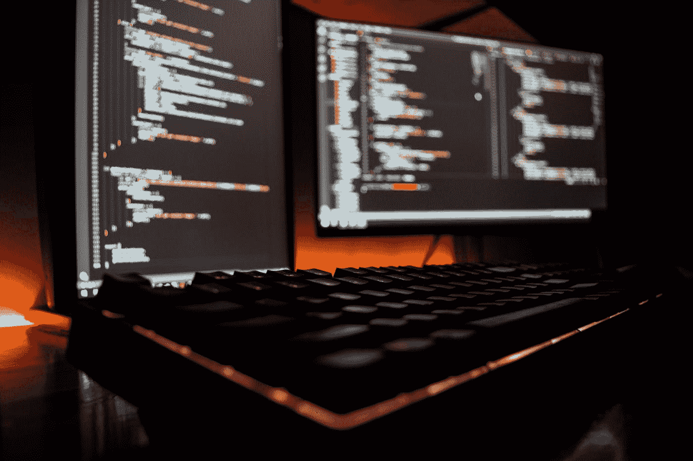
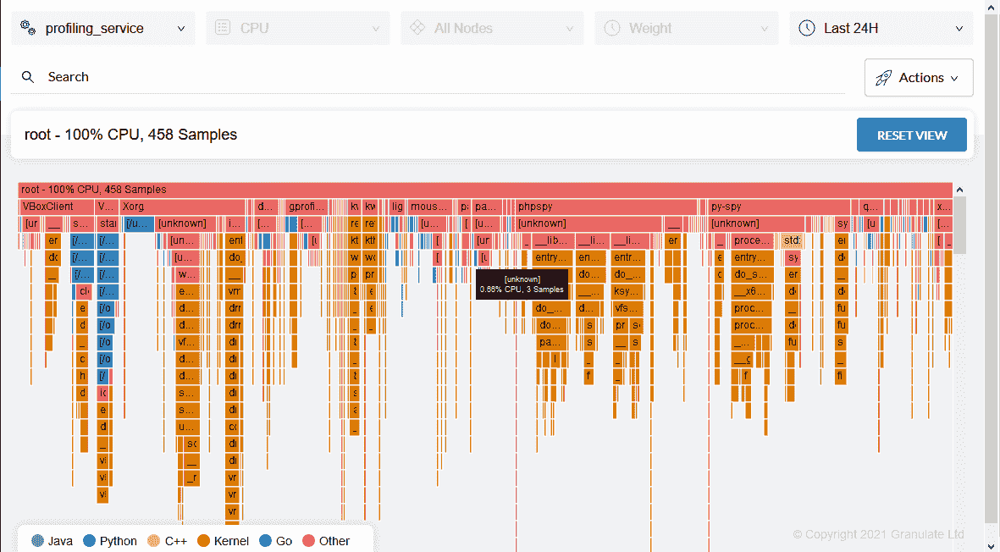

# 为什么持续剖析可以改进您的 Python 应用程序

> 原文：<https://towardsdatascience.com/why-continuous-profiling-can-improve-your-python-application-1c4ec2b238f7?source=collection_archive---------16----------------------->



照片由[*Fotis Fotopoulos*](https://unsplash.com/@ffstop?utm_source=unsplash&utm_medium=referral&utm_content=creditCopyText)*[*Unsplash*](https://unsplash.com/s/photos/programming?utm_source=unsplash&utm_medium=referral&utm_content=creditCopyText)*

*剖析 python 程序是进行动态分析，测量程序执行时间——代码执行每个程序的功能需要多少时间。由于函数和调用需要太多的资源，所以有必要对它们进行优化。而代码优化不可避免地会导致成本优化，因为它使用的 CPU 资源更少，这意味着为云基础设施支付的费用更少。*

*开发人员经常使用各种方法进行局部优化。例如，它们决定哪个函数执行代码更快。但是，如果我们试图在没有调查的情况下盲目调整程序，可能会导致问题并导致程序执行速度变慢。*

# *剖析是如何完成的？*

*有必要决定您是需要使用宏观还是微观层次的[剖析方法](https://medium.com/fintechexplained/advanced-python-learn-how-to-profile-python-code-1068055460f9)。在宏分析中，我们分析整个程序，并在程序执行时产生统计数据。在微分析中，像函数调用或计算一样，只对程序的特定组件进行分析。*

*根据您是想进行宏观还是微观分析，Python 中有几个模块和内置函数可用。对于微观分析，我们可以使用 line_profiler，对于宏观分析，我们可以使用 cProfile 或一个时间包，通过它我们可以确定一个程序执行的总时间。*

*有时，当我们使用时间包时，由于网络延迟或 CPU 繁忙导致的延迟，得出的时间可能是错误的。因此， [timeit](https://www.geeksforgeeks.org/timeit-python-examples/) 函数多次执行代码，然后显示运行所用的平均时间。*

# *连续分析和执行时间*

*最需要考虑的是程序执行的时间。程序运行的时间越长，使用该程序的应用程序就越慢。此外，当它被实现时，它占用了太多的 CPU 资源。在云上运行应用程序所用的资源越多，你需要支付的费用就越多。*

*让我们看看执行时间增加的几个常见原因。*

# *减少内存泄漏和使用*

*读写数据的过程称为[内存管理](https://en.wikipedia.org/wiki/Memory_management)。默认情况下，它是用 Python 实现的。*

*但是，在某些情况下可能会发生内存泄漏。*

1.  *当剩余的大物体没有被释放时。*
2.  *当代码中有参考循环时。*

*让我们假设已经创建了一个服务器来进行缓存，但是缓存的大小还没有定义。这意味着大量的请求会将缓存大小扩大到内存泄漏的程度。*

*Python 管理自己的堆，独立于系统堆。内存是在 Python 解释器中分配的——我们根据需要创建的对象类型使用不同的方法。池和竞技场保存在 Python 堆中，因为 Python 处理自己的块。任何类型的内存块的释放仅仅是将它标记为可供将来在解释器中使用。*

*为了定位内存泄漏，我们利用了内存分析器，它逐行显示代码的内存使用情况。因此，我们可以找出哪些表达式消耗了大量的内存。接下来，我们可以优化这些语句，使它们使用更少的 RAM。*

# *正确利用 CPU 资源*

*优化 CPU 资源的使用非常重要。如果你使用的是云服务，那就更有意义了，因为你使用的资源越多，你支付的费用就越多。现在，如果我们没有一个程序的统计数据，我们就不能盲目地开始优化过程。*

*在这种情况下，最好的办法是使用 [cProfile](https://www.machinelearningplus.com/python/cprofile-how-to-profile-your-python-code/) ，它显示程序的完整统计数据并列出正在使用的函数——它给出了需要优化的函数或语句的概述。适当的代码优化将消耗更少的 CPU 资源，从而为公司节省成本或优化。*

*由于这些原因以及更多的原因，开发人员在生产阶段使用[连续剖析](https://granulate.io/introduction-to-continuous-profiling/)来评估系统或软件，以查看什么是缓慢的或者利用了大量的资源。例如，连续分析有助于识别程序中可能需要大量 ram 或时间来执行的任何指令或功能。*

# *进行连续分析*

*内置 Python 模块的问题是，当代码在生产服务器上执行时，无法监控代码的统计数据。即使您设法启用了生产分析，它也会消耗大量的 CPU 资源，这对公司来说成本太高了。*

*因为连续的剖析是必要的，你可以使用 [gProfiler](https://profiler.granulate.io/) ，它是一个即插即用的模块。只需下载客户端并安装在您的服务器上。它将在后台运行，不会占用太多的资源，并密切关注一切。它还提供了无缝的产品剖析和大量 Python 剖析器无法提供的统计数据。它消耗更少的 CPU 资源，从而为团队节省成本。你也可以把它作为守护进程安装在 Docker 上，或者通过命令行安装。*

*让我们来看看如何设置和使用它。不费吹灰之力。*

*首先，您需要创建一个帐户，因为它需要一个 API 密匙来监控您的服务。接下来，您只需用`wget`下载并安装它。*

*创建帐户后，在终端上运行以下命令:*

```
*wget https://github.com/Granulate/gprofiler/releases/latest/download/gprofilersudo chmod +x gprofilersudo ./gprofiler -cu — token “<API_token>” — service-name “Service name”*
```

*一旦安装完成，它将开始在后台运行，您将能够在仪表板中查看代码的统计信息:*

**

*图片由[颗粒有限公司](https://granulate.io/)提供*

*当我们使用 Python 模块进行概要分析时，它只向我们显示关于程序的统计数据。另一方面，gProfiler 提供了大量的数据，比如在内核级执行的进程、CPU 使用的资源等等。这样，开发人员就完全知道消耗了多少资源，哪些功能需要优化。*

# ***结论***

*连续分析对于确保正确使用资源至关重要。概要分析允许我们识别代码中一些最基本的瓶颈。解决这些问题可以显著优化代码，并最终降低公司的成本。*