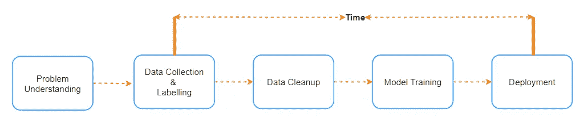
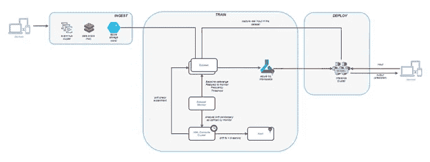
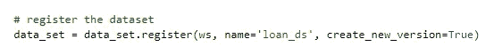
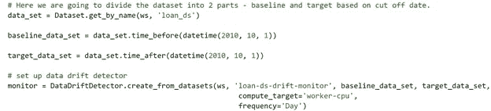
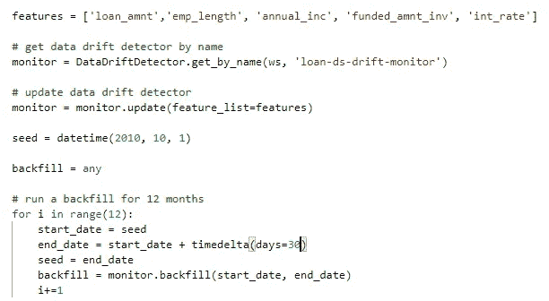
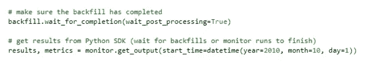
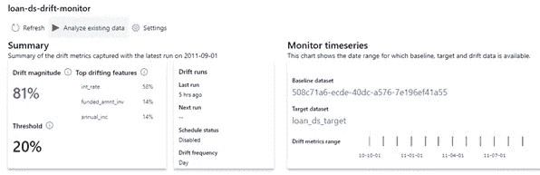
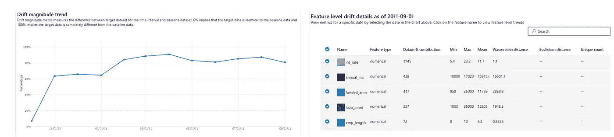

# 为什么数据漂移检测如此重要，如何通过 5 个简单的步骤实现自动化

> 原文：<https://towardsdatascience.com/why-data-drift-detection-is-important-and-how-do-you-automate-it-in-5-simple-steps-96d611095d93?source=collection_archive---------1----------------------->

卢克·切瑟在 [Unsplash](https://unsplash.com/s/photos/data-drift?utm_source=unsplash&utm_medium=referral&utm_content=creditCopyText) 上的照片

*开发任何机器学习模型的基本假设是，用于训练模型的数据模拟真实世界的数据。但是在模型被部署到生产中之后，如何断言这个假设呢？本文详细介绍了这个问题，并展示了如何使用 Azure ML 处理它。*

当您在监督学习的情况下训练模型时，训练数据通常是有标签的，当您在生产中部署模型时，没有实际的标签，无论您的模型有多精确，只有当提交给生产中模型的数据模拟(或统计等效)时，预测才是正确的？)训练中使用的数据。如果没有呢？我们称之为**数据漂移**。

数据漂移的定义是，在将模型部署到生产中之前，生产数据与用于测试和验证模型的数据之间的差异。导致数据漂移的因素有很多，其中一个关键因素是时间维度。如果您观察下图，该图显示了机器学习模型开发的高级阶段，那么很明显，在收集数据的时间和使用模型预测真实数据的时间之间存在明显的差距。根据问题的复杂程度，这一差距可能从几周到几个月到几年不等。其他几个因素也可能导致漂移，如数据收集中的错误、季节性，例如，如果数据是在 covid 之前收集的，而模型是在 covid 之后部署的。

机器学习模型开发阶段(图片由作者提供)

**如果你不认同漂移怎么办？**

当数据漂移时，如果没有及时发现，预测就会出错，基于预测做出的业务决策可能会产生负面影响。向网飞用户推荐一部错误的电影比推荐一只错误的股票危害更小，在某些情况下，影响是延迟的。

根据漂移的性质、程度和类型，处理漂移所需的工作可能会有所不同。在少数情况下，可以通过根据新数据重新训练模型来管理数据漂移，但有时我们可能不得不重新开始，从头开始。

不仅仅是数据，甚至模型也会漂移，当模型的预测不再有用时，例如预测学生将选择。用于 covid 之前的在线课程，并在 covid 期间使用。处理概念漂移的一种方法是 ***在线学习*** *，其中模型在每次观察时被重新训练。*

建立一个**可重复的**流程来识别数据漂移、定义漂移百分比的阈值、配置主动警报以便采取适当的措施非常重要。有各种类型的漂移，如特征漂移、概念漂移、预测漂移等。但是它们都起源于从数据中检测到漂移的点，或者如果预测是不正确的(不正确的预测只有在存在找到正确标签的手动方法的情况下才能被识别，有时这也存在延迟)。在下面的博客中，已经有一些很好的尝试来定义不同类型的漂移，所以我不打算再次定义它们，请参考下面的博客。

[https://towards data science . com/how-to-detect-model-drift-in-mlops-monitoring-7a 039 c 22 ea F9](/how-to-detect-model-drift-in-mlops-monitoring-7a039c22eaf9)

<https://medium.com/data-from-the-trenches/a-primer-on-data-drift-18789ef252a6>  

**我们如何跟踪数据漂移？**

可以使用顺序分析方法、基于模型的方法和基于时间分布的方法来识别数据漂移。像 DDM(漂移检测方法)/EDDM(早期 DDM)这样的顺序分析方法依靠误差率来识别漂移检测，基于模型的方法使用自定义模型来识别漂移，基于时间分布的方法使用统计距离计算方法来计算概率分布之间的漂移。计算任何两个群体之间差异的一些流行的统计方法是**群体稳定性指数**、**库尔贝克-莱伯或 KL 散度**、**詹森-香农或 JS 散度**、**科尔莫戈罗夫-斯米尔诺夫检验或 KS 检验**、**瓦瑟斯坦度量或运土机距离**。对这些的详细解释超出了本文的范围，如果你有兴趣知道，可以从这里开始。

**如何在 Azure ML 中配置漂移检测？**

微软提供了一种自动识别数据漂移的方法，该方法被集成到 Azure ML workspace 中，该功能目前正在公开预览中。Azure ML 使用统计方法来确定漂移，不同的时间窗口用于计算选定功能的漂移。包含数据漂移监视器的典型 ML Ops 工作流如下所示。接下来的部分解释了这个过程中涉及的每个步骤。

带有数据漂移检测和警报的 Azure ML 工作流。(图片由作者提供)

**在 Azure ML 中实现数据漂移**

识别数据漂移的步骤包括

1.  **注册基线数据集:**基线数据集是用于模型训练的数据集。Azure ML 语言中的数据集是指向数据的指针，这些数据可以位于任何受支持的存储服务中，如 Azure Storage、Data Lake 等。目前，我们只能用时间序列表格数据集来识别数据漂移。

用于注册数据集的 python 代码。(图片由作者提供)

2.**创建数据漂移检测器:**可以通过传递基线和目标数据集以及计算要使用的目标和检查频率来创建漂移检测器对象。您在此选择的时间范围取决于您想要比较的时间窗口，找到一个正确的范围来识别逐渐漂移是很重要的。

用于创建数据漂移检测器的 python 代码(图片由作者提供)

3.**特性选择**:在按需运行漂移检测之前，我们需要提供一个要监控的关键特性的列表，这可能是数据集的所有属性或子集。其次，我们需要为我们想要监视的日子回填监视器，这应该以最大 30 天为单位来完成。

用于选择检测漂移的要素的 python 代码(图片由作者提供)

4.**运行:**然后，您可以按计划或按需运行漂移检测。下面的代码显示了从 2010 年 10 月 1 日起漂移检测的按需调用。启动该过程并等待完成。

按需运行漂移检测的 python 代码。(图片由作者提供)

输出可以从笔记本或 Azure ML Studio 的**数据集- >数据集监视器窗格中可视化，下面的截图来自 Azure ML Studio，因为我觉得它们更直观。可用的统计距离度量是**瓦瑟斯坦距离**(数字特征)和**欧几里德距离**(分类特征)。您可能会注意到，漂移高于阈值，顶部显示了每个顶级特性的百分比漂移。**

Azure ML Workspace 的漂移检测输出(图片由作者提供)

基于特征的漂移检测(图片由作者提供)

除了上面的报告，我们还可以得到特征漂移的大小和分布。如果你想尝试，完整的源代码可以从[这里](https://github.com/sriksmachi/driftdetection)下载。

**可交代的 AI。**

从最近的[调查](https://www.forbes.com/sites/louiscolumbus/2021/01/17/76-of-enterprises-prioritize-ai--machine-learning-in-2021-it-budgets/?sh=33a74ad2618a)中可以明显看出，企业在过去两年中优先考虑采用 ML，这在很大程度上可以归功于快速数字化和 Covid 带来的新业务方式。随着适应，同样重要的是，这些企业要了解 ML 模型的结果，而不只是把它看作一个“黑箱”。因此，我希望在未来看到更多的工具、框架和创新，这些都集中在“可解释的人工智能”上，这是一个用来使预测更加可解释的术语。在这种情况下，我认为用其他可用的替代方案来结束这篇博客是明智的，尽管可能有许多我将在这里特别谈论的方案。

*   [显然](https://github.com/evidentlyai/evidently) : EvidentlyAI 是另一个开源工具，它有助于评估和监控生产中的模型。如果您没有使用 Azure ML，并且正在寻找一个简单易用的非商业工具，evidentlyai 是一个不错的起点。
*   [Fiddler AI 监控](http://fiddler.ai) : fiddler.ai 有一套工具，可以帮助使 AI 变得可解释，帮助在生产中操作 ML 模型，监控 ML 模型和 yes 数据&模型漂移检测就是其中之一。
*   如果你想实现你的自定义方法，你可以使用像 river.drift 的 PageHinkley 和 skmultiflow.drift_detection 的 ADWIN 这样的库。

总之，漂移检测是 ML 生命周期中的一个关键步骤，因此它不应该是事后的想法，它应该是您在生产中部署模型的**计划的一部分，它应该是**自动化的**，必须仔细考虑**确定漂移方法**、要应用的**阈值**以及检测到漂移时要采取的**行动**。**