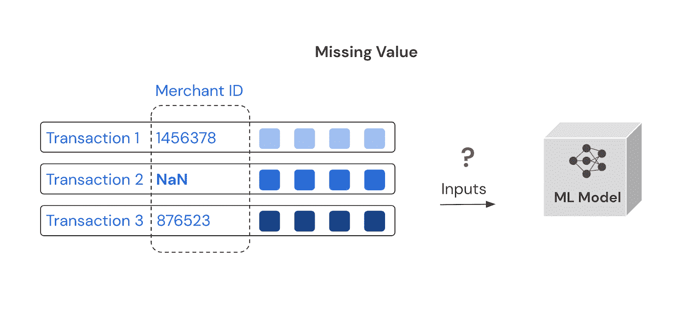
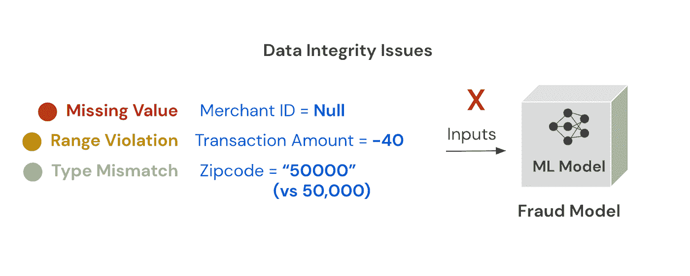
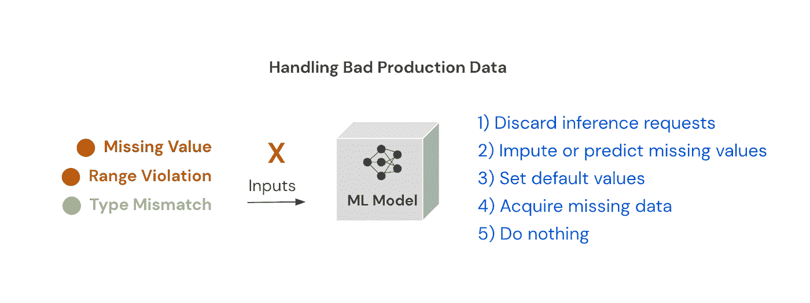
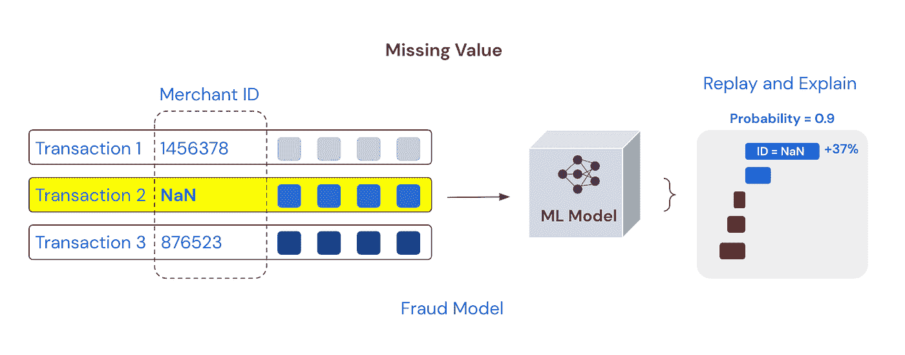
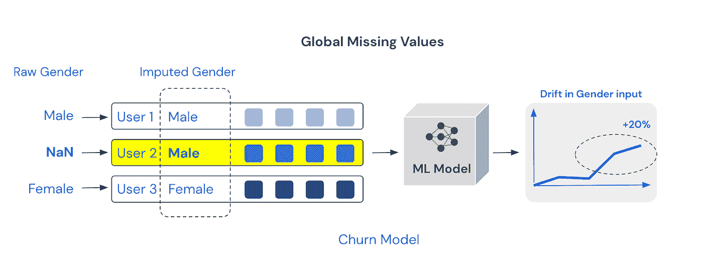

# 为什么数据完整性是 ML 监控的关键

> 原文：<https://towardsdatascience.com/why-data-integrity-is-key-to-ml-monitoring-3843edd75cf5?source=collection_archive---------21----------------------->

由[米卡·鲍梅斯特](https://unsplash.com/@mbaumi?utm_source=unsplash&utm_medium=referral&utm_content=creditCopyText)上[的 Unsplash](https://unsplash.com/s/photos/machine-learning?utm_source=unsplash&utm_medium=referral&utm_content=creditCopyText)

机器学习(ML)应用建立在数据基础上:大量数据流入 ML 系统，以便根据历史实例训练模型，并实时做出高质量的预测。然而，许多机器学习项目降级或失败，很大程度上是因为数据完整性难以维护。

# **为什么数据会中断**

维护数据完整性是一个难题。最大似然数据的动态特性是模型衰减的一个常见原因。ML 系统越来越多地被复杂的特征管道和涉及数据变更的自动化工作流所驱动。数据通常要经过多次转换，才能形成适合模型使用的形式。这些转换需要一致地应用于 ML 管道中的所有同类数据。此外，模型通常使用来自不同团队管理的多个管道的数据，并公开非常不同的接口。例如，ML 模型经常需要结合来自历史批次源和实时流的数据。由于有如此多的活动部分，包括数据和模型版本，生产中的 ML 模型经常会看到数据不一致和错误。

ML 系统将为这些畸形输入提供预测，而没有意识到它们有数据问题。如果没有额外的监控，这些错误往往不会被发现，并且随着时间的推移会侵蚀模型的性能。更糟糕的是，由于机器学习应用程序通常被视为黑盒，如果即时影响较低，这些错误可能在检测后无法解决。与其他类型的软件不同，ML 应用程序缺乏一个全面的解决方案，将正确的流程和监控放在适当的位置。

(图片由作者提供)

# **什么是 ML 数据完整性**

虽然数据完整性可能有不同的定义，这取决于您的谈话对象，但最普遍接受的说法是数据在其整个生命周期中是一致的，没有不准确之处。

无论是在训练中还是在生产中，坏数据都会对 ML 模型的性能产生重大影响。数据工程师在特征工程方面投入大量时间，以确保训练集具有良好的数据质量，从而尽可能训练出最具代表性的模型。在要素工程过程中，数据工程师使用一组一致的规则将坏数据替换为好数据:删除具有缺失值的行、允许缺失值、将缺失分类值设为唯一值、输入缺失值、用统计表示法(例如平均值)替换缺失值或默认为某个值。

然而，并不是所有的 ML 团队都以相同的努力程度来处理部署的模型，即使他们遇到了相同的挑战。一旦 ML 模型被训练，它对坏数据漠不关心，并且将继续做出预测，在这种情况下，不管数据质量如何，都是坏的预测。

生产中的 ML 模型面临三种类型的数据完整性问题

*   **缺少值**，其中特征输入在推理时为空或不可用。
*   **范围违规**特征输入超出预期范围或者是已知错误。
*   **类型不匹配**，不同数据类型的输入被传入。

(图片由作者提供)

有几种方法可以处理不良生产数据，但许多方法会产生自己的问题

1.  **丢弃推理请求** —如果数据是坏的，服务系统可以跳过预测以避免出错或做出不准确的预测。虽然当模型做出大量非关键决策(例如产品推荐)时，这可能是一个解决方案，但当它做出业务或生命关键决策(例如医疗保健)时，这不是一个选项。在这些情况下，需要有一个备用决策系统来确保结果。然而，这些备份系统会使解决方案更加复杂。
2.  **估算或预测缺失值**-当某个值缺失时，可以使用简单的统计度量(如要素平均值)或基于其他模型输入的更复杂的预测值来替换该值。这种方法的一个关键挑战是它隐藏了数据问题背后的问题。持续替换坏数据会改变预期特征的分布(也称为数据漂移),导致模型降级。这种数据替换导致的漂移可能很难捕捉，随着时间的推移会慢慢影响模型的性能。
3.  **设置默认值** —当值超出范围时，可以用已知的高或低或唯一值替换，例如用最接近的已知最小值或最大值替换非常高或非常低的年龄。这也会随着时间的推移导致逐渐漂移，从而影响性能。
4.  **获取缺失数据** —在一些关键的高价值用例中，如贷款，ML 团队也可以选择获取缺失数据来填补空白。这对于绝大多数用例来说并不典型。
5.  **什么都不做** —这是最简单的，也可能是最好的方法，这取决于您的用例的关键程度。它允许坏数据出现在上游或下游，以便解决背后的问题。根据用于训练模型的 ML 算法，大多数推理引擎可能会抛出错误。对不良数据所做的预测可能会显示为输出或受影响输入的异常值，从而有助于发现问题。

考虑到可能出现的所有数据挑战，您需要一个早期预警系统，以便您可以立即发现并解决这些问题。

(图片由作者提供)

数据完整性问题的示例

*   ***缺失值*** 在 ML 模型推断时会有规律地出现。即使要素中允许缺失值，模型也可以看到比训练集中更多的缺失值。缺失值错误的一个例子是基于表单输入进行推理的 ML 模型，其中由于代码错误，以前可选的字段现在总是发送空值输入。
*   ***范围违规*** 发生在模型输入超出其值的预期范围时。分类输入的拼写错误和基数不匹配导致这个问题是很常见的，例如，类别和数字字段(如年龄等)的自由形式输入。未知的产品 SKU、不正确的国家和管道状态导致的分类值不一致都是范围违规的例子。
*   ***类型不匹配*** 出现在模型输入类型与推理时提供的类型不同时。类型不匹配的一个原因是在一些数据冲突操作中列顺序不匹配。

# **如何捕捉数据完整性问题**

设置数据检查很麻烦:虽然数据检查可能存在于 ML 管道和调用代码中，但是一种彻底的方法包括对模型推断进行检查，以便在运行时捕捉任何问题。但是随着功能的增加，添加这些缺失值、类型不匹配或范围检查可能会很繁琐。生成这些检查的快速方法是使用来自训练集的代表性数据样本，并设置一个作业来定期根据这些规则评估数据，并在违规时发出快速警报。

## **如何评估和缓解数据完整性问题**

当发现数据故障时(许多故障会在几周或更长时间内未被发现)，团队通过了解哪些数据违规对模型性能影响最大来确定修复的优先级是很重要的。不解决问题可能会产生意想不到的后果，特别是考虑到 ML 模型的脆弱性。

**那么，如何评估数据问题呢？**

**1。局部分析**——对于关键用例，最佳实践是通过重放问题的推理并查看其对模型的影响，从细粒度的预测分析方法开始。对于这种分析，可解释的人工智能有助于了解数据违规的影响，因此可以快速找到问题的根源——特别是在越来越多的黑盒模型的背景下。但是，重新创建导致问题的所有因素可能非常耗时，尤其是在数据或模型发生变化的情况下。有问题的数据可能没有与输入查询一起存储，可能需要重新创建。如果模型版本不正确，也很难重现结果。

(图片由作者提供)

**2。全局分析** -对于全局问题，故障诊断范围扩大到了解数据问题的严重性。这包括在更大的时间范围内分析该功能的数据，以了解问题可能是何时开始的。数据更改通常与产品发布相一致。因此，查询数据变更时间表可以将问题与特定的代码和数据发布联系起来，有助于快速恢复或解决问题。

数据问题在模型输入中表现为漂移，并且根据其影响，在输出中表现为相应的漂移。因此，漂移分析是确定数据完整性问题原因的有用方法。当数据因完整性问题而被估算时，这一点尤为重要-在这种情况下，输入数据的构成将发生变化，即使这可能不会触发完整性违规

(图片由作者提供)

这些步骤通常有助于查明和评估管道中的数据问题。考虑到故障排除过程的复杂性，ML 团队很难在没有良好的 MLOps 解决方案的情况下快速解决数据完整性问题。

总之，数据完整性是任何 ML 应用取得成功的一个重要因素，MLOps 监控可以帮助解决以下棘手问题:设置正确的检查、检测数据中的异常，以及确定影响最大的故障的优先级。