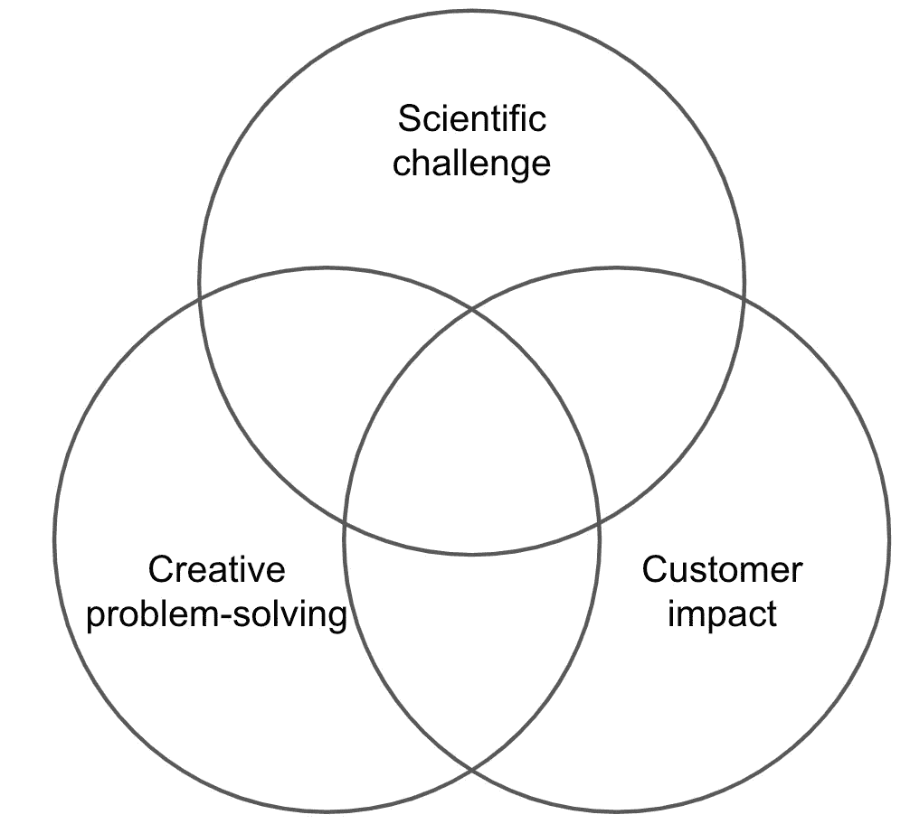
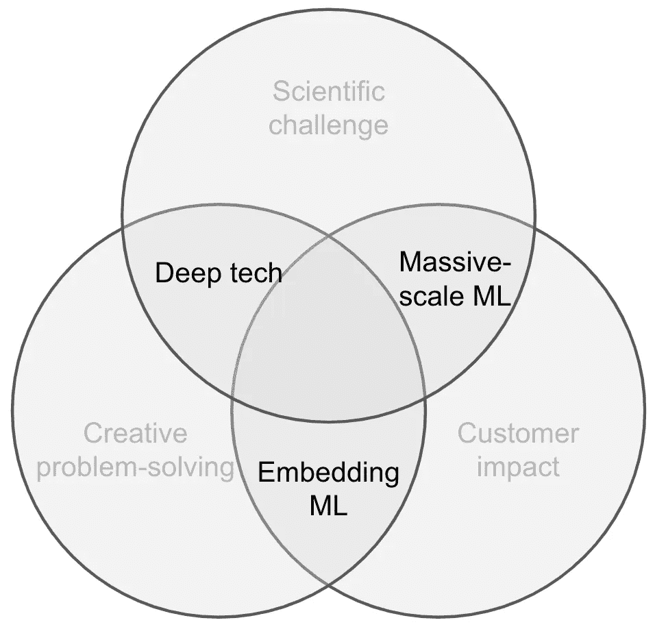

# 为什么数据科学家从不快乐

> 原文：<https://towardsdatascience.com/why-data-scientists-are-never-happy-8825318df5f9?source=collection_archive---------11----------------------->

## 我如何找到适合我的项目

为了追求 21 世纪最性感的工作，数据科学家经常带着[不切实际的期望开始工作](/why-so-many-data-scientists-are-leaving-their-jobs-a1f0329d7ea4)或者结束与他们职业抱负不一致的项目。我当然也陷入过几次同样的陷阱。也许你也经历过类似的事情。

在我职业生涯的初期，我经常对项目感到沮丧，因为我想什么都做——一方面是深入的科学研究，另一方面是以客户为中心的工作。在一系列不同的公司工作过之后，我意识到，基于公司和他们要解决的问题类型，DS 项目可以有非常不同的特征。

在此期间，我最终得出结论，我可以使用我称之为“3c”的三个类别对 DS 项目的类型进行分类和评估:

*   **科学挑战**:需要尖端的机器学习(ML)技术
*   **创造性解决问题**:有一个很大的开放式问题，却没有明显的解决方案
*   **客户影响**:有明确的用例及生产基础设施。交付分析或模型直接转化为客户的价值

你过去的项目在哪里？(图片由作者提供)

实际上，对于一个数据科学项目，您只能选择两个 c！

让我们仔细看看这三个 c 实际上是什么意思。

## **科学挑战**

如果你想专攻某项技术或应用(例如，NLP 或计算机视觉)，这个项目特征是很有用的。我总是发现这些项目是有益的，因为它们推动了我对 ML 的理论理解，并且我很容易跟踪我的学习进度。

在这样的项目中，您会发现典型的活动有:

*   回顾学术文献以确定艺术方法的状态
*   从一篇论文中实现一个模型，并使它适应你的问题
*   尝试新的软件库和模型的开源实现

## **创造性解决问题**

您经常会在咨询风格的项目中发现这种特征，这些项目需要使用 ML 快速和创造性地解决现实世界中的问题。关键的挑战是让自己适应新的环境，并在固定的时间和预算内获得现成的 ML 解决方案。这些项目可能是令人兴奋的，因为它们通常允许对解决方案进行快速迭代。

在这样的项目中，您会发现典型的活动有:

*   根据要求与客户接触，以了解业务问题
*   探索提供的数据和适当的基础设施，以评估集成 ML 解决方案的可行性。
*   构建“80/20”概念验证来测试 ML 的用例

## **客户影响**

对客户有影响的项目有明确定义的价值主张，通常会在现有产品中添加 ML 特性。因为这样的模型改进可以直接部署到用户手中。这使得这些项目成为 ML 工程师和任何想提高他们工程技能的人的地方。我从用户的积极反馈中获得了很大的满足(“这让我每周节省了几天的工作”)，我喜欢通过我为我的模型的用户创造的价值来衡量我的影响。

在这样的项目中，您会发现典型的活动有:

*   与软件工程师密切合作生产模型
*   进行 A/B 测试以衡量模型改进
*   从现有用户中提取数据用于训练模型

# **选择两个 Cs**

当作为一名数据科学家进行职业选择时，请考虑三个 c 以及您正在寻找哪个 c。不要期望在一个项目中得到这三者。根据我的经验，好的数据科学项目往往会落入以下交叉点:

寻找交叉点上的项目(图片由作者提供)

## **《深度科技》**

你经常会在科技创业公司和大公司的 R&D 分部找到这些项目。新技术和建模技术被应用于具有颠覆整个行业潜力的开放性问题。数据科学家通常需要开发最先进的模型来获得竞争优势。然而，实际将模型投入使用可能需要大的业务开发和工程努力。

## **《嵌入 ML》**

许多传统公司希望将 ML 嵌入到他们的流程中，以支持他们的核心业务。这为数据科学家创造了大量的机会和项目，以找到 ML 应用程序的唾手可得的果实。使用现有的 IT 基础设施，您可以交付具有巨大影响力的简单模型。

转移到另一个项目，开发另一个简单的模型，通常比进一步提高现有模型的准确性更有商业价值。这使得数据科学家很难获得更多前沿技术和模型的实践经验。

## **“海量级 ML”**

这些项目可以在以技术为产品核心的公司中找到。他们雇佣了庞大的数据科学家和工程师团队，构建可以扩展到数百万用户的新功能。在这些环境中，数据科学家可以专注于一个小领域，在这个领域中，模型改进可以转化为大量的节约和利润。然而，随着专业化程度的提高，在你和客户之间可能会有很多层的产品/项目经理。

# **那又怎样？**

如果你对当前的角色/项目感到沮丧，问自己以下问题:

*   你希望你的项目包含哪些 Cs？
*   你缺少什么特征？
*   贵公司是否有其他项目可以提供这种服务？
*   考虑新工作时:公司提供你想要的项目类型吗？