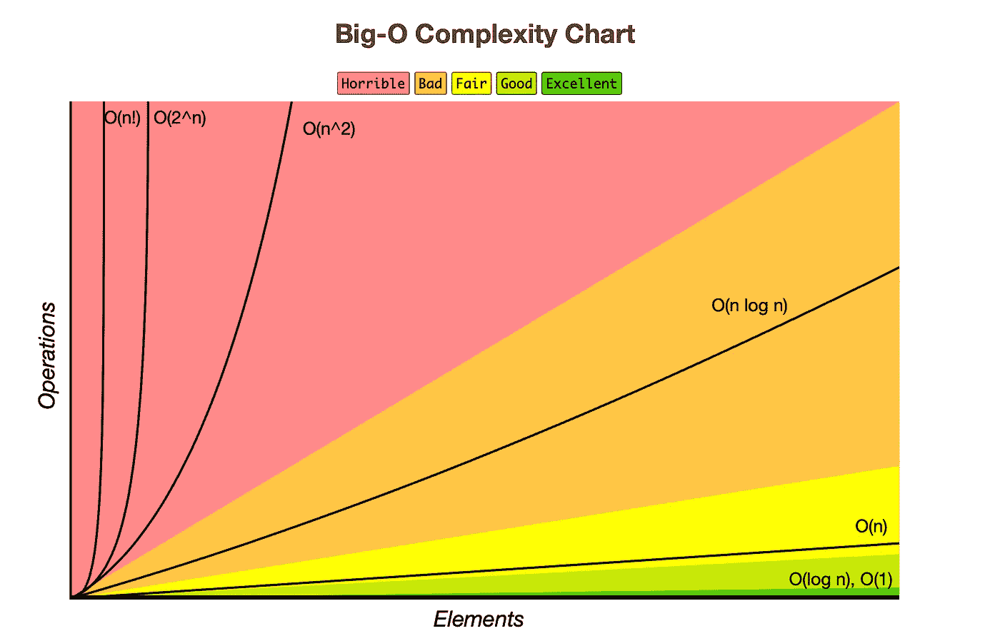
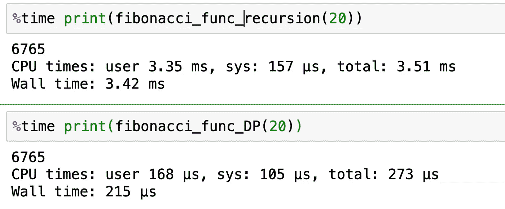

# 为什么数据科学家应该学习动态编程

> 原文：<https://towardsdatascience.com/why-data-scientists-should-learn-dynamic-programming-e50dfe62a5c7?source=collection_archive---------10----------------------->

## 数据结构和算法

## 数据科学家的基本算法


Birger Strahl 在 [Unsplash](https://unsplash.com/s/photos/dynamic?utm_source=unsplash&utm_medium=referral&utm_content=creditCopyText) 上拍摄的照片

# 介绍

在当今的就业市场中，数据科学不再是一个纯粹的分析领域，而是需要编程和工程方面的丰富实践经验。除了模型开发和数据分析等正常职责之外，数据科学家正在与工程团队合作构建基础设施管道。对编程的深刻理解加快了生产进度，减少了摩擦。

Python 广泛应用于数据科学和软件工程社区。就是这样一种通用的编程语言，提供了各种数据结构和算法，包括[数组](https://www.w3schools.com/python/python_arrays.asp)、[集合](https://www.w3schools.com/python/python_sets.asp)、[堆栈](/how-to-solve-python-coding-questions-using-stack-94571f31af3f?sk=82ce6f24681521226a4619d3d660dda9)、[字符串](/python-string-manipulation-for-data-scientists-in-2021-c5b9526347f4?sk=01b9defd7130d5e3f518d3503cc3bbf1)、[字典](/master-python-dictionary-for-beginners-in-2021-1cdbaa17ec45?sk=1e841ed0bc3eed23b07b80260a925938) ( [第一部分](/master-python-dictionary-for-beginners-in-2021-1cdbaa17ec45?sk=1e841ed0bc3eed23b07b80260a925938)和[第二部分](/master-data-type-dictionary-in-python-from-zero-to-hero-part-2-6513aad883de?sk=23264e4e8bb82db4229918f28a34a0c8))、[堆](https://www.geeksforgeeks.org/heap-queue-or-heapq-in-python/)、[二分搜索法](/binary-search-in-python-the-programming-algorithm-8b8fa039eaa?sk=cee7c5d7c49b43d2be5b8e50446ffc64)等。

在这篇博客文章中，我们将学习另一种流行的算法，称为**动态编程**，并了解为什么它的性能优于其他方法，如迭代和递归。

# 什么是动态编程？

DP 是一种算法，它将问题分解成子问题，并存储和重用之前计算的结果。

我们将在 DP 之前介绍什么是递归。

递归函数是相对于自身定义的函数，这意味着函数将继续调用自身，直到满足某些条件。递归包含两个部分:基本情况和递归情况。该函数将不断迭代递归情况，并计算子问题的结果，直到满足基本情况。

[递归](https://www.w3schools.com/python/gloss_python_function_recursion.asp)函数调用自身，反复重新计算子问题的结果，效率低下。

> 有什么解决办法吗？
> 
> 记忆化！

也就是说，我们缓存之前已经计算过的答案，并将结果存储在字典或列表中，这个过程叫做**记忆化**，显著提高了算法效率。

我们将使用以下三个真实的面试问题来帮助我们更好地理解算法。首先，我们将浏览每个问题的思考过程，并讨论我们如何提出解决方案。然后，我们用 Python 编写代码，讨论它们的时间和空间复杂性。

这里，时间复杂度的大 O 符号是合适的。可以直观的查看各种算法的速度。例如，黄色区域中的线性时间 O(n)比红色危险区域中的 O(n)好得多。



[https://www.bigocheatsheet.com](https://www.bigocheatsheet.com)

*完整的 Python 代码请参考我的*[*Github*](https://github.com/LeihuaYe/Python_LeetCode_Coding)*。*

# 问题 1:阶乘

> -一个数的阶乘，N 是所有小于等于 N 的正整数的乘积，记为 N！。
> 
> -比如 3 的阶乘是 3！= 3*2*1 = 6.
> 
> -给定一个正数 N，计算它的阶乘。

## 走过我的思考

我的第一反应是应用迭代方法，将 n 范围内的元素相乘。

> 首先，我们定义一个名为 **result** 的对象，并将其设置为 1。
> 
> 其次，迭代这些数字直到 n+1 并返回结果，如下所示。

```
# solution 1: for loop 
def factorial_1(n):
    result = 1
    for i in range(1,n+1):
        result*=i
    return result
```

迭代方法是线性的，因为 for 循环的迭代次数等于数的大小，直到 n+1，aka。，线性时间复杂度。该算法包含线性空间复杂度，因为它存储从 1 到 n+1 的数。

迭代方法具有以下特征:

```
Time complexity: O(n)
Space complexity: O(n)
```

让我们试试递归。基本条件是当 n 等于 1 时，对于递归条件，我们递归地调用同一个函数。

```
# solution 2: recursion
def factorial_2(n):
    if n==1:
        return 1

    else:
        n *= factorial_2(n-1)

 return n
```

递归阶乘方法具有线性时间复杂度，因为它为每个数字调用一次自身。因此，迭代轮次与数目 n 成正比，即其时间复杂度为 O(n)。此外，空间复杂度也是线性的，因为没有占用额外的空间。

递归方法具有以下特征:

```
Time complexity: O(n)Space complexity: O(n)
```

如上所述，递归方法会多次计算相同的值。例如，我们已经计算了 3 的阶乘(即 3*2*1 = 6)，但必须再次计算 4 的阶乘(即 4*3*2*1)，这是低效的。

当递归堆栈堆积时，递归迭代会显著降低速度。事实上，如果递归堆栈达到上限，递归方法可能无法运行。

为了解决重复计算的问题，我们可以通过存储先前的结果来应用动态编程方法。

## 解决方案:动态编程

```
3628800
```

动态规划方法具有以下特点:

```
Time complexity: O(n)Space complexity: O(n)
```

方法 2 和 3 具有相同的时间和空间复杂度。那么，为什么我们认为动态规划方法更好呢？让我们来看看问题 2 的答案。

# 问题 2:斐波那契数，被大家

<https://leetcode.com/problems/fibonacci-number/>  

> 通常表示为`*F(n)*`的**斐波纳契数列**形成了一个序列，称为**斐波纳契数列**，这样，从`*0*`和`*1*`开始，每个数字都是前两个数字的和。也就是说，
> 
> F(0) = 0，F(1) = 1
> F(n) = F(n — 1) + F(n — 2)，对于 n > 1。
> 
> 给定`*n*`，计算`*F(n)*`。

## 走过我的思考

这是一个几乎每个大型科技公司都会问求职者的普遍问题。按照问题 1 中的相同步骤，我们可以比较迭代、递归和 DP 方法。

**#解决方案 1:迭代方法**

简单地说，我们在 for 循环中不断更新三个项目的值:current、n1 和 n2。查看 Python 代码的解决方案。

迭代方法具有以下特征:

```
Time complexity: O(n)Space complexity: O(1)
```

**#解决方案 2:递归方法**

有两个条件:

1.  *基本条件:0 号位和 1 号位怎么办？*
2.  *递归条件:位置 2 及以上怎么办？*

我们从 0 和 1 开始，对每个位置的前两个函数求和，并对其他位置调用自身的函数，这是典型的递归设置！查看 Python 代码的解决方案。

递归方法具有以下特征:

```
Time Complexity: O(2^n)Space Complexity: O(n)
```

**#解决方案 3: DP**

与问题 1 类似，我们将之前的结果缓存在一个字典中，并在被调用时返回它们。回想一下，由于多次计算，递归方法具有 O(2^n 的时间复杂度。

得益于**记忆化**过程，DP 方法将时间复杂度从 O(2^n 降低到 O(n)，这对于算法性能是一个显著的改进。查看 Big-O 复杂性图表(如上)进行比较。



让我们比较一下计算 20 的斐波那契数的这两种方法的运行时间。递归方法需要 3.42 毫秒(*毫秒，1/1000 秒*，但是 DP 方法只需要 215 微秒(*微秒，1/1000000 秒*)，几乎相差 16 倍。

迭代方法的时间复杂度与它在每一步中需要的调用次数成正比。因此，如果迭代需要多次调用自己，运行时间可能会很快增加。如果发生这种情况，DP 方法就派上了用场，并为我们节省了大量时间。

动态规划方法具有以下特点:

```
Time Complexity: O(n)Space Complexity: O(n)
```

## 解决办法

```
5
```

# 问题 3:最长的增长子序列

<https://leetcode.com/problems/longest-increasing-subsequence/>  

> 给定一个整数数组`*nums*`，返回最长严格递增子序列的长度。
> 
> **子序列**是可以通过删除一些元素或不删除元素而不改变剩余元素的顺序来从数组中导出的序列。例如，`*[3,6,2,7]*`是数组`*[0,3,1,6,2,2,7]*`的子序列。

## 走过我的思考

该问题要求最长的长度，该长度取决于当前位置 I 和其先前位置 i-1 之间的相对值。然后，我们可以创建一个新的列表， ***new_list*** ，其长度与 nums 相同，并将所有元素设置为 1。换句话说， ***new_list[i]*** 表示目前为止最长的递增子序列的长度。

然后，我们计算一个 for 循环中有多少元素小于***new _ list【I】***。如果是，则向***new _ list【I】***加 1，并更新位置 I 处的较大值，aka。***【new _ list[I]= max(new _ list[I]，new_list[i]+1)*** 。

最后，从列表中返回最大值。

由于嵌套的 for 循环和常数空间，该算法具有指数时间复杂度。

动态规划方法具有以下特点:

```
Time complexity: O(N²)Space complexity: O(N)
```

## 解决办法

```
4
```

*完整的 Python 代码请参考我的*[*Github*](https://github.com/LeihuaYe/Python_LeetCode_Coding)*。*

# 外卖食品

*   理解什么是递归，它的整个过程，优点和缺点。
*   记忆化可以通过存储以前的结果来提高算法性能。
*   DP 在递归方法必须在每一步中多次调用自己的场景中表现出色。

*Medium 最近进化出了自己的* [*作家伙伴计划*](https://blog.medium.com/evolving-the-partner-program-2613708f9f3c) *，支持像我这样的普通作家。如果你还不是订户，通过下面的链接注册，我会收到一部分会员费。*

<https://leihua-ye.medium.com/membership>  

# 我的数据科学面试顺序:

</crack-data-science-interviews-five-sql-skills-for-data-scientists-cc6b32df1987>  </5-python-coding-questions-asked-at-faang-59e6cf5ba2a0>  </6-python-questions-you-should-practice-before-coding-interviews-f958af55ad13>  

# 喜欢读这本书吗？

> 请在 [LinkedIn](https://www.linkedin.com/in/leihuaye/) 和 [Youtube](https://www.youtube.com/channel/UCBBu2nqs6iZPyNSgMjXUGPg) 上找到我。
> 
> 还有，看看我其他关于人工智能和机器学习的帖子。