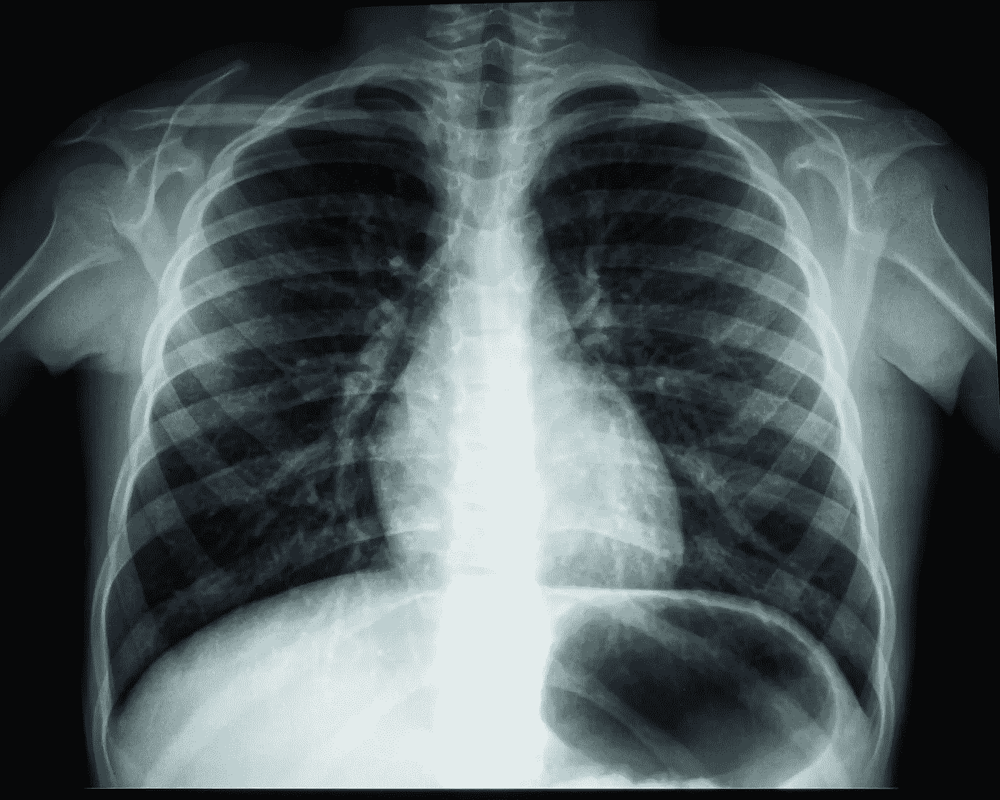
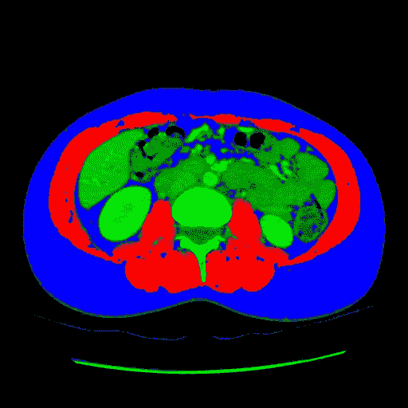

# 为什么数据科学家应该像放射科医生一样看待问题

> 原文：<https://towardsdatascience.com/why-data-scientists-should-see-like-radiologists-13762a212f9?source=collection_archive---------30----------------------->

## [意见](https://towardsdatascience.com/tagged/opinion)

## 为什么人工智能不会取代放射科医生

照片来自[Unsplash](https://medium.com/u/a170d7477b91?source=post_page-----13762a212f9--------------------------------)

> **“你想当放射科医生？而且你不怕过不了多久被人工智能取代吗？”**

早在 2016 年我成为一名放射科实习生时，就有人问过我这个问题。如今，几乎每个新的放射科实习生都至少听过一次。媒体无处不在地报道着艾的又一新成就，这与此有关。

领域内几个大佬的交流就是一部分。例如，在 2016 年的机器学习和智能市场大会上， **Geoffrey Hinton** ，将放射学家比作漫画中的 Wile E. Coyote:

> “你已经在悬崖边上了，但你还没有往下看。下面没有地面。[……]相当明显，五年内，深度学习会比放射科医生做得更好”[1]。

5 年的时间框架*(在同一次讨论中，半推半就地延长到了 10 年后)*则主要描绘了当时人工智能研究界普遍的乐观情绪。事实上，在 2016 年，机器学习领域被深度神经网络所彻底改变，其第一份主要出版物只有 4 年的历史，其最近的进展令人眼花缭乱。大规模视觉识别挑战赛每年都展示计算机视觉领域的最新进展，汇集了国际知名团队。自 AlexNet [2]提出神经卷积网络以来，最低的错误率一直停滞在 25%左右，2012 年该分数飙升至 15.3%。在随后的几年中，几乎所有的团队都依赖于神经网络，以至于在 2015 年，ResNet [3]以 3.57%的错误率击败了人类的结果。

然而，G. Hinton 的预测在 5 年后的今天面临着现实，它们远未得到证实，正如欧洲放射学会(ESR) [4]提醒我们的那样，放射科医师不会被取代。

然而，G. Hinton 发布的关于放射学的预测仍然存在于人们的脑海中，这可能是该专业吸引力最近下降的原因。根据 2018 年对 322 名加拿大医学生的调查， **68%的人认为 AI 会减少对放射科医生的需求** [5]。2016 年，获得该专业的截止排名在法国国家分类考试(ECN)要求的专业排名中为第 2781 位，2020 年降至第 4417 位(+64.7%)[6]。前 1000 名中选择放射学的学生比例 2016 年为 11.1%，而 2019 年为 7.0%(绝对-4.1%，相对-36.9%)[7]。这种排名上的差异可能对新的放射科实习生的质量没有影响，但描绘了专业吸引力的下降。在“未来实习生指南”中，ISNI(Inter-Syndicale national des Internes)在 2020 年描述了“一个幽灵徘徊在这个专业周围，人工智能将取代放射科医生的世界的想法”。

[**机器更新换代是各个领域头条新闻反复出现的主题**](https://www.nytimes.com/1940/02/25/archives/does-machine-displace-men-in-the-long-run-new-studies-cited-as-old.html) **。1940 年，甚至在计算机出现之前,《纽约时报》的标题是:**

> "从长远来看，机器会取代人吗？"(1940 年 2 月 25 日)。

人工智能能够取代放射科医生的想法是科幻小说，因为它掩盖了大量的中间步骤。

*   用一个只知道最常见疾病的软件来取代放射科医生是不可行的。然而，目前的机器学习技术需要数百甚至数千个不同病例的图像来学习，这似乎不可能为罕见的病理收集**。保护人们及其个人数据的法律(欧洲的 RGPD)极大地限制了医学领域的研究，并使收集如此多数据的工作变得不可思议。**
*   在明确定义的任务之外评估一个软件似乎几乎是不可能的。在复杂情况下，机器学习的整个困难在于避免陷入“局部最小值”:算法找到了一个适合它的解决方案，因为当它远离现实时，它看不到任何可能的改进。这就是当软件找到一个快捷方式，为问题提供一个快速(但不协调)的解决方案时所发生的情况。
*   评估人工智能正确性的难度随着所要求的任务平行发展。
*   所有的软件，作为医疗设备，都需要评估。代码的每次修改都会导致新的认证。如果人工智能变得如此复杂，以至于取代了放射科医生，那么这种评估就不可靠。

目前的技术无法克服这些步骤，但该领域的新突破不会解决所有问题:**将医生从护理等式中移除是一个前所未有的医学法律和伦理难题，尚未得到充分探索**。

## **一个前所未有的医学法律和伦理难题**

飞机自动驾驶既安全又高效，然而将一个人的生命交到没有人类替角的机器手里还不被接受。这种对机器的信任取决于文化，所以在飞机自动驾驶仪的例子中，留给人类的部分部分取决于你在哪里。在美国，航空公司要求飞行员进行人工监督和控制。另一方面，亚洲航空公司将自动驾驶仪的使用推到了禁止人工控制着陆的地步。**当系统出现故障或面临无法处理的情况时，就需要专家。**此外，航空公司和乘客希望这位专家在场:人类比计算机更善于快速吸收新的和不相关的事实，并据此采取行动。事实上，在那些机器已经证明其效率的领域，人类掌握着最终决策权，他对自动驾驶仪做出的决策负责。

同样的法医学问题也出现在医学上:谁对诊断负责，尤其是如果诊断是错误的？参与开发、营销和安装人工智能系统的科学家和制造商是否会为使用人工智能算法导致的有害结果承担法律责任？责任问题是有分歧的[9]。

相反，人工智能作为一种新的工具，参与丰富了放射科医生的角色。在 CT 和 MRI 出现的时候，一些人预测该专业将会过时，由于更容易的解释而变得没有必要。相反，技术已经完善，放射科医生从未如此必要。**该专业已经证明了其适应新技术的能力，创新最终被输出到其他专业**，例如用于血管流产的 Seldinger 方法[10]，该方法也是心脏病学、血管医学和麻醉的参考。

# 欢迎来到人工智能增强放射学的第一章

我们在第 1 章的人工智能在放射学中，它将被整合，因为每一个以前的形式已经。学生不会因为人工智能而逃离专业，而是会从利用这种变化和培训中受益[11]。

正如 1896 年一位医生和一位工程师发展了放射摄影术一样，研究可以从放射学家和研究者之间的合作中获得一切。专业不与 AI 竞争。这种偏见可能让人想起邓宁-克鲁格效应(Dunning-Kruger effect )[ 13 ],预测对抗的个人主要来自初创企业和政治阶层，并不了解放射学家的真实活动。

放射科医师的角色不仅仅是标记图像；他或她参与医学讨论，讨论要进行的检查、临床假设、与病人档案的对质、咨询其他专家并为管理铺平道路。图像提供的信息被整合到患者问题的管理中。与普遍的看法相反，除了对病人进行的所有技术操作之外，介入放射学中还有会诊。另一方面，这种机器将使重复性工作变得更容易，加快管理速度，并可能有助于满足日益增长的放射学需求。诸如在 CT 扫描仪中引入有组织的肺癌筛查之类的进步，有可能需要每年解释数百万次以上的检查:如果没有计算机的帮助，这是一个无法实现的目标。**放射科将需要人工智能**。后者也将是有用的，当它将有助于改善技术，并加快 8 倍的 MRI 扫描的采集，正如第一次研究结果似乎显示的[14]。

我将站在斯坦福大学放射学家柯蒂斯·朗洛茨(Curtis Langlotz)一边，他在 2018 年表示:

> **“AI 不会取代放射科医生，但使用 AI 的放射科医生会取代不使用 AI 的放射科医生。”**

为什么要害怕一个充满新奇未来的专业？

*关于作者:
亚历山大·内罗特(Alexandre Nerot)医学博士(*[*https://www.linkedin.com/in/alexandre-nerot/*](https://www.linkedin.com/in/alexandre-nerot/)*)是一名法国放射学实习生，他在介入放射学的一项活动和他的笔记本之间分享时间，以参加各种可用的 Kaggle 竞赛。
这篇文章的标题灵感来自于在 Kaggle 上找到的一篇文章:*[*https://www . ka ggle . com/jhoward/don-t-see-like-a-放射科医生-fastai*](https://www.kaggle.com/jhoward/don-t-see-like-a-radiologist-fastai)

作者照片，自动肌肉和脂肪分割

引用

[1]“杰夫·辛顿:关于放射学——YouTube”。[https://www.youtube.com/watch?v=2HMPRXstSvQ](https://www.youtube.com/watch?v=2HMPRXstSvQ)

[2] O. Russakovsky 等，“ImageNet 大规模视觉识别挑战”，ArXiv14090575 Cs，janv。2015，Consulté le : avr。09, 2020.[http://arxiv.org/abs/1409.0575](http://arxiv.org/abs/1409.0575)。

[3] K. He，X. Zhang，S. Ren，et J. Sun，“用于图像识别的深度残差学习”，ArXiv151203385 Cs，déc. 2015，【http://arxiv.org/abs/1512.03385】。

[4]“放射科医生应该了解的人工智能 ESR 白皮书”，《洞察成像》，第 10 卷，avr。2019，doi:10.1186/s 13244–019–0738–2。

[5] S. Reardon，“机器人放射科医生的崛起”，《自然》，第 576 卷，第 7787 号，第 7787 号文章，2019 年，doi:10.1038/d 41586–019–03847-z。

[6]“rangs limites”。【https://www.cngsante.fr/chiron/celine/limite.html 

ECN 统计:放射学和医学影像学"。[https://www . med shake . net/medicine/ECN/statistiques/radio logie-et-imagerie-medical e/](https://www.medshake.net/medecine/ECN/statistiques/radiologie-et-imagerie-medicale/)

[8]“不要对波音公司的自动飞行飞机大惊小怪——机器人已经在天上飞了”，《连线》。

[9] M. Codari 等人，“人工智能对放射学的影响:欧洲放射学学会成员之间的 EuroAIM 调查”，《洞察成像》，第 10 卷，第 1 期，第 105 页，2019 年 10 月，doi:10.1186/s 13244–019–0798–3。

[10] S. I. Seldinger，“经皮动脉造影术中针头的导管替换；一种新技术”，无线电学报，第 39 卷，第 5 期，第 368-376 页，mai 1953，doi : 10.3109/00016925309136722。

[11] A. Nerot 和 I. Bricault，“放射学中的大数据介绍和人工智能自治的启动”，J. Imag。Diagn。Interv。，AOT 2020，doi : 10.1016/j.jidi.2020.05.016。

[12] W. J. Morton 和 E. W. Hammer,《看不见的 X 射线或摄影及其在外科手术中的价值》。纽约:美国技术图书公司，1896 年。

[13] J. Kruger et D. Dunning，“不熟练和不知道它:如何认识到自己的无能的困难导致膨胀的自我评估。心理网”，美国心理学会心理网，1999 年。/record/1999–15054–002？doi=1

[14] J. Zbontar 等人，“fastMRI:加速 MRI 的开放数据集和基准”，ArXiv181108839 Phys. Stat，déc. 2019，[http://arxiv.org/abs/1811.08839](http://arxiv.org/abs/1811.08839)。