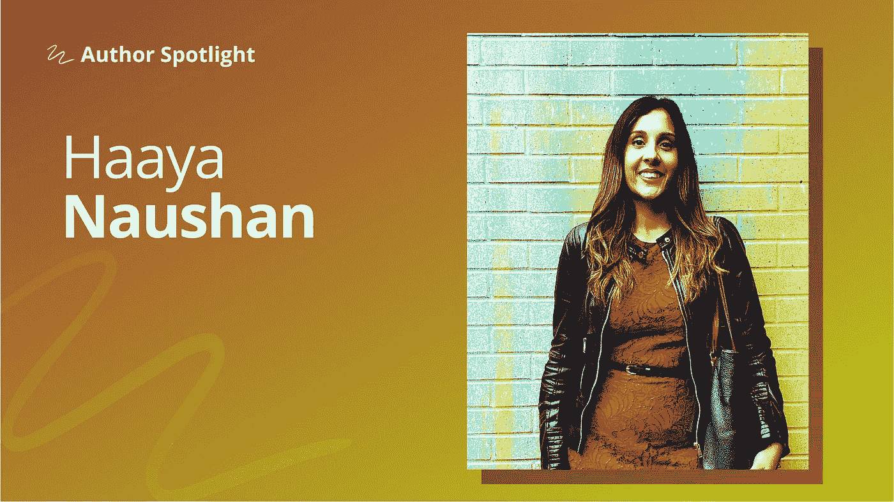

# 为什么数据科学家应该保持开放的心态、好奇心和非判断性

> 原文：<https://towardsdatascience.com/why-data-scientists-should-stay-open-minded-curious-and-non-judgemental-49784a883a78?source=collection_archive---------35----------------------->

## [*作者聚焦*](https://towardsdatascience.com/tagged/author-spotlights)

## “我总是意识到有多少我不知道，但随着我的学习，我试图将一切联系起来。”

*在 Author Spotlight 系列中，TDS 编辑与我们社区的成员谈论他们在数据科学领域的职业道路、他们的写作以及他们的灵感来源。今天，我们很高兴与大家分享* [*哈耶纳山*](https://medium.com/u/68f801f1b50b?source=post_page-----49784a883a78--------------------------------) *与* [*本胡伯尔曼*](https://medium.com/u/e6ad8abedec9?source=post_page-----49784a883a78--------------------------------) *的对话。*

照片由 Haaya Naushan 提供

[*Haaya*](https://medium.com/u/68f801f1b50b?source=post_page-----49784a883a78--------------------------------) *是一位专注于将数据科学和机器学习与社会意识研究相结合的数据科学家。她目前与 NLP 和计量经济学合作进行因果推断，并拥有利用大数据和图形算法研究社交媒体的经验。*

在从事数据科学之前，她学习生物学，希望成为一名兽医。在空闲时间，她玩在线竞技视频游戏，阅读哲学和科幻小说，烘焙糕点，并用水彩画来表达自己。

## 你是如何决定进入数据科学领域的？

在疫情开始的时候，我开始学习如何以编码为乐；我的主要兴趣是数据可视化和 web 应用程序开发。2020 年 6 月，当我在非营利部门的工作被取消时，我有很多空闲时间，并决定学习数据科学，因为我一直喜欢统计和讲故事。我跟随自己的好奇心，很快迷上了机器学习，然后对语言的痴迷驱使我深入探索 NLP。

由于我致力于社会公正，我自然被像阿拉伯语这样的低资源语言所吸引。这给了我一个在世界银行工作的机会，在那里，我能够协助针对中东和北非的社交媒体研究。与经济学家一起工作激发了我对因果关系的兴趣，这也是我开始自学计量经济学的原因。

后来，我很幸运地签约研究如何将 NLP 用于经济分析，重点是可持续发展。我决定我需要领域知识来更好地解决问题；因此，我开始自学宏观经济学和发展经济学。一路上，我拓展了自己感兴趣的其他领域，例如语言学、虚假信息、网络安全、神经科学、流行病学和人工智能伦理学。

## 对于门外汉，你能分享一下什么是计量经济学吗？为什么你觉得它很有趣？

对我来说，计量经济学只是一套工具，可以用来解决因果问题。我被计量经济学吸引，因为我想做的不仅仅是使用数据驱动的模式识别进行预测——我想了解“为什么”因果推断令人着迷，传统计量经济学通常提供了确定因果影响的最佳方法。

此外，机器学习目前正在以很酷的方式推进计量经济学，由于大数据，现在有可能提出新类型的预测经济学问题。此外，我们现在有机会将因果方法应用于数据科学，我希望这将提高人工智能的可靠性和公平性。

理解如何应对流行病是考虑计量经济学的另一个原因——流行病学依赖于与经济学相同的基本因果数学。由于这两个学科对人们的生活有着直接的影响，所以它们都需要非常严格的要求。道德的社会政策需要良好的数据，因果关系对于确保决策者的责任是必要的。

## **迄今为止，在你的数据科学经历中，最具挑战性的方面是什么？**

我的数据科学之旅始于避免无聊的愿望；让我保持兴趣的是该领域的跨学科性质、引人入胜的挑战和创造力的空间。我特别喜欢人工智能发展的快速步伐，因为总是有新的东西要学，我觉得这非常令人兴奋。然而，我面临的挑战是接受我需要自由地以非传统的方式学习。我必须学会不去评价自己不喜欢在线课程的结构，对重复的代码练习和传统课程缺乏耐心。这也意味着我没有办法衡量自己的进步，有时会感到很孤独。我的解决方案是[在媒体](https://haaya-naushan.medium.com/)上写文章，与人交流，并在确定优先学习内容时满足我的好奇心。

让自己变得真实是一种力量，也意味着我的数据科学之旅以自我发现为特征。更具体地说，我发现我喜欢通过阅读源代码和文档来学习如何编码。我更喜欢处理有趣的项目来练习我的技能，我通过阅读研究论文来最好地吸收领域知识。我总是意识到有多少我不知道，但是当我学习的时候，我试着把一切联系起来。我将这个过程概念化为构建一个图表，帮助我看到更大的画面，在这里我依靠灵感和直觉来寻找方向。因为我一直在寻找视角，所以这场斗争是在对抗存在主义的自我怀疑。我学会了通过抚摸我的猫或转移注意力来放纵我的其他爱好来休息和重置。

## 你的文章经常通过数据的镜头来探讨社会公正和道德。当你着手这类话题时，你的目标是什么？

我相信数据科学和人工智能有巨大的潜力来帮助人们；然而，我担心从业者可能天真地认为他们的工作是客观的，远离社会。现实是，科学不会在真空中产生:需要对当前的社会不公正有所认识，并有促进公平做法的动力。

我担心，对利润的盲目追求将破坏我们确保人工智能发展弊大于利的能力，特别是对历史上被边缘化的弱势群体。人工智能的当前应用已经揭示，由于缺乏公平的激励，并且对有偏见的算法没有影响，人工智能正在伤害人类。从积极的方面来说，我从寻求技术和研究民主化的开源运动中获得了希望。我还感到鼓舞的是，许多积极分子一直在努力提高对这些问题的认识。

## **你对刚刚进入这个领域的人有什么建议——尤其是那些可能对任务驱动的项目感兴趣但不知道从哪里开始的人？**

对我有效的方法对其他人来说不一定是正确的；然而，当你善待自己时，每一段旅程都会更顺利。我会鼓励人们思想开放，充满好奇心，不做评判。我相信内在动机是有帮助的，激情对确保学习之旅本身是令人满意的有很大帮助，不管结果如何。如果一天结束时你很痛苦，成功就没有什么意义；最好是有乐趣，这样学习是一种乐趣，而不是达到目的的一种手段。

对于那些对社会影响计划感兴趣的人来说， [DataKind](https://www.datakind.org/) 、 [data for good](https://dataforgood.ca/) 或 [tech jobs for good](https://techjobsforgood.com/) 是一个好的起点。我认为在非营利组织做志愿者是一次很好的学习经历，有很多领域，比如公共卫生、教育和环境保护，都可以受到数据的积极影响。我也鼓励人们写作和分享他们的作品——这是巩固知识和学习如何让技术内容更容易理解的好方法。从小处着手是可以的:我只在自己喜欢的时候写作，我认为质量比数量更重要。Medium 对我来说是一个巨大的资源，为社区做贡献将会帮助其他人。

## **以充满希望的口吻结束，您希望在未来几年内看到数据科学领域发生什么样的变化？**

疫情暴露了全球的不平等，这为以更公平的方式重建社会提供了机会。具体来说，我认为我们这一代最重要的两个问题是气候变化和贫困/不平等，我认为不可能只解决其中一个而不解决另一个。让我充满希望的是，我目前在世界银行的工作代表了他们同时、系统地解决这两个问题的承诺。我希望在数据科学和人工智能领域看到这种变化，在这些领域，开发和应用应该关注社会和气候正义。

我也希望看到因果 ML 的进步和增加的可访问性，因为我认为因果推理是伦理 AI 的关键。技术方面，我最激动的是量子计算；观察这个领域在未来十年的发展将会非常有趣。我也看到了神经经济学在更好地理解人类决策的生物和社会机制方面的潜力——我希望这一知识将转化为人工智能的改进。此外，我预计深度学习将继续对视频编辑、电影制作和视频游戏开发产生影响。与此相关的是，看到数据科学家或使用人工智能的内容创作者在 Twitch 上流动会很酷。

好奇想了解更多关于 Haaya 的工作和项目吗？在[媒体](https://haaya-naushan.medium.com/)和 [LinkedIn](https://www.linkedin.com/in/haaya-naushan-a4b5b61a5) 上关注她。以下是 Haaya 关于*走向数据科学*的档案中的一些杰出作品，她在这里分享了计量经济学和人工智能伦理的深度挖掘，机器学习和可视化技术的教程，等等。

*   探索 Haaya 关于**计量经济学**的文章——一个好的起点是她的[实用 Python 因果关系介绍](/practical-python-causality-econometrics-for-data-science-ffc074e11a1d)，然后是她的[关于工具变量深度学习的综合文章](/causal-ml-for-data-science-deep-learning-with-instrumental-variables-96e5b7cc0482)。
*   Haaya 最近的文章触及了人工智能和社会正义的交集:如果你错过了它们，你会想读读这两篇文章:理解偏差:神经科学伦理人工智能批判理论。
*   Haaya 的一些**实践帖子**包括一系列关于在[阿拉伯文本](/automate-arabic-nlp-with-apache-spark-fdcc2eedade5)上使用 [NLP 方法](/machine-learning-advancements-in-arabic-nlp-c6982b2f602b)的文章，以及关于[动画动态图](/animate-dynamic-graphs-with-gephi-d6bd9faf5aec)和[多元自回归模型](/multivariate-autoregressive-models-and-impulse-response-analysis-cb5ead9b2b68)的教程。

请继续关注我们即将推出的下一位专题作者。如果你对你想在这个空间看到的人有建议，请在评论中给我们留言！