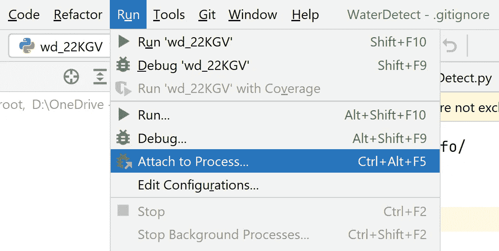

# 为什么数据科学家应该适度使用 Jupyter 笔记本

> 原文：<https://towardsdatascience.com/why-data-scientists-should-use-jupyter-notebooks-with-moderation-808900a69eff?source=collection_archive---------5----------------------->

## Jupyter 笔记本改变了全球数据科学家的游戏规则。但是应该乱用吗？


Elisa Ventur 在 Unsplash 上拍摄的照片

# 介绍

毫无疑问，2015 年 Jupyter 项目及其笔记本的推出改变了科学程序员和他们的代码之间的关系。第一个原因是连接不同编程语言(内核)的简单性，以及将文本与代码片段和输出(如表格、图形和地图)组合成一个页面的简单性。这种笔记本特性使得实现由 Donald Knuth 在 1984 年首次提出的有文化的编程范例成为可能，而且很简单。

> 识字编程最初是由斯坦福大学的 Knuth 提出的，目的是使程序逻辑更接近人类语言。它将代码与自然语言文本结合起来。

第二个原因是 Jupyter 笔记本的交互特性。试验数据并查看每个输入命令的代码结果的可能性使它成为数据科学家和研究人员的理想选择，他们的重点是数据分析而不是开发。
通过使用交互式笔记本，不再需要编写充满几十(或几百)行容易出错的代码的长脚本来在处理结束时显示结果。根据目标的不同，你甚至不需要费心去声明函数或者设计类。你可以按需声明你的变量，然后关注结果。

一句话:Python 和 Jupyter 成为数据科学家的标准。越来越多需要这些技能的课程和工作岗位可以证实这一点。

但现在，你可能会问自己。如果它这么好(而且是一个改变游戏规则的人)，为什么我还要管它的使用呢？

为了回答这个问题，我要讲一个小故事。

# 老式节目

当我开始在大学开展我的研究时，我至少有 10 年没有从事任何编码工作，我几乎不知道 Python 的存在。我曾经用 Pascal、C 和 Fortran 中的一点点编写代码，它们是我毕业时在大学里使用的主要科学语言(我知道，那是很久以前的事了)。我既不知道 Jupyter 的存在，也不知道成千上万个不同的 Python 包中的任何一个，这可能会让人不知所措。


[伯特 b](https://unsplash.com/@bertsz?utm_source=medium&utm_medium=referral) 在 [Unsplash](https://unsplash.com?utm_source=medium&utm_medium=referral) 上的照片

所以我开始了我习惯的方式。买了两本 Python 的书(没错没错…我还在用书)装了基本的 Python 解释器和一个很好的免费 IDE。快速的网络搜索让我找到了 Pycharm 社区的 T2 版本。

由于我没有 Jupyter 提供的快速可视化的优势，我创建了一个管道来预处理所有的输入数据，并测试不同的处理组合。最后，它生成了我的研究所需的所有可能的图表和输出。我被迫写一个好的代码，它很容易被复制，否则，我将不能分析一切。当我处理高分辨率卫星图像时，数据量非常大。

我花了一些时间来开发一切，但一旦工作完成，我就可以专注于在全球的不同地区，以不同的覆盖范围等来试验该算法。最终，我对结果感到满意，我的第一篇科学论文和公共 Python 包(一个卫星图像的水探测软件)发表了。你可以在 GitHub 库[这里](https://github.com/cordmaur/WaterDetect)查看它们。

# 笔记本“编程”

通过了我的第一个研究“检查点”，我开始学习新的工具来提高我的技能，然后我安装了 Jupyter Lab(以前笔记本的更新版本)。

我的生活改变了。我记得当时在想… **“为什么我之前不试试这个？”**。


照片由 [Myriam Jessier](https://unsplash.com/@mjessier?utm_source=medium&utm_medium=referral) 在 [Unsplash](https://unsplash.com?utm_source=medium&utm_medium=referral) 上拍摄

我对测试、记录和快速可视化我所做的所有事情的无限可能性感到惊讶。我甚至测试了一些最近的软件包，它们将笔记本变成了一种开发环境。这个名为`**nbdev**`的工具使得导出模块、创建包甚至记录全部内容变得更加容易。我想，这是两个世界中较好的一个。

然而，在另一个主题上工作了几个月，并在我的机器学习研究方面取得了相当好的成果之后，我的上司告诉了我一些害怕的话:“伟大的成果！让我们在不同的网站上进行尝试，以验证结果。”。不同的网站？验证结果？为了明天？？？

我对此没有准备。为了获得最初的结果，我用不同的算法、不同的预处理标准化等运行了一系列不同的机器学习测试。但重点是结果，而不是开发一个完整的加工链，我仍然在“试验”。因此，代码没有模块化，很难重现一个旧的实验，我从来没有找到笔记本上正确版本的实现，等等。等等。等等。

因此，仅仅是为一个新的位置复制结果就非常痛苦。而且要花很多时间。这让我们效率很低。对于要求苛刻的上级来说，这不是一件容易理解的事情。他只是想“…但是你已经开发了它，你已经给我看了结果，我现在所要求的是**按下同样的按钮**”。嗯……算是吧。

事实是，一段时间后，我做了很多不同的测试和实验，并编码，这是真的。但是我没有模块化的代码，无法发布，也无法与其他研究人员分享。我只有…一堆互不关联的笔记本，重复的功能，奇怪的名字，等等。

到最后，似乎我没有以前那么有效率了。我没有构建任何东西。我没有软件要交付。这种感觉很糟糕。

我已经在这个故事里写过科学软件设计不好的原因:[科学软件设计不好的 7 个原因](/7-reasons-why-scientific-software-are-not-well-designed-5b9f38e0027d?source=your_stories_page----------------------------------------)。而我相信，科学家“程序员”对 Jupyter 笔记本的不加选择的使用，会让这个问题变得更加严重。

# 卡格尔的洞察力

在我是一个狂热的笔记本用户的这段时间里，我也参加了一些 Kaggle 比赛，以提高我在深度学习方面的技能(在我看来，这是向其他 DL 从业者学习的最好方式)。比赛结束后，他们总会做的一件好事是采访获胜者。

于是有了这次采访，采访对象是一个俄罗斯人(我不记得他是哪个比赛的了)。有人问他使用的开发环境，他回答说:“我不使用 Jupyter 笔记本。我所做的一切都是通过简单的旧观念。那改变了我的想法。我是从一个有成千上万竞争者的比赛的获胜者那里听到的。很可能，他们中的大部分人直到现在还贴在他们的笔记本上。

这个故事让我重新思考我的一些误解。事实是，使用 Pycharm(或 Spyder，或 VS Code，任何其他 IDE)时，我使用笔记本的效率比开始时更低了。

这里我想指出的是:因为笔记本赋予我们的自由，所以有必要加倍承诺保持代码的干净、可复制、有组织等。有时候，这是不可行的。


图片作者。

# 解决办法？

现在，在我的数据科学之旅中，最适合我的是同时使用 IDE 和 Jupyter 进行开发，但目的不同。我在 IDE 上编写函数和类，放在我创建的一些新包中，然后我使用笔记本来调用包并可视化结果。这样，最终，我有了一个“现成的”包，可以与其他研究人员共享。

为了使这个设置工作，我们需要注意以下几点:

*   创建一个新的(空)包，并使用 pip ( `-e`选项)在编辑模式下安装。这样，源代码将保留在原始的文件夹结构中，您可以在其上继续开发。

```
cd project_folder
pip install -e .
```

*   使用 Jupyter 笔记本上的`%autoreload`分机。这将允许您在 IDE 上更新软件包，并在笔记本上检查结果，而无需重新启动内核。

```
# on the very first cell of the notebook
%load_ext autoreload
%autoreload 2
```

*   或者，您可以将 IDE 的调试器附加到 Jupyter 内核。在 PyCharm 上，这是在运行菜单中完成的(下图)。



我目前正在开发一个新的掩模处理器，这是一个例子，展示了我现在的设置。我拥有 IDE 的所有优点(完成、参数检查等)。)，调试器正常运行，最终，包“准备好”进行部署。使用 Jupyter 笔记本仅用于显示结果的另一个优点是，它可以用作新软件包的用户手册。


# 结论

先说清楚。我并不反对使用 Jupyter 笔记本或任何其他交互式环境，如 R 或 Matlab。我理解他们的优势，特别是对于研究和数据科学工作，重点是数据分析和实验，而不是代码生产。

然而，我们必须牢记期望是什么。通常，我们所做的最简单的数据分析应该是可重复的，并且容易与其他同事共享。

如果我们使用笔记本只是为了利用社区中已经存在的多个包并显示结果，那也没问题。但是，对于一段新的代码，一种新的处理，甚至是现有过程的简单自动化，最终可能会适得其反。

作为一名数据科学家，您认为哪种环境设置最适合您？留下你的评论和见解。

下一个故事再见。

# 保持联系

*如果你喜欢这篇文章，并想继续无限制地阅读/学习这些和其他故事，考虑成为* [*中等会员*](https://cordmaur.medium.com/membership) *。你也可以在 https://cordmaur.carrd.co/查看我的作品集。*

<https://cordmaur.medium.com/membership> 