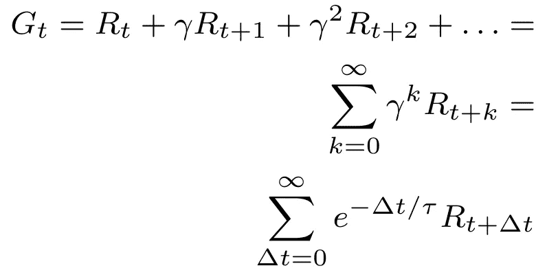

# 为什么强化学习要对未来的回报打折扣？

> 原文：<https://towardsdatascience.com/why-discount-future-rewards-in-reinforcement-learning-a833d0ae1942?source=collection_archive---------13----------------------->

## 从数学，金融，生活，当然还有强化学习的角度讨论贴现率。

不是那种折扣。 [Artem Beliaikin](https://unsplash.com/@belart84?utm_source=medium&utm_medium=referral) 在 [Unsplash](https://unsplash.com?utm_source=medium&utm_medium=referral) 上的照片

虽然折现率是马尔可夫决策问题和强化学习(RL)的一个组成部分，但我们经常会不假思索地选择 *γ=0.9* 或 *γ=0.99* 。当然，当被问到时，我们会有一些直觉，比如“今天的回报比明天的回报更有价值”或者“补偿不确定性”。当被追问时，你能为为什么这些直觉成立辩护吗？为什么挑 *γ=* 0.8 而不是 *γ=* 0.9？不确定性不是已经纳入期望值了吗？如果你没有现成的即时答案，这篇文章可能会对这个问题有所启发。

## 🧮数学中的折现

从严格的数学角度来看，贴现率的目的是显而易见的，至少对于无限期问题是如此。从贝尔曼的递归方程中，我们学会了求解状态序列的值函数:

如果那个数列是无穷的，那么奖励数列也是无穷的。考虑以下累积奖励序列 *G_t* :

`G_t = R_t + R_t+1 + R_t+2 + … = 1 + 1 + 1 + … = ∞`

众所周知，对一个无穷奖励级数求和会产生无穷奖励，使得方程组无解。幸运的是，加上贴现率*γ∈【0，1】*会产生一个收敛的几何级数。例如，如果我们设置 *γ=0.8* ，我们得到:

`*G_t = γ⁰R_t + γ¹R_t+1 + γ²R_t+2 + … = 1 + 0.8 + 0.64 + … = 5*`

有了这个技巧，我们可以将值附加到状态上，并求解贝尔曼方程组。当然，在强化学习中，这个解决方案是近似的。

这解释了无限的情况，但是为什么要为有限时间范围的贴现而烦恼呢？你可能会说我们补偿了不确定性，但这不是已经反映在预期价值中了吗(用未来回报乘以它们的概率)？数学的观点不能解决这个问题，我们需要深入人类的心灵。

## 金融中的贴现💸

有什么比金钱更能诠释人类的精神？

投资的一个重要组成部分是存在一个无风险利率。这是在没有任何不确定性或违约风险的情况下可以获得的回报，作为所有其他回报的基准。美国国债经常被用作代理。将 1 美元投入 2%的美国国债，一年后你将获得 1.02 美元的保底收益。因此，我们更喜欢今天的 1 美元，而不是明年的 1 美元。不需要努力，我们的财富每年可以增长 2%，因此我们会将未来的回报折现 2%，以反映**的时间价值**。

当考虑股票等风险工具时，这变得更有意思了。假设一只股票从现在起一年后会上涨 0%或 4%，两者的概率都是 0.5。**的预期收益**是 2%。然而，空手而归的可能性很大。在这种情况下，典型的投资者会更喜欢无风险的 2%债券，尽管*预期的*收益是相等的。由此可见，股票回报的折现率高于债券回报。

这种现象被称为*避险* **。人们期望不确定性得到补偿，否则他们会选择更安全的替代方案。不确定性越多，折现率越高。也许我们会选择收益率为 10%而不是 4%的股票(将预期收益提高到 5%)。投资需要在补偿时间价值的基础上提供一定的**风险溢价**。**

仍然有许多话题没有触及，例如使用**指数贴现**的趋势(类似于 RL)、机会或后悔成本(你只能投资一次)、冒险行为(从理性投资者的角度来看，彩票几乎没有意义)，以及奇怪的不一致边界情况。现在，让我们确定贴现率既反映了时间价值又反映了风险溢价的基本原理。

## 生活中的折扣⏳

贴现行为不仅限于美元。在日常生活中，我们不断地平衡短期满足和长期后果，权衡确定性和不确定性。晚睡，明天会很累。冬天尽情地吃，夏天你需要减掉脂肪来打造海滩身材。现在没日没夜地学习，希望以后有所收获。

指数贴现和双曲线贴现的比较。前者通常用于强化学习，后者根据经验在人类中观察到。图片来自维基媒体

在这个问题上已经进行了无数的心理学研究，表明人类在决策中倾向于执行类似于双曲线贴现的东西。手臂上纹有*及时行乐*纹身的人很可能对未来的奖励大打折扣，其他人可能会更看重它们。尽管个人之间存在差异，但我们所有人都在某种程度上打了折扣。

这种现象的一个非常自然的原因是**风险率**——我们无法活到明天收获回报的概率。尽管急性死亡的风险不像我们狩猎采集的祖先那样高，但偏好奖励的生物冲动现在仍然非常完整。危险不需要像死亡一样病态。膝盖受伤可能会缩短运动生涯，而五年后的亚洲背包旅行也可能无法实现。即使在最平庸的层面上，我们也更喜欢现在吃一块饼干，而不是下周吃一块。

作为人类，无论明智与否，我们只是天生倾向于把现在的回报看得比(遥远的)未来更高。

## 强化学习中的折扣📖

现在我们对人类贴现的基本原理有了一些了解，但是这种推理对强化学习问题成立吗？尽管神经网络和人脑之间存在一些松散的联系，但典型的 RL 算法并不是为了模仿人类行为而设计的。危险率也是一个易受影响的基本原理，因为我们可以将危险模拟到环境中。例如，一个[悬崖行走游戏](/walking-off-the-cliff-with-off-policy-reinforcement-learning-7fdbcdfe31ff)在代理人踏入悬崖时结束——我们不需要额外打折来反映心脏病发作或脚趾受伤。一个相反的论点是，这种危险可能发生在政策没有经过训练的环境中，利用贴现率作为一种稳健性手段。

对于许多 RL 问题，不贴现未来的奖励是完全可以接受的。尽管如此，即使是有限的时间范围，也有充分的理由对 RL 进行贴现。其中之一是决策对长期绩效的实际影响。最终，由建模者决定什么样的折现率最能反映问题背景下的累积回报。

假设今晚我必须在清淡和丰盛的晚餐中做出选择。这个决定可能会影响我之后的健身课，但可能不会影响我明年的晋升。在这里，我们看到了贴现未来回报的明确理由——一些后果很难与今天的行动联系起来。RL 的目的是纳入当前决策的下游影响，然而**未来的回报可能是不相关的**。一般来说，环境越随机，我们的行为对绩效的持久影响就越小。

StackExchange 上的一个[答案以一种有趣的方式形式化了这个概念，表达了一个参数 *τ* ，它反映了我们感兴趣的时间间隔:](https://stats.stackexchange.com/questions/221402/understanding-the-role-of-the-discount-factor-in-reinforcement-learning)

和以前一样，假设回报总是 1。随着 *γ=0.8* ，级数收敛到 5。实际上，超过五个时间步长的奖励——注意*e^(-1/5)≈0.8*——几乎没有影响。类似的，一个级数在 *γ=0.9* 时收敛到 10，在γ=0.99 时收敛到 100。请注意:在 *t+τ* 之后突然获得+100 奖励仍然会对折扣奖励产生重大影响，但是根据**的经验法则**这种方法是有意义的。如果你认为五个时间步后的回报与现在所做的决定没有什么关系， *γ=0.8* 可能是一个合适的贴现率。

希望这篇文章在贴现率的话题上提供了一些清晰度，然而它仅仅触及了表面。有人认为[整个概念对于函数逼近(我们通常在 RL 中使用)是有缺陷的](https://arxiv.org/pdf/1910.02140.pdf)，并且*平均*奖励是比*贴现*奖励更好的衡量标准。另一个有趣的方法是放弃固定贴现率的概念，转而使用依赖于州的贴现率。考虑到人类的偏好，一个全新的世界就展现出来了。

的确，那个小小的参数 *γ* 隐藏了很大的深度。

## 外卖食品

*   贴现通常是解决无限期问题所必需的。折扣率 *γ < 1* 确保了回报的几何级数收敛。
*   从金融学中，我们了解到贴现反映了时间价值和风险补偿。像在强化学习中一样，指数贴现通常是假定的。
*   人类天生倾向于对未来回报进行贴现(接近双曲线贴现)，风险率是一个重要的生物学原理。
*   对于有限范围的问题，是否需要贴现很大程度上取决于问题的性质和建模者的偏好。
*   随机环境要求贴现率不那么强调未来回报；当前奖励对遥远未来的影响很小。贴现率隐含地反映了你希望预测的时间步数。

## 进一步阅读

达斯古普塔和马斯金(2005 年)。不确定性和双曲线贴现。[https://scholar . Harvard . edu/files/maskin/files/uncertainty _ and _ 双曲线 _ 贴现 _aer.pdf](https://scholar.harvard.edu/files/maskin/files/uncertainty_and_hyperbolic_discounting_aer.pdf)

Fedus，w .，Gelada，C .，Bengio，y .，Bellemare，m .和 Larochelle，H. (2019)。双曲线贴现和在多个时间跨度上的学习。【https://arxiv.org/pdf/1902.06865.pdf 号

Investopedia (2021 年)。折扣率。【https://www.investopedia.com/terms/d/discountrate.asp 

Investopedia (2021 年)。风险溢价。[https://www.investopedia.com/terms/r/riskpremium.asp](https://www.investopedia.com/terms/r/riskpremium.asp)

卡尼曼博士(2017)。思考，忽快忽慢。

纳伊克，a .，沙里夫，r .，Yasui，n .，姚，h .和萨顿，R. (2019)。折扣强化学习不是一个优化问题。[https://arxiv.org/pdf/1910.02140.pdf](https://arxiv.org/pdf/1910.02140.pdf)

Pitus，S. (2019 年)。再思考强化学习中的折扣因子:决策理论方法。[https://arxiv.org/pdf/1902.02893.pdf](https://arxiv.org/pdf/1902.02893.pdf)

StackExchange (2016)。理解折扣因子在强化学习中的作用。[https://stats . stack exchange . com/questions/221402/understanding-the-role-of-discount-factor-in-reinforcement-learning](https://stats.stackexchange.com/questions/221402/understanding-the-role-of-the-discount-factor-in-reinforcement-learning)

维基百科(2021)。几何级数。[https://en.wikipedia.org/wiki/Geometric_series](https://en.wikipedia.org/wiki/Geometric_series)