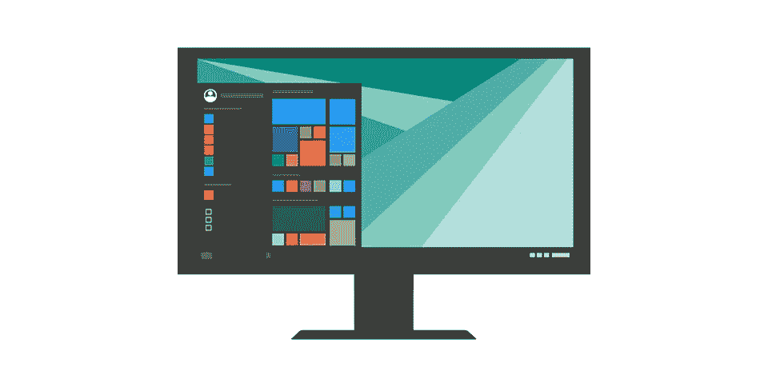

# 为什么生物信息学家避免使用 Windows？

> 原文：<https://towardsdatascience.com/why-do-bioinformaticians-avoid-using-windows-c5acb034f63c?source=collection_archive---------16----------------------->

## 生物信息学

## 为什么几乎每个生物信息学家都使用 Linux 而不是 Windows 的原因列表

从 Pixabay 打开剪贴画的图像

# **简介**

在我们触及主题之前，让我先向你介绍一下生物信息学。生物信息学是连接计算研究(计算机科学、统计学、数据工程)和生物学的一门学科。生物信息学家帮助生物学家存储非常大的生物数据，执行计算分析，并将生物查询转换成可理解的结果。

如果你是一名生物信息学家，或者曾经与生物信息学家共事过，你可能会意识到一件事。生物信息学家的大部分工作都不使用 Windows。

原因其实很简单。是因为大部分生物信息学的工作都无法在 Windows 下完成。即使这是可能的，还有很多其他问题。下面的列表解释了为什么生物信息学家更喜欢 Linux 而不是 Windows。

图片由[打开剪辑 Ar](https://pixabay.com/users/openclipart-vectors-30363/) t 来自 [Pixabay](https://pixabay.com/vectors/linux-tux-administrator-animal-154544/)

# 为什么要用 Linux 做生物信息学？

## 1.大多数生物信息学工具只在 Linux 中可用

不幸的是，生物信息学工具选项在 Windows 中非常有限。大多数标准的生物信息学软件，例如用于基因组组装、结构注释、变体调用和系统进化树构建的软件都是专门为 Linux 编写的。

你可以争辩说，仍然有一种方法可以在不使用 Linux 的情况下访问这些生物信息学工具。我们可以尝试使用 Galaxy，这是一个在线平台，包含常用的生物信息学工具，如 FastQC、BWA-MEM、SAMtools、FreeBayes、BCFtools 等等。然而，尽管 Galaxy 是一个很好的平台，但也有一些限制。

1.  **时间**
    因为你正在银河服务器上运行程序。该过程可能需要一段时间才能完成，因为您正在与许多其他用户共享服务器。
2.  **内存**
    Galaxy 在内存分配方面是相当慈善的。您的 Galaxy 帐户将获得 250 Gb 的免费配额。但是如果你超过了这个限制，那么你需要下载并删除你的文件来释放一些空间。
3.  **有限的工具选项**
    这也许是生物信息学家仍然喜欢在 Linux 中做生物信息学的主要原因。即使在 Galaxy 中有如此多的选择，生物信息学领域是如此之大，以至于 Galaxy 不能集成每一个生物信息学工具。例如，有可能我不得不使用一个非常*合适的*函数，比如 computeGCBias，来进行 GC 偏差校正。像这样的利基功能在 Galaxy 中不可用，尽管该功能自 2012 年以来一直可用。

*如果你对计算生物学的银河软件感兴趣，在这里* ***查看一下* [***。***](https://usegalaxy.org/)**

## 2.Windows 处理生物数据的速度非常慢

有没有试过在 Windows 下用记事本打开一个很大的 FASTA 文件或者基因表达文件？我打赌它不行，因为记事本的大小限制是 58 Mb。像这样的大型生物文件不能直接用文本编辑器或电子表格应用程序打开。

图片来自 [Pixabay](https://pixabay.com/vectors/employee-desk-stress-exhausted-6038877/) 的 [Hassan](https://pixabay.com/users/mohamed_hassan-5229782/)

我们经常做的是查看文件的标题(或者列名，如果是表格的话)并获得一些理解。在 Linux 中，使用 head 或 tail 可以轻松地查看数据。

在 Linux 中，执行简单的数据争论也很容易。我们只对检查唐氏综合症的 21 号染色体感兴趣吗？使用 grep 并将输出重定向到不同的文件。我们要不要把多个 FASTA 文件组合起来做进化树构建？很简单，使用 cat 并将输出重定向到一个新的 FASTA 文件。

## 3.Linux 有内置的编程语言

Linux 的另一个好处是，它有几个内置的编程语言，随安装一起提供。在文件转换之后，生物信息学的下一步是数据分析。在 Ubuntu(最常用的 Linux 发行版)中，已经安装了 Perl 和 Python，可以直接使用。

如果我们想用其他语言进行数据分析呢？例如，我是一名 R 程序员，但 Ubuntu 中没有预装 R。幸运的是，在 Ubuntu 中安装 R and R 工作室非常容易，因为大多数(如果不是全部)编程语言在每个 Linux 发行版中都可用。

## 4.在 Linux 中创建生物分析管道可以很容易地完成

生物信息学家做的一个好的实践是自动化他们的管道。例如，从头到尾自动化基因组装配流水线将是一个好主意。如果没有自动化，我们需要运行每一行并等待它完成(这可能需要一段时间，因为生物数据通常非常大)，然后手动运行下一行。

生物信息学家封装所有这些过程的一种常见方式是在一个Bash 脚本中列出它们。使用 Bash 实现管道自动化并不是我们在 Linux 中唯一可以做到的方式。我个人最喜欢的管道自动化方法是使用 Snakemake ，这是一个创建可重复和可扩展数据分析的工具。点击这里阅读更多关于 Snakemake [的信息。](https://snakemake.readthedocs.io/en/stable/)

## 5.Linux 是免费的

Linux 是一个免费的*、*开源操作系统，任何人都可以安装、学习、修改甚至重新发布。因为所有的 Linux 发行版都是开源的，所以 Linux 发行版的开发和进步来自社区，也为社区服务。如果你有一个专门用于生物信息学工作的指定平台(笔记本电脑或台式电脑)，为什么不选择免费的呢？

# 在那里你可以使用视窗进行生物信息学

既然我已经结束了对 Windows 的抨击和对 Linux 的赞美，那么实际上有一个实例表明生物信息学家使用 Windows 是没问题的。

图片由[200 度](https://pixabay.com/users/200degrees-2051452/)距[像素点](https://pixabay.com/vectors/operating-system-windows-os-1995434/)

## 数据分析和结果解释

在生物信息学中，整个计算流水线可以分为两个部分，数据转换和数据分析步骤。对于数据转换，生物信息学的选择非常有限。例如，从 FASTA 到 CSV 文件的生物文件转换在 Linux 上比在 Windows 上有更少的限制。然而，对于数据分析来说，情况完全不同。

用于生物数据分析或结果解释的三种最常见的编程语言是 Python、R 和 Perl。这 3 种语言在 Windows 中都是完全支持的。从创建用于乳腺癌预测的机器学习模型到使用曼哈顿图的不同密度可视化，所有这些分析都可以在 Windows 中使用这三种语言来完成。请记住，您也可以在 Linux 中进行这些分析，但是一旦您到达了生物信息学管道的这一部分，请随意选择您的操作系统。

# 结论

生物信息学家经常使用 Linux，因为我们在 Windows 中的选择非常有限。常见的生物信息学工具，如 FastQC、BWA-MEM 和 SAMtools 在 Windows 中不可用。确实有允许我们利用这些工具的在线平台，但是它们仍然没有摆脱限制。但是，如果您正在进行数据分析步骤，选择 Linux 还是 Windows 取决于用户。

感谢你阅读这篇文章！你同意我的想法吗，或者已经找到了一种即使在 Windows 下也能进行生物信息学工作的方法？欢迎在下面的评论中发表你的想法。