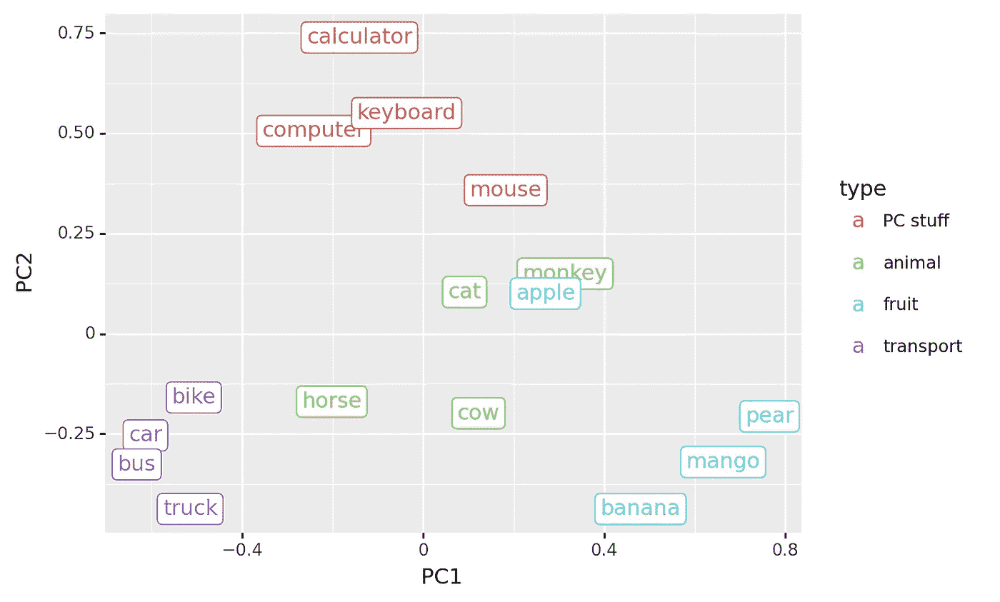
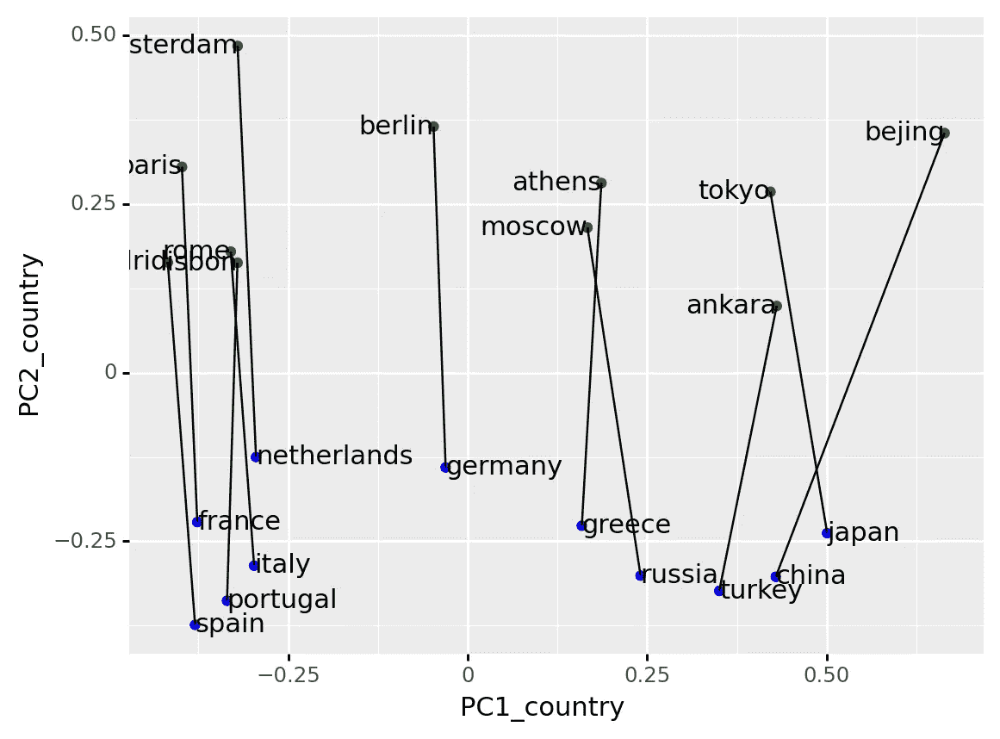

# 为什么人类的学习速度比机器学习模型快那么多？

> 原文：<https://towardsdatascience.com/why-do-humans-learn-so-much-faster-than-machine-learning-models-cab0f5c111b6?source=collection_archive---------5----------------------->

## 当我们使用单词嵌入的魔力来说明对世界的理解时，会产生更好的机器学习模型

# 介绍

为什么人类可以在大约 50 小时内学会如何驾驶汽车，而机器学习(ML)模型需要数千小时的驾驶数据？在我看来，这种巨大的差异是由人类对周围世界有着与生俱来的理解这一事实造成的。如果我丢下一个鸡蛋，我可以预测鸡蛋一落地就会碎。此外，即使我没有把玻璃杯掉在地上，我也可以从鸡蛋的破裂推断出玻璃杯在撞击时也可能会破裂。将此转化为驾驶环境:当我在路上看到另一辆车时，我可以通过想象在这种情况下我会做什么来预测这辆车会做什么。这种*对我们周围世界的理解*以及我们在特定情况下准确*推理*结果的能力给了我们在 ML 模型上的巨大优势。

在使 ML 模型能够模仿人类的理解能力方面已经取得了很大的进步。一个很棒而且很神奇的例子是单词嵌入。在这篇文章中，我将挑选出一组经过训练的单词嵌入，并解释为什么在我看来它们显示了对我们生活的世界的真正理解。此外，我想传达我的绝对魅力，从一个简单的训练计划中可以产生对我们世界的微妙理解。

# 但是到底什么是单词嵌入呢？

单词嵌入是将文本数据表示为数字的一种方式，如果您想将文本输入到 ML 模型中，就需要这种方式。单词嵌入使用比如说 50 个特征来表示每个单词。在这个 50 维空间中靠得很近的单词意思都差不多，比如`apple`和`orange`。我们面临的挑战是如何构建这 50 个特征。

已经提出了多种方法，但在本文中，我们将重点放在[手套词嵌入](https://nlp.stanford.edu/projects/glove/)。手套单词嵌入是从语料库中单词的共现矩阵中导出的。如果单词出现在相同的文本上下文中，Glove 假设它们的意思相似。这已经给出了第一个暗示，单词嵌入学习对它们训练的语料库的理解。

如果在一个给定的上下文中使用了大量的水果，单词 embeddings 将知道`apple`将适合那个地方。即使训练集从未在特定的上下文中使用过单词`apple`，这也是有效的。通过单词嵌入学习的世界的表示，单词嵌入允许训练更加灵活。

# 加载预训练的手套单词嵌入

为了真正挖掘单词嵌入的力量，我们将加载一些预训练的手套单词嵌入并探索它们。我使用[的 50 个特征词嵌入](https://www.kaggle.com/watts2/glove6b50dtxt):

```
array([ 0.08414142,  0.0502594 , -0.08301819,  0.02449763,  0.06950121],
      dtype=float32)
```

单词嵌入存储为空格分隔的文本文件，其中第一个条目是单词，其他条目是嵌入值。上面的函数只是将它读入一个大字典，其中单词是键，嵌入值是值。

# 单词嵌入的简单推理

最简单的推理形式是单词在单词嵌入特征空间中彼此有多相似。我们现在面临着可视化 50d 嵌入空间的挑战，这实际上是不可能的。为了可视化的目的，我们使用 [PCA](https://en.wikipedia.org/wiki/Principal_component_analysis) 将 50d 的嵌入空间减少到仅仅 2 维。在下图中，我们展示了一些从动物到水果的单词:



这里出现的模式是有意义的:

*   不同的类别在嵌入空间中聚集在一起。
*   `mouse`介于`PC stuff`和`animal`类别之间。
*   `horse`介于`animal`和`transport`类别之间。

令我惊奇的是这种理解的微妙之处。一个`mouse`既可以是动物，也可以是 PC 外设。但是魔法并没有就此结束，兔子洞还要深得多。

# 更复杂的推理:关系

除了单独看单词，我们还可以看单词之间的关系。例如，单词`france`和`paris`之间的向量描述了关系`capital of`。让我们画出一些国家资本对的向量:



底部的国家和顶部的首都之间的向量大致相似。这表明单词嵌入学习了关系`capital of`。我真的很惊讶，仅仅通过查看输入文本中哪些单词出现得彼此接近，就出现了像`capital of`这样复杂的关系。

但是巫术并没有就此结束。有了这些单词嵌入，我们可以使用向量演算来[执行一些真正令人惊奇的推理](https://blog.acolyer.org/2016/04/21/the-amazing-power-of-word-vectors/):

```
'warsaw'
```

这个结果真的让我大吃一惊(你现在可能已经发现我喜欢单词嵌入:)。我们可以取`paris`，从中减去它的国家，再加上一个新的国家(`poland`，就得到那个国家的首都:`warsaw`。这确实显示了嵌入这个词所包含的复杂的理解。

# 包扎

我希望到现在为止，我已经让你们相信，单词嵌入确实获得了对语料库所描述的世界的理解。这种理解可以被将这些单词嵌入作为输入的 ML 模型所利用。我认为 ML 模型理解我们生活的世界是建立更好的 ML 模型的重要组成部分。新的人工智能概念，如[变形金刚](https://en.wikipedia.org/wiki/GPT-3)，在将这种理解提升到一个新的水平上显示出更多的希望。

最后一点，真正的“理解”是什么。有人可能会说，单词嵌入并不真正代表人类意义上的理解。这只是一个隐藏在层层数学背后的非常复杂的派对把戏。话说回来，我们对世界的理解不也是大量神经元的一种自然属性吗？

你喜欢单词嵌入吗，你和我一样惊讶吗？还是你更怀疑？让我知道！

*文章、代码和数据可以在 github*T10【上找到<https://github.com/PaulHiemstra/wordembedding_magic>

# *我是谁？*

*我叫 Paul Hiemstra，是荷兰的一名教师和数据科学家。我是科学家和软件工程师的混合体，对与数据科学相关的一切都有广泛的兴趣。你可以在 medium 上关注我，或者在 LinkedIn 上关注我。*

*如果你喜欢这篇文章，你可能也会喜欢我的其他一些文章:*

*   *[掌握数据科学并不是学习一系列技巧](/mastering-data-science-is-not-learning-a-series-of-tricks-df66d8529c29)*
*   *[学习 AI 机器人玩井字游戏系列文章](https://towardsdatascience.com/tagged/rl-series-paul)*
*   *[牛郎星图解构:可视化气象数据的关联结构](/altair-plot-deconstruction-visualizing-the-correlation-structure-of-weather-data-38fb5668c5b1)*
*   *[面向数据科学的高级函数式编程:使用函数运算符构建代码架构](/advanced-functional-programming-for-data-science-building-code-architectures-with-function-dd989cc3b0da)*
*   *[通过规范化扩展您的回归曲目](/expanding-your-regression-repertoire-with-regularisation-903d2c9f7b28)*