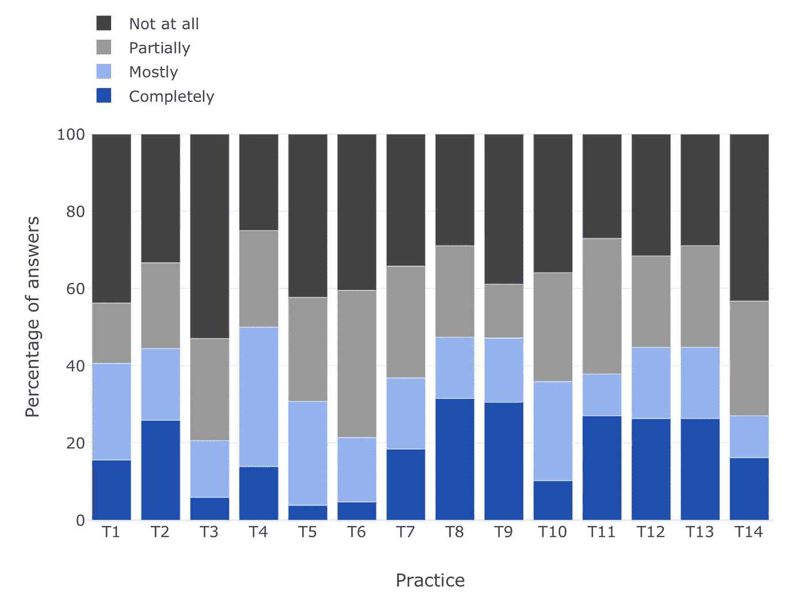
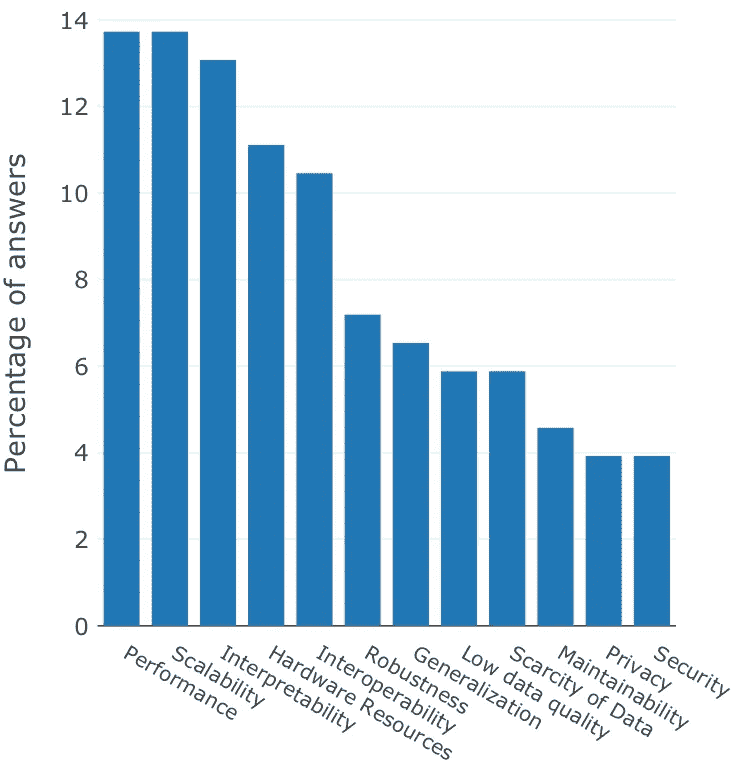

# 为什么 ML 工程师努力构建值得信赖的 ML 应用？

> 原文：<https://towardsdatascience.com/why-do-ml-engineers-struggle-to-build-trustworthy-ml-applications-b552220a308a?source=collection_archive---------30----------------------->

## [行业笔记](https://towardsdatascience.com/tagged/notes-from-industry)

## 论理论与实践的差距及其弥合

*亚历克斯·塞尔班和约斯特·维瑟*

虽然关于人工智能的**伦理的研究近年来显著增加，但从业者往往忽略了来自其 ML 组件的不公平或不公正的风险。这是斯坦福大学以人为中心的人工智能小组最近发布的 2020 年年度人工智能状态报告的见解之一。**

> **理论与实践之间为什么会存在这种差距，如何才能弥合？**

在我们自己的研究( [SE4ML](https://se-ml.github.io/) )中，我们从几个角度探讨了这个问题，特别是针对机器学习(ML)的主要 AI 子领域。

一方面，我们研究了 ML 工程**实践**及其在 ML 工程团队中的采用水平。另一方面，我们研究了政策制定者制定的可信 ML 的**要求**。最后，我们调查了一系列决策驱动因素对于 ML 系统的**架构师**的相对重要性。

正如我们在下面更详细地讨论的，我们的总体结论是 **ML 工程团队缺乏具体的行动过程来设计和构建他们的系统，特别是满足可信性需求，例如安全性、健壮性和公平性**。

此外，我们可以得出这样的结论:从业者**意识到**由 ML 组件的不适当开发引起的伦理和健壮性风险，但是目前**受到更传统的关注的约束**，例如扩展他们的系统，或者在训练和测试之间保持性能。

# 什么是 ML 工程实践？

ML 工程是一门与开发工程原理有关的学科，用于设计、开发、操作和维护具有 ML 组件的软件系统。

为了促进从业者采用工程原则，我们从对从业者的采访以及对从业者博客和学术文献的广泛回顾中系统地提炼出可操作的**工程实践**。由此产生的实践描述在我们的网站上进行分类。

此外，我们测量并公布了这些实践的**采用**率及其感知的**效果**，以便允许评估和比较使用 ML 组件构建软件的工程师团队。

> *如果你是用 ML 组件构建软件系统的团队成员，你可以通过* [***参加我们关于 ML 工程实践的 10 分钟调查***](https://se-ml.github.io/survey) *来为我们的研究做出贡献。*

# 值得信赖的 ML

随着政策制定者最近对解决机器学习(ML)的不当使用的兴趣，我们努力扩展我们的实践目录，以包括**可信 ML** 的操作实践。

特别是，我们遵循了欧盟委员会人工智能高级专家组制定的可信人工智能要求，该要求将[可信人工智能](https://ec.europa.eu/digital-single-market/en/news/ethics-guidelines-trustworthy-ai)定义为合法、符合道德和稳健，并定义了**可信人工智能的七项关键要求**。

受这些需求的启发，我们搜索了工程实践的文献，这些工程实践可以被开发者直接应用来解决 ML 组件的道德和健壮的开发。总的来说，我们确定了 [**14 个新的实践**](https://se-ml.github.io/eu) ，其中包括诸如偏倚测试、确保安全性或让第三方审核应用程序等主题。

对于所有新的实践，我们将相关工作总结为一个知识体系，该体系遵循与我们目录中以前的实践相同的结构，包括详细描述、意图的简明陈述、动机、适用性、相关实践和参考资料。

值得信赖的洗钱行为的采用率仍然很低。在我们的 [ML 工程实践目录](https://se-ml.github.io/practices/)中详细定义了这些[值得信赖的 ML](https://se-ml.github.io/eu) 的 14 种实践。

我们还扩展了我们的[调查](https://se-ml.github.io/survey)来衡量开发 ML 解决方案的团队对可信度实践的采用。不幸的是，我们发现**可信 ML 实践的采用率相对较低**(如上图所示)。

特别是，与确保 ML 组件的安全性相关的实践采用率最低。造成这些结果的因素是多种多样的。例如，大多数针对对抗性例子的防御——一种对 ML 组件的已知威胁——已经被突破。此外，对数据中毒攻击的研究表明，只有一小部分训练数据需要修改才能诱发恶意行为。我们认为缺乏 ML 组件安全问题的“现成”解决方案是我们结果的最大贡献因素。

# ML 系统的体系结构

在一项平行的研究中，我们调查了从业者如何定义具有 ML 组件的系统的软件架构，我们要求从业者为他们的系统排列最重要的决策驱动因素。

我们再次发现，与可信 ML 相关的决策驱动因素，如安全性、隐私性或健壮性，被认为不如性能或可伸缩性等更传统的驱动因素重要(如下图所示)。

使用 ML 组件的系统的架构决策驱动因素。与可信度相关的驱动因素往往被认为不太重要。

这些结果意味着实践者仍然致力于解决开发和操作 ML 组件的基本问题，并且倾向于忽略可信 ML 需求的重要性。

# 观点

我们相信，通过软件工程的眼光来解决道德和健壮性的持续努力将**增强从业者的能力**来优先考虑这些需求并开发值得信赖的 ML 组件。

此外，我们认为采用特定于可信度的和通用的 ML 工程实践是**相互关联的**。例如，持续集成的实践可以使偏差测试的实践更加有效。

因此，我们正致力于定义一系列传统的工程和信任相关的实践，从业者可以直接应用这些实践来开发更道德和更健壮的 ML 组件。

阅读我们的[出版物](https://arxiv.org/pdf/2103.00964.pdf)，了解更多关于[可信 ML](https://se-ml.github.io/eu) 的实践。

Alex Serban *是 Radboud 大学的博士生，也是莱顿高级计算机科学学院的客座教授。*

Joost Visser 是莱顿大学软件和数据科学教授。

*在* [*SE4ML 项目*](https://se-ml.github.io/) *中，我们研究了软件工程原理和实践需要如何适应或补充包含 ML 组件的软件系统。*

*如果您是使用 ML 组件构建软件系统的团队成员，您可以通过* [***参加我们关于 ML 工程实践的 10 分钟调查***](https://se-ml.github.io/survey) *来为我们的研究做出贡献。*