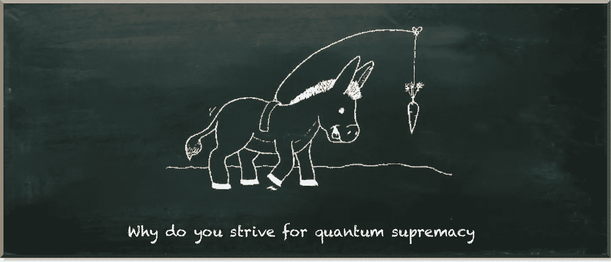
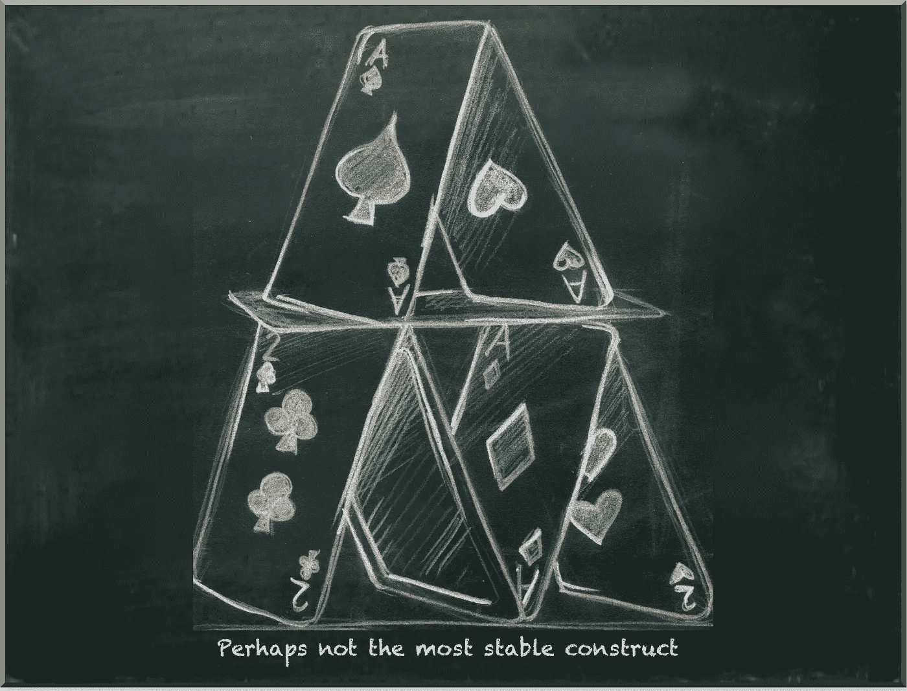
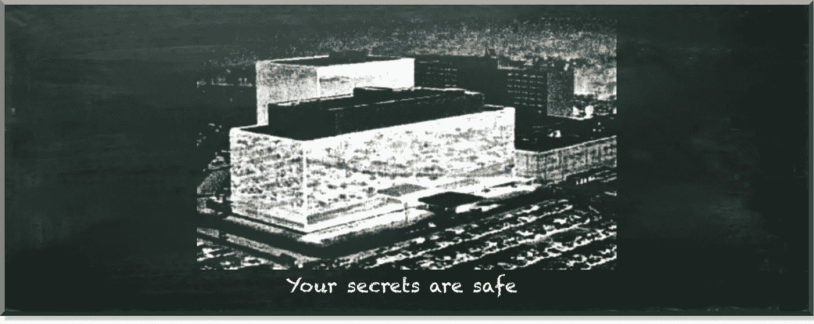

# 我们到底为什么要关心量子计算机？

> 原文：<https://towardsdatascience.com/why-do-we-care-about-quantum-computers-at-all-403dd6191c2b?source=collection_archive---------5----------------------->

## 量子优势的秘密证据

量子机器学习要不要入门？看看 [**动手量子机器学习用 Python**](https://www.pyqml.com/page?ref=medium_whycare&dest=/) **。**

据称，量子计算机可以做经典计算机做不到的事情。我们称之为量子优势的现象。然而，即使是科技巨头也对追求它感到绝望。为什么谷歌、IBM、微软和其他公司像驴子一样，鼻子前挂着一根胡萝卜？

作者图片

这都是他的错！好吧，不全是。但是很多。1994 年，彼得·肖尔提出了他著名的量子算法，该算法比任何已知的经典算法都要快。它引起了学术界以外的许多兴奋，因为现代加密建立在这样一个事实上，即需要数千年才能找到一个任意大数的质因数。如果我们能在几分钟内分解出这样的数字，基于质因数的加密就像纸牌搭的房子一样倒塌了。

作者图片

显然，我们还没有经历过这种天启。肖尔的算法不适合在今天的实践中证明量子优势。请确保没有人可以阅读您的加密邮件。也许除了国家安全局。原因很简单，Shor 的算法需要数以百万计的纠错量子位来分解我们正在讨论的数字。最先进的量子计算机大约有 100 个量子比特。而且，这些也容易出错。

作者图片

所以，我们的秘密暂时还是安全的。然而，在实践中证明量子优势的竞争已经白热化。2019 年，[谷歌报告](https://www.nature.com/articles/s41586-019-1666-5)他们的 53 量子位量子设备“Sycamore”在几分钟内解决了一项任务，这项任务需要今天最强大的超级计算机数千年才能完成。

量子计算机开发的主要竞争对手 IBM[立即提出反对](https://www.ibm.com/blogs/research/2019/10/on-quantum-supremacy/)。他们认为他们的经典超级计算机可以在 2.5 天内完成同样的任务。如果你问我，在几分钟内解决一个超级计算机需要几天的任务仍然是非常令人印象深刻的。然而，这不是我们所说的量子优势。

> **如此超乎寻常的期待从何而来？**

量子优势并不意味着微弱优势。相反，这意味着量子计算机的速度远远超过了经典计算机。但是，我们为什么会这样期望呢？换句话说，为什么量子计算机要比经典计算机快？

对量子计算机优于经典计算机的主要解释是，我们可以在指数数量的状态叠加中制备量子比特。然后，量子算法同时计算所有可能的输入。

听起来不错。然而，这看起来很有趣。而且，不幸的是，描述往往到此为止。如果量子计算机可以并发计算指数数量的状态，为什么我们没有到处看到它们？我的意思是，有了 53 个量子比特，我们可以一次性计算出 2^53=9,007,199,254,740,992 态。

好了，我们可以看到期望从何而来。但是，问题出在哪里呢？

> 为什么他们都在努力利用量子计算机的优势？

另一个流行的解释是基于计算复杂性理论的机制来确定量子计算机的优势。复杂性理论是对运行算法所需的计算工作的研究。让量子计算如此强大的是它所实现的算法。量子算法可能表现出与经典算法不同的复杂性特征。

例如，加法的计算量是 O(n)。这意味着两个数相加的工作量随着数的大小(位数)线性增加。乘法的计算量是 O(n)。努力随着数量大小的平方而增加。据说这些算法在多项式时间内是可解的。所以，属于 P 类问题。

但是这些问题相对简单。相比之下，解决因式分解问题(寻找一个 n 位数的质因数)的最佳经典算法是 O(e^{n^{1/3}}).算法这意味着努力随着位数的增加而呈指数增长。

你想尝一下吗？太好了！试着不用计算机解决下面的因式分解问题。

*   找出数字 21 的质因数。
*   找出数字 221 的质因数。
*   找出数字 2231 的质因数。
*   找出数字 22523 的质因数。

我很肯定你会很容易地解决第一个任务。也许，你马上就想出了解决办法。当你处理第二个问题时，试着数一数尝试的次数。

你可以从 11x13=143 开始。那太低了。然后，你算出 17x19=323。那太高了。那么，13x17 怎么样？这就是 221——解决方案。试了三次。

你可能需要更多的尝试来找到 2231 的因子。而且，我相信你根本找不到 22523 的那些。

让我们改变一下，考虑一个多项式任务。

*   将 3 乘以 7。
*   用 17 乘以 13。
*   将 23 乘以 97。
*   用 223 乘以 101。

同样，你会发现每个任务都比前一个难。但是你甚至可以用纸和笔解决最后一个问题。

这就是 O(e^{n^{1/3}}(因式分解)和 O(n)(乘法)复杂度的区别。不可小觑。虽然你的智能手机可以在几秒钟内将 800 位数字相乘，但在超级计算机上，这种数字的因式分解需要大约 2000 年。

这种复杂性生动地说明了我们对量子计算机的期望。量子霸权的竞赛仍在继续。

最近，在 2021 年，一个中国团队声称他们的量子计算机“祖冲之”在一个小时内解决了一个传统上需要八年才能解决的问题。相当惊人。

然而，我们在日常生活中并没有体验到量子优势的影响。那是因为有一个圈套！“无花果树”和“祖冲之”解决的任务是为了展示量子计算机的优越性。除此之外，这些问题没有什么实际意义。我们仍在等待有人演示用量子计算机解决相关问题。

> 但是为什么用量子计算机解决相关问题如此困难呢？

如果你不厌其烦地计算上面的例子，你会注意到乘法是因式分解问题的结果。因此，有趣的是，因式分解的复杂性呈指数增长。但是如果你知道解，你可以在多项式时间内验证它是正确的。然后，我们说整个问题具有非确定性多项式(NP)复杂性。

因此，虽然对候选人的评估简单明了，但复杂性源于从呈指数增长的候选人中选择正确的答案。这就是量子优势的第一个解释发挥作用的地方。请记住，量子计算机可以同时评估的状态数量随着量子位的数量呈指数增长。

通俗地说，我们把非确定性多项式复杂度中的“非确定性”去掉。而且，多项式复杂的任务很容易解决。但这种移除并不像听起来那么容易。这是一项具有挑战性的任务。

作者图片

有许多已知的 NP-hard 问题，如布尔可满足性问题、旅行推销员问题或最大割问题。开发一种利用潜在量子优势的算法需要对问题及其特定复杂性的来源有深刻的理解。

例如，彼得·肖尔知道傅立叶变换运算是一种寻找频率的好工具，它对解决因式分解很有用。他真正的成就是发现了量子傅立叶变换。

但是我们不能用同样的技术去解决其他 NP 难的问题。我们需要精明的领域专家，他们对问题和量子算法的特殊性有足够的理解，以发现如何解决它们。

显然，这是一个复杂的问题。

量子机器学习要不要入门？看看 [**动手量子机器学习用 Python**](https://www.pyqml.com/page?ref=medium_whycare&dest=/) **。**

在这里免费获得前三章。