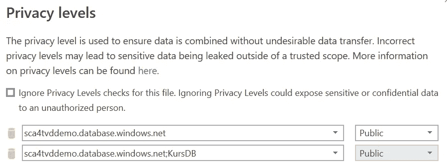
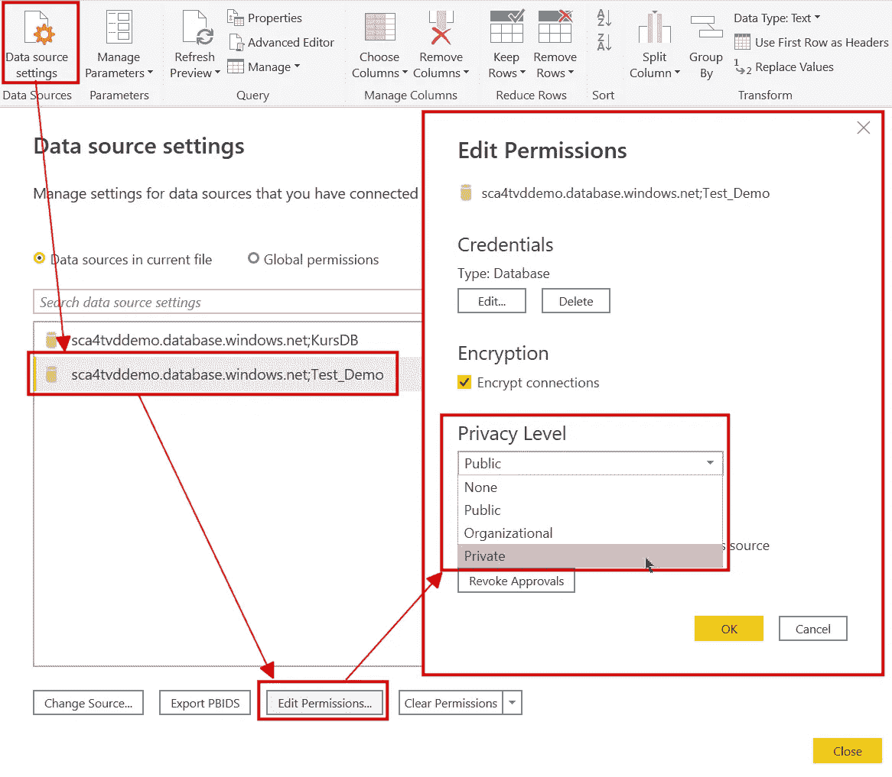
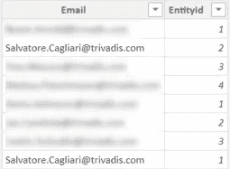
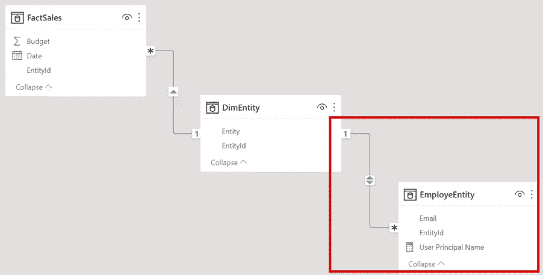
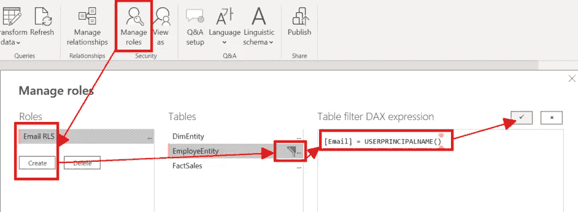
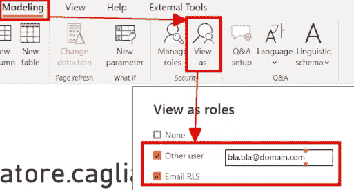
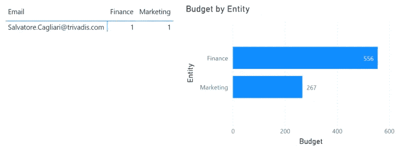
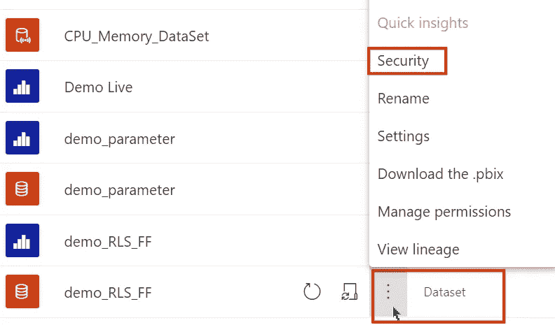
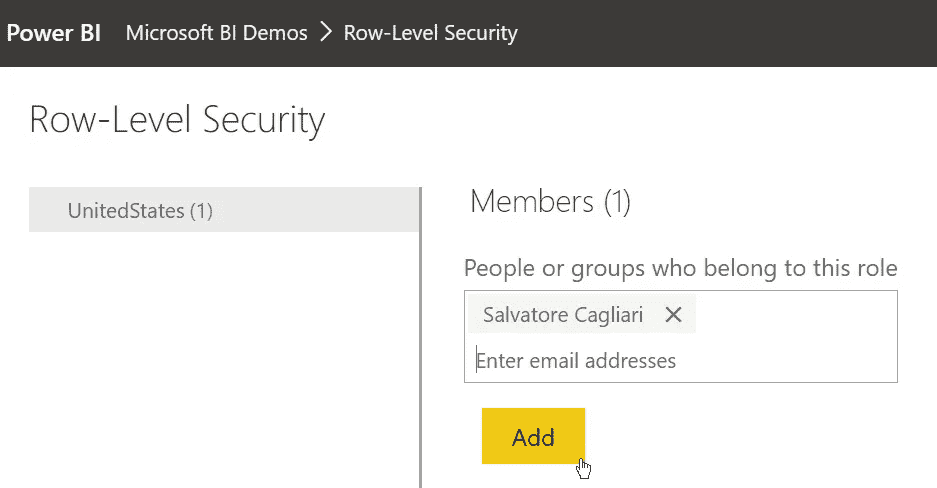

# 为什么 Power BI 有四个安全级别？

> 原文：<https://towardsdatascience.com/why-do-we-have-four-levels-of-security-in-power-bi-7bc53e7d5729?source=collection_archive---------1----------------------->

## 当您开始使用 Power BI 时，数据安全可能不是第一个话题。但是，当你开始钻研这个话题时，它就变得非常令人困惑。让我们来了解一下 Power BI 中的安全特性。

照片由 [Klugzy Wugzy](https://unsplash.com/@klugzy?utm_source=medium&utm_medium=referral) 在 [Unsplash](https://unsplash.com?utm_source=medium&utm_medium=referral) 上拍摄

# 介绍

Power BI 是收集数据并呈现给受众的一个很好的工具。但是，当您开始考虑数据安全性时，您会发现 Power BI 提供了四种不同的安全功能来保护您的数据。

但是为什么我们需要四个地方来改变设置以控制数据安全呢？

事实证明，每种设置都针对不同的区域。

我们有:

*   超级查询中的隐私级别
*   Power BI 中的行级安全性(RLS)
*   Office 365 敏感性标签
*   Power BI 工作空间安全性

这些设置中的每一项都有助于以不同的方式保护您的数据。这些主题有大量的网络资源。我将添加这些资源的链接，而不是重写或复制那里的内容。

那么，让我们来看看每一个。

# 超级查询中的隐私级别

在这四种机制中，这是权力查询中最难理解的机制之一。

这个特性是关于管理从一个系统到另一个系统传递数据的可能性。

当您从关系数据库加载数据时，可能会发生[查询折叠](https://docs.microsoft.com/en-us/power-query/power-query-folding)。这意味着可以将 Power Query 转换翻译成 SQL 代码并传递给源数据库。

现在假设您从两个数据库中获取数据。一个数据库包含敏感数据，例如，关于雇员或客户的个人数据。

假设您希望根据包含敏感数据的数据库中的数据来过滤不包含敏感数据的数据库中的数据。您可能希望避免将敏感数据从一个数据库传递到另一个数据库。

隐私级别有助于您管理这种情况。

当您在源上设置正确的隐私级别时，您可以禁用查询折叠，并且不同的源之间不会共享敏感数据。

您可以在首次使用源时设置隐私级别，例如，当您想要合并两个源时:

图 1 —第一次使用时的隐私级别(图片由作者提供)

您可以随时在“数据源设置”对话框中更改隐私级别:

图 2 —更改隐私级别(作者提供的图片)

以下是关于此主题的更多详细信息的链接:

[微软关于隐私级别的文档](https://docs.microsoft.com/en-us/power-bi/admin/desktop-privacy-levels)

[alpha bold 对隐私级别的简短解释](https://www.alphabold.com/data-privacy-settings-in-power-bi/)

[克里斯·韦伯](https://blog.crossjoin.co.uk/2019/01/13/power-bi-data-privacy-cloud-web-data-sources/)的完整描述(查看他的系列文章，在这篇博文中链接了详细的隐私等级)

我强烈建议查看可用的级别，并根据数据源进行设置:

*   *公共*，为来自互联网的数据
*   *组织*，用于内部数据源
*   *私有*，用于带有敏感数据的数据

不要使用 *None* 来避免不必要的副作用，比如在数据源之间传递数据。

# Power BI 模型中的行级安全性(RLS)

行级安全性(RLS)控制谁有权访问数据模型中的哪些数据。

Power BI 的这一特性在社区中得到很好的记录和理解。

此功能有三种形式:

1.  带有电子邮件地址的查找表
2.  父子关系
3.  动态 RLS

带有查找表的最简单的形式如下例所示:

1.您的模型包含一个带有用户列表的表。该列表包括每个用户的电子邮件地址:

图 3 —带有电子邮件地址的查找表(图片由作者提供)

在本例中，每个用户都有一个对实体的引用，以控制对现有实体的访问。

2.您必须启用查找表来过滤由数据模型中的列 EntityId 引用的表:

图 4 —数据模型(作者提供的图片)

我们需要双向交叉筛选，以便 EmployeEntity 表能够对 DimEntity 表进行筛选。
此外，关系必须启用“双向应用安全过滤器”选项。该选项激活 RLS 过滤器到事实表的传输。

3.配置 RLS 角色

图 5 —配置 RLS 角色和表达式(图片由作者提供)

您可以单击建模功能区中的“管理角色”按钮来获得对话并设置角色。然后，您需要创建一个角色，并给它一个有意义的名称。

之后，您必须选择要在其上编写过滤条件的表，并将该条件作为 DAX 表达式输入。

我们使用 USERPRINCIPALNAME()函数将实际用户的电子邮件地址与表中的用户列表进行比较。

4.测试 RLS 角色

现在，您可以通过单击“作为角色查看”按钮来测试角色:

图 6 —测试 RLS 角色(图片由作者提供)

您可以选择角色以查看 RLS 角色对您的影响，或者输入另一个用户的邮件地址以查看 RLS 角色对该用户的影响:

图 RLS 权限的影响(图片由作者提供)

您可以通过单击报告右上角的“停止查看”按钮来停止 RLS 测试模式。

使用父子层次结构，您可以为可以查看其下属的所有数据的上级以及具有父子层次结构的类似方案设置访问权限。您可以通过使用 PATH() DAX 函数和 RLS 过滤器来实现这一点，该过滤器使用 LOOUPVALUE()或 PATHCONTAINS()函数来授予适当的访问权限。

您可以阅读文章[动态行级安全性与组织层次结构权力 BI](https://radacad.com/dynamic-row-level-security-with-organizational-hierarchy-power-bi) 了解更多详情。

或者你可以从“伦敦商业分析集团”YouTube 频道观看这个 YouTube 视频，它解释了同样的方法:

动态 RLS 最难理解，对性能的影响也最大。

查看这些参考资料，了解更多详细信息:

*   [Power BI 中的动态行级安全性(由 PragmaticWorks 提供)](https://blog.pragmaticworks.com/dynamic-row-level-security-in-power-bi)
*   [在 Power BI 中实现动态行级安全需要什么？(作者 RADACAD)](https://radacad.com/what-do-you-need-to-implement-dynamic-row-level-security-in-power-bi)

当上面显示的两种方法都不足以满足需求时，您需要动态 RLS。
例如，您的用户需要访问基于其他表的数据，例如地理区域或业务单位的分配。

但是，RLS 的设置并不止于此。

将报告发布到 Power BI 服务后，您需要配置对 Power BI RLS 角色的访问。

您可以在数据集的上下文菜单中访问此设置:

图 8 —设置数据集安全性(图片由作者提供)

在那里，您可以将用户添加到 RLS 角色:

图 9 —向 RLS 角色添加成员(作者提供的图片)

此步骤将用户分配到特定的 RLS 角色。

在用户未被分配 RLS 角色之前，用户无权访问具有 RLS 的 Power BI 报告中的数据。

你可以观看 YouTube 频道“立方体中的家伙”的视频，了解更多关于这个话题的信息:

# 敏感性标签

敏感标签是由 Azure 和微软 365 admins 控制的功能。

管理员可以在您的组织中启用数据保护并创建敏感性标签，以控制强制加密并限制在租户内外分发信息的能力。

此功能可能会产生额外费用，具体取决于您的 Microsoft 365 订阅级别。

管理员配置标签和策略后，您可以在 Power BI 报告上添加敏感度标签。

例如，敏感性标签可以限制 Power BI 报告中的分发能力。

敏感度标签的一个重要功能是，当您用标签标记 Power BI 报告时，相同的标签会应用到使用 Power BI 中的导出功能创建的 Office 文件。

敏感标签是一个巨大的话题。我不能在本文中更详细地讨论这个主题，因为我没有访问管理门户的权限。因此，我不能配置这个特性并彻底测试它。

我鼓励你看下面这个来自“立方体中的家伙”的关于这个话题的视频:

请访问微软关于 Power BI 中[灵敏度标签的文档，了解更多信息。](https://docs.microsoft.com/en-us/power-bi/admin/service-security-sensitivity-label-overview)

# 工作区安全性

最后但同样重要的是，您可以在 Power BI 服务中配置对工作区的访问。

您可以在 Power BI 服务中创建工作区。默认情况下，几个月前在 MS Teams 中创建团队时，微软已经禁用了 Power BI 工作区的自动创建。

你可以在这里阅读微软关于创建工作空间和授予成员访问权限的文章:[在 Power BI](https://docs.microsoft.com/en-us/power-bi/collaborate-share/service-create-the-new-workspaces) 中创建新的工作空间。

每个工作区有四个角色:

*   管理员
    管理员可以在工作区做任何事情
*   成员
    每个成员都可以在工作区中添加任何内容并更改大多数设置。成员可以添加具有成员角色的其他用户，并且可以添加贡献者和查看者。
*   Contributor
    该角色的成员可以向具有 Contributor 角色的工作区添加报告和数据集。但是，只要管理员没有将此权限委托给用户，他们就不允许更改 Power BI 应用程序。
*   查看器
    查看器存在于你有高级能力的时候。观众可以访问任何内容，即使没有专业许可证。但是他们不能改变任何事情。

在微软文档中，您可以在 Power BI 的新工作区中的[角色列表中查看完整的权限列表。](https://docs.microsoft.com/en-us/power-bi/collaborate-share/service-roles-new-workspaces)

您需要将角色分配给用户、Windows 组甚至微软 365 组，包括微软团队中的团队。

有权访问工作区的每个用户都可以与不是工作区成员的其他用户共享工件。可能的权限包括数据集的构建权限和报告共享权限。

Power BI 应用程序在某种程度上处于工作空间之外，不受工作空间安全性的控制。如这里的[所述](https://docs.microsoft.com/en-us/power-bi/collaborate-share/service-create-distribute-apps#publish-your-app)，你可以配置对你的 Power 应用程序的访问，这超出了用户对你的工作空间的访问权限。

# 结论

Power BI 中的每个安全级别涵盖一个特定的领域。

*   工作区安全性控制对已发布工件(如数据集和报告)的访问。
*   RLS 控制用户对报表中数据的访问。
*   超级查询源的隐私级别保护敏感数据在数据源之间的传输。
*   当在公司内外移动数据时，敏感级别控制着可以对机密数据做什么。

我们所有人都需要知道如何处理工作空间的安全性。这是第一层保护。

一旦我们需要控制哪个用户可以访问报告中的哪些数据，我们就需要知道如何使用 RLS。

当避免在数据源之间共享潜在的敏感数据时，Power Query 中的隐私级别通常被低估。您需要了解查询折叠的后果，以及如何使用隐私级别来保护您的数据。

管理员通常控制敏感标签，您需要知道在什么情况下可以使用哪个标签。如果您不知道标签的用途，请向您的安全官索取有关可用标签的文档。如果敏感度标签按钮被禁用，则您可以忽略此功能，因为您的组织中没有设置此功能。

我希望这篇文章有助于理解 Power BI 中可用的安全特性以及如何使用它们。我建议通过上面提到的链接来了解每个特性的更多信息。

 [## 通过我的推荐链接加入 Medium-Salvatore Cagliari

### 作为一个媒体会员，你的会员费的一部分会给你阅读的作家，你可以完全接触到每一个故事…

medium.com](https://medium.com/@salvatorecagliari/membership)