# 为什么增加 k 会减少 kNN 中的方差？

> 原文：<https://towardsdatascience.com/why-does-increasing-k-decrease-variance-in-knn-9ed6de2f5061?source=collection_archive---------4----------------------->

## [思想和理论](https://towardsdatascience.com/tagged/thoughts-and-theory)

## 直觉、证据和经验结果

我不想写一篇关于 kNN 如何工作的一般性文章，而是想清楚地解释为什么增加 k 会减少方差。这是因为我自己也在网上苦苦寻找过令人信服的答案，也见过很多人问这个问题。尽管这些知识对于使用模型来说并不必要，但我相信，对于模型如何处理不同数据的基本理解对于解释它们的结果是至关重要的。我希望这篇文章能传达这个信息，最重要的是，激发你并鼓励你将这种思维方式应用到其他问题上！

## kNN 和符号的快速复习

kNN 是一个分类算法(也可以用于回归！稍后将详细介绍)，它通过查看给定点 **x_test** 的 **k** 最近的邻居(即最接近它的点)来学习预测给定点【】x_test 是否属于 C 类。该点被分类为在最近邻集中出现最频繁的类别。下图直观地展示了这一点:

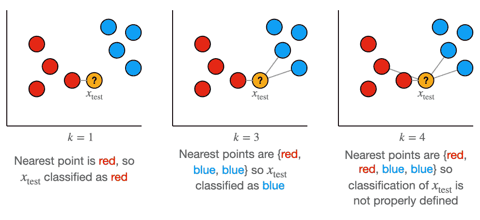

kNN 算法采用 n 个 d 维训练数据点(我们的 X 矩阵),每个数据点都有一个相应的 y，并带有离散输出(即类)。在上面的例子中，我们有 n=8 d=2 个训练示例。其中 4 个是红色的，另外 4 个是蓝色的。kNN 算法使用该信息根据给定的 k 来预测测试点的类别(橙色)

只是为了快速澄清，在二进制分类器的情况下(所以当我们只有 2 个类要预测时)，k **必须是奇数**以避免有未定义的点。如上述 k=4 的最后一个示例所示，您可能会遇到类数量相等的情况，因此无法对您的点进行分类。当然，有办法解决这个问题。一个简单的解决方案是从两个类中随机选择一个。在多类分类器中，如果要为每个测试点定义一个结果，k **只能是 1** ，如下所示:

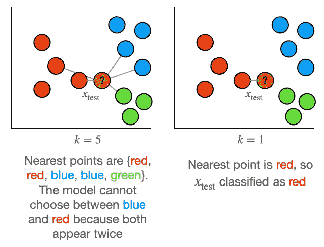

这里我们有 n=11 个 d 维训练点，我们的 y 现在是 3 维的，y = { '绿色'，'蓝色'，'红色' }。任何偶数 k 将具有与之前二进制分类情况相同的问题。除此之外，现在除了一个以外的所有奇数 k 都可能导致不确定的结果。

kNN 算法可以正式写成:

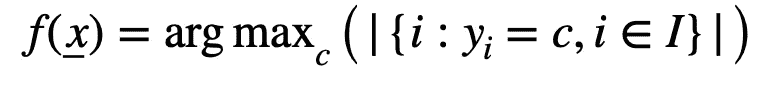

我们的函数 f 接收一个向量 x(用下划线表示),并将其归类为属于类别 c。这是通过在 x 的最近邻居中找到最频繁出现的类别来完成的

其中:

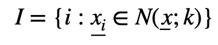

I 表示 x 的最近邻居的指数。k)找到最近邻居的集合

kNN 是一个非参数模型，这意味着没有任何“学习”发生。这意味着使用优化问题不需要找到任何参数。我们只指定一个超参数 k，它指定了我们的模型的行为方式。

如果你对这些不熟悉，我强烈建议你重新学习 kNN 知识。网上有很多很好的文章解释了算法是如何工作的。Onel Harrison 的[文章](/machine-learning-basics-with-the-k-nearest-neighbors-algorithm-6a6e71d01761)相当受欢迎，也很容易获得。如果你对更深入的东西感兴趣，那么我会推荐凯文·扎克卡的[文章](https://kevinzakka.github.io/2016/07/13/k-nearest-neighbor/)。

## 关于误差的快速复习:偏差、方差和贝叶斯率

任何给定的机器学习模型都会有以下 3 个错误。

> **偏差:**这是我们因模型假设而产生的误差

我们得到这个错误是因为我们在模型中做了假设来简化分析，因此我们可能会错过数据中的实际潜在趋势。下图清楚地显示了这一点:

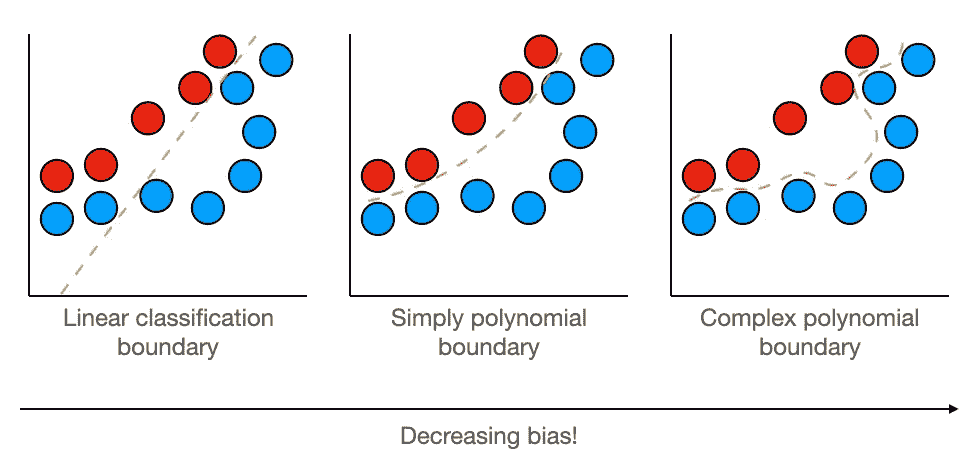

我们在左边看到，线性模型产生的错误最多，因为它没有捕捉到数据的非线性行为。其他两个模型不会出错，因为它们会出错。然而，我们看到最后一个模型几乎完美地捕捉到了蓝色决策边界。它有效地“记忆”了蓝色数据。这也不好，因为我们会看到它增加了方差！

通常，模型复杂性的增加会减少这种类型的错误。这是因为如果趋势更复杂，简单的模型会忽略趋势。

> **方差:**是我们因不同数据集的预测不同而产生的误差

我们之所以会有这个误差，是因为我们的数据从来没有代表过真实的总体。因此，根据我们获得的训练/测试数据的类型，我们的预测会有所不同。我对这个错误的理解是:我们在多大程度上学习了训练数据中的噪音？也就是说，我们**记住了**多少数据？

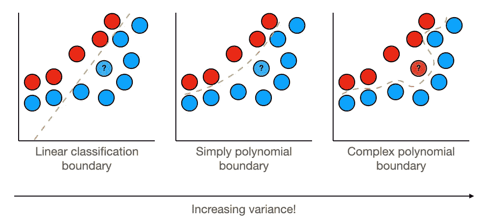

我们可以看到右边的图将点误分类为红色，尽管它看起来像是蓝色的一部分。我们得到这个的原因是因为复杂的边界已经记住了蓝色数据集中的噪声。它更喜欢关注地方特色，而不是总体趋势。在左边，我们看到一条直线。正如我们之前所讨论的，这具有很高的偏差，因为它没有学习趋势，但是因为它没有记忆数据集中的“噪声”，它实际上正确地对新点进行了分类。在这种情况下，简单多项式是偏差和方差之间的最佳平衡，因为:它学习数据的一般趋势，而不记忆任何噪声！

通常，模型复杂性的增加会增加这种类型的误差，因为更复杂的模型在记忆局部特征/噪声方面更好。

> **不可减少的错误率:**这是您拥有的实际数据的固有错误。如果不更改您的数据，就无法进一步减少。

这种类型的错误通常是因为我们的数据集中的固有噪声，即固有的随机性。这在下图中得到最好的展示:

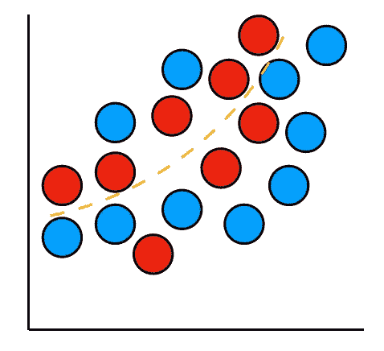

这和上面的例子是一样的，采用我们最好的模型，简单多项式。但是，数据比以前多了，噪音也多了。即使有“理想”边界，由于数据中固有的噪声，模型也会产生误差。

如果你还是不明白，就去找个硬币。我们知道得到正面的概率是 0.5。然而，尝试投掷硬币 4 次，并重复这个实验 4 次。你会像你期望的那样总是得到两个尾巴(T)和两个头(H)吗？

我就这么做了，得到了:

*   **实验一:** TTHT
*   **实验二:** THHT
*   **实验三:** TTHH
*   **实验四:** TTHT

这并不是因为硬币有偏差，而是因为扔硬币有内在的随机性。当我们投掷硬币的次数接近无穷大时，正面的概率只收敛到 0.5。这同样适用于我们拥有的任何训练数据。

在分类中，我们有一种方法来估计任何分类问题的最小误差(类似于不可约误差)。这是[贝叶斯错误率](https://en.wikipedia.org/wiki/Bayes_error_rate)。

> **贝叶斯错误率:**随机结果的任何分类器的最低可能错误

它由下式给出:

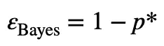

p*是在给定数据的情况下使用贝叶斯分类器预测类的最大概率(即确定具有最高条件概率的类的概率)

这些误差的总和给出了模型的总误差率。

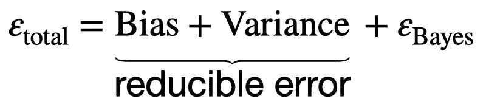

## 直觉:为什么增加 k 会减少模型方差，但会增加模型偏差？

为了说明这一点，让我们考虑一个分类问题，到目前为止，你们可能都已经看到了:

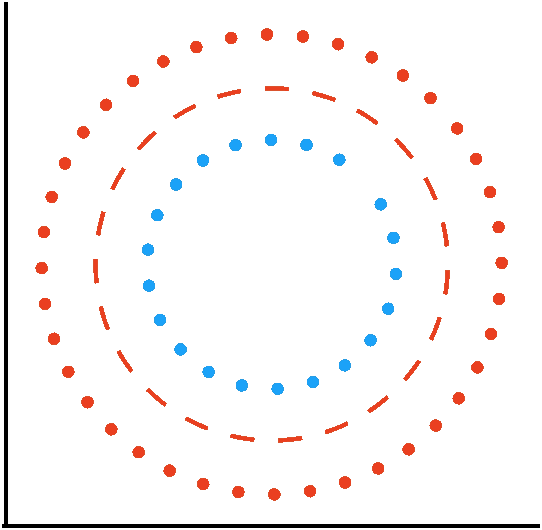

用圆形分布正确分类红色和蓝色。这里的橙色线表示两个类别之间的理想分离边界

让我们考虑同样的问题，但是有噪声。让我们看看，如果我们尝试对 k=1 的新点进行分类，会发生什么。

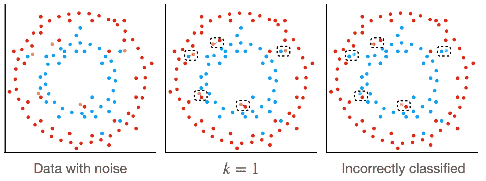

我们可以看到，k=1 的点错分了大部分的点。这是因为碰巧这些点的最近邻点没有反映数据的趋势，即圆圈，而是简单的噪声样本。k=1 算法有效地“记忆”了数据中的噪声，因此它不能很好地概括。这意味着它有很高的方差。然而，偏差非常低，因为它完美地捕捉了数据中存在的所有波动。

现在让我们考虑一个例子，k=3，k=9

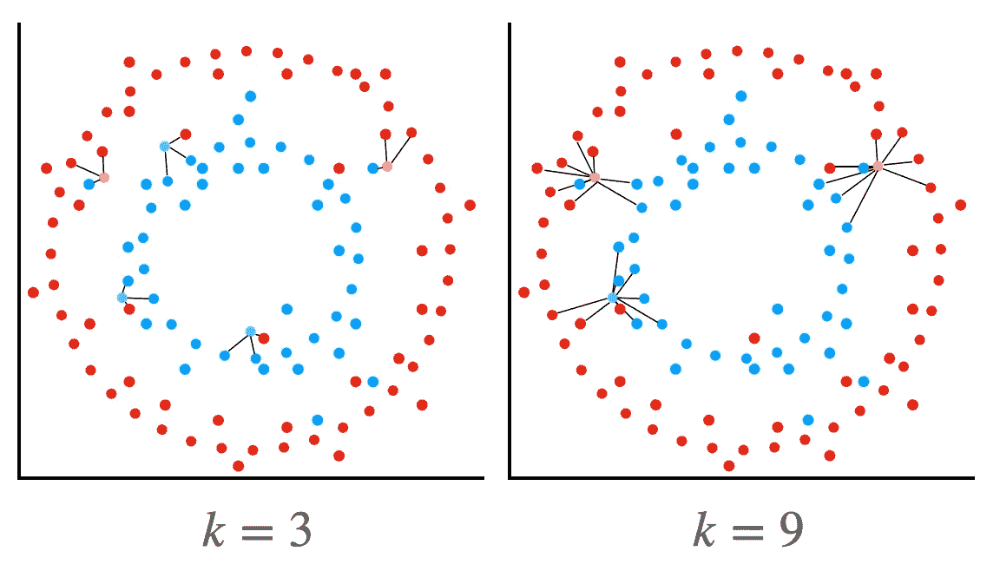

我们可以看到，对于 k=3，所有的决策都非常合理。偏差和方差都很低。对于 k=9，虽然我们仍然得到正确的答案，但是一些用于对我们的点进行分类的最近邻开始从两种分布中获取信息。在这一点上，我们的方差很低，但偏差很大，因为我们的模型没有了解到有两个不同的圆圈代表不同的类别。

如果我们在 k 接近数据集大小时取极限，我们会得到一个模型，这个模型只是预测在数据集中出现频率更高的类(实际上是贝叶斯误差)。这是具有最高偏差的模型，但是方差是 0(因为我们的误差对于测试数据是不变的)。高偏差，因为它未能捕获关于模型的任何局部信息，但 0 方差，因为它预测任何新数据点的完全相同的事情。

## kNN 作为回归模型的数学证明

如果我们将 kNN 视为一个回归问题，我们实际上可以从数学上表明，增加 k 会导致我们模型的方差减少。这样，我们的预测器就变成了一个决定连续变量的函数:

实际上，我们为 **x_test** 预测的值是其所有最近邻居的平均值

与任何模型一样，我们对最小化预期误差 E 感兴趣，其中:

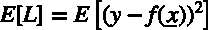

这里我们使用均方差作为我们的损失函数，因为它是一个回归问题

我们可以将其扩展，得到偏差-方差分解，如下所示:

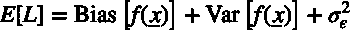

平方损失(MSE)的偏差方差分解。这个结果来自维基百科[页面](https://en.wikipedia.org/wiki/Bias%E2%80%93variance_tradeoff)。如果证明不清楚，请在这里留下评论，我会考虑写关于分解证明的文章。

偏差和方差由下式给出:

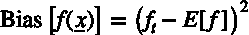

偏置方程，其中 f_t 是定义 y 的确定性函数，因此 y = f _ t+ε(ε是均值为 0 的随机误差)。期望 E 是 x 的所有可能实现，记住偏差是我们因为模型的假设而产生的误差。这个等式应该是:考虑到我们的预测值在 x 的所有可能值上看起来像什么(因此是期望值)，与函数的真实形式相比，我们产生的误差是什么。

方差方程。根据我们的定义，方差是由于不同数据集之间的差异而产生的误差。第一个期望中的术语是:在所有可能的 x 值上，与我们的预测值相比，我们对函数 f 的单个实现产生的误差是多少。然后，我们考虑在所有可能的 f 值上的这个误差(因此是期望)。

最后一项是误差的固定标准差:

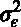

这是我们不可减少的错误。由于误差的变化，我们的模型会产生多大的变化？值得提醒您的是，为了实现这一点，我们假设误差的平均值为 0。这意味着我们的误差不应该是输入 x 的函数，它们应该是随机的。

如果我们现在考虑我们的 kNN 回归模型，我们实际上可以确定偏差和方差的表达式。我们将分析限制在一个给定点 **x_test** 。

对于偏差，我们有:

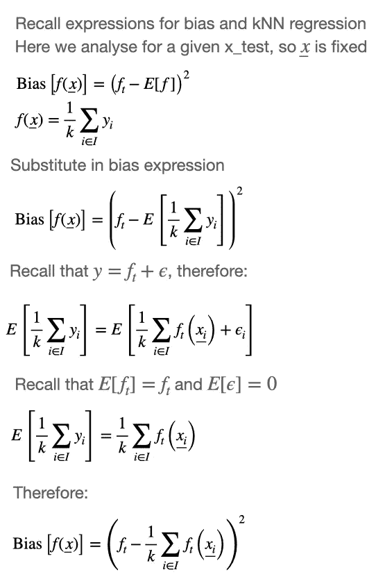

对于方差，我们有:

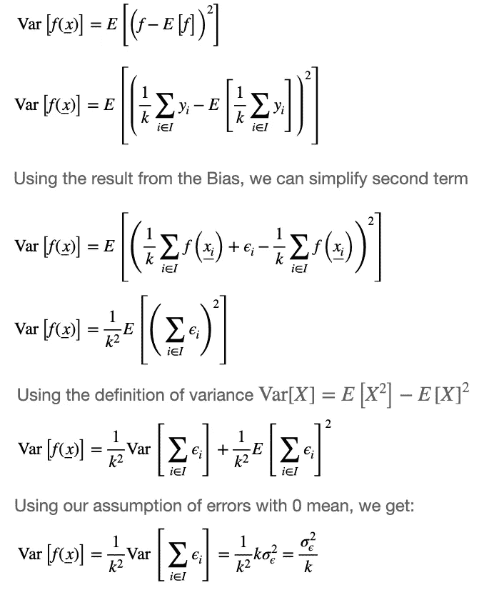

总的来说，我们得到我们的预期损失如下:

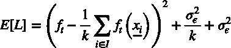

我们可以非常清楚地看到，随着 k 的增加，当它接近无穷大(即数据集的大小)时，模型的方差趋于 0。不可约误差保持不变。虽然直觉上我们预期偏差会增加，但要用数学方法显示这一点并不容易。然而，取 k 的极限到我们覆盖整个数据集的程度意味着我们的 kNN 回归仅仅给出平均值的恒定值(具体地，除了我们正在查看的点之外的所有点的平均值)。因此，我们只是预测一个常数值，因此我们没有捕捉到有关数据基础结构的内在信息，因此我们的偏差会很大。

## 实证结果:k 如何影响泛化误差？

我做了一些实验，看看 k 的选择如何影响泛化误差。这是我得到的情节:

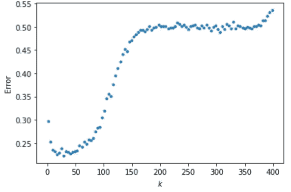

这是在 m=500 和 test_size 为 20%的 circle 数据集上进行的实验。

如果我们看上面的图，k 值低于 150，我们得到经典的总误差曲线。对于小 k 值，方差占主导地位，这就是为什么我们得到高误差率。对于较大的 k 值，我们的偏差是高误差率的主要原因。

我们可以看到，给出最小误差的 k 的最佳值约为 27(注意，我们可以使用交叉验证找到更好的近似值！).

该图中真正有趣的是，当 k>150 至 370 左右时，误差几乎保持稳定。虽然看起来后台可能发生了一些可疑的事情，但这个结果实际上是有意义的！由于我们有一个二进制分类问题，并且每个类别的样本相等，我们预计对于非常高的 k 值，我们将有效地在两个类别之间随机猜测，因此错误率为 0.5！

奇怪的是，在 370 左右，我们的错误率增加了。对此也有一个解释，由 [Karolis](https://stats.stackexchange.com/questions/550991/why-does-error-rate-of-knn-increase-when-k-approaches-size-of-training-set/550993#550993) 提供。

这是因为 **train_test_split()** 函数随机分割数据，结果测试集和训练集中的类平衡都不相等。当我们的分类器处于非常高的 k 值时，它将学习预测在训练集中更频繁出现的类别。在我们的测试集中，我们将有一个相反方向的类不平衡，即在训练集中不太频繁的类将是在我们的测试集中最频繁的类。这种偏差导致误差增大，变得比随机猜测还要糟糕！

为了说明这一点，可以通过模拟来确定不平衡测试集的平均频率:

平均频率为 0.540，如图所示！

为了验证这个理论，我用分层的 **train_test_split()** (也就是确保拆分后的类是平衡的)重复了这个实验，瞧！结果如我们所料！

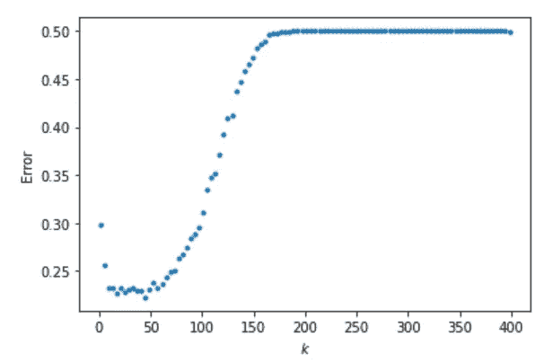

## 实证结果:k 如何影响决策边界？

为了感受模型“记忆”噪声(即高方差)的意义，我绘制了不同 k 值下的 kNN 模型的等值线图。这些图清楚地显示了决策边界。

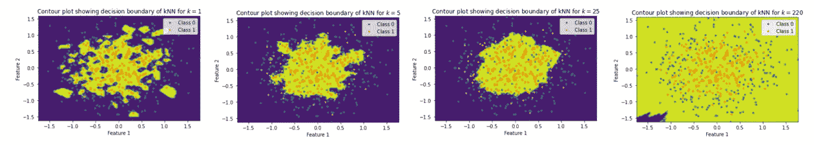

我们可以看到，随着我们从低 k 到高 k，决策边界变得更加平滑。这意味着，我们并没有过多关注局部特征(即噪声)，而是试图捕捉一些潜在的趋势。当然，我们看到，当我们对 k 的值走得太远时，我们只是得到一个几乎 100%一致的边界。在这种情况下，我们完全忽略了潜在的趋势和任何局部特征，而只关注全局特征，即训练数据集中类的频率

我们可以将上述模型与实际的训练数据集进行比较。

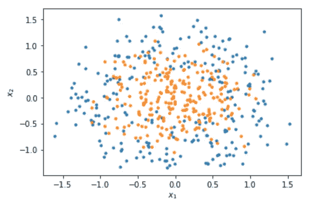

我们看到 k=25 的模型最好地解释了数据。

## 实证结果:m 如何影响 k 的最优值？

我做了一些实验来确定改变数据集 m 的大小对 k 的最优值的影响。

结果有些耐人寻味，所以我想与你分享:

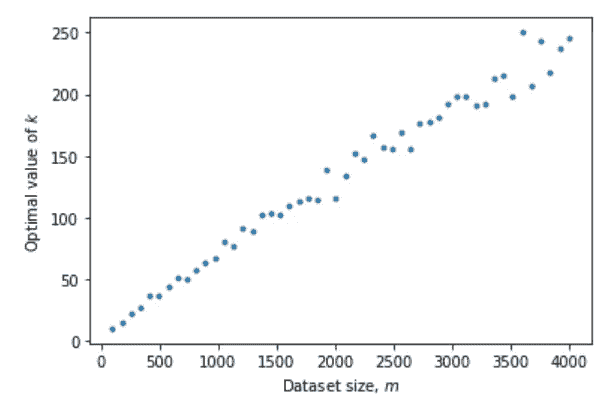

我们可以看到，对于 **make_circles()** 数据集，m 的增加几乎是线性的。由于数据的参数(噪声= 0.3，因子= 0.5)随着样本数量的增加会有很大程度的重叠，因此 m 的增加导致 k 的增加是有道理的。

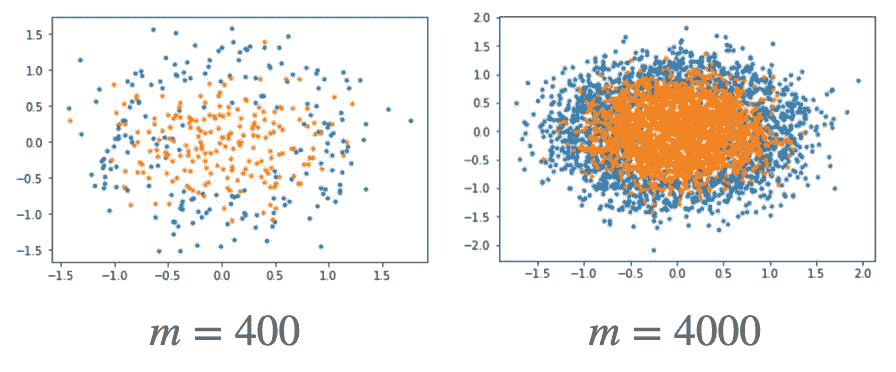

因此，对于较小的样本，我们需要依靠局部特征进行精确预测，因此 k 值较小，但对于较大的样本，我们需要更平滑的决策边界，以确保我们捕捉到趋势，而不是重叠产生的噪声。

至于为什么这个关系是线性的，我只能猜测是因为我们在线性增加数据。但是，我对这种推理不够自信。

## 关键要点

*   kNN 模型是一个具有超参数 **k** 的非参数模型
*   其性能基于总误差，即**偏差**、**方差**和**不可约误差**之和
*   小值的 **k** 记忆**噪声**，从而导致**非平滑**判定边界。这增加了总误差，其中主要是高**方差**
*   **k** 的大值忽略了数据(局部特征)中的**潜在** **趋势**，从而导致**平滑**决策边界。这增加了总误差，其中主要是高偏置
*   将 kNN 视为一个回归问题，可以让您以数学方式显示上述结果
*   k 的最佳值是方差和偏差之间的平衡值。这可以通过交叉验证找到。如果不确定从哪个 k 值开始分析数据， **k = sqrt(m)** 或 **k = log(m)** 是一个好的开始

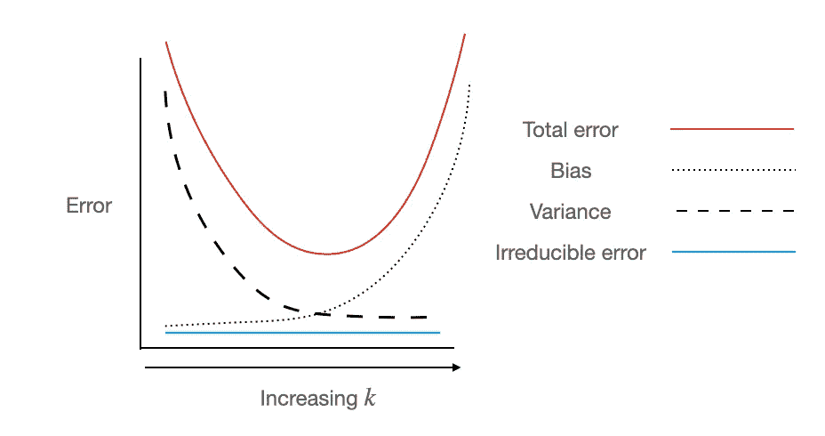

显示任何 ML 问题中不同类型错误的图表，总结上述信息

## 再现性

如果你想重现结果，请查看 GitHub 的页面。如果您对它的任何方面有任何问题，请联系我！

如果你真的喜欢我的工作并愿意支持我，请考虑使用我的[推荐链接](https://namiyousef96.medium.com/membership)来获得一个中等订阅。

*除非另有说明，所有图片均由作者创作。*