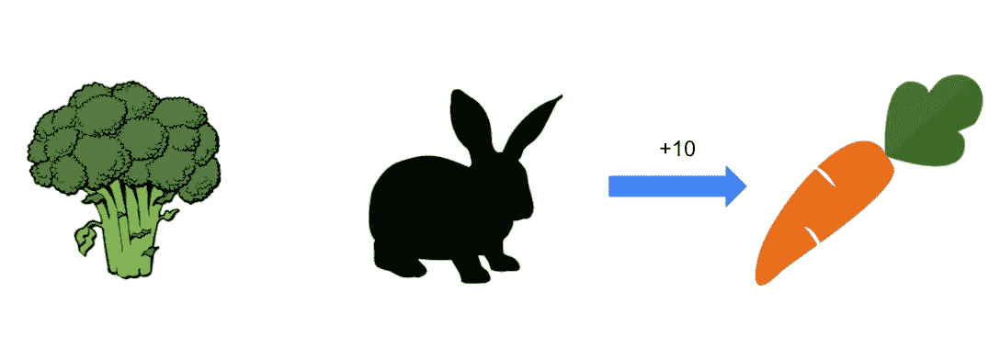
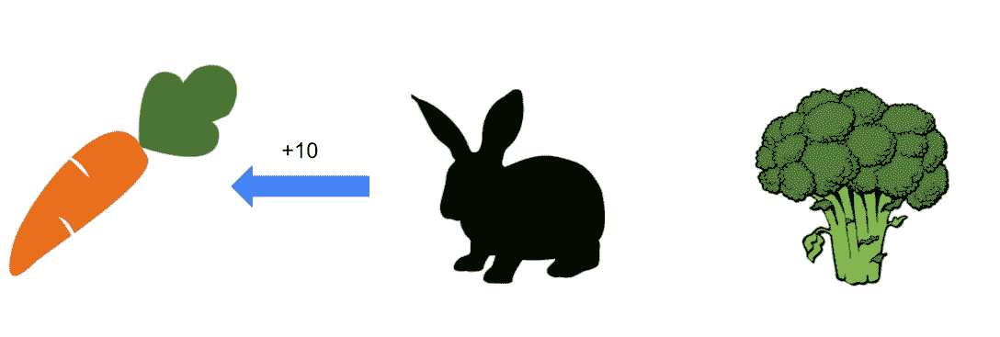
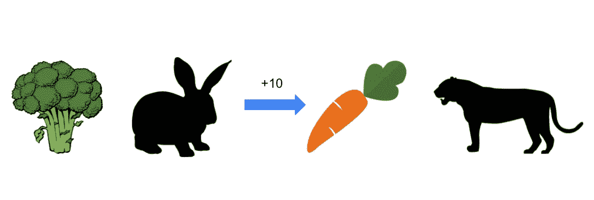
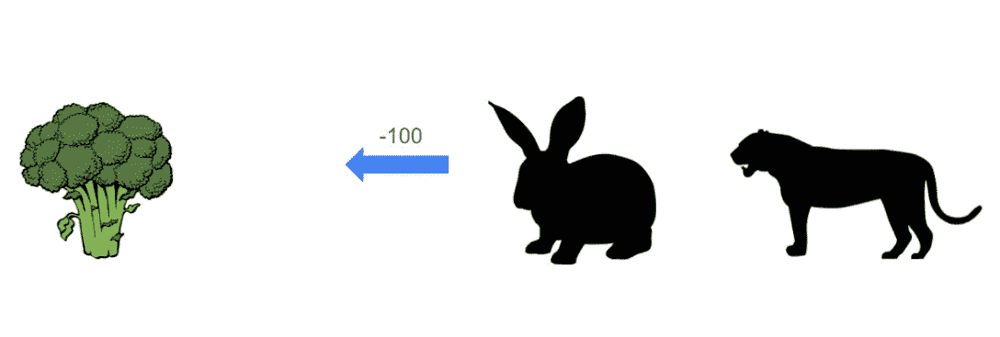
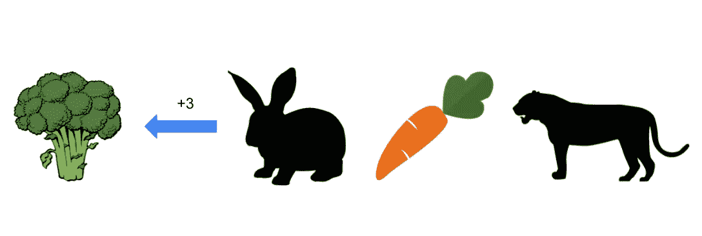
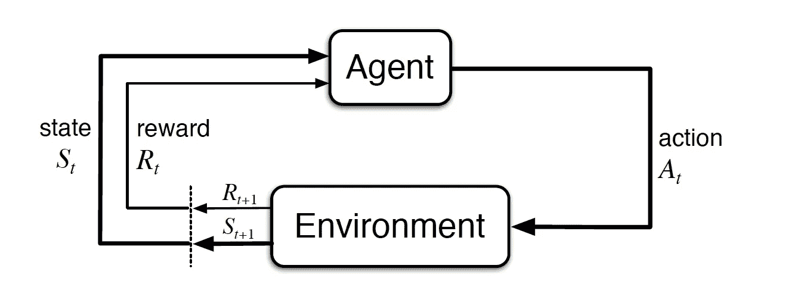
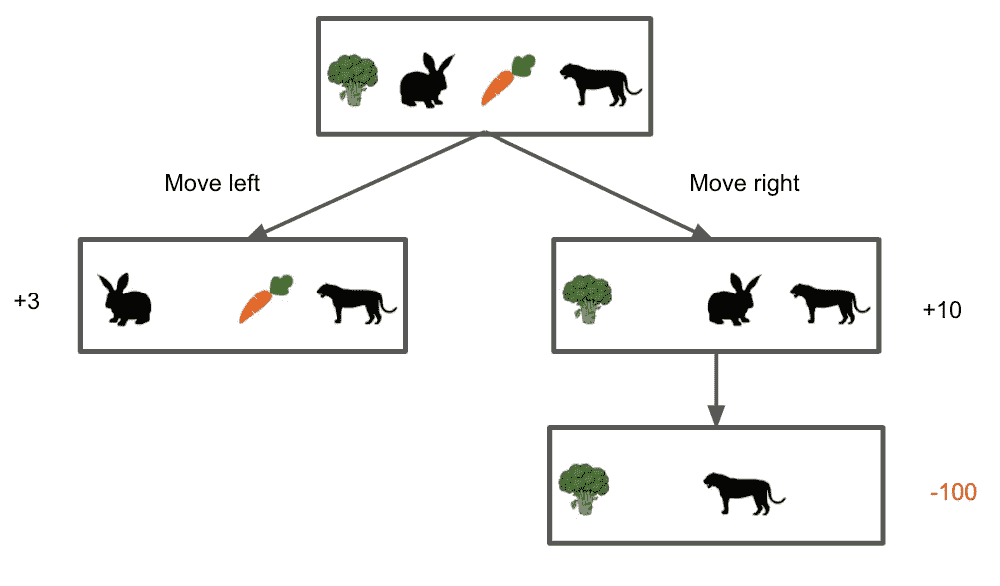

# 为什么马尔可夫决策过程在强化学习中很重要？

> 原文：<https://towardsdatascience.com/why-does-malkov-decision-process-matter-in-reinforcement-learning-b111b46b41bd?source=collection_archive---------18----------------------->

## 比较 MDP 和 k-武装土匪的问题，看看 MDP 如何更适合在现实世界中

贾南·拉格沃尔在 [Unsplash](https://unsplash.com?utm_source=medium&utm_medium=referral) 上拍摄的照片

对于大多数学习者来说，马尔可夫决策过程(MDP)框架是第一个了解强化学习(RL)的框架。然而，你能解释为什么它如此重要吗？为什么不是另一个框架？在这篇文章中，我将解释 MDP 相对于另一个流行的 RL 框架 k-armed bandit 问题的优势。

这个帖子的灵感来自于[由阿尔伯塔大学和阿尔伯塔机器智能研究所在 Coursera](https://www.coursera.org/specializations/reinforcement-learning) 上提供的 RL 专业。我写这篇文章是为了总结一些视频，并对专业化有更深入的了解。

# 强化学习的目标

在深入我们的主要问题之前，我想提一下 RL 的主要目标，因为当我们选择一个框架来构建一个模型时，它很重要。在 RL 问题中，我们希望**随着时间的推移采取行动，使我们获得的总回报**最大化。没有人告诉我们什么行为会带来更高的回报。相反，我们从经验中学习。我们重复试错的尝试，观察哪种行为给我们更高的回报，哪种行为给我们更低的回报。此外，我们甚至不知道什么时候开始给予奖励。它们可能会立即给出，也可能在我们采取行动后的几个时间步骤后给出。因此，我们需要一个动态框架来捕捉这两个特征，“试错搜索”和“延迟回报”

# 例子:兔子探索食物

我们考虑一个简单的情况。有一只饥饿的兔子正在寻找食物来满足她的食欲。它的右边有一个胡萝卜，左边有一个花椰菜。兔子更喜欢胡萝卜而不是西兰花，所以当她吃一根胡萝卜时，她会得到+10 奖励。另一方面，花椰菜只能产生+3 的回报。每次，兔子都会选择一根胡萝卜，因为她知道选择一根胡萝卜是一个最优行动。

图 1:兔子右侧的胡萝卜(图片由作者提供)

如果胡萝卜和西兰花的位置互换了呢？兔子也会再次选择胡萝卜，因为食物的位置不会影响兔子得到的奖励。这其实是一个简单的“k 臂土匪”问题的例子。

图 2:兔子左侧的胡萝卜(图片由作者提供)

# k 武装匪徒

**k 臂土匪问题**是 RL 中最简单但功能强大的框架之一。它被命名为“独臂强盗”(=老虎机)，虽然框架有 *k* 杠杆，而不是一个。在这个问题中，你面临着在 *k* 个不同选项中做出选择。每次选择后，你会收到一份奖励，它是从与你选择的选项相对应的固定概率分布中选出的。你重复这样的选择，目的是最大化你获得的奖励总额。要做到这一点，你需要找到一个最有可能产生最佳回报的杠杆(或期权)，并把你的选择集中在它上面。

兔子的例子可以被视为一个“双臂强盗”问题，因为兔子总是有两种选择，胡萝卜和花椰菜。选择胡萝卜有 100%的概率产生+10，选择西兰花有 100%的概率产生+3。因为兔子想让奖励总量最大化，所以总是选择胡萝卜。

下面这篇文章将有助于更详细地理解 k 臂土匪问题。

</multi-armed-bandits-and-reinforcement-learning-dc9001dcb8da>  

# 例子续:胡萝卜后面的老虎

虽然 k-armed bandit 框架很好地捕捉了前面的简单情况，但它有一个限制，这将在下一个情况中显示。

在这里，我们想象一只老虎躲在胡萝卜后面猎食兔子。当兔子吃了胡萝卜，兔子和老虎之间不再有任何障碍。老虎比兔子跑得快，所以她跑不掉。兔子最终被猎杀并获得-100 奖励。

图 3:兔子去抓胡萝卜，老虎在后面(图片由作者提供)

图 4:兔子在吃完胡萝卜后被追捕(图片由作者提供)

如果兔子选择吃西兰花，兔子会得到+3 并且保持安全。

图 5:兔子只要选择西兰花就是安全的(图片由作者提供)

在 k 臂土匪问题中，兔子即使知道胡萝卜后面有老虎，也继续选择胡萝卜，因为变化的情况不影响它的最优行动。然而，继续选择胡萝卜不会永远帮助兔子。我们应该如何在我们的问题定义中考虑情况的变化？

# 马尔可夫决策过程

最后，我们引入**马尔可夫决策过程(MDP)** 来解决这样一个问题。MDP 由两个元素组成:**代理**和**环境**。代理是学习者或决策者。在上面的例子中，代理是兔子。环境是代理周围的一切。在这个例子中，环境包括兔子和老虎在田野里的一切。在代理采取行动后，我们面临一个不同的情况。我们称这些不同的情况为状态。比如兔子还没动的情况被认为是一种状态，兔子吃了胡萝卜之后在西兰花和老虎之间的情况被认为是另一种状态。

在 MDP，病原体与环境“互动”。代理选择一个动作，并观察采取该动作后环境中发生了什么。然后，它会收到与动作和她转换到的状态相对应的奖励。代理多次重复交互，并学习在每个状态下什么动作是最佳的。

下图是 MDP 的形式化。在时间 *t* 处，处于状态 St 的代理从动作空间中选择处于处的动作*，并且环境从状态空间返回新的状态 *S_t+1* 。然后，代理根据开始状态、采取的行动和后续状态接收奖励 *R_t+1* 。*

图 6:代理和环境之间的交互(图片由萨顿和巴尔托提供，由 CC BY-NC-ND 2.0 授权)

在兔子的例子中，动作空间由左右移动组成。状态空间包括所有四种可能的情况，1)兔子在初始位置，2)兔子在西兰花和老虎之间，3)兔子吃完西兰花后在最左边，4)兔子被老虎吃掉。可能的奖励是+3(情况 2)，+10(情况 3)，和-100(情况 4)。下图描述了详细信息。

图 7:可能状态和相关奖励的可视化(图片由作者提供)

考虑到 MDP 框架和图表，兔子知道最佳行动是向右移动，因为吃胡萝卜最终会产生负的总回报。

从技术上讲，MDP 通过定义 MDP 的动态函数来捕捉 RL 问题的动态性，这是一个状态和后续奖励对的概率分布，取决于其先前的状态和在那里采取的行动。不过，我会把这个解释留到以后写的另一篇文章中。

# 摘要

*   MDP 框架很重要，因为它考虑了可能导致最优行动改变的情况变化，而这在 k 臂土匪框架中是没有考虑的
*   一个 MDP 由它的主体和环境组成。代理与环境交互，观察状态转换并接收奖励，以在每个状态下找到最佳行动

# 参考

*   [1] R .萨顿和 A .巴尔托，强化学习导论，第 2 版(2018)，麻省理工学院出版社
*   [Coursera 上的强化学习专业化](https://www.coursera.org/specializations/reinforcement-learning)