# 为什么圆周率呈现正态分布？

> 原文：<https://towardsdatascience.com/why-does-pi-show-up-in-the-normal-distribution-a10baf4a71f1?source=collection_archive---------4----------------------->

## [提示和技巧](https://towardsdatascience.com/tagged/tips-and-tricks)

## 理解钟形曲线是如何形成的，以及它们与圆周率的反直觉关系

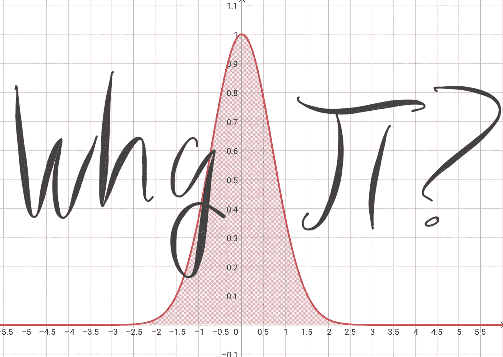

*作者图片*

最近在翻阅一本旧的统计学教科书时，我发现了熟悉的正态分布方程:

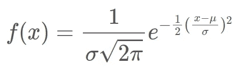

任何在大学上过统计学课程的人都会遇到这个等式。我自己已经看过很多次了，但这次看着它，两个问题立即浮现在脑海中:

1.  这个东西到底是怎么形成正态分布的？
2.  π在里面做什么？

第一个问题似乎很简单:我只需要追溯这个方程的历史，然后把它一点一点拼凑起来。但第二个问题绝对难倒了我:钟形曲线到底和圆有什么关系？

我通读了所有的[数学堆栈交换解决方案](https://math.stackexchange.com/q/28558/424609)，四处搜索，并在 Twitter 上提问，但从未感觉到任何答案给了我一直在寻找的直觉。他们过于依赖分析解决方案，或者当使用视觉技术时，我觉得这些连接是手动波动的。在做了一些我自己的研究后，这里是我在不求助于任何高等数学的情况下解释这种联系的尝试。

# 首先，什么是钟形曲线？

在讨论π部分之前，了解一下钟形曲线是如何形成的会有所帮助。让我们从指数函数开始，你可以在上面的等式中看到。这里它是独立的:

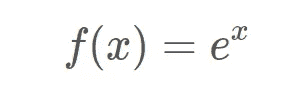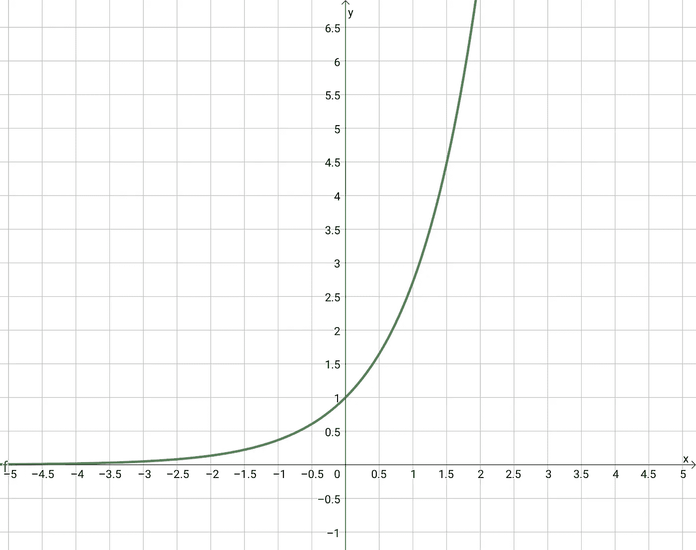

*作者图片*

如果我们对 x 的值求平方，它看起来有点像二次型，但不是一次型。相反，它是一个比二次函数增长更快的函数，但具有一些类似的属性，如关于最低点对称。将其添加到上面的图中进行比较，可以看到它们在 *x=0* 和 *x=1* 处具有相同的值:

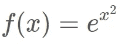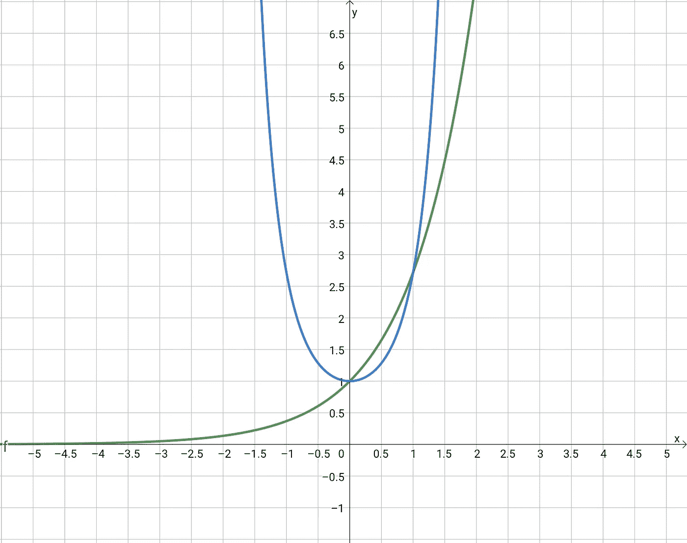

*作者图片*

最后，让指数为负，像变魔术一样，我们得到下面红色显示的钟形曲线:

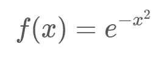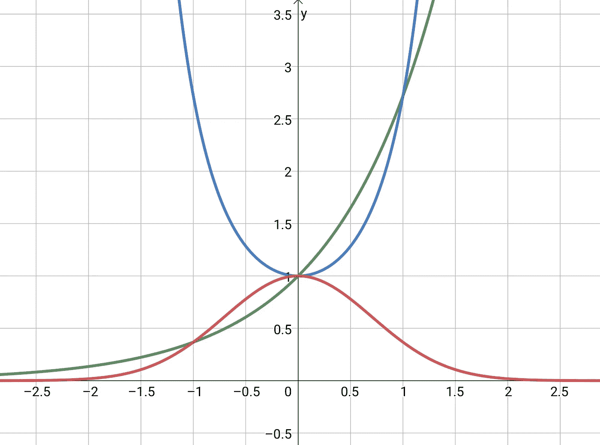

*作者图片*

这个函数， *f(x) = e^{-x }* ，只是无数可能性中的一个特殊的钟形曲线。一般来说，你可以将 e 提升到任何你喜欢的二次型。然而，只有当二次曲线是凹的(也就是说，它向下“打开”)时，你才能得到一条钟形曲线。上面那个二次是 *-x* ，确实是向下开的。

例如，下面用蓝色绘制的方程 *f(x) = x + x + 2* 不凹，当 *e* 上升到它时，你得到的是绿色曲线，显然不是钟形曲线:

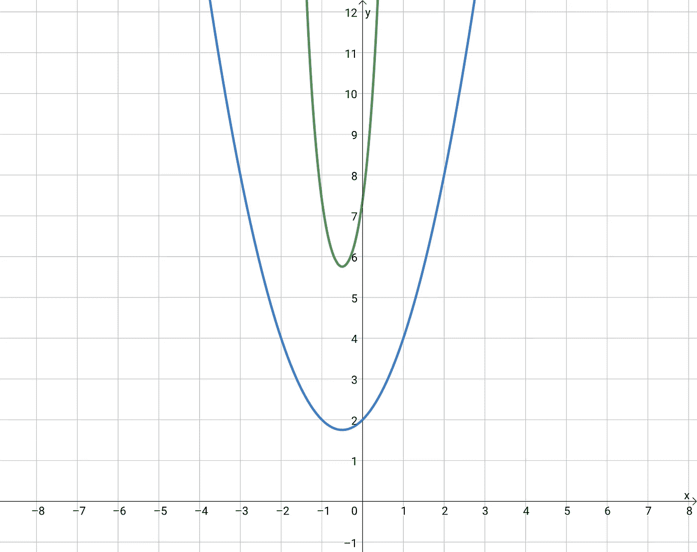

*作者图片*

但是，如果我们将等式转换为 *f(x) = -2x + 3x + 2* ，我们会得到一个凹函数，并且 *e* 被提升到，从而形成钟形曲线形状:

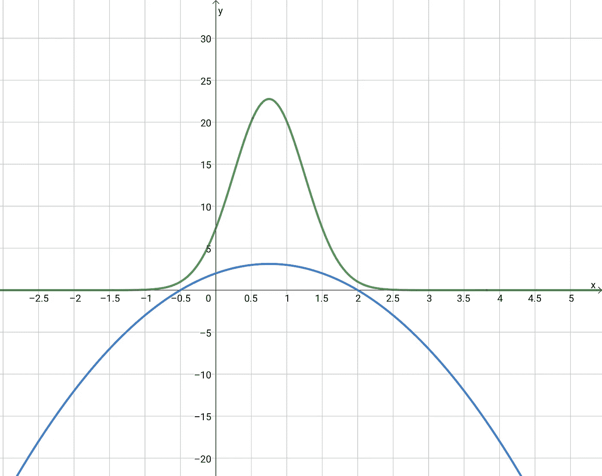

*作者图片*

为此，钟形曲线方程的一般方程被提升为二次方程:

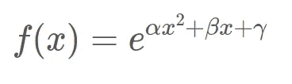

为了有助于将其约束为仅凹二次曲面，可以执行以下替换:

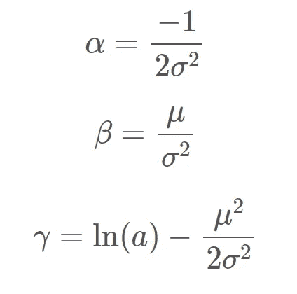

将这些代入并重新排列后，你会发现你得到了下面的等式，它几乎与我们从顶部开始的等式完全相同，只是在它前面有一个 *a* :

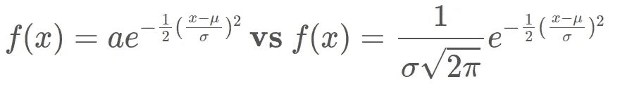

在右边的等式中选择 *a* ，这样无论钟形曲线的形状如何，它下面的面积总是正好为 1。这是因为对于统计分布来说，1 相当于 100%的可能结果，面积总和应该总是该值。

换句话说，钟形曲线和π项之间的联系，一定和曲线本身的面积有关。但是这到底有什么联系呢？

# 圆周率与钟形曲线的关系

让我们来评估一下刚刚发生了什么。我们取了一个[先验](https://en.wikipedia.org/wiki/Transcendental_number)数， *e* ，并将其提升到二次幂。当我们计算曲线下的面积时，我们得到另一个超越数π。

原来，这两个数字在几个方面是有联系的，包括它们在复数系统中的关系经由数学中最优美的方程之一: [*e^{iπ} + 1 = 0*](https://en.wikipedia.org/wiki/Euler%27s_formula) 。但是这个等式在这里不起作用。

相反，正如我们将会看到的，π不需要我们去计算面积。迂回地用*【e^{-x】*的平方，再求平方根，就可以得到这个面积。换句话说:

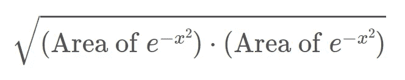

我们必须这么做的原因是，我们需要用到微积分技术来得到面积。网上有很多例子说明如何做到这一点，但我想提供这些分析解决方案不一定传达的视觉直觉。

由于我们用来计算面积的变量是任意的，我们可以简单地用下面的等式来表示上面的等式，其中我们用一个 *y* 代替了第二个 *x* :

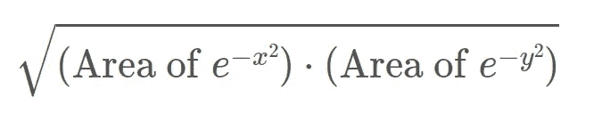

现在，您可以将这些钟形曲线中的一条放在 x 轴上，另一条放在 y 轴上，然后获取它们高度的所有组合，并绘制成三维图:

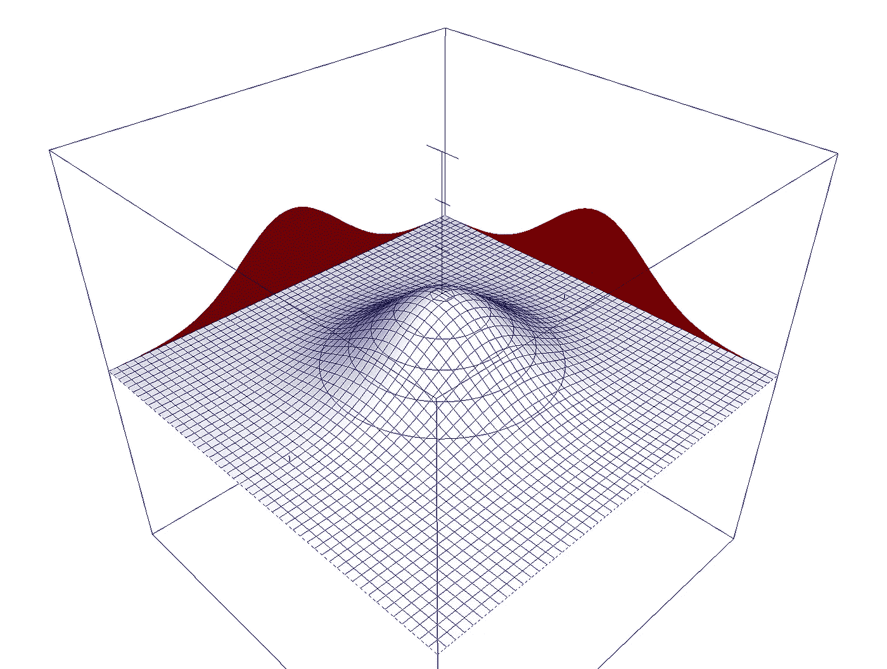

*作者图片*

要得到其中一条曲线的面积，你只需要得到形成的“山”的体积，然后求这个值的平方根。与此类似，维度更少的情况是知道一个正方形的面积，然后通过平方根得到它的边长。

> ***注意:*** *此招并非对所有类型的函数都有效。如果你用一个二次型(比如说，* -x + 9 *)来尝试这个，你不会得到正确答案。原因是这只适用于平方后旋转对称的函数。虽然高斯曲线是这样，但从下面类似的二次曲线图中可以看出，它是“方形”的，并且不像上面的曲线那样通过旋转对称。*

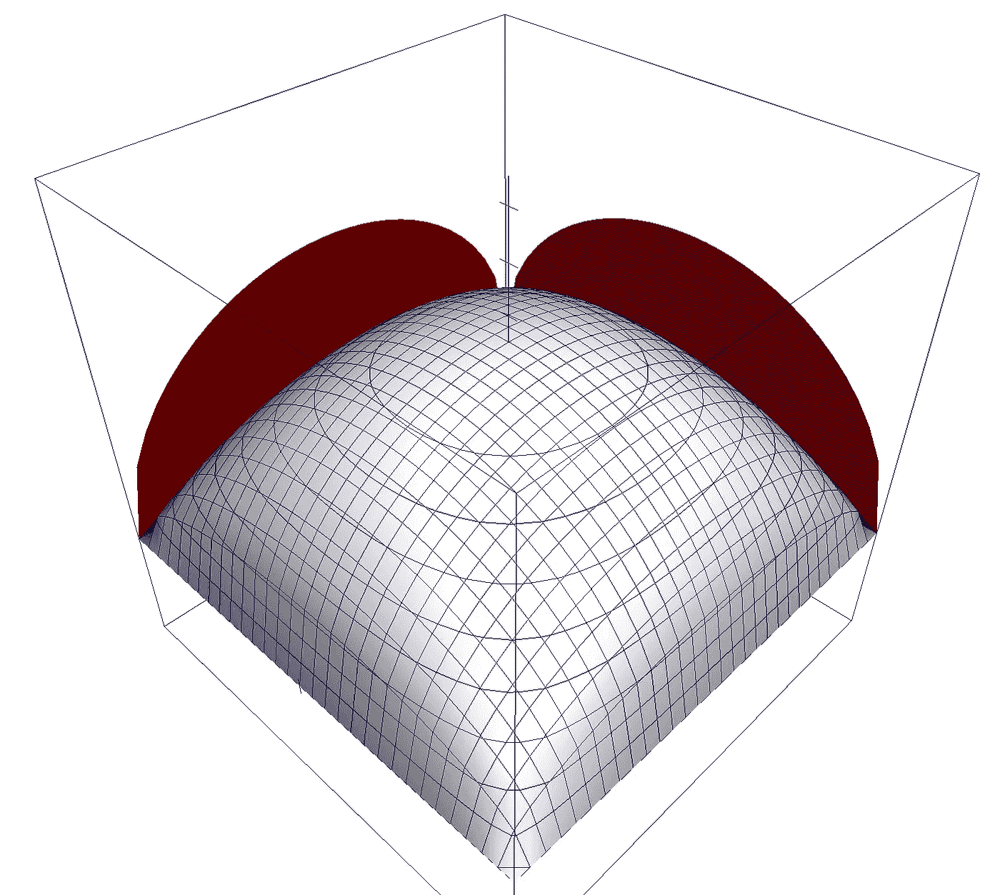

一个“平方二次”的图表明它不是旋转对称的。*图片作者。*

但是，我们如何得到体积呢？一种方法是将山分成如上的方块，然后得到每个方块中间的高度。然后你可以计算这些方形柱子的体积为*(每个正方形的面积)**(高度)*，然后将所有这些较小的体积相加。你做的方块越小，近似值就越好。

然而，这隐藏了π的来源。所以相反，想象一下，不使用正方形，我们把它径向分开。在这张图中，我们从顶部向下看，可以看到山丘的等高线:

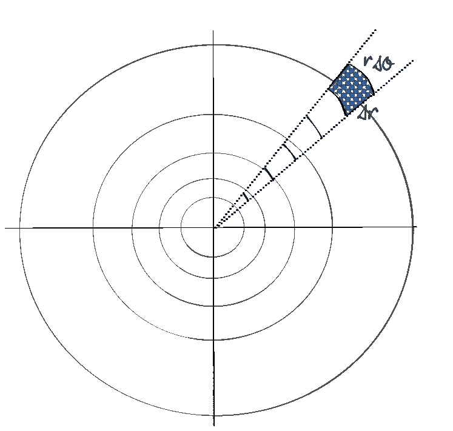

*作者图片*

在这里，您将上山划分为由黑色虚线表示的“片”。这些切片被进一步分成以蓝色突出显示的部分。如上所述，你将这些蓝色小块的面积乘以该点的山的高度，得到体积:

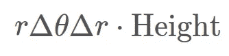

不过，在这种情况下，您可以沿着“切片”重复此操作，以获得整个切片的体积，然后乘以切片的总数，以获得整个山体的体积。

如果你把𝜃角做得足够小，以至于它几乎是一个长条，那么实际上，你可以把一个切片的体积乘以 *2π弧度*，弧度是一个圆的弧度数。

如果你真的做了这道算术题(同样，微积分在这里[讨论过](https://en.wikipedia.org/wiki/Gaussian_integral#By_polar_coordinates)给那些想看的人看)你会发现每个切片的面积正好是 0.5。将它乘以 *2π弧度*，你得到的体积正好等于 *π* 。

现在你知道了:圆周率来源于这样一个事实:我们通过制作径向切片，然后将它们围绕一个圆缝合在一起，从而得到体积。

事实证明，任何通过旋转对称的东西都可以被认为包含圆，自然地，圆意味着 *π* 潜伏在数学中的某个地方。

虽然这不是一个严格的证明，并且我跳过了许多细节(例如，跳转到两条钟形曲线的 3D 图通常并不适用于所有函数，但它适用于我们使用的函数)，但我希望这能给读者一个直觉，为什么 *π* 似乎突然出现在一条似乎没有什么关系的曲线中。

***原载于***[***【WhackData.com】***](https://www.whackdata.com/2021/12/06/why-pi-gaussian-normal-equation/)***。关注莱恩在推特上的***[***@布里多***](https://twitter.com/Brideau) ***。***