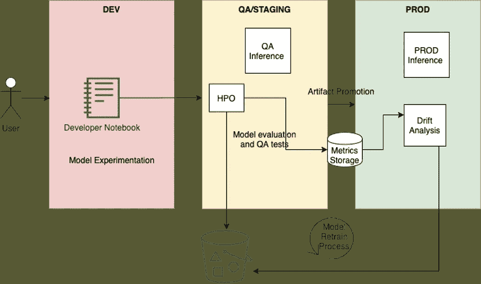

# 为什么你的 MLOps 感觉不够用？

> 原文：<https://towardsdatascience.com/why-does-your-machine-learning-ops-feel-inadequate-430fdee7d687?source=collection_archive---------34----------------------->

## [意见](https://towardsdatascience.com/tagged/opinion)

## *机器学习过程碎片化的原因以及为什么许多实践仍然是定制的。*

E 每次我设计一个新的微服务，都会有一个待办事项清单供我核对。这个列表中的一个早期项目是关于为新服务设置 CI/CD。我思考这些人工制品是什么，以及它们在不同阶段是如何形成的。我考虑它如何最终部署到生产环境中，以及如何在部署后对其进行监控。

这种情况不是我一个人的。现代软件工程实践将经过深思熟虑的 CI/CD 原则作为一种规范来实施。然而，当我开始我们公司的 MLOps 之旅时，我意识到软件工程中实践的那种 CI/CD 不是数据科学实践中的标准。

MLOps 非常定制(照片由[杰斯温·托马斯](https://unsplash.com/@jeswinthomas?utm_source=medium&utm_medium=referral)在 [Unsplash](https://unsplash.com?utm_source=medium&utm_medium=referral) 上拍摄)

这几乎难以置信。因为我认为人为错误导致的[模型质量问题](/rookie-errors-in-machine-learning-bc1c627f2789)在行业中普遍存在。是因为在典型的 ML 过程中没有足够的质量和自动化考虑吗？或者它是否需要一种尚未真正弄清楚的全新类型的 ops 工具包？后来我发现，这是两者的结合。和许多其他人。

以下是这些发现的摘要。

*   **许多数据科学操作显然是不成熟的—** 我们不能忽视显而易见的事实。几个数据科学运营的规模不足以将必要的想法纳入运营。我遇到的一家公司将数据科学家本地 Jupyter 笔记本上的每个新模型通过 *slack* 发送给数据工程团队，他们会将其复制到他们的生产环境中。虽然这是一个忽略了几个质量方面的难以置信的天真的实践，但该公司软件运营的其余部分是可靠的。这个实践告诉我 MLOps 是多么被忽视。
*   **在陷入 MLOps 之前，新模型需要喘息的空间—** 新的 ML 模型通常是为了处理全新的问题而构建的，这需要围绕推理的新框架在生产中运行。构建过程经历了大量的实验&评估——只有在证明该模型的商业成功后，才能围绕它构建一个推理框架。因此，部署过程通常是事后才想到的。无论这个框架何时形成，它都是一个非常定制的过程。
*   **太多的框架没有一个明确的赢家—** 数据科学实践太定制化了，把几个 ML 框架串在一起用于管道的不同部分。顶级 ML 框架中还没有一个赢家(例如，考虑深度学习——py torch、MXNet、Tensorflow)。几个框架的存在使得过程标准化对于外部供应商来说具有难以置信的挑战性。
*   **先进的 ML 管道有时无法实现** —这包括监控生产中模型的漂移、使用实时数据进行自动再训练、实现集中式数据清理和功能工程等功能。尽管这些对于任何运行在产品中的模型来说都是有价值的工具，但是它们背后的工程工作是如此之大，以至于许多组织并不简单地投入这些工作。
*   **Cloud AutoML-** 支持 AutoML 的云服务( [Sagemaker](https://aws.amazon.com/sagemaker/autopilot/) 、 [Cloud AutoML](https://cloud.google.com/automl) 、 [Datarobot](https://www.datarobot.com/platform/automated-machine-learning/) )已经具备 it 固有的强大 CI/CD 功能。我说的不仅仅是自动算法选择。任何可以自动化数据科学管道(特征工程、数据处理、算法选择、推理等)的软件。)背后必须有合理水平的 CI/CD 和工程。
    操作该模型的软件通常是围绕一个标准化的推理模板构建的，该模板通常由同一个 AutoML 框架提供。事实上，如果你正在使用某种形式的 AutoML，你已经有了一种 CI/CD。但通常，这是不够的。CI/CD 只是可靠的 MLOps 流程的一部分。在这种情况下，您仍然依赖个人来获得正确的部署。没有足够的制衡。

## 另外，数据科学家不是软件工程师。

> 软件工程之所以有几个护栏，是因为人类会犯错误的潜在假设。这是很好理解，理论化和多年价值的过程已经围绕这一点。然而，机器学习行业仍然在追赶这一基本思想。

数据科学家的思维过程与软件工程师不同。开发人员每天都关心他们代码的操作方面。他们在生产过程中建立质量关卡和检查。

另一方面，数据科学家钻研复杂的数学和数据分析。在构建新模型时，代码质量、管道和自动化测试并不是他们最关心的事情。大多数时候，向他们提出这样的要求是不公平的。

然而，为了使 MLOps 正确，我们需要混合经典的软件工程。这个头衔经常被伪装成*数据工程师*。但随着 MLOps 越来越受欢迎，这个角色需要更多的细微差别。该角色通常用于扩展进入管道的数据(ETL、Spark 等)，而不是 ML 模型相关的问题。例如，这个人必须思考，

*   如何在模型训练和模型推理之间创建可重复的数据清理和特征工程管道
*   如何跟踪实验，哪些指标需要汇总到仪表板中
*   如何通过跟踪漂移来监控生产中的模型？以及如何使用新数据实现实时再培训

这些都是需要数据科学和软件工程思维过程的挑战性问题。需要将大规模研究这些问题的各种专业角色纳入“数据工程师”或其同等职位。

## 后来添加的东西

我谈到的所有问题的解决方案似乎都很明显——为您的机器学习过程提供一个可靠的 MLOps 管道。当这种情况发生在我们身上时，我们开始寻找一个能够开箱即用的提供商。经过几个月徒劳无功的调查，我们不得不自己构建它来适应这个用例。就像我提到的其他人一样。

它做它被设计做的事。但是我们会达到开源的程度吗？大概不会。

ML 实践的 CI/CD(图片由作者提供)

## 参考

</7-mlops-smells-that-tells-that-your-ml-process-stinks-2f389c3ebd11>  <https://aws.amazon.com/solutions/implementations/aws-mlops-framework/>  <https://cloud.google.com/solutions/machine-learning/mlops-continuous-delivery-and-automation-pipelines-in-machine-learning>  <https://azure.microsoft.com/en-ca/services/machine-learning/mlops/> 