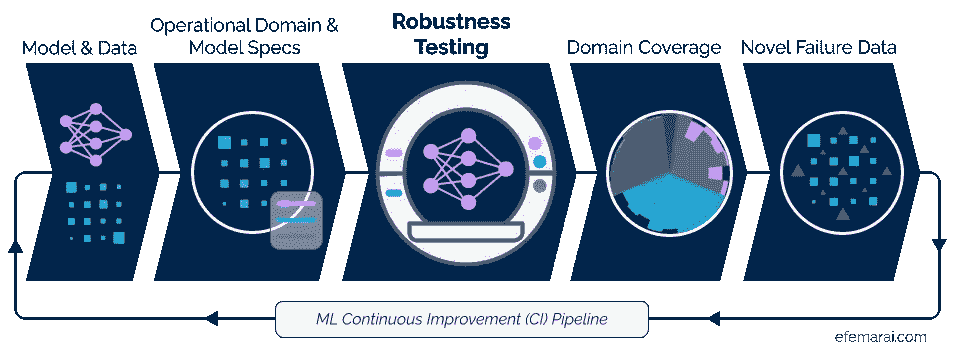
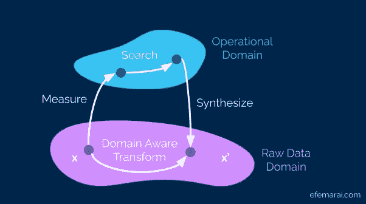

# 为什么我们不像测试软件一样测试机器学习？

> 原文：<https://towardsdatascience.com/why-dont-we-test-machine-learning-as-we-test-software-43f5720903d?source=collection_archive---------22----------------------->

## [行业笔记](https://towardsdatascience.com/tagged/notes-from-industry)

## 让我们从现代软件测试中获得灵感，使 ML 模型更加健壮！自信地改进模型的新方法。

机器学习系统现在在我们的日常生活中无处不在，因此它们行为的正确性绝对至关重要。当一个 ML 系统出错时，它不仅会导致令人讨厌的在线体验，还会限制你的社会经济活动能力，甚至更糟的是，在你的车里进行危及生命的操作。那么，你有多确定一个已部署的 ML 系统经过了彻底的测试，并且你不是一个有效的测试用户呢？另一方面，您如何知道您开发的系统足够可靠，可以在现实世界中部署呢？而且即使当前版本在现实世界中经过了严格的测试，在更新了模型的一部分之后，你又怎么能确定它的整体性能没有退步呢？这些都是棘手的问题，根源在于我们试图以数据驱动的方式解决的问题的纯粹复杂性，以及我们如今正在构建的机器学习模型的规模。

在这篇博客文章中，我们将仔细研究面临类似问题的另一个领域——软件工程——那里采用的测试方法以及它们如何应用于 ML 测试。最终，在那篇文章结束时，我希望你会认真地问自己“为什么我们不像测试软件那样彻底地测试机器学习？”。并了解如何使用先进的软件测试方法来广泛测试模型，捕捉回归，并成为您的 ML 质量保证过程的一部分。下面你可以看到我和我的团队正在构建的持续改进管道图，它展示了如何在 MLOps 领域使用高级软件 QA 技术。

*利用现有的模型和数据，我们可以将它们与预期的操作域配对，并在其中测试它们的稳健性。这将生成一个域覆盖估计和任何已经发现的失败数据样本。(图片由作者提供)*

# 测试机器学习模型

迄今为止，用于评估 ML 模型的最广泛采用的策略依赖于已经收集的固定数据集，并且很少探索超过准确度、混淆矩阵和 F1 分数或其代理。更成熟的 ML 团队通常拥有更先进的测试管道，包括广泛的数据切片、不确定性估计和在线监控。

但是，众所周知，这些方法容易遗漏一些特殊情况，并且存在域转移和陈旧数据等问题。在访问几乎无限量的数据的限制下，这些广泛采用的方法将提供可靠的结果，但是当解决现实世界的问题和构建现实世界的系统时，情况就不是这样了。尽管测试和迭代会占用 ML 系统开发时间的 60-70 %,评估 ML 模型目前更多的是一门艺术，而不是标准的工程解决方案。

严格测试的问题在从软件工程到过程控制的其他领域都得到了很好的研究。那么我们能借什么呢？

极其关键的代码片段不仅仅被测试，而且被正式验证是正确的。这意味着该系统在理论上被证明在所有考虑的情况下都表现出正确的行为。虽然用于正式验证深度神经网络的[算法正在积极开发中，但它们尚未扩展到现实世界的应用。然而，实际上，世界上只有极小一部分软件经过了正式验证。](https://arxiv.org/abs/1903.06758)

然而，可能在生产中部署的每一个软件都使用从手工测试到单元和端到端测试的技术进行了测试。虽然最大化测试代码覆盖率是一种常见的方法，但对于数据驱动的系统，如基于 ML 的系统，需要更先进的测试技术。

# 软件质量保证和基于属性的测试

代码覆盖率可能是软件行业中最广泛采用的衡量一段代码测试好坏的方法。然而，很有可能实现 100%的代码覆盖率，但仍有特定的数据输入会破坏您的代码。

例如，假设我们已经编写了自己的除法函数“div(a，b)”来计算“a / b”。我们可以编写几个测试来确保“div(8，2)”和“div(7，6)”正确工作，并快速获得 100%的代码覆盖率。然而，我们急着写函数，完全忘记了除以 0 的情况。尽管如此，我们仍然实现了 100%的代码覆盖率！感觉有些不对劲。关键问题是代码覆盖率对于数据驱动的解决方案来说是不够的。现在几乎每一个软件都是数据驱动的！

这就是为什么更先进的技术已经在软件质量保证中使用了很长一段时间。一种流行的技术叫做基于属性的测试。关键思想是，您指定的规则必须在整个可能的数据输入集合(“数据域”)中始终保持正确(“属性”)。一旦你指定了这些规则，计算机会自动寻找违反指定属性的数据输入，从而违反你的假设。

如果我们要以基于属性的方式测试我们的“div(a，b)”函数，我们应该指定

1.  a '，' b '和结果' c '是实数(数据域)
2.  a = b * c '必须为真(属性)+

这些信息足以让计算机搜索极限情况，而且你可以肯定，现代的基于属性的测试框架，如假设或快速检查，在“b = 0”时几乎会立即找到极限情况。当这种情况发生时，由我们来决定是修复代码还是限制可能的输入集。重要的是，无论我们选择什么行动，我们都将把隐含的假设转化为明确的假设。

到现在为止，你一定想知道计算机是如何找到这些极限情况的。许多现代框架采用纯粹随机的数据生成，也许还带有一些启发来提高性能。虽然这对于测试很少接受超过 7-8 个输入参数的单个源代码函数很有效，但它肯定不适用于测试通常在高维空间中操作的整个机器学习模型。那么，我们如何将基于属性的测试引入机器学习呢？

+为了保持示例简单，我们省略了与数值精度相关的问题。

# 将基于属性的测试引入 ML

在讨论“如何”之前，让我们花点时间想想“为什么”。为什么要以基于属性的方式测试他们的 ML 模型？当前围绕固定支持数据集和数据切片的 ML 测试方法相当于基于覆盖的软件测试。但是正如我们在前面的“div()”函数示例中看到的，代码覆盖率对于基于数据的系统来说是不够的。因此，需要采用更先进的策略来测试我们的 ML 系统。

乍一看，由于输入数据的维度非常大，任何将基于属性的测试引入 ML 的努力似乎都是徒劳的。即使是玩具般的数据集 MNIST 的图像也存在于 576 维空间中。有 2576 个可能的图像，所以从实际角度来看，随机击中一个实际上代表一个数字的图像并打破你的模型是根本不可能的。但是有一些简洁的方法来描述数据集的图像。

# 运营领域与数据领域

想象一下，你的一个朋友或同事问你 MNIST 数据集包含哪种图像。你不会把它们描述成——“每张图像都是一个 576 维的二进制向量，属于一个覆盖手写数字的流形。”。你更可能会说一些类似“每张图片都包含一个随机旋转、大小和样式的手写数字”的话。

第一个答案描述了原始数据域，第二个描述了模型的操作域。当人们构建和测试 ML 模型来解决现实世界中的问题时，我们最终关心的是操作领域，而不是数据领域。想象一下，您必须通过描述您已经探索的原始数据空间的部分来说服监管机构您的 ML 解决方案已经过充分测试……虽然这可能是安全关键型应用所需要的，但分析应该始终从操作领域的角度出发。

事实证明，考虑操作域而不是原始数据域是将基于属性的测试引入 ML 的重要一步。操作域要小得多，推理起来也很直观。使用操作领域的语言来提出需求是非常容易的，比如“我的模型应该能够识别数字，而不管它的方向”或者“我的模型应该能够处理小的和大的数字”。

识别黑色背景上的手写数字是一个相对容易的问题，操作范围有点小。然而，对于我们倾向于用 ML 解决的许多现实世界的问题来说，情况并非如此。自动驾驶汽车的操作范围有多大？

# 搜索与随机抽样

自动驾驶汽车的操作域[的大小，加上遵循长尾分布的罕见事件，使得随机抽样完全不切实际。因此，将基于属性的测试引入 ML 的第二步是将随机生成失败案例的问题转化为搜索问题。因此，](https://www.bsigroup.com/en-GB/CAV/pas-1883/)[基于目标属性的测试](https://dl.acm.org/doi/10.1145/3092703.3092711)的想法恰好也是一种新兴的软件质量保证方法。为了实现这种转换，指定不仅仅是二进制假或真的属性，而是遵循从 0 到 1 的范围是很重要的。这一步对于各种 ML 问题是非常直观的，即使是离散的问题，比如分类，我们可以很容易地测量激活和它们与决策边界的接近程度。

# 在抽象级别上下移动

*(图片由作者提供)*

上图说明了操作数据域和原始数据域之间的差异，以及如何从一个域转移到另一个域，以便对 ML 系统执行基于属性的测试。重要的是，从给定的原始数据样本 x 到新的原始数据样本 x’有两条路径。第一条路径经过*一个数据样本 x->measure->search->synthese->备选样本 x’*功能极其强大。它允许在精确定义的操作域中进行搜索，而不用担心无效的数据样本将被用于模型的评估。然而，这些能力需要重要的步骤，例如*‘测量’*原始数据样本的各个方面，以便将其翻译成操作领域的语言，以及执行从操作领域中的点合成新的原始数据样本的逆步骤。

随着模拟器和[深度生成模型](https://arxiv.org/abs/2103.05180)的发展，合成在越来越多的现实世界问题中变得切实可行，但仍有一些问题尚未实现。这就是第二条路径 *x - >域感知转换->x’*发挥作用的地方。它类似于标准的增强技术，但是重要的方面是认识到转换通常在操作领域的级别上被参数化。例如，添加像素噪声是在低数据级别的变换，但是将运动模糊添加到由相机到场景的相对速度参数化的图像是在操作域级别的变换。因此，即使测量和综合不可行，也可以搜索整个操作域。

# 基于属性的 ML 测试的优势

以基于属性的方式测试 ML 模型不仅仅提供关于它是否破裂的信息，还可以提供对系统故障模式的深刻见解，以及提供可操作的人工产物，例如破坏您模型的新的看不见的数据样本的新数据集。

# 精确的鲁棒性评估

在确保不违反任何规范的同时，积极地在操作域中搜索故障区域，这不可避免地会对您的模型在操作域中的健壮性产生准确的评估。因为操作域是以人类可以理解的方式指定的，所以您可以快速了解失败案例背后的原因，并确定解决问题的措施。

# 新的看不见的故障数据样本

基于属性的测试的核心思想是生成违反测试的数据输入，这样你最终会得到新的数据样本，这些数据样本实际上会导致你的模型失败。这是一个非常有用的资源，因为您不仅可以近距离检查故障，还可以增强您的训练数据集，这将不可避免地提高模型的鲁棒性。它甚至可以监控新的输入数据，并通过与大量故障案例数据集进行比较，自动标记有问题的样本。然而，还有许多其他有用且有趣的用例！

迭代地构建一个 ML 系统，同时配备真正有代表性的健壮性分数和新颖的失败数据样本，不再是打地鼠问题，因为你可以仔细地跟踪回归并识别改进。最终，基于属性的测试框架使您和您的团队能够以前所未有的信心构建 ML 解决方案。

如果你对我们即将发布的关于将基于属性的测试应用于计算机视觉 ML 问题的博文感兴趣，记得**订阅**！

# 关于作者

我是 Efemarai 的首席技术官兼联合创始人，这是一家早期初创公司，为测试和调试 ML 模型和数据搭建了一个平台。通过我们的平台，机器学习团队可以跟踪回归，监控改进，并满怀信心地交付他们的 ML 解决方案。

在硅谷和欧盟投资者的支持下，我们正在为人工智能世界带来质量保证，并释放出新的 ML 应用程序的寒武纪大爆发！

如果你想联系我们，请发邮件至 team@efemarai.com