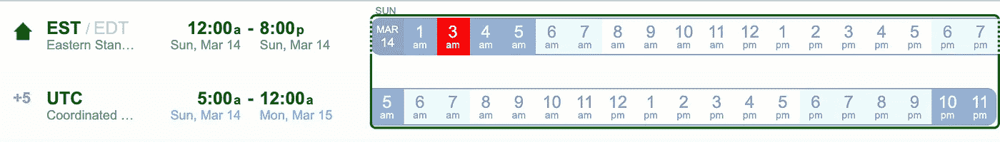
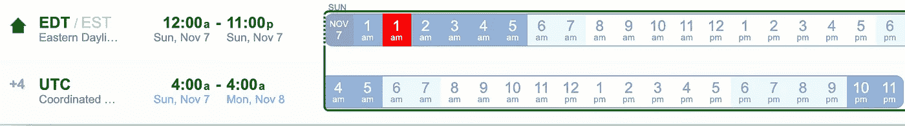

# 为什么 DST 是数据工程噩梦？

> 原文：<https://towardsdatascience.com/why-dst-is-a-data-engineering-nightmare-605a6044ce75?source=collection_archive---------8----------------------->

## 数据/管道所需的钻杆测试和处理概述

亚历山大·里恩在 [Unsplash](https://unsplash.com/s/photos/time?utm_source=unsplash&utm_medium=referral&utm_content=creditCopyText) 上的照片

嘿伙计们！

所以，DST 或夏令时最近结束了，2021 年 11 月 7 日，那天我格外警惕，一直祈祷不要出什么事！在验证 DST 影响时，我想到了写一篇关于 DST 考虑事项的文章，这需要一年两次关注 wrt 管道、数据和作业。

另外，如果你不知道什么是夏令时，不要担心，我会在下面解释，相信我，这将是一个有趣的阅读:)

## 到底什么是夏令时或 DST？

夏令时是一种通过改变标准时间来确保白天有更多阳光的做法。

在初春的某一天(通常在三月)，美国、加拿大和澳大利亚的时区开始采用夏令时。

也就是说，时钟向前拨一小时，一天中跳过一小时。到了那一天，一天将只有 23 个小时而不是 24 个小时，而这就是我的朋友，作为一名数据工程师的麻烦开始了，事实上，除了我以外的任何管道所有者都会遇到这一点。

今年，夏令时从 3 月 14 日开始。

DST 日的美国东部时间 wrt UTC 示例(时区，伙计！):

演职员表:【https://www.worldtimebuddy.com/ 

如果您仔细观察，会发现第 2 小时被跳过，时钟被向前拨。所以在三月，一天会有 23 个小时。在春季和夏季，夏令时导致白天更多的光照，当冬季到来时，时间需要再次标准化。(因为冬天我们晚上很早，夏令时有什么意义呢？)

冬天开始时，DST 结束，时钟被重置为标准时间，这发生在今年的 11 月 7 日，这一天将有 25 个小时:

演职员表:[https://www.worldtimebuddy.com/](https://www.worldtimebuddy.com/)

如果你仔细观察，夏令时结束时，凌晨 1 点发生了两次，所以一天有 25 个小时，但仍然有 24 个小时(*再读一遍*)。

好了，已经非常详细地解释了什么是夏令时，让我们来谈谈为什么它很糟糕！(是的，我说了)

## 夏令时如何影响数据？

当夏令时开始(3 月)和结束(11 月)时，在那些日子里，一天不会有标准的 24 小时。因此，在那些日子里，任何标准的处理、检查或比较都可能不起作用。下面列出了一些影响场景:

让我们从数据质量检查开始，假设您对原始数据进行检查，每天应该有 24 小时，否则数据被认为是“坏”的，即如果一天只有 24 小时的数据，那么它将被处理/质量良好/完整。

现在，当 DST 开始时，如上所述，一天将有 23 个小时，这样的 24 小时数据检查将失败。为了处理这个问题，可能需要进行特殊处理。

数据质量故障的另一个例子是“丢失数据警报”,或者当某个小时的数据丢失时发送警报。在 DST 开始的那一天，警报可以发送 2 小时(跳过这一小时),可能需要特殊处理。

阈值检查通常是在数据量超过某个值时发送的警报，现在，在 DST 结束的当天，凌晨 1 点的数据实际上将包含两个小时的数据(*为了清楚起见，请再次参见上图*)，全天将包含 25 个小时的数据，因此再次对计数/数据量等进行阈值检查。可能会失败，需要特殊处理。

我想我已经把你吓得够呛了，现在让我们讨论一些可能需要的逻辑和报告处理。

如果您的逻辑需要前一个/后一个小时的数据来进行任何计算，则需要对 DST 开始和结束日进行特殊处理，以便在凌晨 1 点后的 3 月份，凌晨 3 点是下一个小时，而不是凌晨 2 点。同样，在 11 月，凌晨 1 点也是凌晨 1 点后的下一个小时。

此外，对于 11 月的这 25 个小时，您在任何报告中进行的任何比较，如一小时一小时的比较、一天一天的比较，都可能会显示更高的数字(*，除非您决定放弃一个小时的数据，但不建议这样做*

另一个影响领域是时间安排影响。如果您计划特定时区的作业/管道，则 DST 计划或 SLA 时间可能会受到影响。一定要仔细检查。

我的建议是，如果不需要，不要在特定的时区运行管道，而要在 UTC 运行。对于最终的可交付数据，当然要进行时区转换，但至少在所有地方，UTC 总是一致的。

嗯，就这样吧！这是我现在能想到的所有影响。如果您有任何其他我没有注意到的考虑因素或影响，我很乐意知道。请留下你的评论。

希望这有所帮助！

快乐编码，
JD