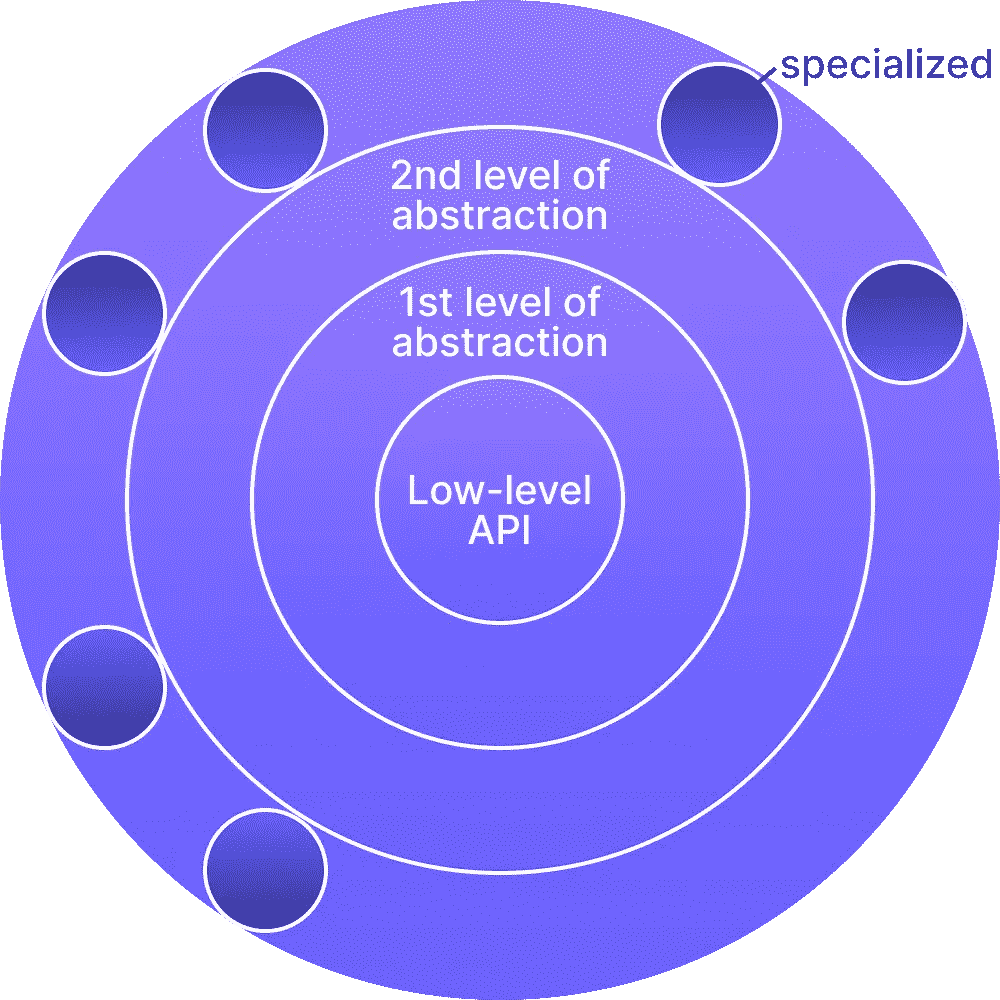

# 为什么 ETL 需要开源来解决集成的长尾问题

> 原文：<https://towardsdatascience.com/why-etl-needs-open-source-to-address-the-long-tail-of-integrations-5394c058c326?source=collection_archive---------23----------------------->

## 去年，我们的团队采访了 200 多家公司，了解他们的数据集成用例。我们发现的是，2021 年的数据整合还是一塌糊涂。

# 不可逾越的现状

在 200 次采访中，至少有 80 次采访了现有 ETL 技术的用户，如 Fivetran、StitchData 和 Matillion。我们发现他们每个人都在构建和维护他们自己的连接器，即使他们使用的是 ETL 解决方案(或者 ELT 解决方案——为了简单起见，我只使用术语 ETL)。为什么？

我们发现了两个原因:

1.  连接器的不完全覆盖
2.  围绕数据库复制的重大摩擦

## 无法满足所有连接器需求

许多用户的 ETL 解决方案不支持他们想要的连接器，或者支持但不是以他们需要的方式。

举个例子:Fivetran 已经存在了八年，支持 150 个连接器。然而，仅在 martech 和 adtech 这两个领域，就有超过 10，000 种潜在连接器。

ETL 最难的部分不是构建连接器，而是维护它们。这是昂贵的，并且任何闭源解决方案都受到 ROI(投资回报)考虑的限制。因此，ETL 供应商关注最流行的集成，然而公司每个月使用越来越多的工具，连接器的长尾被忽略了。

因此，即使使用 ETL 工具，数据团队仍然要投入大量的金钱和时间来构建和维护内部连接器。

## 无法解决数据库复制用例

大多数公司将数据存储在数据库中。我们的采访揭示了现有 ETL 提供的数据库连接器的两个重要问题。

1.  **基于容量的定价:**数据库非常庞大，并且服务于不断增长的数据量。拥有数百万行的数据库，目标是服务于数亿行，这是常见的情况。当前 ETL 解决方案的问题是基于数量的定价。员工只需点击一下鼠标，就可以轻松复制一个数百万行的数据库。而这个简单的点击可能要花费几千美元！
2.  **数据隐私:**随着当今对隐私和安全的关注，公司越来越重视对数据的控制。现有 ETL 解决方案的架构通常会将数据从公司的私有云中提取出来。闭源产品阻止公司仔细检查底层 ETL 代码/系统。能见度降低意味着信任度降低。

这两点解释了为什么公司最终要建立额外的内部数据库复制管道。

## 无法随数据扩展

上面提到的关于基于数量的定价和数据隐私的两点也适用于公司规模。对于公司来说，拥有一个内部的数据工程师团队来构建 ETL 解决方案中维护的完全相同的管道变得更加便宜。

# 为什么开源是唯一的出路

开源解决了上面提到的许多问题。这就是开源带给我们的。

*   **定制的权利:**访问并能够根据自己的需要编辑代码是开源软件带来的一项特权。例如，如果 Salesforce 连接器缺少您需要的一些数据，该怎么办？有了开源，这样的改变就像提交代码改变一样简单。支持票上不再有长线程！
*   **解决连接器的长尾问题:**您不再需要说服一个专有的 ETL 提供者您需要的连接器是值得构建的。如果您需要一个比平台开发速度更快的连接器，您可以自己构建它，并在大型用户社区的帮助下维护它。
*   **与数据工具和工作流更广泛的集成:**因为开源产品必须支持各种各样的堆栈和工作流，用于编排、部署、托管等。，您更有可能找到对您的数据堆栈和工作流的现成支持(基于 UI、基于 API、基于 CLI 等。)和一个开源社区。其中一些，如 Airbyte 的开源气流运营商，是由社区贡献的。公平地说，理论上你可以用闭源方法做到这一点，但是你可能需要从头开始构建很多工具。
*   **调试自治:**如果您遇到任何连接器问题，您不需要等待客户支持团队回复您，也不需要等待第三方公司优先考虑您的修复。您可以自己解决问题。
*   **现成的安全性和隐私合规性**。如果开源项目足够开放(MIT，Apache 2.0 等。)，任何团队都可以通过在其基础设施中部署开源代码来直接解决他们的集成需求。

# 连接器开发套件的必要性

但是，开源本身不足以解决数据集成问题。这是因为创建一个强大且功能齐全的连接器的门槛太高了。

例如，考虑一个从 REST API 提取数据的脚本。

从概念上讲，这是对数据库中的一些数据进行简单的“SELECT * FROM entity”查询，可能带有“WHERE”子句，以便根据某些标准进行过滤。但是任何编写过脚本或连接器来持续可靠地执行这项任务的人都知道这要复杂得多。

首先是身份验证，它可以像用户名/密码一样简单，也可以像实现整个 OAuth 流程一样复杂(并安全地存储和管理这些凭证)。

我们还需要维护脚本运行之间的状态，这样我们就不会一遍又一遍地重读相同的数据。

之后，我们需要处理速率限制并重试间歇性错误，确保不要将它们与无法重试的真正的*错误混淆。*

然后，我们希望将数据转换成适合下游消费者的格式，同时执行足够的日志记录，以便在事情不可避免地出错时修复问题。

哦，所有这些都需要经过良好的测试，易于部署…当然，昨天就完成了。

总而言之，目前构建一个新的 REST API 源连接器需要几天的时间。这种进入壁垒不仅意味着社区创建的连接器更少，而且通常意味着连接器质量更低。

然而，我们认为 80%的困难是偶然的，并且大部分可以自动消除。缩短实现时间将极大地帮助社区做出贡献，并解决连接器的长尾问题。如果这种自动化以一种聪明的方式完成，我们也可能能够提高标准化，从而对所有连接器的维护做出贡献。

# 连接器开发工具包是什么样子的

让我们从一个不同的角度再次看看构建连接器所涉及的工作。

附带复杂性:

*   设置包装结构
*   将连接器封装在 Docker 容器中并建立释放管道

大量重复的逻辑:

*   为每种连接器类型(REST APIs、数据库、仓库、Lakes 等)重新设计相同的设计模式和代码结构。)
*   编写相同的帮助器，用于将数据转换为标准格式、实现增量同步、日志记录、输入验证等。
*   测试连接器是否正确遵守协议。

测试[快乐流](https://en.wikipedia.org/wiki/Happy_path)和边缘案例。

你可以看到很多都可以自动化，并且你会很高兴知道 Airbyte 已经提供了一个开源连接器开发工具包(CDK)来完成所有这些。

我们相信，最终，[打造数以千计高质量连接器的方法是在洋葱层中思考。](https://airbyte.io/articles/data-engineering-thoughts/how-to-build-thousands-of-connectors/)为了与 devo PS/基础设施中众所周知的[宠物/牛](https://www.hava.io/blog/cattle-vs-pets-devops-explained)概念进行比较，连接器是牛代码，您希望在它上面花费尽可能少的时间。这将极大地提高生产率。

# 抽象为洋葱层

最大限度地利用高杠杆工作会引导您构建具有洋葱式结构的架构:

*来源:作者*

该中心定义了 API 的最低级别。在那个级别实现一个连接器需要大量的工程时间。但它是非常复杂的连接器的逃生出口，需要大量的控制。

然后，构建新的抽象层，帮助快速处理连接器系列。例如，源具有特定的接口，而目的地具有不同种类的接口。

1.  用于编写源连接器的 Python 框架
2.  快速开发 HTTP APIs 连接器的通用实现
3.  一个测试套件，用于测试是否符合 Airbyte 协议和 happy 代码路径
4.  用于引导开发和打包连接器的代码生成器

然后，对于源，您有不同的种类，如基于 HTTP-API 的连接器和数据库。HTTP 连接器可以分为 REST、GraphQL 和 SOAP，而数据库可以分为关系数据库、NoSQL 数据库和图形数据库。目的地可以分成仓库、数据湖和 API(用于反向 ELT)。

CDK 是这些抽象的框架！

# 什么是已经可用的

Airbyte 的 CDK 仍处于早期阶段，因此预计随着时间的推移会有很多改进。如今，该框架具有以下特性:

最终，CDK 能够在两个小时内构建强大的全功能连接器**,而以前需要两天。**

Airbyte 团队一直在内部使用该框架开发连接器，这是我们开发 70 多个连接器的经验的顶峰(我们的目标是在用户社区的帮助下，到今年年底开发 200 个连接器！).我们从自身经验和用户社区中学到的一切都将用于改进 CDK。

# 结论——未来

将构建一个新连接器所需的时间缩短到 10 分钟，并扩展到越来越多的可能集成系列，这不是很好吗？这是怎样的一个登月计划！

如果我们能够和我们的用户社区一起做到这一点，那么最终集成的长尾问题将会很快得到解决！更不用说数据集成管道将通过开源被商品化

如果你想参与进来，我们希望你加入我们的 [Slack 社区](https://slack.airbyte.io)——围绕数据集成最活跃的社区——因为我们为了所有人的利益连接到开源的未来！

*最初发布于*[*https://airbyte . io*](https://airbyte.io/blog/why-etl-needs-open-source-to-address-the-long-tail-of-integrations)*。*