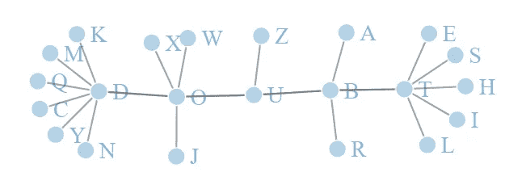
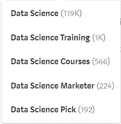

# 为什么每个数据科学家都应该有冒名顶替的想法

> 原文：<https://towardsdatascience.com/why-every-data-scientist-should-have-imposter-thoughts-bdcbdb0e5578?source=collection_archive---------49----------------------->

## 自我怀疑会有一些好处

冒名顶替综合征是指尽管取得了成功或成就，但有人一直怀疑自己的能力。与之相反的是[邓宁-克鲁格](https://en.wikipedia.org/wiki/Dunning%E2%80%93Kruger_effect)效应，在这种效应中，能力低下的人对自己的能力过于自信。找到自信和技能之间的平衡很重要，但有时有很好的理由产生冒名顶替的想法(而不是完全的冒名顶替综合症)。 [Basima Tewfik 对医生、投资分析师和 ROTC 学员进行了研究](https://repository.upenn.edu/edissertations/3603/),发现冒名顶替的想法有助于激励人们掌握技能，并[改善工作中的人际关系表现](https://ideas.wharton.upenn.edu/research/imposter-syndrome-unexpected-benefits/#:~:text=We've%20all%20heard%20about,know%20it's%20a%20bad%20thing.&text=The%20syndrome%20involves%20feeling%20inadequate,that%20others%20overestimate%20your%20abilities.)。总体结果喜忧参半，但发现了这些冒名顶替思想的积极用例。

由作者用 R. Image 中的 networkD3 包创建

对于数据科学家来说，很容易将自己与他人进行比较，并认为尽管你学习了编程、统计等更多知识，但你不配拥有这个头衔，因为其他人做得更多。如果你有这些想法，你可能是正确的。

作者截图

(截至 2021 年 3 月)媒体上有 119，000 篇带有数据科学标签的文章。之前的[分析](https://baditaflorin.medium.com/inside-the-top-1000-tags-on-medium-com-part-1-a1ff96356639)显示，平均每篇文章 3.3 分钟，仅在介质上就产生了大约 272 天的数据科学阅读材料。这有点奇怪，因为在他们的工作领域没有人会阅读所有的文章，但数据科学有些不同，因为专业化不一定对一个人的数据科学职业生涯有利。

# 你应该时不时地对自己的知识广度产生错觉；否则你的知识可能会过时。

在过去的一年里，我专注于模型可解释性技术和模型偏差分析。大多数相关研究不到 5 年，大多数有用的[开源包](https://medium.com/responsibleml/r-packages-for-explainable-artificial-intelligence-7b3536423d2b)不到 3 年，并且每年更新多次。因此，尽管我在 2017 年参加了研究生课程，但除了线性回归系数和总体变量重要性图之外，我对模型解释能力的了解有限，因为当时文献很少。为了抵消我的冒名顶替的想法和疑虑，我做了以下事情:

*   花时间阅读文章，享受学习新概念的过程(亚当·格兰特在他的书[中讨论了犯错的快乐](https://www.adamgrant.net/book/think-again/)
*   开始与其他同事讨论数据科学，并定期召开会议讨论与特定项目无关的数据科学
*   一旦完成对一个模型偏差的分析，我们得出结论，该报告尽我们目前的能力评估偏差，但随着新的文献出现和我们能力的提高，我们将继续评估偏差

数据科学的知识库快速增长，数据科学的工具库快速增长。许多有抱负的数据科学家问“我应该为数据科学学习什么编程语言？”虽然 python、R 和 SQL 在过去的十年里仍然是[顶级编程语言](/programming-languages-for-data-scientists-afde2eaf5cc5)，但是还有许多其他语言可能需要成为你的工具包的一部分。你可能需要学习 ETL 工具、管道工具、机器学习特定编程语法、大数据[工具](/best-data-science-tools-for-data-scientists-75be64144a88)，或者可视化软件。一些公司是“谷歌商店”、“微软商店”、“AWS 商店”，或者另一种类型的“商店”，其中使用的大多数工具和产品来自一家公司。

# 你应该对你的数据科学技能有冒名顶替的想法；否则，您可能会掌握过时工具的技能。

在一家公司，当我听说我们要采用 Hadoop 时，我主动要求用它做额外的项目。我的动机一部分是出于真正的兴趣，另一部分是出于恐惧。我知道，如果我不具备这种技能，我未来的晋升或其他工作的前景都会受到限制。当我们采用 Teradata Aster 时，也发生了同样的过程。冒名顶替的想法激发了我学习新技能的动力，最终帮助我找到了一份数据科学家的工作。最近，我担心我没有做足够的工作来学习新的技能，这些技能可能会在未来与我的工作相关。

冒名顶替思想可以用于激励，可以用于自我和整体评价。一个冒名顶替者认为“我的工作无关紧要”的想法可以转化为“什么工作重要？”或者“我怎样才能最好地利用我的时间？”

# 你应该对你工作的重要性有错误的想法；否则，你可能不会优先考虑最重要的工作。

我喜欢听到图像处理神经网络的最新进展，但我的大部分工作都没有涉及任何图像。有时我觉得自己是一个失败的数据科学家，不擅长图像处理的机器学习和学习最新的发展。当我想到这些想法时，我会做以下事情:

*   我承认这不是我目前工作的重点
*   我定义了我在图像处理之前优先考虑的其他工作
*   我不排除将来继续这样做的可能性

我没有学习图像处理，而是专注于以下几个方面:

*   能够向没有数据科学背景的人解释数据科学工作
*   展示数据科学项目的投资回报率，以及如何将它们与备选基准进行比较

判断改进可能会令人沮丧，因为这些是软技能，但它们对当前业务更重要。

如果你曾经觉得自己是数据科学领域的骗子，你并不孤单。试着用这些想法作为动力，同时保持平衡，不让冒名顶替的想法伤害你的生产力和精神健康。

*这篇文章的灵感来源于:*
[扶手椅专家播客插曲与亚当·格兰特](https://armchairexpertpod.com/pods/adam-grant-returns)
[心态作者卡罗尔·德韦克](https://www.amazon.com/Mindset-Updated-Changing-Fulfil-Potential/dp/147213995X/ref=pd_lpo_14_t_0/135-4551732-4032112?_encoding=UTF8&pd_rd_i=147213995X&pd_rd_r=3eb02b21-f9ec-4fb7-ad9f-c47fda44f28c&pd_rd_w=S1nDR&pd_rd_wg=A6F1Q&pf_rd_p=16b28406-aa34-451d-8a2e-b3930ada000c&pf_rd_r=FY3A7DW34H4VKA5V0GFW&psc=1&refRID=FY3A7DW34H4VKA5V0GFW)

*脚注:*
一个替代方案是零怀疑地学习 COBOL，并且相信系统变化缓慢。这个[策略可能会奏效](https://cacm.acm.org/news/244370-cobol-programmers-are-back-in-demand-seriously/fulltext)。