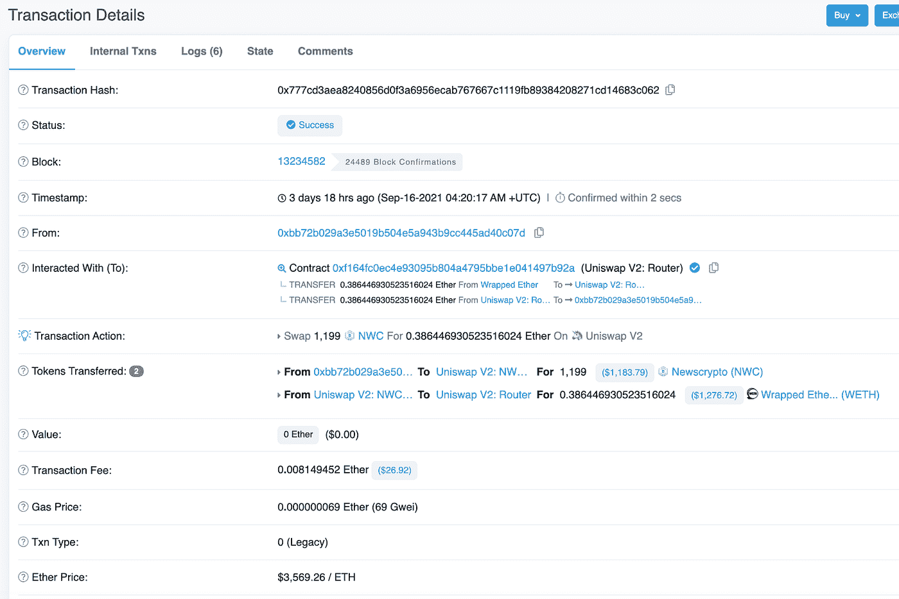
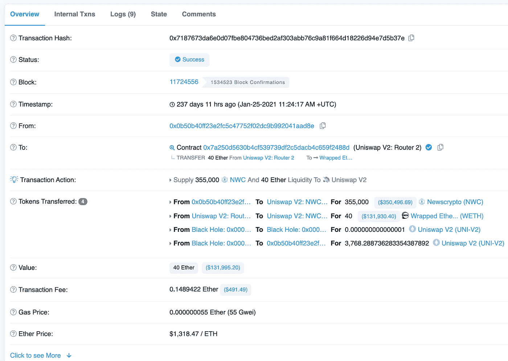

# 为什么每个数据科学家都应该关注加密

> 原文：<https://towardsdatascience.com/why-every-data-scientist-should-pay-attention-to-crypto-39b4c25ff319?source=collection_archive---------6----------------------->

## 提示:事情不是你想的那样

[Zoltan·塔斯](https://unsplash.com/@zoltantasi?utm_source=medium&utm_medium=referral)在 [Unsplash](https://unsplash.com?utm_source=medium&utm_medium=referral) 上的照片

与你可能会想的相反，我在这里不是要告诉你，你可以使用机器学习来找出哪个由迷因启发的加密令牌即将爆发，或者你可以使用基于深度学习的交易策略来生成大量的阿尔法。这些事情可能是真的，但这不是我个人对 crypto 感到兴奋的原因，也不是我认为你也应该兴奋的原因。我的兴奋源于三个事实:

1.  加密正成为消费产品越来越重要的平台
2.  分散的加密应用程序创建了大量精细的、可验证的和公开可用的数据
3.  有效利用这一数据资产是实现加密潜力的关键

我相信这将为加密社区的数据科学专业知识创造一个巨大的机会。

## 术语的快速注释

本文中的 Crypto 特指分散的、支持智能合约的区块链，以及建立在这些区块链之上的应用程序。以太坊和索拉纳·区块链就是这种加密生态系统的著名例子。值得注意的是，比特币区块链并非如此，因为在构建智能合约应用时，它的功能有限。如果这听起来对你来说很陌生，我所指的简单心智模型是一个生态系统，其中区块链充当分布式计算后端，其状态由网络上参与者的共识驱动，这些后端通过智能合约用于构建面向用户的应用程序。

# 加密正成为消费产品越来越重要的平台

当观察加密空间时，很难不把令牌价格的剧烈波动和无数由迷因激发的项目视为一个没有实际价值的巨大投机赌场。在某种程度上，这是真的。然而，这分散了我们对底层技术的注意力，而底层技术具有巨大的潜力来实现下一代消费者应用。正如许多人比我更雄辩地指出的那样，区块链支持的去中心化应用程序可能为我们今天拥有的消费应用程序相关的许多问题提供有效的解决方案。特别是，少数强大的平台，如脸书和谷歌，对消费者的数字生活拥有有效的垄断控制。他们可以选择以相当任意的方式进行审查，为自己的利益服务——甚至损害用户的利益。他们还从生态系统中攫取了几乎所有的经济价值，牺牲了创造大部分价值的参与者的利益。

分散式区块链网络提供了一个分布式计算框架，任何人都可以使用它来构建面向消费者的分散式应用程序，从而实现了一个不同的范例。这些应用程序，也称为 dApps 或智能合同，在区块链上透明地运行和执行，并提供框架来消除中间人，并将治理和经济价值放回参与生态系统的消费者和生产者手中。

如果这听起来像是一个遥不可及的理想，那它在今天基本上就是了。仍然有许多性能、治理和简单的实现问题需要解决。这个[网站](https://rekt.news/)提供了一个有趣的视角，展示了构建加密应用的各种失败尝试。然而，它也不可否认地获得了牵引力，许多 dApps 实现了真正令人印象深刻的规模和在各种消费领域的采用。例如

1.  [Uniswap](https://docs.uniswap.org/) ，以太坊区块链的一个分散式交易所，允许用户在没有集中做市商或集中平台托管资产的情况下交易加密货币。截至本文撰写之时，它每天的交易额约为 15 亿美元，约为比特币基地中央加密货币交易所[4]的 40%，该交易所可以说是美国最受欢迎的加密货币交易所。
2.  [Opensea](https://opensea.io/) ，一个主要在以太坊和多边形区块链上运营的市场，允许用户发现和交易 NFT(独特数字资产的所有权)。2021 年 8 月，约 22 万用户交易了总价值约为 35 亿美元的 NFTs。为了提供一个相对的规模感，Etsy 和 EBay 在整个 Q2 2021 年分别完成了约 10 亿美元 3B 和 2 20 亿美元总交易额[6]。单看 8 月份，Opensea 已经超过 Etsy，规模大约是 EBay 的一半，这对任何市场来说都是令人印象深刻的，不管是不是去中心化的。

这些应用程序，以及许多其他应用程序，如音乐领域的 [Audius](https://audius.co/) 和游戏领域的 [Axie Infinity](https://axieinfinity.com/) ，显然正在拓展消费产品的界限。我甚至认为，它们中的许多已经是重要的消费产品，拥有大量忠实的用户基础，尽管它们有许多粗糙的边缘。我们仍处于采用和增长曲线的起点，随着区块链技术的不断改进，我相信我们会看到越来越多的这种分散式消费产品出现并蓬勃发展。

# 分散的加密应用程序创建了大量精细的、可验证的和公开可用的数据

与传统应用程序相比，分散式应用程序的一个非常显著的特征是它们的数据耗尽。由于区块链技术的性质，许多最重要的用户操作都被透明地记录在区块链账本上。以 Uniswap 为例，人们可以很容易地看到每一笔加密货币交易的细节，就像这样

[一笔 uniswap 交易，在 Etherscan 上用约 0.386 以太币兑换了 1，199 枚 NWC 代币](https://etherscan.io/tx/0x777cd3aea8240856d0f3a6956ecab767667c1119fb89384208271cd14683c062)

…人们还可以看到何时创建了特定的交易对，以及有多少流动性可用于交易。

[在 Etherscan 上创建 Eth-NWC 交易对库](https://etherscan.io/tx/0x7187673da6e0d07fbe804736bed2af303abb76c9a81f664d18226d94e7d5b37e)

实际上，Uniswap 产品中的每一项创造价值的活动都是公开和透明的，因为它们正在发生，对于任何知道在哪里和如何寻找的人来说都是如此。这些记录也是可独立验证的，并且在块确认之后不能(或者难以置信地难以)被任何人更改。这适用于构建在区块链上的所有分散式应用程序，不管经济活动的单位是什么。可以是一笔交易，也可以是一首歌的流，甚至可以是游戏中某个头像的一击。这代表了一种与我们今天所知的产品截然不同的范式，在我们今天所知的产品中，你最多只能从上市公司获得汇总指标，在后的四分之一*价值创造活动已经发生。而在私人公司的情况下，通常根本没有可见性。*

随着越来越多的加密消费者应用程序获得牵引力，越来越多的公开数据将从根本上改变下一代产品的竞争和运营方式。

# 有效利用这一数据资产是实现加密潜力的关键

想象一下，如果 Robinhood 的所有粒度交易数据都是公开的。那意味着什么？这将损害罗宾汉的订单流付费商业模式，该模式占其收入的绝大部分。同样，对于脸书的消费者数据来说，如果它是公开的，他们将无法像今天这样赚钱。

如果我们认真思考这个问题，我们今天使用的许多平台公司通过消费者和生产者对数据和分销渠道的专有访问权从中渔利。一个透明的数据生态系统，就像 dApps 在区块链建立的那样，几乎不可能以这种方式进行寻租。这仅仅是因为任何拥有适当专业知识的人都可以访问这些数据，使用这些数据来发现这样一个事实，即一些产品或服务提取的价值超过了它提供的价值，并建立一个更好的替代方案来获取这些价值并消除低效率。这类似于股票市场中的套利概念，在股票市场中，由于相当透明和标准化的数据，每一个免费赚钱的机会都将被利用和消除。我认为，如果在消费者应用领域这是真的，我们实际上会有更大的责任，更公平的竞争，更好的产品，以及对消费者和生产者更公平的价值分享。

如果所有这些听起来很抽象，请允许我提供一个更具体的例子。NFT 加密交易所 OpenSea 的首席产品官最近被要求辞职，因为 OpenSea 的一个用户发现，在 OpenSea 在其网站上推广 NFT 之前，他通过购买 NFT 不公平地获利[7]。对于 OpenSea 和更广泛的加密应用生态系统来说，这无疑是一个成长的烦恼。然而，这也是一个深刻的，尽管很小的例子，说明了数据透明如何导致对坏人的问责，否则他们就会逍遥法外。一个有事业心的人，不管她是否意识到，做了一些出色的数据科学来弄清楚发生了什么，并敲响了警钟。这些数据的用途不仅限于发现坏演员。由于对每一个 NFT、Opensea 平台上的每一笔交易以及交易机制在区块链上是如何实现的有了充分的了解，如果 Opensea 不能为其收取的费用提供足够的价值，就很有可能创造出竞争对手的产品。这就产生了一种问责机制，确保消费者的利益得到照顾。当然，这一切都取决于对数据资产的有效理解和利用。

作为一名数据科学家，这感觉非常令人兴奋，就像某种潜在范式转变的开始。很明显，数据透明是羽翼未丰的加密生态系统的一个关键特征，也是帮助平台真正更好地为消费者服务的一个重要工具。数据科学从业者将有机会甚至有责任创造这种新的透明度和问责制范例。只有让加密数据变得更容易访问和标准化，我们才能利用这些见解来帮助构建未来。

在接下来的几篇文章中，我将分享更多关于如何使用智能合同数据的细节，包括数据结构概述、如何获取数据、使用数据的工具以及一些深入分析示例。如果你想了解更多，请关注我的**和* [*推特*](https://twitter.com/yifei_huang) *，这样你就可以在我发表下一篇文章时获得最新消息。**

*如果您有任何意见或问题，请随时联系我们。 [*推特*](https://twitter.com/yifei_huang) *|* [*领英*](https://www.linkedin.com/in/yifeihuangdatascience/) *|* [*中*](https://yifei-huang.medium.com/)*

*参考*

*[1] [从 Web 1.0 到 Web3:这些年来互联网是如何发展的](https://hackernoon.com/from-web-10-to-web3-how-the-internet-grew-over-the-years-zac032g1)*

*[2] [开放元宇宙的价值链](https://www.notboring.co/p/the-value-chain-of-the-open-metaverse)*

*[3] [互联网 3.0 和(科技)历史的开端](https://stratechery.com/2021/internet-3-0-and-the-beginning-of-tech-history/)*

*[4][https://www . the block crypto . com/data/decentralized-finance/dex-non-dependency](https://www.theblockcrypto.com/data/decentralized-finance/dex-non-custodial)*

*[https://dune.xyz/yifeihuang/Opensea](https://dune.xyz/yifeihuang/Opensea)*

*[6][https://decrypt . co/79789/opensea-3b-month-ether eum-NFT-sales-Amazon-ebay-etsy](https://decrypt.co/79789/opensea-3b-month-ethereum-nft-sales-amazon-ebay-etsy)*

*[https://twitter.com/ZuwuTV/status/1437921263394115584](https://twitter.com/ZuwuTV/status/1437921263394115584)*