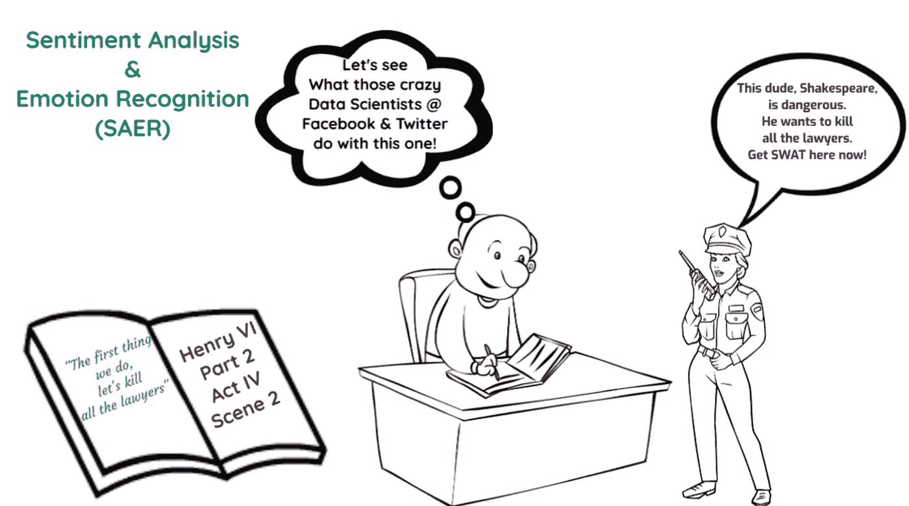

# 为什么今天每个社交网络都会禁止莎士比亚&报告他是危险的颠覆分子！

> 原文：<https://towardsdatascience.com/why-every-social-network-today-would-ban-shakespeare-report-him-as-a-dangerous-subversive-3e86d1774ec3?source=collection_archive---------43----------------------->

## 浅析情感分析和情感识别

版权 2021，作者保留所有权利

# 想象

想象一下，当一位名叫威廉·莎士比亚的新剧作家写的以下帖子进入他们的系统时，基于当今社交网络中使用的基于情绪和情感的人工智能算法会发生什么:

> “我们要做的第一件事，就是杀掉所有的律师。”#法律#律师#杀手律师

善良的老威尔正试图为他的新剧《亨利六世》制造轰动，(当然是自己出版的，因为没有出版商或文学代理人会回复他的询问信。)

各种各样的社交网络算法会首先选择“杀死”这个词，然后分析整个陈述。算法会得出结论，这是一种明显的仇恨“情绪”，莎士比亚在传播危险的言论。毫无疑问，他将被禁止，并可能因鼓吹谋杀而向警方报案。

# 情感分析和情感识别

T 对于那些没有沉浸或不熟悉情感分析科学的人来说，必须考虑三个基本的子因素&情感识别(SAER)。我不打算对机器学习(ML)、自然语言处理(NLP)、模式识别(PR)、深度学习(DL)或现代人工智能(AI)的任何其他无数结构进行广泛的描述——所有这些都影响着 SAER。这些主题需要清晰的学术写作和研究，而媒体不是这类文章的地方。

当接近 SAER 时，我将在一段时间内处理的三个基本子类别分成短文(并基于本文末尾列出的我的学术文章)如下:

1.  分析在上下文中所写和张贴的内容。
2.  对背景的深入探究
3.  需要分析的不仅仅是“文本”，因为我们的世界已经采用了许多沟通模式，包括表情符号、视频、故事、图片和语音。

这篇文章旨在阐明第一部分的难点——分析文章内容。人们需要理解数据科学家、由此产生的算法以及试图分析被评估帖子的含义的公司所面临的问题。

# 获得精确定义的困难

对许多人来说，“情感分析”(SA)和“情感识别”(ER)——SAER——这两个术语听起来似乎与一些当代心理学理论有关，而不是 NLP 旗下的一种对话和表情分析方法。然而，让这一技术探索领域如此迷人的是，它试图设计的基于规则的系统是基于心理反应的。

使用数据科学将人类互动和行为的心理转化为比特和字节不是一项简单的任务——语气的任何波动或使用补充词或其他形式的交流来描述情绪或情感都可能导致意义的剧烈变化。

大多数陈述、声明或对话通常会涉及一些情感或情绪表达，无论交付方式如何。解释这些表达式，以便分析数据系统可以通过它们的字典、规则和定理吸收这些信息，这对任何有组织的系统的成功都是至关重要的。

SAER 的实际定义仍然存在争议，尽管对这种数据的计算分析已经存在了几年。根据维基百科，SA 也被称为“观点挖掘或情感人工智能”这个定义是误导性的，**因为它混淆了情绪和情感**——这是一个重要的细节，因为 SA 和 ER 需要截然不同的分析形式。许多学术文章提出了数学公式和决策树，得出了 SA 的一个基本的，可能是原始的性质。

将 ER 视为 SA 的一个组成部分将导致基于相同参数和算法的所呈现的分析包含情感和情绪。但是，SA 和 er 应该 ***而不是*** 合并成一个实体。相反，SA 和 ER 是离散模型，在数据分析中使用时必须加以区分。忽略两者之间的差异，任何分析通常会导致误导或错误的解释。

# 进退两难

为了更好地理解“情感”和“情绪”之间的区别，快速浏览一下它们各自的定义是很有见地的。“情绪”的定义是:

> “一种情感的意识状态，在这种状态中体验到快乐、悲伤、恐惧、仇恨等，区别于意识的认知和意志状态。”
> 或:
> “一种有意识的心理反应(如愤怒或恐惧)，主观感受为通常针对特定对象的强烈感觉，通常伴有身体的生理和行为变化。”⁴

与此同时，“情绪”更难定义:

> 对某事的态度；关注；观点；精神上的感觉；情感:怜悯的情绪；优雅或温柔的情感；更高或更精致的感情的表现；在文学、艺术或音乐中表现或表达感情或情感，或唤起温柔的情感；受感觉或情感影响或源于感觉或情感的思想；意图通过语言、行为或手势传达的思想或感情，区别于语言、行为或手势本身。⁵
> 或
> ‘由感觉引发的态度、想法或判断:偏好……特定的观点或观念:意见’。⁶

在一篇关于这个话题的有说服力的文章中，Nada Allouch 对情绪和情感之间的区别定义如下:

> 第一种[情感分析]使用简化的二元分类，而第二种[情感识别]依赖于对人类情感和敏感性的更深入分析。这种方法突出了读者表达的不同感情之间的细微差别。[它]是对与每种情绪偏差相关的程度和强度的更细致、更彻底的研究……与情绪分析不同，情绪分析[又名情绪识别]包含并考虑到人类心理主观的不同变化。][它]通常基于广泛的情绪，而不是几个静态的类别。在积极方面，它检测特定的情绪，如快乐、满足或兴奋——这取决于它是如何配置的。情感分析对观众的动机和冲动更进了一步。它提供了有价值的准确见解，很容易转化为行动。'⁷

从出生起，ER 就比 SA 在我们的头脑中更明显，我们的训练包括情感识别和表达。SAER 不是一门有绝对分类的精确科学。许多定义将包括 ML、NLP、DL、PR 以及经常使用和滥用的人工智能术语。如果这还不够，还必须包括词干分析、词汇化、分类、蕴涵、语义相关、语义文本相似性和释义检测，这只是 NLP 和 ML 保护伞下的一些科学。

虽然上述定义是合法的，值得包含在任何彻底的描述或试图为 SAER 建立一个精确的描述中，但数据科学家，理论家和社交网络大师们仍然在 SAER 可以利用任何分析的内容和方式上存在分歧。

许多已发表的工作集中在 Twitter 上，试图评估积极或消极的方面和推文的语气。虽然这是一个起点，但在任何情况下，它都没有涵盖 s a 的基本元素，也没有涵盖它在理解其客户和成员方面能够为几乎任何企业、组织或社交网络提供的实际能力。

在数据科学家中，对于 SAER 的确切定义仍然明显缺乏共识。事实上，花几天时间查看期刊、书籍和互联网文章，找到 SA 和 ER 的不同和分层的描述是可能的。

# 为什么情感和情绪的区别很重要？

这有什么关系？谁在乎呢。将术语或对话归类为情绪或情感对数据分析、营销或任何技术的未来会有什么不同？

如果有人发布*“我爱我的孩子”，*SAER 的算法很简单。这种说法不需要大量的科学知识就能知道信息表达了父母对孩子的情感。

**然而，区分情绪和情感可能是营销中最重要的区别之一。**当客户表达“我讨厌你的产品”这样的情绪时，改变这种情绪不仅具有挑战性，而且往往是浪费精力和资金。投资回报率(ROI)会让这种努力成为泡影。情绪是微妙而不可预测的，但却是人类本性的一部分。他们不容易通过直接呼吁或营销活动来改变自己。一个人所能期望的最好结果是解释为什么产品会成为讨厌的对象，帮助计划改进产品。

像“顾客服务很糟糕”这样的情绪，不同于直接的情绪，会有反应和改变。理解这句话出现的上下文并不是一项挑战性的任务。客户面临的问题需要注意使用适当的营销来改变客户的情绪。

在实现 SAER 时，**上下文变得决定性，SA 与 ER 的分离至关重要**。构成分析系统的计算机算法、数学公式和决策树必须理解一个陈述的表达是什么、为什么、如何以及在什么情况下发生的。当听实时人类对话时，人们的大脑也会考虑这些问题。

一个使用 Twitter 的例子是相关的，因为公司以近乎痴迷的冲动挖掘推文。因此，如果一个用户在推特上说:“我讨厌这个产品”，从首席执行官到初级营销人员都会崩溃。诸如“为什么？”之类的问题以及“这个人是谁？”电子邮件和短信会以令人眩晕的速度飞来飞去，要求员工找到推文的潜在原因。

为什么？因为一旦推文飞入电子媒体的以太网，算法、数据存储和公式就会接管，创建一个分析，无疑会将该帖子标记为“高度有害”。用营销术语来说，这意味着不可接受的失败。

与此同时，系统可能会看到推文:“问题解决了，但真是一团糟！”或者“我喜欢这个产品，但是他们把上一个版本搞砸了”，但是不要把他们看作是对现有问题的标记。系统将看到的是“问题已解决”的决定因素——所有其他的都变成了噪音。或者，产品的“爱”有一个明确的表达，我们都知道爱是最终的情感。

什么乱七八糟的？发生了什么事？它没有上下文，所以谁知道呢？谁在乎？上一个版本发生了什么让客户表达了否定？最新版本的哪个部分有问题？什么不起作用？(最好的例子之一是浏览谷歌 Play 商店上的用户评论，因为公司经常竭尽全力回应不满意的客户，并将他们的负面评论放在某种背景下。)

当系统看到积极情绪时，它可能会在分析过程中忽略潜在的消极情绪和上述问题。然而，“混乱”和“消极”**确实很重要**。尽管环境仍然至关重要，但同一客户现在对产品和公司有着复杂的情感。

对于营销人员来说，这恰恰是公司应该担心的客户类别。已经决定讨厌该产品的顾客(明显的情绪反应)会去找它的竞争对手。然而，表达负面情绪的顾客有潜在的情绪反应**，这是可以改变的**。这个客户是市场营销应该瞄准的目标，以创造一个积极的产品认知。

**区分情绪和情感对于其市场营销、客户维系和与客户保持一致的员工队伍的持续生存至关重要。几乎每个部门都会感受到 SAER 的影响，明白在应对不同情况时，他们是在处理情绪还是情感。**

# 威廉·莎士比亚真的是颠覆者吗？

T 何行，*“我们做的第一件事，让我们杀光所有的律师”，*是莎士比亚的经典。虽然它不包含“仇恨”一词及其任何同义词，但它似乎通过呼吁观众杀死律师来表达对律师的厌恶情绪和仇恨情绪。随着这个“杀死”的呼叫，我们的 SAER 算法将分析情绪，并得出结论，这是源于仇恨的情绪。莎士比亚的情感被解释为一种会被认为是对谋杀和可能是仇恨犯罪的呼唤的情感！

然而，在总结莎士比亚这句话的真正含义之前，请考虑以下几点:

> 我们都听说过这句话:“我们要做的第一件事，就是杀掉所有的律师”。莎士比亚写于 1598 年(亨利六世，第二部分),今天人们仍在说这句话……杀死所有的律师无疑是一句挑衅的话。除了那些研究这类事情的人，这条线一点也不令人震惊。事实上，这是一个很好的老式笑话。蒙特利尔约翰·阿博特学院的英语教授詹妮弗·麦克德莫特博士写了一篇关于莎士比亚的论文，她说:“在今天的世界里，许多人可以从吟游诗人口中说出一两句话来赢得社会声誉，但很少有人意识到这句话本身的全部含义。”。其中最臭名昭著的是“我们要做的第一件事，让我们杀了所有的律师。”'⁸

***等着瞧***——通过理解莎翁写这句台词时针对的是谁，意思是 flips⁹；**语境把仇恨变成笑话**。如果有人把这条线穿过 SAER，ER 可能会把它贴上仇恨的标签。SA 可能会更亲切一点，称之为深度厌恶。

一家律师事务所的公共关系部门会将这位潜在客户标记为不成功的客户。但是，如果它像最初打算的那样，被当作一个笑话来使用，那会怎么样呢？甚至有可能是另一个律师写的谦逊的信？谁会知道呢？该算法如何对这一陈述进行分类？急诊室是什么？SA 是什么？

算法中的多数共识和词汇可能导致错误的结论。想象一下，这句话来自一条推特(而不是莎士比亚),然后出现在全球成千上万的转发中——每个接收者会如何理解它？一个笑话还是反对法律体系的号召？**语境为王。不考虑上下文，有人可能会发动军队杀死所有的律师。**

# 其他关键因素

现在我们可以松一口气，让自己继续阅读，用莎士比亚的天才教育我们自己和我们的孩子，并在上下文中理解他的幽默。没必要报警，也没必要给他贴上伟大剧作家的标签。

正如开始时提到的，在接下来的两篇文章中，我将通过以下内容来处理 SAER 的更深层次的复杂性:

*   对背景的深入探究
*   需要分析的不仅仅是“文本”，因为我们的世界已经采用了许多沟通模式，包括表情符号、视频、故事、图片和语音。

如果你想阅读讨论 SAER 所有这些领域的学术文章，请阅读下面关于如何下载或索取的内容。

与此同时，小心你发布的内容！

Rasheedhrasheed， [CC BY-SA 4.0](https://creativecommons.org/licenses/by-sa/4.0) ，通过维基共享

## 参考资料:

1.  SAER 是作者创造的首字母缩略词。它还没有被 AI 社区接受。
2.  Alaoui，IE，Gahi，y .、Messoussi，r .、Chaabi，y .、Todoskoff，A .和 Kobi，A. (2019)“大社会数据情感分析的新型适应性方法”，《大数据杂志》，第 5 卷，可在[https://doi.org/10.1186/s40537-018-0120-0](https://doi.org/10.1186/s40537-018-0120-0)查阅
3.  Dictionary.com(挪威)‘情感’在 https://www.dictionary.com/browse/emotion[可用](https://www.dictionary.com/browse/emotion)
4.  https://www.merriam-webster.com/dictionary/emotion有韦氏词典(挪威)【情感】
5.  Dictionary.com(未标明)‘感悟’可在:[https://www.dictionary.com/browse/sentiment](https://www.dictionary.com/browse/sentiment)获得
6.  https://www.merriam-webster.com/dictionary/sentiment有韦氏词典(挪威)【感悟】
7.  Allouch，N. (2018 年)“情绪和情感分析:绝对差异”，可在[https://www . emojics . com/blog/emotional-analysis-vs-情操分析/](https://www.emojics.com/blog/emotional-analysis-vs-sentiment-analysis/) 查阅
8.  Chisling，A. (2017)“我们要做的第一件事，就是杀掉所有的律师。”等等……什么？为了纪念莎士比亚 453 岁生日(或多或少)，我们来看看他最著名的——也是最常被误解的——语录，网址是[https://medium . com/@ avajoy/the-first-thing-the-this-we-do-let-kill-all-the-lawyers-wait what-B2 CBD 34 c8 f1 f](https://medium.com/@avajoy/the-first-thing-we-do-lets-kill-all-the-lawyers-waitwhat-b2cbd34c8f1f)
9.  芬克尔斯坦，S. (1997)“我们做的第一件事，让我们杀了所有的律师——这是一个律师的笑话”，可在[http://www.spectacle.org/797/finkel.html](http://www.spectacle.org/797/finkel.html)买到

上面的文章是我的原始学术文章的编辑和压缩版本，*“情感分析和情感识别:在数据分类中发展沟通的范式，*，它首次发表在[“应用营销分析”第 6 卷第 1 号，亨利·斯图尔特出版的期刊](https://hstalks.com/article/5691/sentiment-analysis-and-emotion-recognition-evolvin/)。整篇文章的 PDF，可以使用 [ResearchGate](https://www.researchgate.net/publication/349519937_Sentiment_analysis_and_emotion_recognition_Evolving_the_paradigm_of_communication_within_data_classification) 、[谷歌学术](https://scholar.google.com/citations?user=qqEe9UEAAAAJ&hl=en)、 [figshare](https://figshare.com/authors/Ted_Gross/10182179) ，或者直接在 [LinkedIn](https://www.linkedin.com/in/tedwgross) 上联系作者。在所有情况下，如果您引用这篇文章或整篇文章，需要完全归功于原作者。

**关于作者:** Ted Gross 担任 R & D 的 CTO & VP 多年，擅长数据库技术，专注于 NoSQL 系统、NodeJS、MongoDB、加密、AI、创新&混沌理论。他也擅长虚拟世界技术&增强现实。Ted 已经并将继续在专业期刊和在线@ Medium & LinkedIn 上撰写许多关于技术主题的文章。 [**他也是文学小说、儿童书籍和各种非小说类文章的作者**](http://amazon.com/author/tedgross) 。他的短篇小说集，[、*、【古代故事、现代传说】、*、](http://www.amazon.com/Ancient-Tales-Modern-Legends-Collection/dp/1469901714)获得了极好的评价。

可以通过[电子邮件](http://tedwgross@icloud.com)联系 Ted[推特](https://twitter.com/tedwgross)(@ tedw gross)；[LinkedIn](http://il.linkedin.com/in/tedwgross)；[中等](https://medium.com/@tedwgross)