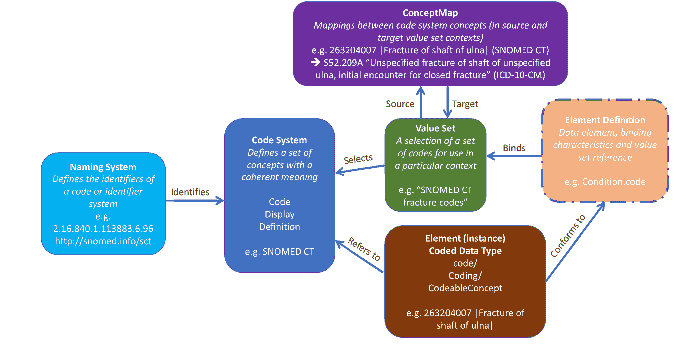
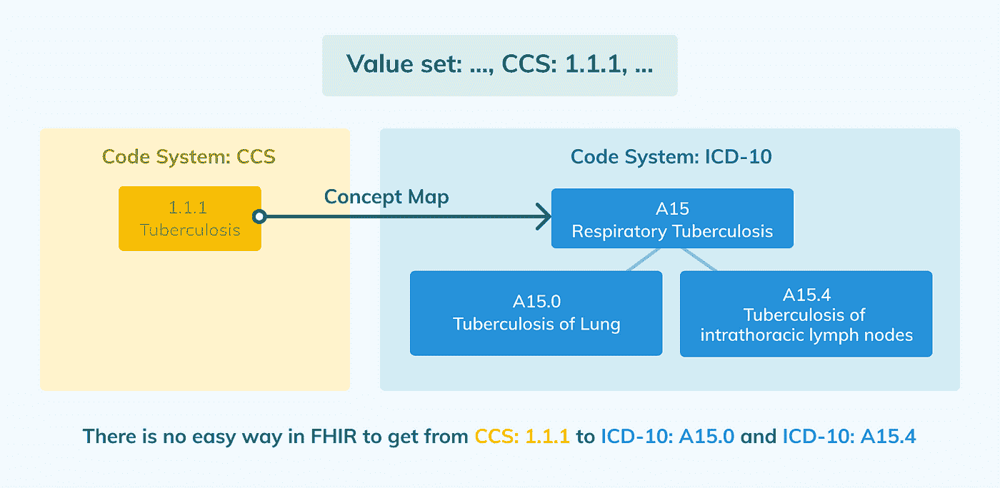
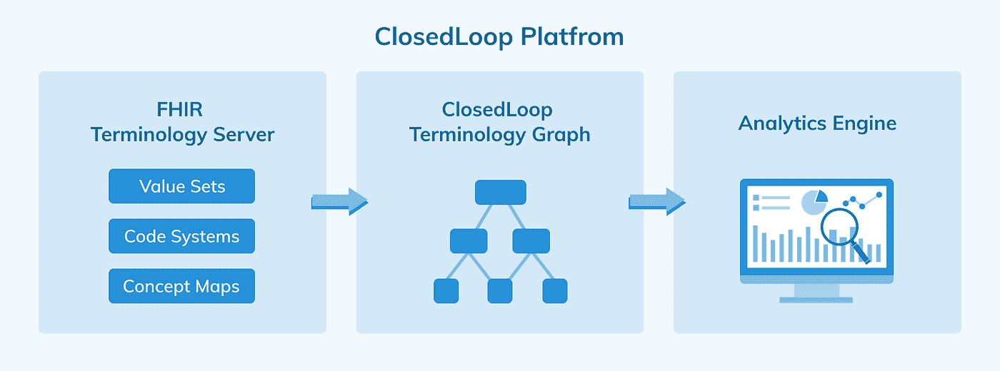

# 为什么他们的术语不适用于分析

> 原文：<https://towardsdatascience.com/why-fhir-terminologies-dont-work-for-analytics-d462103204c1?source=collection_archive---------22----------------------->

## [行业笔记](https://towardsdatascience.com/tagged/notes-from-industry)

## 以及该怎么做

我想谈谈任何医疗保健分析系统的一个重要组成部分——术语。这些是医疗保健数据中普遍使用的诊断、药物、程序、设备和其他医疗保健服务的基础代码。在 ClosedLoop，我们在数据科学平台中维护和利用许多术语。我们发现快速医疗保健互操作性资源(FHIR)——一种描述数据格式和元素的标准，以及一种用于交换健康数据的应用程序编程接口——对于这项任务来说既非常有用，又非常令人沮丧。FHIR 为这些术语提供了一致的结构，这些术语以前通常作为具有不同格式和约定的文件和数据库表来管理。FHIR 擅长管理数据，但不是为分析而设计的。在这篇文章中，我将谈论我们在试图构建一个纯粹基于 FHIR 的术语服务时所面临的一些问题，以及我们如何最终迁移到一种使用 FHIR 来维护和管理源数据的方法，然后在此基础上构建我们自己的术语图来支持分析查询。

# 什么是 FHIR？

FHIR 彻底改变了医疗保健数据互操作性。单纯为了促进医疗数据交换而存在的应用程序需要一种通用语言，而 FHIR 就是这种通用语言。它使苹果健康工具包、CMS BlueButton 等应用程序获得了成功。FHIR 规范的一个完整的小节涉及术语服务，并描述了在整个医疗记录中使用的无数诊断、程序和其他代码如何在 FHIR 中使用。你可能会认为，对于那些对医疗保健数据进行分析的人来说，FHIR 术语会非常有用。使所有代码标准化并可从单个 FHIR 服务器访问可以使构建和维护分析查询更加容易。不幸的是，FHIR 是为互操作性而构建的，它有两个严重的缺点，这使得它很难用于分析。

*图 1: FHIR 术语资源概述。转载自*【http://hl7.org/fhir/2021Mar/terminology-module.html】

*为了理解这些缺点，了解一下术语在 FHIR 中的工作原理是很有用的。如图 1 所示，FHIR 定义了 3 个管理术语的关键资源:代码系统、值集和概念图。毫不奇怪，代码系统是一组独特的代码，是一些受控术语的一部分。ICD-10 诊断代码是一个代码系统，就像 SNOMED 一样，甚至是 FHIR 语言的官方列表。代码系统可以是分层的，因此代码系统中的单个代码可以有子代码。代表“哮喘”的 ICD-10 代码 J45 有一个代表“轻度间歇性哮喘”的 J45.2 的孩子。代码系统本身有一个标识符，所以如果你在 FHIR 中看到一个代码，你就知道它来自哪里。*

*除了代码系统，FHIR 还定义了另外两种资源，值集和概念图。值集定义了可以在特定地方使用的代码组。例如，您可能有一个特定的字段，可以是 CPT 代码或 ICD-10 程序代码。该字段的值集将是这两个代码的组合。概念图定义了代码之间的关系。例如，概念图可以将 RxNorm 概念代码与同该概念相关的 NDC 列表联系起来。*

# *使用 FHIR 进行分析的挑战*

*使用 FHIR 进行分析的第一个主要问题是，代码系统、值集和概念图都定义了代码之间的关系，但用不同的规则和不同的查询函数以不同的方式定义。这使得即使是涉及将来自多个代码系统的代码聚合到更高级分组中的基本分析查询也变得非常困难。*

*在一个简单的例子中，假设您想要查找带有某组传染病诊断的医疗索赔。您有这些诊断的高级代码列表。其中之一是针对“结核病”的 CCS 类别 1.1.1。该 CCS 分组包括 ICD-10 代码 A15。A15 对不同种类的结核病有几个子码，A15.0，A15.4 等。您希望能够获得您的初始代码列表，并确定与您的查询匹配的所有 ICD-10 代码。也就是说，您希望获得 CCS 1.1.1 的所有子代码，这需要包括 ICD-10 A15.0 和 ICD-10 A15.4。要在 FHIR 中获取这些代码，您需要一个定义初始代码列表的值集，其中包括 CCS 1.1.1。CCS 到诊断代码的映射将通过概念图来完成，A15 及其子代码之间的关系将存储在 ICD-10 代码系统的层次结构中。*

**

*作者图片*

*当您尝试将初始列表解析为一组诊断代码时，FHIR 的局限性就变得很明显；您需要运行 3 个单独的 FHIR 查询。您必须首先扩展值集，然后遍历概念图，最后获得 ICD-10 代码的所有子代码。更糟糕的是，FHIR 查询的这种组合是特定于这种特定的数据结构的。如果概念图或代码系统层次结构的结构不同，您可能需要执行一组不同的查询。*

*如果您发现前面的例子令人困惑，不要担心。这个例子的目的是展示使用 FHIR 查询进行分析是多么困难。对于分析，一个更自然的术语视图是一个有向图，其中每个代码是一个节点，它们之间的关系是边。任何一种聚合都是一种简单的图遍历。*

*第二个主要问题是，FHIR 的版本化方法使得处理可能跨越多个先前术语版本的历史数据变得困难。在分析中，我们通常会查看包含历史数据的数据集，有时是几年前的数据。一个特定的代码可能在今天已经过时了，但是它在几年前使用的时候是有效的，你不希望在做分析的时候扔掉所有这些代码。对于分析，您需要术语的历史视图，包括当前和过期的代码，并无缝地使用它们。在 FHIR 中，您要么需要指定一个特定的版本，要么只选择最新的版本。您不能合并不同版本的搜索。*

# *救援术语图表*

*为了解决这两个问题，我们开发了一种混合术语方法，即闭环术语图。ClosedLoop 术语图是一个高性能的术语图，可以快速解析代码关系。它位于我们的 FHIR 服务器的前面，并提供了一个基于图形的查询 API，用于分析比标准的 FHIR 端点更快、更简单。通过使用仅存储节点和边结构的高度压缩的格式将图形结构存储在存储器中来实现性能，并且根据需要从 FHIR 服务器检索关于每个代码的底层信息。这个图能够合并多个版本的 FHIR 资源，因此它可以包含一个完整的历史代码集。默认情况下，图形会返回任何代码的最新版本，但如果某个代码已被删除，它会从该代码处于活动状态的最新版本中检索该代码。*

**

*作者图片*

*闭环术语图为我们提供了两个世界的精华。FHIR 是存储和维护代码系统、概念图和值集的一种很好的方式，我们用它来达到这个目的。在 FHIR 之上，我们提供了一个基于图表的术语视图，可以跨越多个历史版本，以实现快速方便的分析查询。虽然构建我们自己的图表并找到与我们的 FHIR 服务器保持同步的方法是一个挑战，但最终的好处超过了成本。它使我们能够保持标准合规性，但仍能提供出色的分析体验。FHIR 可能会在某个时候纳入更多的分析工作流，并解决这些问题。在那之前我们有一个解决方案。*