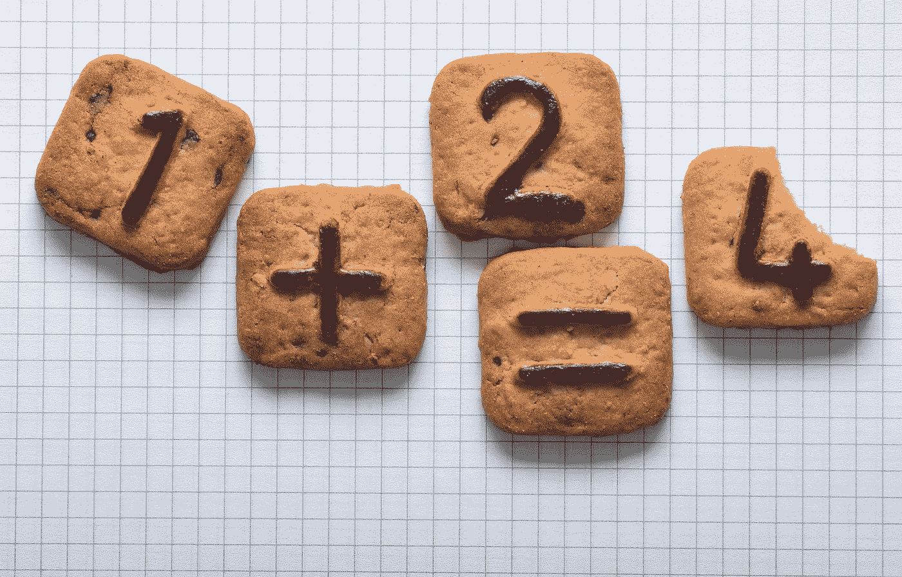
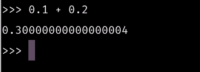
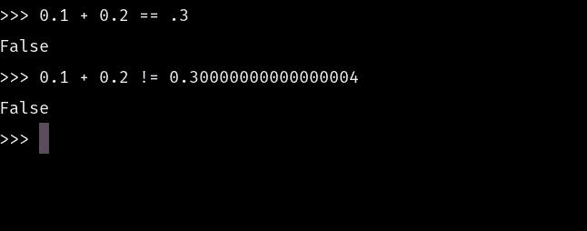
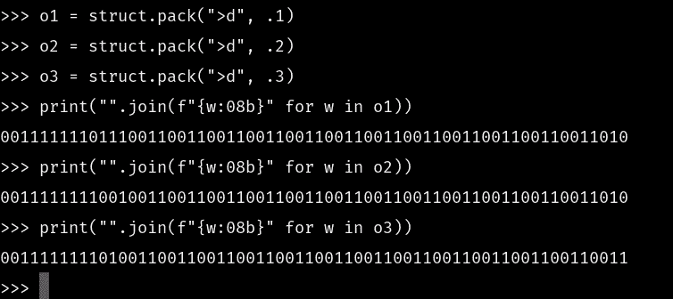

# 为什么浮动不准确

> 原文：<https://towardsdatascience.com/why-floats-are-inaccurate-2a785649c73d?source=collection_archive---------23----------------------->

## 关于浮点值为何不准确的详细对话。



(https://pixabay.com/images/id-3456722/

# 介绍

在计算中，小数值的概念相当普遍。在科学计算中更是如此，数据通常存储在浮点数据类型的小数值中。有很多关于浮点操作错误的讨论，以及对于计算机来说，浮点是否天生难以处理。即使具有科学和数字能力的语言也有浮点问题，有时会计算不准确。考虑以下两个浮点数的简单加法:

```
0.1 + 0.2
```

这真的很简单，你在第一阶段思考的头脑大概马上就想出了答案。一加二等于三，所以十分之一加十分之二必须加起来是十分之三。当然这是正确的，我们可以用下面的数学表达式来证明:

```
0.1 + 0.2 == .3
```

所以这种数学毫无疑问是正确的，但有趣的是当我们在 Python 中使用 float 数据类型做同样的事情时会发生什么。以下是 Python REPL 中使用相同数学方法:



(图片由作者提供)

```
0.1 + 0.20.30000000000000004
```

当然，我们毫无疑问地知道这不是真的。我们的大脑很容易区分这一点

```
0.1 + 0.2 == .3
0.1 + 0.2 != 0.30000000000000004
```

但很明显，电脑似乎认为它有。我们看到，如果我们把这两个语句放入我们的 Python REPL，我们会看到两个都是假的。



(图片由作者提供)

这到底是怎么回事？为什么 Python 不如我们的大脑准确？

# 位

为了理解为什么我们的计算机可能对这个简单的计算有问题，我们需要考虑计算机是如何存储浮点数的。根据您的系统和安装，Python 可能为您的浮点数存储 32 位或 64 位签名。我们会假设大部分阅读器的系统架构很可能不是 i386，我认为这是一个有效的假设，大部分阅读器很可能是 64 位系统。

有一种方法可以让我们实际看到在 Python 中用来存储数据的位，这就是我要用的方法，来演示到底是什么导致了我们的操作错误。我将使用 struct 模块来实现这一点。struct 模块有一个采用两个参数的 pack()方法。第一个论点是要解释我们想要包装什么样的类型。为此，我将使用`“>d”`。大于号用来表示人类书写数学的方式，大端。d 代表双精度浮点数 64。让我们看一下我们刚才看到的所有数字的打印输出:

```
>>> o1 = struct.pack(">d", .1)
>>> o2 = struct.pack(">d", .2)
>>> o3 = struct.pack(">d", .3)
>>> print("".join(f"{w:08b}" for w in o1))
0011111110111001100110011001100110011001100110011001100110011010
>>> print("".join(f"{w:08b}" for w in o2))
0011111111001001100110011001100110011001100110011001100110011010
>>> print("".join(f"{w:08b}" for w in o3))
0011111111010011001100110011001100110011001100110011001100110011
>>>
```



现在，让我们以 0.1 为例，将这几组位稍微分解一下。第一位是一个符号位，这意味着它决定了我们数字的正性，0 代表正，1 代表负。接下来是 11 位，在计算机用来表示浮点数的公式中用作指数。这很像科学记数法。让我们使用一个快速 for 循环来分解这两个值。

```
>>> bits = "".join(f"{w:08b}" for w in o1)
>>> count = 0
>>> signbit = []
>>> exponenetbits = []
>>> fractionalbits = []
>>> for bit in bits:
...     count += 1
...     if count == 1:
...         signbit.append(bit)
...     if count > 1 and count < 13:
...         exponenetbits.append(bit)
...     if count > 12:
...         fractionalbits.append(bit)
```

现在让我们按顺序把每个部分打印出来。不要问我为什么不小心输入了“Expo net…”我也不知道发生了什么。

```
>>> print(signbit)
['0']
>>> print(exponentbits)
Traceback (most recent call last):
  File "<stdin>", line 1, in <module>
NameError: name 'exponentbits' is not defined
>>> print(exponenetbits)
['0', '1', '1', '1', '1', '1', '1', '1', '0', '1', '1']
>>> print(fractionalbits)
['1', '0', '0', '1', '1', '0', '0', '1', '1', '0', '0', '1', '1', '0', '0', '1', '1', '0', '0', '1', '1', '0', '0', '1', '1', '0', '0', '1', '1', '0', '0', '1', '1', '0', '0', '1', '1', '0', '0', '1', '1', '0', '0', '1', '1', '0', '0', '1', '1', '0', '1', '0']
>>>
```

是的，我确实尝试过键入指数位。我们将这些值代入以下公式:

(-1) ^符号* 2^e-1023 * 1 .分数

在这个公式中，每当我们将十分之一和十分之二相加时，我们的小数会被截掉，并在某一点四舍五入。这解释了为什么会出现这种现象，因为一个简单的舍入误差。

# 结论

我们喜欢认为计算机非常聪明，非常精确，但事实并非如此。在一天结束时，理解计算机如何在这种水平上工作真的会证明为什么计算机会犯这样的简单错误。归根结底，它仍然是一个复杂的 unicode 和 bits 系统，共同创建我们编写的表达式。感谢你阅读这篇文章，我希望你学到了一些关于双打的新知识！