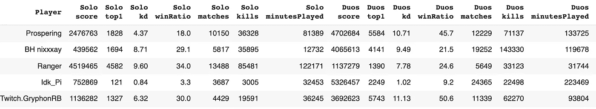
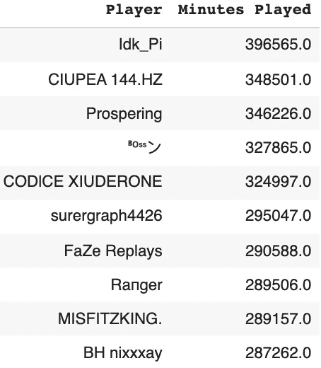
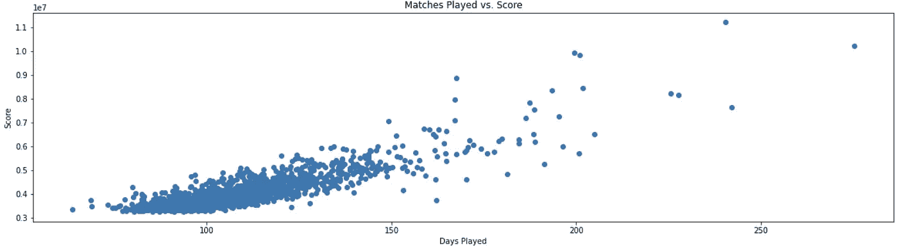
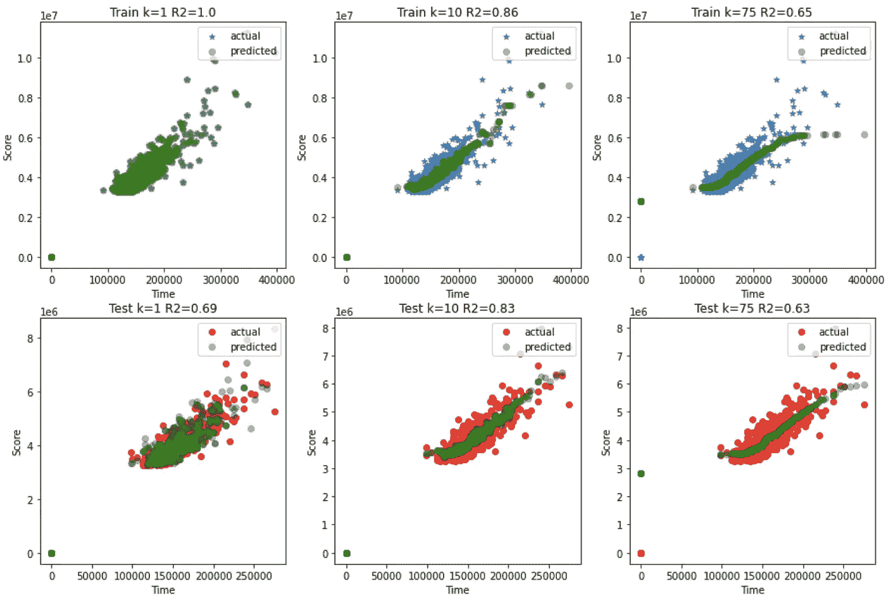
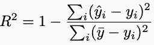
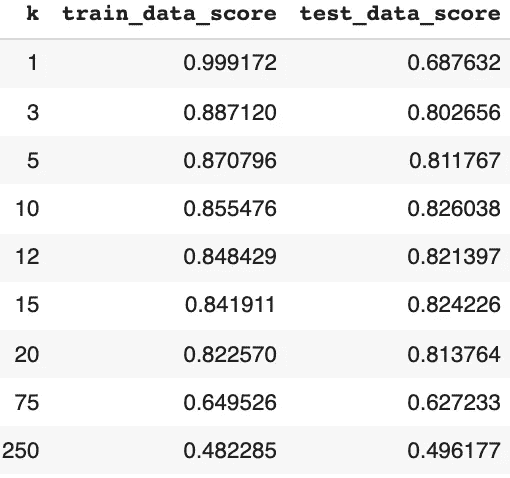
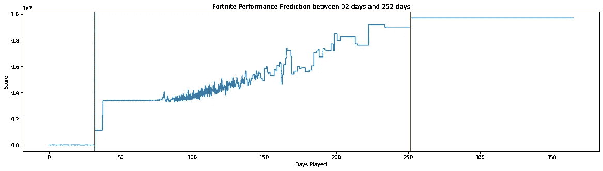

# 为什么堡垒之夜成为历史上最令人上瘾的游戏

> 原文：<https://towardsdatascience.com/why-fortnite-became-the-most-addicting-game-in-history-5e827754f76a?source=collection_archive---------16----------------------->

## 用人工智能和 K-最近邻模型分析球员的状态。

照片由 Unsplash 上的[标记十分位数](https://unsplash.com/@markdecile)拍摄

孩子们越来越沉迷于堡垒之夜，这引起了家长们的恐慌。全球玩家超过 2.5 亿，月收入 2 亿美元，如今似乎每个人都在玩堡垒之夜。根据一些研究，堡垒之夜正变得比海洛因更容易上瘾。像脸书这样的科技巨头正在元宇宙——我们设想的未来虚拟世界——投入大量资源。

通过利用一些简单的心理现象，堡垒之夜不断给年轻玩家一个重返游戏的理由，即使他们不想这样做。在这篇文章中，我研究了上场时间和球员得分之间的关系。

# 数据

我使用了 5 种游戏模式(单人、双人、三人、小队和 LTM)中 1400 多名 Forntine PC 玩家的终生[统计数据。这些数据是由 Kaggle.com 的](https://www.kaggle.com/iyadali/fortnite-players-stats)[Iyadali](https://www.kaggle.com/iyadali/fortnite-players-stats)([免费访问](https://www.kaggle.com/terms))在第六季第二章(2021 年 4 月)期间使用 t [racker.gg.](https://feedback.tracker.gg/tos) 的公共排行榜数据收集的，其中包括以下信息:

*   分数:总分，
*   top1:获胜总数，
*   kd:杀伤/死亡比，
*   WinRatio:胜率，
*   比赛:比赛次数，
*   杀戮:被消灭的次数，
*   minutesPlayed:花费的总分钟数。

统计数据表明，应该有一种非常特殊的快乐来自于玩家永远不想结束的游戏。在堡垒之夜的例子中，获胜者是 Idk_Pi，他花了相当于 396'565 分钟(275 天)玩这个游戏。

堡垒之夜大力鼓励人们继续玩游戏，因为他们有信心赢得下一次比赛，当他们赢了，他们想突破下一个水平。随着比赛时间的迅速增加，分数缓慢而稳定地增长，这暗示了这种假设。

# K-最近邻模型

研究表明，像堡垒之夜这样的游戏使用最先进的行为心理学来故意让你上瘾。我感兴趣的是检查游戏中的上瘾是否是故意的，通过观察两个指标:玩游戏花费的时间和获得的分数。当达到特定分数时，玩家会停止游戏吗？如果会，什么时候会发生？

k-最近邻(kNN)模型是一种直观的方式来预测量化的响应变量，如分数，使用上场时间作为预测因子。

对于固定的 k 值，第 n 分钟的预测得分是最接近的 k 分钟的观察得分的平均值:

下面我将我们的数据分成训练和测试集，并训练各种 kNN 模型。

这些图说明了每个模型在测试数据集上进行预测时的表现。R2 度量反映了模型的适合度，并表明 k=10 将提供对玩家分数的最佳预测。

使用具有 10 个最近邻居的最佳模型，我们可以对花费在玩堡垒之夜游戏上的时间做出 1 天到 3 年的分数预测。

结果表明，至少需要 32 天才能获得足够的分数登上堡垒之夜排行榜。经过 252 天的游戏，分数的提高是非常不可能的。

# 结论

堡垒之夜是一款游戏，它定义了小小的成功，例如，击中两颗子弹就能决定排行榜上的第 10 名或第 99 名。人们继续比赛是因为有太多的希望。该模型表明，252 个游戏日才意识到为什么它如此令人上瘾。

在堡垒之夜失败后，几乎每个玩家都相信这两颗子弹会在下一场游戏中掉落。玩家认为他或她只需要熬过头 32 天。在这段时间之后，分数的稳定增长提供了玩家需要的奖励和心理鼓励。

分数有很多位数，永远会增加，不管你输得多惨。我相信，这种积极的反馈机制是堡垒之夜变得如此上瘾的一个重要原因，特别是对于那些在生活中没有从其他地方获得太多积极反馈的年轻人来说。

感谢阅读！

感谢《走向数据科学》的本·胡伯尔曼和埃利奥特·冈恩。