# 用数据找出为什么《权力的游戏》8.3 如此糟糕

> 原文：<https://towardsdatascience.com/why-game-of-thrones-8-3-was-objectively-bad-6f558d4d63e7?source=collection_archive---------29----------------------->

## **我给《权力的游戏》7/8 的数据科学情书**

不幸的是，昨晚我看了《权力的游戏》第八季第三集。

*作者注:虽然原始资料已经从当代新闻中消失，但我对《权力的游戏》的热情以及对该剧第八季惨败的愤怒并没有消退。这是我写给一个节目的情书，这个节目我爱了 7 年，但此后又恨之入骨。*

***标注上标数字的引文***

# **【得到剧透警告】**

在《权力的游戏》的粉丝中，我想我属于中上水平。我看过这部剧，也读过书，但除此之外，我对维斯特洛没有百科全书般的了解。

但当我看《权力的游戏》最新一集《第八季第三集:漫漫长夜》时，我内心深处有一种东西冒了出来。

那是愤怒。

纯粹的粉丝狂怒。

我讨厌电视的这一集。

也许是糟糕的写作，或者是一部关于战争的电视剧中糟糕的军事策略，或者是聪明的角色变笨了，或者是太黑暗了，或者是这部剧应该比《赫尔姆斯-deep⁴…》更好

我非常不喜欢这一集，这让我很生气。现在只是把原因打出来就很让人沮丧。

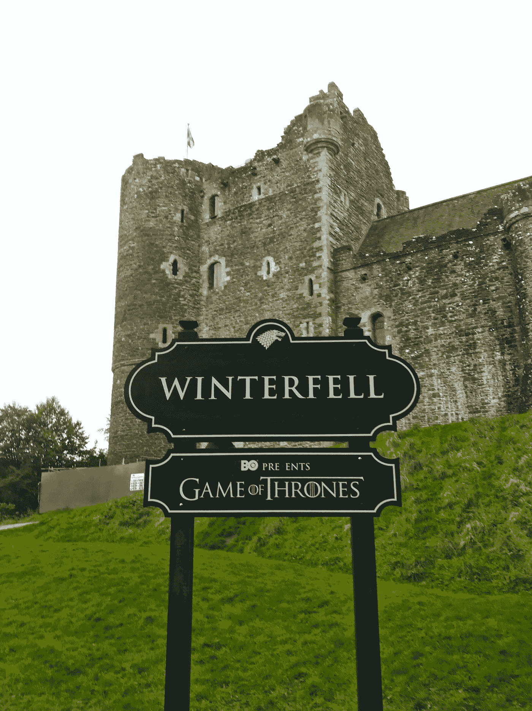

照片由 [Reiseuhu](https://unsplash.com/@reiseuhu?utm_source=medium&utm_medium=referral) 在 [Unsplash](https://unsplash.com?utm_source=medium&utm_medium=referral) 上拍摄

但奇怪的是，我的抱怨无人理睬。我在观看聚会上的朋友似乎并不介意我所看到的缺点。可爱的夏天的孩子们…

我需要找到一些“真实”的东西一些客观的东西来反驳这一集；以数据为基础，毫无疑问地证明这一集是糟糕的。

但是什么是“客观”品质呢？然后我突然想到:

《权力的游戏》一直是一部关于颠覆幻想修辞的剧。更具体地说，它因在关键时刻杀死重要人物而受到称赞:好人并不总是赢家。

这让我想到了这篇文章的假设:

> **临冬城战役中发生的死亡事件对观众的影响不如前几集重要，也低于预期。**

我花了整个周末来探索和验证这个假设👨‍🔬

我无法分析在弧线结束或开始时杀死一个角色的优点(如乔拉·莫尔蒙对米森代)或一个角色被杀死的方式(也就是一个无意义的死亡如何破坏了一个伟大的弧线，反之亦然)，因为这些仍然是主观的。

我*能*弄清楚的是**角色的重要性**，因为工作室显然会把更多的屏幕时间奉献给更重要的角色。

# **决定死亡重要性**

首先，我收集了《权力的游戏》中所有角色在《8⁵.》一季中的屏幕时间这将是我分析的一个很好的起点:

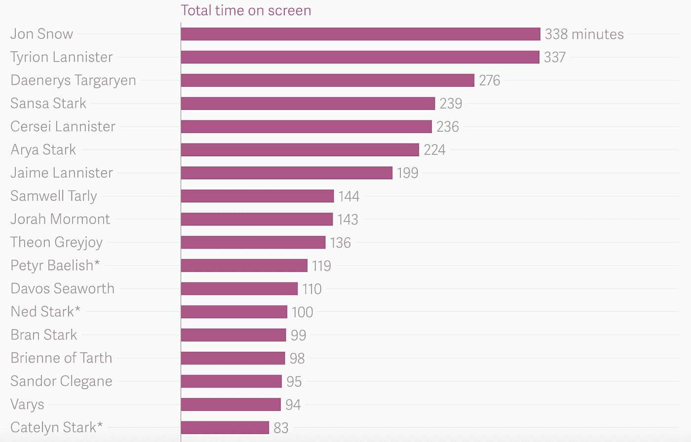

一个很长的图表的顶部，列出了 GoT 字符的屏幕时间。来源:[https://www.theatlas.com/charts/HJrdxDNKW](https://www.theatlas.com/charts/HJrdxDNKW)

我增加了几个专栏让我的生活更容易，然后从精彩的网站[https://deathtimeline.com/](https://deathtimeline.com/)刮出所有死亡加上增加的第七季死亡产生了开始数据表。我去参加比赛了🐴

**剧集**栏显示某角色是否出现在该剧集中。上面的图表很好，但是让我们只看死人，因为那是我们正在探索的。对于死去的人，我添加了一个**死亡剧集**栏，显示他们死于哪一集，以及 **MinPerEp** ，这是他们在所有剧集中的屏幕时间。

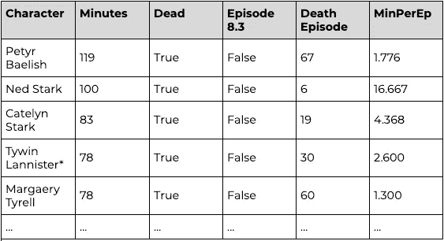

作者图片

起初，我简单地绘制了一集里所有被杀角色的总屏幕时间:

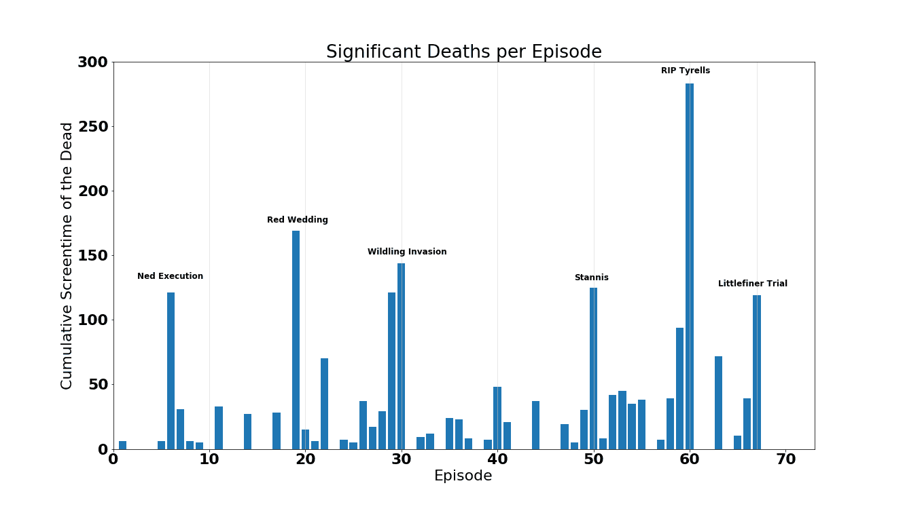

作者图片

很高兴看到主要的情节点+死亡可以用这种方式捕捉。我们还可以看到第六季的结局是多么的疯狂——杀死了大量的主要角色。这远远超出了其他主要死亡事件的范围，它们都徘徊在 130-180 之间。

**(一个*可能会*认为这个分数表明*在这一集里有太多*的死亡，在这个系列的这个点上，这个疯狂的死亡集只是用来结束一些零散的事情和颠覆预期…不过我跑题了)**

但是有几件事不能让我对通过死亡时间来决定剧集质量感到满意:

1.  奈德+韦赛里斯在第一季的死亡可以说是这个系列中最关键的时刻。在这里，它没有野人入侵重要，我个人不同意。
2.  使用原始屏幕时间作为衡量标准高估了在节目后期发生的死亡。即使你是一个中等角色，如果你活到最后，你的死亡可能会像《红色婚礼上的罗柏·史塔克》一样意义重大

那么，如果我们不把重要性看做总的绝对屏幕时间，而是每集的屏幕时间，会怎么样呢？有理由认为，一个重要的人物会在整部剧中延长屏幕时间。在第 10 集里，一个总屏幕时间为 100 分钟的角色死亡应该比在第 50 集里一个总屏幕时间为 100 分钟的角色死亡更有意义。每集 10 分钟可以捕捉到这种关系.那个图表看起来像这样:

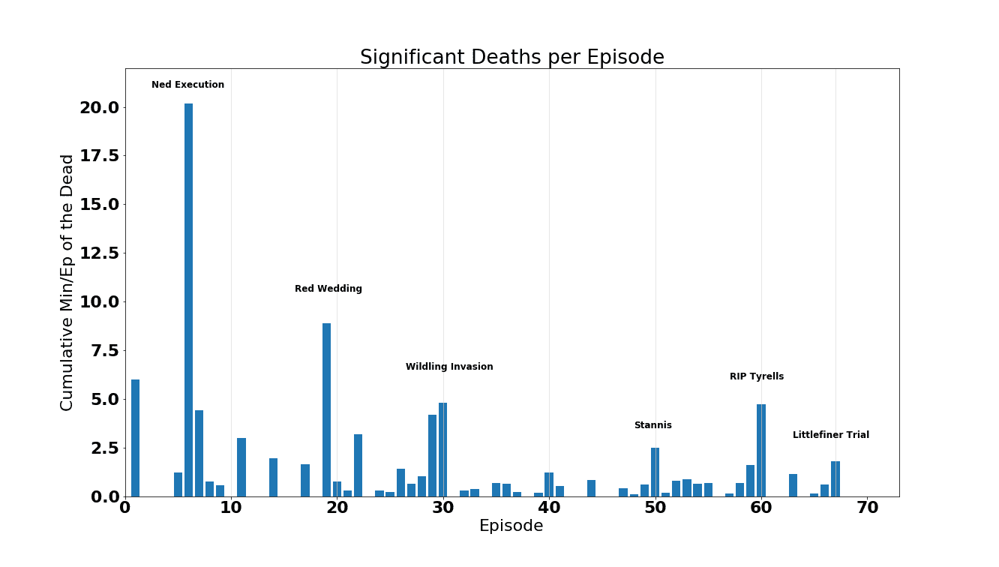

作者图片

这产生了相反的效果——过早死亡更受青睐，使得重大的后期死亡更难实现。在上图中几乎可以看到死亡值的指数衰减线。

你可以说这是对《权力的游戏》的一种不公平的喜剧表现，因为内德、T2、韦赛里斯和第四、五、六、七季中死去的所有人加起来都值钱…

显然，需要有一种更聪明的方法来计算死亡价值。

在我的 Min/Ep 公式中，我添加了一个生存奖励参数——基本上保持了 Min/Ep 的值，但通过软化衰减增加了后来的系列死亡。每集获得 2 分钟屏幕时间奖励的每个角色都存活了下来。虽然这起初感觉是手工制作的，不太客观，但我认为这也可以被视为增加了死亡的重量，因为角色通过自己的弧线和故事弧线前进:即使他们的屏幕时间没有增加，他们的长期参与自然会增加他们的意义。下面是我的生存死亡值公式:

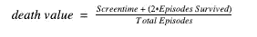

这产生了下面的图表:

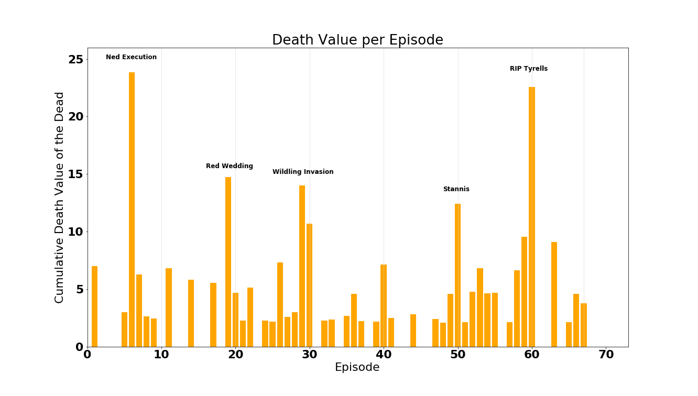

改变颜色让你的读者保持兴趣！！作者图片

这看起来太棒了——奈德的死刑和提利尔一家是这部剧最重要的死亡事件，紧随其后的是《红色婚礼》。它贬低了小指头的审判，我认为这是一件好事，因为一个单一的半体面的角色的死亡远不如其他人的关键时刻。

我们越来越接近，但还没有完全达到:

1.  红色婚礼被低估了。没有办法，它只是作为一个关键的野生入侵，并相形见绌奈德的执行，许多人会认为应该接近在一起
2.  意志困境

# 意志困境

要理解**的意志困境**，看一看死亡名单，按死亡值排序:

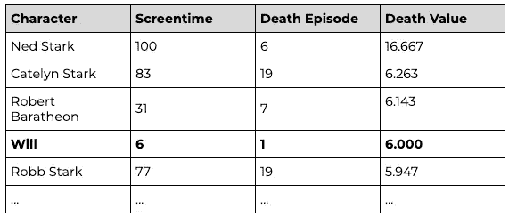

作者图片

首先，我们有奈德·史塔克——电影史上最意外、最重大的死亡事件之一。它引发了《权力的游戏》的所有事件，并转化了数百万 GoT 粉丝——当然值得登上榜首。接下来是凯特琳·史塔克，她是《红色婚礼》第一季大部分时间的女主角，然后是劳勃·拜拉席恩，这位鲁莽的国王的死开启了《权力的游戏》。

然后，还有**将**。

他甚至没有姓。

这是他的粉丝页面:[https://gameofthrones.fandom.com/wiki/Will](https://gameofthrones.fandom.com/wiki/Will)

他出现在 1.1 的前 6 分钟，然后被一个白行者杀死。

尽管在一个场景中扮演了这个小角色，但他的排名比史坦尼斯、提利尔甚至罗柏·史塔克都要高。显然有些事情需要解决。

简而言之，意志困境是我们的模型倾向于*高估不受欢迎的角色*。没错，连《权力的游戏》都是人气比拼。

但是你如何衡量受欢迎程度呢？很明显，我不能对每个角色的重要性进行排名，这是不客观的。

相反，我们可以用**一个角色在《权力的游戏》的维基页面上的链接数量**作为受欢迎程度的衡量标准。一个角色和其他人的联系和关系越多，他们就越受欢迎和重要。当我们对链接进行计数并对它们进行归一化(在 0 和 1 之间进行缩放)时，我们会得到类似于图表链接的东西。任何高于 0.34 的都被认为是流行的。

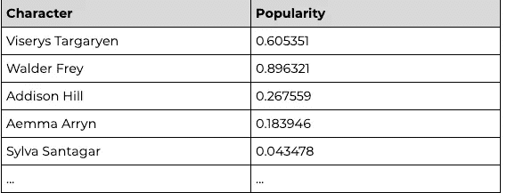

《权力的游戏》人气排行榜。作者图片

像瓦德·佛雷和韦赛里斯·坦格利安这样的重要人物？受欢迎。不，像希尔瓦·桑塔加这样的名字几乎不受欢迎。

我们现在可以将死亡价值函数改写为:

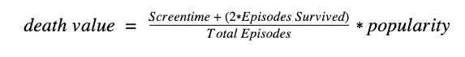

或者，如果你想让这看起来像一个公式，假装这是一个数学上严格的练习:

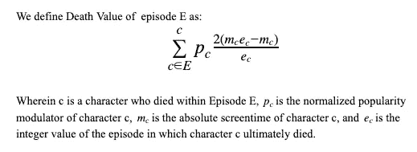

使用这个修改的死亡值，我们得到:

作者图片

这个看起来很有希望。奈德/韦赛里斯是最强有力的一集，紧随泰里尔大屠杀之后。红色婚礼虽然仍被低估，但与史坦尼斯和野人入侵相比，它显然是独一无二的。

*旁注:*我用了书中人物的人物页而不是节目来计算人气。如果你担心这使数据有所偏差，或者创造不正当的价值，我会认为维基这本书抓住了维斯特洛内部人物的真正内部受欢迎程度，而不是 HBO 内部的外部受欢迎程度。书中每个人物背景故事的丰富性和被点名人物的绝对数量保证了重要人物几乎不受人气放大器的影响，没有人受到重罚。

*边注 2:* 以上数据集不包括约翰·斯诺的第一次死亡，因为他实际上并没有死。在我的死亡计算中不允许假死！

# 死亡中的无形资产

这里有几个概念是我们无法用死亡值来解释的:

*   阿多效应:一个拥有强大而有意义的死亡的次要角色。阿多虽然在《权力的游戏》的宏大计划中扮演了一个相对次要的角色，但他有一个绝对令人震惊的死亡镜头，这肯定比他可怜的 0.621 分更有价值。然而，对死亡序列的“伟大”程度进行排名对于这项分析来说过于主观。
*   **小指头的困惑**:一个主要角色可怕的或者非角色的死亡结束了他们的叙述。这与*阿多效应*相反，因此代表了降低角色死亡分数的需要。对我们的分析来说也太主观了。
*   **耶哥蕊特假设:**一个赛季中期加入球队的角色不应该被贬低。显然耶哥蕊特只出现在第二季，但她的死亡分数应该从那里开始吗？从技术上来说，她还活着，只是在第一季中没有任何露面的时间，但她在那些剧集中获得了生存奖金。我选择从第一集开始考虑所有的角色，但是也接受生存奖励。
*   **耳语大师(银幕外)额外收获:**原始屏幕时间不一定反映故事的影响力。《指环王》中的索隆在三部电影中只有 4 分钟的实际屏幕时间，但他的影响力来自于故事中所有对他的提及。也许下一步将是计算一个角色出现在屏幕上的时间长度。

现在，我们用这个来说说 8.3。

# **临冬城之战**

下面是《漫漫长夜》中每个人的潜在死亡值，在这一集里真正死去的人用红色粗体显示:

作者图片

将这些突出显示的值相加，我们可以生成临冬城之战的死亡值(蓝色):

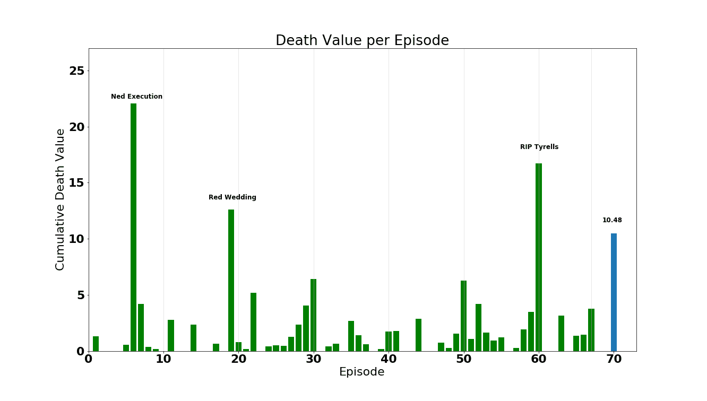

作者图片

乍一看，似乎该集的客观死亡值尚可。它没有《红色婚礼》和《泰里尔大屠杀》那样震撼人心，但也足够重要。

但是一旦你看到表面之下，你就会开始看到裂缝。

选择的角色并不重要。其中只有一个人——席恩·葛雷乔伊——以价值计算排在人物榜的上半部，两个人物——莱安娜·莫尔蒙和埃德森·托莱特——以价值计算排在最后。简而言之，**死亡评分分数并不是像之前重要剧集那样来自于关键死亡，而是来自于次要角色的清除。**

此外，21.6%的死亡分数出现在战斗之后，当时梅丽珊卓认定她与艾莉亚的鼓舞士气的谈话是她生命的目的，并继续活到 100 岁死去。它没有增加战斗本身的戏剧性，而是人为地夸大了这一集。

*旁注*:夜王不在其中，因为根据作者的说法，他是一个“元素”和纯粹邪恶的化身，所以正常的人类事物并不适用于他。比如死亡。和性格发展。

你现在可能会问自己:“如果这一价值低于其他重要剧集，并因次要角色和战后死亡而被夸大，那又会怎样？人们在期待什么？”

我们可以弄清楚。

首先，一个明显的问题:

# **如果所有人都死了会怎样？**

作者图片

杀死所有人——基本上提前结束这场演出——在维斯特洛会是一场大灾难，在现实世界也可能如此。想象一下，如果夜王和他的不死族邪恶地消灭了所有的丹妮和北方军队。剩下的就是瑟曦和夜王的对决了。邪恶对邪恶。这绝对会改变整部剧的基调，这一点可以从上面高得吓人的死亡分数中反映出来。

(平心而论，夜王大战瑟曦“野火”兰尼斯特会是一首冰与火之歌……)

# 我们以为谁会死？

转到一个更现实的预期，我找到一篇文章，列出了它对漫漫长夜的预测:

> 格雷沃姆、席恩·葛雷乔伊、埃迪逊·托雷特、塔斯的布蕾妮、乔拉·莫尔蒙、詹德利和波德瑞克·派恩

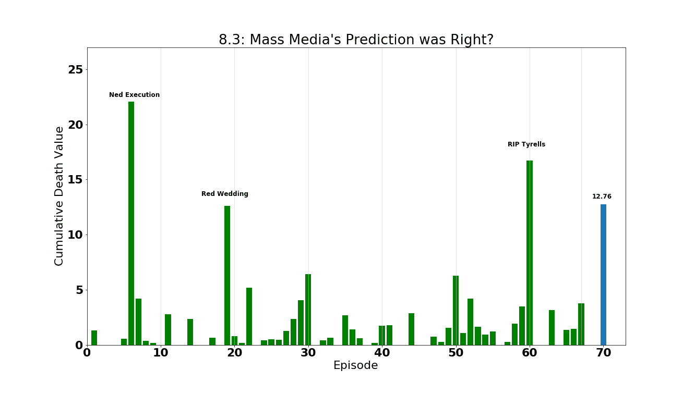

作者图片

我也问自己，“在这一集之前，我预计谁会死？”以下是我的选择:

> G 雷伊沃姆，贝里·唐德利恩，席恩·葛雷乔伊，塔斯的布蕾妮，乔拉·莫尔蒙，&詹德利

我可以滔滔不绝地解释为什么我会期待这些…但是现在不是时候…有图表要绘制！

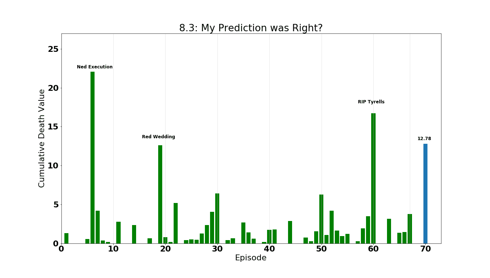

作者图片

令人惊讶的是，我的预测和大众媒体的预测只相差 0.02(又名 1/4 吉利)

很明显，每个人都期望死亡值在 12.75 左右，而战斗值为 10.48

总之:

# **临冬城之战客观上比大家预期的差了 17.99%**

这似乎不是很多，但两位数的百分比下降是一个重大的下降。如果这部剧缩短 17.99%，就只有六季半了(我多么希望这是真的……)。

如果你不算 Missendei，因为她在战斗后去世了，你只剩下可怜的 8.25 分，比 exceptions 低 35%。呀。

# **尾声:结束游戏**

U 唱完上面的死亡评分等式，最后清理一下我的一些图表，这里是第八季的剩余部分。由于我在最后一季中没有接触屏幕的时间，所以在第八季之前，我只是根据每个角色每集的时间给了他们额外的屏幕时间:

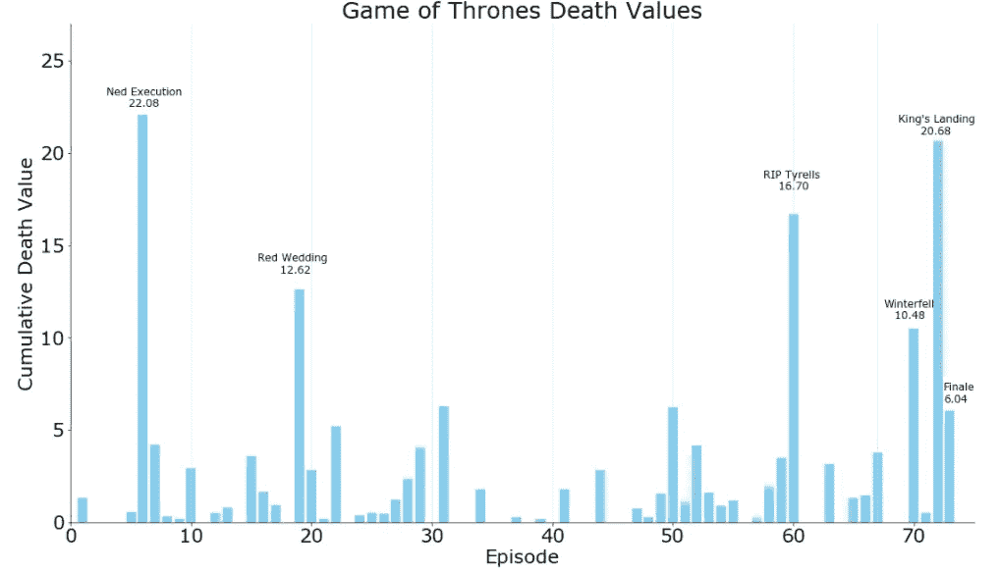

作者图片

如果出于任何原因，你对剩下几集的表现不满意，这也是最后一集的死亡值。随意计算你自己想象的情节中死亡的重要性:

*   琼恩·雪诺:6.948
*   提利昂·兰尼斯特:6.934
*   丹妮莉丝·坦格利安:6.036
*   珊莎·史塔克:5.491
*   瑟曦·兰尼斯特:5.447
*   艾莉亚·史塔克:5.270
*   詹姆·兰尼斯特:4.902
*   山姆威尔·塔利:3.969
*   戴佛斯·席渥斯:3.484
*   布兰·史塔克:3.430
*   塔斯的布蕾妮:3.415
*   瓦里斯:3.020
*   桑铎·克里冈:2.345
*   格雷果·克里冈:1.945
*   攸伦·葛雷乔伊:1.643
*   艾德慕·徒利:1.467
*   波隆:1.451
*   Qyburn: 1.253
*   杰诺斯·史林特:1.224
*   詹德利:1.116
*   吉利:0.800
*   波德瑞克·派恩:0.767
*   梅拉·黎德:0.650
*   托蒙德:0.596
*   达里奥·纳哈里斯:0.585
*   米桑代伊:0.502
*   贾昆·哈加尔:0.476
*   热馅饼:0.403
*   萨拉多·萨恩:0.386
*   鞣花砂:0.373
*   灰色蠕虫:0.366
*   约翰·罗伊斯:0.357
*   西利欧·佛瑞尔:0.250

非常感谢你的阅读。

瓦拉·莫古里斯

引用的作品

1.  https://www.youtube.com/watch?v=EA5mJRFaI8c
2.  [https://www . the verge . com/2019/4/30/18522060/权力的游戏-got-season-8-HBO-final-meli sandre-Tyrion-lanni ster-long-night-prophetions-tactics](https://www.theverge.com/2019/4/30/18522060/game-of-thrones-got-season-8-hbo-final-melisandre-tyrion-lannister-long-night-prophecies-tactics)
3.  [https://www.youtube.com/watch?v=EB_y1Hp36Js](https://www.youtube.com/watch?v=EB_y1Hp36Js)
4.  [https://comic book . com/TV-shows/2019/03/04/game-of-thrones-final-battle-bigger-than-helms-deep-Lord-of-the-rings/](https://comicbook.com/tv-shows/2019/03/04/game-of-thrones-final-battle-bigger-than-helms-deep-lord-of-the-rings/)
5.  [https://www.theatlas.com/charts/HJrdxDNKW](https://www.theatlas.com/charts/HJrdxDNKW)
6.  [https://deathtimeline.com/](https://deathtimeline.com/)
7.  [https://en . Wikipedia . org/wiki/List _ of _ Game _ of _ Thrones _ episodes](https://en.wikipedia.org/wiki/List_of_Game_of_Thrones_episodes)
8.  [https://data.world/data-society/game-of-thrones](https://data.world/data-society/game-of-thrones)
9.  [https://www . vulture . com/2019/04/game-of-thrones-battle-of-winter fell-who-will-die . html](https://www.vulture.com/2019/04/game-of-thrones-battle-of-winterfell-who-will-die.html)说对了吗？
10.  我自己
11.  【https://Mashable . com/article/game-of-thrones-white-walker-night-king-long-night/
12.  [https://www . wired . com/story/game-of-thrones-ploters-vs-pants ers/](https://www.wired.com/story/game-of-thrones-plotters-vs-pantsers/)