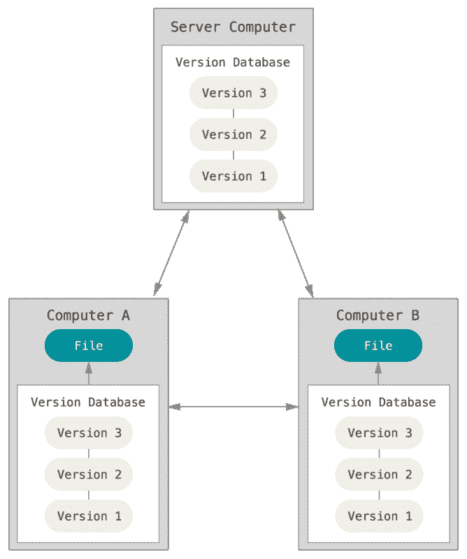

# 为什么 Git 对于数据科学是不够的

> 原文：<https://towardsdatascience.com/why-git-is-not-enough-for-data-science-7002995d9e16?source=collection_archive---------20----------------------->

## 一个数据科学家该不该学 Git？

**TL；几乎每个软件开发项目都使用 Git 来跟踪代码和文件的变化。基于这种跟踪每一个变化的能力，数据科学项目对 Gits 的采用也有了巨大的增长。在本帖中，我们讨论:**

1.  Git 给数据科学带来的好处
2.  Git 的差距和局限性
3.  将 Git 用于数据科学项目的最佳实践

对于熟悉 Git 的人，请跳到“为什么学习 Git 对数据科学很重要”一节

# 什么是 Git，它是如何工作的？

“Git 是一个免费的开源分布式版本控制系统，旨在快速高效地处理从小到大的所有项目。”— [饭桶](https://git-scm.com/)

正如描述所说，Git 是一个版本控制系统。它有助于记录、跟踪和保存对源代码所做的任何更改，并快速、轻松地恢复任何以前的状态。

Git 使用分布式版本控制模型。这意味着存储库可以有许多副本(或者 GitHub 世界中的分支/远程)。当在本地工作时，Git 是您将用来跟踪您的存储库的变更的程序。

GitHub.com[是互联网上的一个位置，作为您的存储库的远程位置。GitHub 为您的作品提供了备份，如果您的本地副本丢失(例如，如果您的计算机从码头上掉了下来)，可以找回这些备份。GitHub 还允许你分享你的工作，并在一个项目上与其他人合作。](https://github.com)

与 GitHub 类似的工具有 [GitLab](https://about.gitlab.com/) 、 [Bitbucket](https://bitbucket.org/) 。

来源:斯科特·沙孔和本·施特劳布的 Pro Git。

# Git 和 Github、GitLab 或 Bitbucket 如何帮助您更好地工作

Git 有几种帮助开发项目的实用方法。

*   使用 git 跟踪本地代码的变化。
*   在不同版本之间同步代码(即您自己的版本或他人的版本)。
*   在不丢失原始代码的情况下测试对代码的更改。
*   如果需要，恢复到旧版本的代码。
*   在云上备份你的文件(GitHub/GitLab/Bitbucket)。
*   在 GitHub/GitLab/Bitbucket 上共享您的文件并与其他人协作。

到目前为止，很清楚为什么 Git 是一个强大的工具，它将帮助你记录、跟踪和存储对项目中几乎任何文件的任何更改。我们知道 Git 如何帮助你在团队中更好地工作，这也是 Git 在软件开发项目中如此广泛使用的主要原因之一。

这些优势也与数据科学项目相关，用于管理支持其工作的代码，但这并不是一对一的。

# 学习 Git 对数据科学很重要吗？

如果你想作为合作者加入一个数据科学项目，你将不得不面对一些挑战，例如；

*   回顾所有正在进行的关于特定主题的研究和存储库，并选择最有希望的一个。(如果你正在做一个开源项目)
*   您需要了解该项目的当前状态，以及它是如何随着时间的推移而发展的。
*   确定哪些方向是有前景的，仍然值得探索。在这一步，回顾尝试过并放弃的想法和方法也很重要，因为你不想重复别人尝试过但没有成功的工作。通常，这些失败的方法不会被记录和遗忘，这是一个巨大的挑战。
*   你需要收集项目的所有部分(数据、代码等。)可能分布在多个平台上，有时并不完全可访问。
*   最后但同样重要的是，一旦你做出了一些改进或探索了一个新的方向，就没有简单的方法将你的成果反馈到项目中。

总的来说，现在有多种挑战无法用今天的工具很好地解决。

现在让我们看看 Git 如何帮助我们填补一些缺失的部分。

有了 Git 跟踪我们对文件所做的每一个更改的能力，我们就可以显示所有的方向，它们是何时被谁执行的！可以将整个 Git 历史看作一个真实的故事，理解每一步都做了什么(提交)并有一些文档(提交消息)。您还可以使用前面提到的平台之一与其他合作者共享它。

通过使用更传统的软件开发工作流程，您开始将您的模型更像是一个应用程序，而不是一个脚本，这使得它更容易管理，并导致更高质量的结果。

# 尽管如此，Git 也有局限性

尽管使用 Git 这样的版本控制工具有很大的好处，但是它们也带来了很高的开销。

开销来自于需要确保每个更改都经过“提交”过程，这通常意味着使用命令行和终端。既然终端对于大多数分析师(甚至数据科学家)来说是如此陌生，那么你不仅仅需要学习 Git，你还需要学习终端！这并不迅速，而且在努力记住要写什么命令的同时让你的效率受到影响是一个巨大的障碍。如果这是你的情况，你可以查看这篇博客文章[有效的 Linux & Bash 给数据科学家](https://dagshub.com/blog/effective-linux-bash-data-scientists/)

此外，Git 不能独自承担所有的重担。我这么说是什么意思？

*   Git 不能支持实验跟踪。这里有一个比较现有工具的不错的帖子。[适合您的数据科学工作流程的 ML 实验跟踪工具](https://dagshub.com/blog/how-to-compare-ml-experiment-tracking-tools-to-fit-your-data-science-workflow/)
*   Git 无法跟踪大文件(数据集和模型)。你可以在这个帖子[比较数据版本控制工具](https://dagshub.com/blog/data-version-control-tools/)中找到更多关于这个的信息

# 使用 Git 构建数据科学项目的最佳实践。

照片由[丹妮尔·麦金尼斯](https://unsplash.com/@dsmacinnes)在 [Unsplash](https://unsplash.com/?utm_source=medium&utm_medium=referral) 上拍摄

综上所述，我提出了一个将 Git 思维整合到您的 DS 项目中的解决方案。它由几个部分组成:实验跟踪、版本控制和使用数据作为源代码。

## 实验跟踪

您可以通过两种方法实现实验跟踪，要么使用专用工具，要么使用 Git。您还可以在适合您的数据科学工作流程的 [ML 实验跟踪工具上找到更多相关信息](https://dagshub.com/blog/how-to-compare-ml-experiment-tracking-tools-to-fit-your-data-science-workflow/)

外部跟踪

你必须在外部系统上记录你所有的实验信息。

这种方法有一些优点:

*   已经开发了许多优秀的工具
*   这是一种直观的方法。在采取新的方向在 git 项目上创建新的提交之前，没有必要停下来

但是，有利也有弊:

*   代码和实验结果之间没有明确的联系
*   很难复习
*   再现性。重现导致实验结果的东西并不容易

带有 Git 跟踪的版本控制

您认为每个实验都是 git 提交，这意味着对项目的任何更改都会创建一个新版本，因为代码、数据和参数都是源代码的一部分

一些优点是:

*   复制很容易，只要做一个 git 检验，你就有了代码、参数、数据和模型。
*   你得到了与实验相关的所有背景
*   协作。正如本文所提到的，Git 与其他一些平台的结合为您提供了并行化工作的可能性
*   如果与数据版本工具结合使用，您还可以接受数据贡献
*   GitOps、CI/CD——更容易与 CI/CD、PRs 的现有 git 生态系统集成

它也有一些缺点:

*   当有很多实验时，意味着有很多提交，可能会很混乱
*   改变心态，开始考虑任何新的方向

当然，你可以把这两种想法混合起来。

## 数据作为源代码

正如我之前提到的，开发 Git 是为了跟踪文本文件中的变化，而不是大型二进制文件。因此，跟踪项目数据集不是一个选项。这就是为什么我推荐使用两个选项:

1.  对于不变的数据集，您可以将其上传到服务器并通过 URL 进行访问
2.  如果您有一个可能会改变的数据集，您应该考虑使用一个工具对其进行版本控制。你可以在这里找到一个很棒的对比[对比数据版本控制工具](https://dagshub.com/blog/data-version-control-tools/)。

你还可以在这篇博文中找到更多关于为什么对数据集进行版本化是个好主意的信息[数据集应该像 Git 存储库一样运行](https://dagshub.com/blog/datasets-should-behave-like-git-repositories/)

# 结论

为 Git 实现这些建议的实践有几个好处:

*   将所有项目文件、数据和模型整合到一个地方
*   审查工具，使其更容易为正在进行的项目做出贡献，并更容易检查这些贡献。
*   更容易复制和重用以前项目中的工作
*   CI/CD，如果您对所做的贡献感到满意，您可以有一种自动的方式来合并它们，获取代码和数据，测试它们，并将其交付给生产。

日复一日，Git 被用于更多的数据科学项目。我希望通过阅读这篇文章，你能更好地理解它的局限性和优点，以及如何与你的同事一起使用它。祝你好运！

如果你喜欢这篇文章，请在 [Twitter](https://twitter.com/martintali) 和 [LinkedIn](https://www.linkedin.com/in/martin-daniel-07a53049/) 上联系我。谢谢，下次再见！:)

*原载于 2021 年 4 月 29 日 https://dagshub.com**的* [*。*](https://dagshub.com/blog/how-to-use-git-for-data-science/)