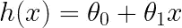
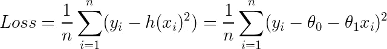
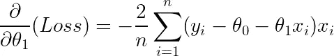
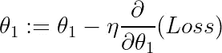
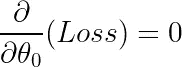
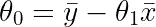
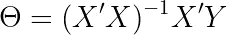

# 线性回归:梯度下降与解析解

> 原文：<https://towardsdatascience.com/why-gradient-descent-is-so-common-in-data-science-def3e6515c5c?source=collection_archive---------6----------------------->

## 解释为什么梯度下降在数据科学中经常使用，并用 C 语言实现


照片由[trần ngọc·万](https://unsplash.com/@aaaaaaaaaaaaaaaa?utm_source=medium&utm_medium=referral)在 [Unsplash](https://unsplash.com?utm_source=medium&utm_medium=referral) 上拍摄

# 介绍

[**梯度下降**](https://en.wikipedia.org/wiki/Gradient_descent) 是一种无处不在的优化算法，在数据科学中广泛应用于**神经网络、线性回归和梯度推进机**等算法中。但是，为什么用的这么频繁呢？

# 梯度下降直觉

让我们从解释梯度下降开始。这将是一个简短的描述，因为这个主题已经被彻底覆盖，所以如果你想要一个更密集的解释，请参考其他博客或教程。

梯度下降是一种**一阶迭代法**求一个可微函数的**最小值。我们从初始猜测开始，并在当前猜测的计算梯度的**相反方向**上**缓慢下降**。然后更新初始猜测，产生新的改进值。这个过程依次执行，直到我们**收敛到最小值**。**

在机器学习中，这个微分函数就是**损失函数**，它告诉我们当前模型与数据的拟合程度。然后使用梯度下降来更新模型的当前参数，以使损失函数最小化。

# 简单线性回归的梯度下降

也许证明梯度下降最简单的例子是一个简单的线性回归模型。在这种情况下，我们的**假设函数**、**、*、*、**，依赖于一个**单一特征变量、*、*、**:



作者对我们模型的假设

其中 ***θ_0*** 和 *θ_1* 为模型的**参数。这个问题的损失函数是**误差平方和(SSE)** :**



作者的和或平方损失函数

因此，我们将使用梯度下降法来寻找使上述损失函数最小的参数值。

正如你所看到的，损失函数是可微的，并且有一个抛物线形状，因此它有一个最小值。如前所述，梯度下降通过**在梯度的相反方向迈出小步来更新模型的参数。**因此，我们需要计算损失函数相对于两个参数的梯度:


作者截取的渐变



作者绘制的坡度

这些参数随后更新为:


按作者截取更新



按作者更新坡度

其中 ***η*** 为**学习率**，决定了每个参数更新的**步长**。学习率在**零和一**之间，指定我们多快收敛到最小值。如果太大，我们可能**超过最小值，**但是太小会导致**更长的计算时间**。因此，需要找到一个快乐的媒介。这就是**超参数调整**通过**网格和随机搜索**甚至**贝叶斯**方法使用的地方。

给定足够的迭代，在数据科学中这被称为**训练时期**，梯度将**趋向于零。因此，参数的当前值已经最小化损失函数并且已经收敛。**

# 解析

然而，简单线性回归模型确实存在**解析解**。不使用数值技术，我们可以简单地将偏导数方程设置为零:



作者方程式


作者方程式

这是一个由两个线性方程组成的**系统，其中两个未知数可以解析求解。通过数学推导和重新排列，满足上述方程的参数值为:**



作者截距公式


作者的斜率方程

其中 **x̅** 和 **ȳ** 分别是数据的**平均值和目标变量**的平均值。因此，通过计算这些平均值，我们可以找到使损失函数最小化的参数，而无需使用迭代方法！

以上方程是**简单线性回归模型**的**解析解**。这只是针对**线性回归模型**的**一般解决方案**的简化版本，其中我们可以有**两个以上的未知参数:**



一般解决方案，作者方程

其中 ***X*** 为数据矩阵， ***Y*** *，*为目标变量矩阵，***θ***为参数矩阵。

# 那为什么是梯度下降呢？

那么，当存在解析解时，我们为什么要使用梯度下降法呢？这个答案完全基于**计算时间和空间成本。**

梯度下降的时间复杂度为 ***O(kn )*** 其中 ***k*** 为特征个数， ***n*** 为数据点总数。这种复杂性可以通过**矢量化实现进一步提高。这就是今天大多数机器学习算法的实现方式。**

然而，线性回归的一般解析解的时间复杂度为 ***O* (𝑛)。**因此，对于小数据集，差异可以忽略不计，但计算时间差会随着数据大小的增加而呈指数增长。实际上，大多数数据集大约有 100 个要素，100 万行。因此，对于这些情况，解析解是不可行的。

此外，对于某些模型，如**泊松回归**和**逻辑回归**，将导数设置为零会导致一组**非线性方程** **没有闭合形式的解析解**，因此，我们被迫使用数值方法，如梯度下降。

# 结论

梯度下降优于解析解，因为它的计算速度和一些回归模型缺乏封闭形式的解决方案。这使得迭代数值方法的实现成为必要。

我希望你们喜欢这篇文章，并学到了一些新东西！有很多其他的文章对我在这篇文章中浓缩的一些推导进行了更深入的探讨，所以我建议大家去看看！

# 和我联系！

*   [*要想在媒体上阅读无限的故事，请务必在这里报名！*T45*💜*](/@egorhowell/membership)
*   [*在我发布注册邮件通知时获得更新！*T51*😀*](/subscribe/@egorhowell)
*   [*领英*](https://www.linkedin.com/in/egor-howell-092a721b3/) 👔
*   [*碎碎念*](https://twitter.com/EgorHowell) 🖊
*   [*GitHub*](https://github.com/egorhowell) 🖥
*   [](https://www.kaggle.com/egorphysics)**🏅**

> **(所有表情符号都是由 [OpenMoji](https://openmoji.org/) 设计的——开源的表情符号和图标项目。许可证: [CC BY-SA 4.0](https://creativecommons.org/licenses/by-sa/4.0/#)**

# **额外的东西！**

**下面显示的是我用 **C** 编写的示例代码，展示了如何对梯度下降进行编程！**

```
**#include <stdio.h>
#include <stdlib.h>
#include <math.h>double dydx(double x);int main(){ int epochs, i; 
  double learning_rate, x, x_new; printf("Enter your intial guess integer: ");
  scanf("%lf", &x);      

  printf("Enter how many epochs: ");
  scanf("%d", &epochs); printf("Enter your learning rate: ");
  scanf("%lf", &learning_rate); for (i=1;i<epochs+1;++i){

    x_new = x;
    x_new = x_new - learning_rate*dydx(x_new); if ((x - x_new) < 0.000001){
      printf("number of epochs to coverge %d\n", i);
      break;  

    } x = x_new; } printf("The value of x that minimises is %lf", x);}double dydx(double x){
  return 2*x - 5;
}**
```

**完整代码可以在我的 GitHub 上找到:**

**[](https://github.com/egorhowell/Medium-Articles/blob/main/Data%20Science%20Basics/gradient_descent.c) [## Medium-Articles/gradient _ descent . c at main egorhowell/Medium-Articles

### 此时您不能执行该操作。您已使用另一个标签页或窗口登录。您已在另一个选项卡中注销，或者…

github.com](https://github.com/egorhowell/Medium-Articles/blob/main/Data%20Science%20Basics/gradient_descent.c)**