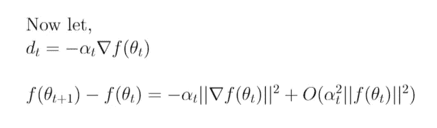

# 为什么梯度下降有效？

> 原文：<https://towardsdatascience.com/why-gradient-descent-works-4e487d3c84c1?source=collection_archive---------15----------------------->

## 每个人都知道什么是梯度下降，以及它是如何工作的。有没有想过它为什么有效？这里有一个数学解释

由[塞维多夫·切梅里斯](https://unsplash.com/@ychemerys?utm_source=medium&utm_medium=referral)在 [Unsplash](https://unsplash.com?utm_source=medium&utm_medium=referral) 上拍摄的照片

# 什么是梯度下降？

梯度下降是一种迭代优化算法，用于优化机器学习模型(线性回归、神经网络等)的权重。)通过最小化该模型的成本函数。

梯度下降背后的直觉是这样的:把代价函数(用***f(*θ̅*)***其中**θ̅**=[θ₁、……θₙ*)*标绘在 ***n*** 维度上)画成一个碗。想象在那个碗上随机放置一个点，用 ***n*** 坐标表示(这是你的代价函数的初始值)。这个“函数”的最小值将是碗的底部。**

**目标是通过在碗上逐渐向下移动到达碗的底部(或最小化成本)。为了实现这一点，我们应该知道碗在不同方向上相对于当前点的斜率，这样我们就可以决定向哪个方向移动以获得最快的收敛。为了确定这一点，我们计算函数在该点的梯度。通过迭代，我们将最终到达某个最小值点，该点的坐标将是模型的最优权重。**

# **梯度下降是如何工作的**

**下面是梯度下降的更正式的定义:**

**从输入矩阵***×t35*开始，n 维输入向量和一个初始值给权重**【θ̅】，**我们知道，在线性回归方程中给出:***【y̅=*【θ̅ᵗ】*×*。**现在，如果成本函数由***f(*θ̅*)，*** 给出，这就是我们如何制定梯度下降:******

**

*梯度下降算法公式(图片由作者提供)*

*这里， ***t*** 是迭代计数器，***【tₘₐₓ】***是我们运行循环的最大迭代次数。*

# *为什么有效*

*这里的第一个问题应该是:二阶导数测试以及任何函数***f(*【θ̅】*)****等于零时的二阶导数告诉你**θ̅**是该函数的局部最大值还是局部最小值。现在，既然我们对最小化感兴趣，我们可以逆向工程这个概念，求解**θ̅**给定**t13】f(θ̅*)****的二阶导数为负。***

***那么，为什么我们不这样做，而是迭代地解决最小化问题(如梯度下降)？答案在于，首先，也是最重要的，二阶导数不能保证永远存在。第二，求解**θ̅ₘᵢₙ**的二阶导数方程的计算复杂度非常高。事实上，有时不可能用微积分来解决，而必须用数值来解决。***

## ***最小化问题***

***因此，在数字上指定一般的最小化问题(并因此迭代)，我们说**θ̅ₜ₊₁=θ̅ₜ+*dₜ***其中 ***dₜ*** 是在时间*的最小化的一些一般方向(回头看碗的例子)****

******

***最小化算法通用格式的规范(图片由作者提供)***

***现在，来选择合适的*dₜ**θ̅ₜ₊₁<θ̅ₜ**——然后我们走向最小化。****

## ***泰勒级数***

***为了解决上述最小化问题，我们利用泰勒级数来表示 ***n*** 维度。我们用以***f(*θ̅ₜ*)为中心的泰勒级数来计算***f***(**θ̅ₜ₊₁**)。*** 这是它的样子:***

**

*n 维泰勒级数及其在 1 维泰勒级数中的对应项(图片由作者提供)*

**

*海森矩阵(图片由作者提供)*

*这里的矩阵*是海森矩阵，代表函数***f(**)***的二阶偏导数**

**接下来，我们从最小化的定义中代入方程:**θ̅ₜ₊₁=θ̅ₜ+*dₜ*****

****

**求解泰勒级数(图片由作者提供)**

**在上图中，我们在渐近项本身中加入了三次项，因为我们只想处理前两项，我们得到了***【o(||dₜ||】******)。*** 接下来，如前所述我们尝试选择最小化的方向*这将给我们***f***(**【θ̅ₜ₊₁】<*f****(***【θ̅ₜ】**)并因此引导我们在 ***t*** 时间步长上朝向最小化。***

**我们选择 ***dₜ*** 作为时间***—****的代价函数的梯度的负值，并且开始出现与梯度下降的相似性，并且我们获得最后一条线。注意，在上面最后一行的等式中，第一项和第二项是相似的，最终结果可以是正的，也可以是负的。这实际上取决于包含在渐近界限内的高阶项。为了确保我们最终在右边得到一个负值，并且随着时间的推移得到一个递减的值，我们引入了一个新术语 ***α*** 。***

## **…还有维奥拉！**

****

**介绍最小化中的学习率(图片由作者提供)**

**你猜对了！ ***α*** 就是我们平常看到的梯度下降的学习率。引入 ***α*** 并确保很少保证上述最终等式中的第二项总是小于第一项，因此，我们在右侧得到一个负的结果。这反过来确保了我们最小化函数***f(**)***随时间**

***本文灵感来源于 Rutgers 大学 Cowan 博士的系列讲座。***

***你可以在这里找到方程式[的 Latex 文件](https://github.com/kunjmehta/Medium-Article-Codes/blob/master/why_gradient_descent_works.pdf)。我很乐意在 Linkedin 上联系！***