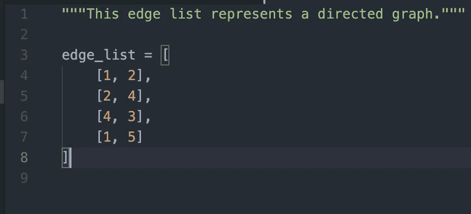
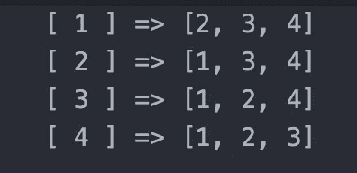

# 为什么图论比你想象的要酷

> 原文：<https://towardsdatascience.com/why-graph-theory-is-cooler-than-you-thought-4df73e2a4950?source=collection_archive---------17----------------------->

## [思想和理论](https://towardsdatascience.com/tagged/thoughts-and-theory)

## 机器学习中的图论，以及它是如何改变游戏的

*这是关于图论和图形神经网络的四部分系列的第一篇文章。*

照片由[纳斯蒂亚·杜尔希尔](https://unsplash.com/@dulgier?utm_source=unsplash&utm_medium=referral&utm_content=creditCopyText)在 [Unsplash](https://unsplash.com/s/photos/connected?utm_source=unsplash&utm_medium=referral&utm_content=creditCopyText) 拍摄

## 什么是图？

与任何学科的科学家交谈，并根据他们的学科问他们这样一个问题:“at 材料的第*和第*是如何工作的？”你可能会发现，在你能够真正理解任何给定事物如何工作之前，你必须考虑一些系统和网络:无论是人体、生态系统中的食物链、化学反应还是整个社会。在不了解一个生态系统中两个动物之间的关系，一个分子中的两个原子，或者我们身体中的细胞和组织之间的关系的情况下，你只是拥有一堆数据:细胞的列表，动物的读数以及它们吃什么等等。

传统的机器学习模型通常以这种方式获取数据:它们获取数据列表或表格，并做一些*事情*(细节取决于所使用的算法以及其他一些参数)来预测一件事情。但是对于某些问题，有更好的方法。

图形是表示它们所包含的数据的网络或关系的数据结构。通常，它们被表示为“节点”和线，或者“边”。

图 1:用图表示的社交媒体网络的示例，虚线或实线表示关系的强度。图片由[戈登·约翰逊](https://pixabay.com/users/gdj-1086657/?utm_source=link-attribution&utm_medium=referral&utm_campaign=image&utm_content=3846597)拍摄，来自 [Pixabay](https://pixabay.com/?utm_source=link-attribution&utm_medium=referral&utm_campaign=image&utm_content=3846597)

上面的图 1 是一个“无向图”的例子，或者说，一个数据与其他数据有双向关系的图。这意味着我们图中的每个*节点*，每个代表一个社交网络中的一个人，都与其他节点相连接。这可能代表一个像 LinkedIn 这样的社交网站，在那里一旦你和某人联系上了，你就和其他人联系上了。有向社交网络图的一个例子可能是 Twitter，其中用户互相关注(并不总是互相关注)。

代表数据(用户)的图像被称为**节点**或**顶点**，连接它们的线被称为**边。**这些线表示顶点之间的关系，可以表示为“全有或全无关系”(即:你跟随某人或你不跟随)，或者表示为“加权”关系(即:实线可以表示两个用户之间的较高参与度，而虚线可以表示较弱的关系或较低的参与度)。

在这一点上，很可能你正在感受我第一次在计算机科学课上接触到图形和图论时的感受:无聊并且可能有点困惑。好消息是，既然我们已经涵盖了理解好东西所必需的一些术语，我们可以开始进入**为什么图表很重要，是什么让它们如此酷。**

## 那又怎样？

在计算机科学中，图形已经被用于一些非常好的东西:例如，你的地图应用程序正在幕后使用图形来存储关于位置和连接它们的街道的数据，并且正在使用最短距离算法来为你找到到达目的地的最短路线。

但是当我们开始使用图表进行机器学习时，情况会变得更好。因为图表展示了数据片段之间的综合关系(与数据的有序列表或[张量](https://machinelearningmastery.com/introduction-to-tensors-for-machine-learning/)相比，后者本身很少告诉我们数据点或特征之间的关系)，我们可以使用它们来执行深入的分析，并基于这些关系做出预测。

## 图论和机器学习——但是怎么做？

在我们开始收获将我们一直谈论的这些图表或网络与机器学习相结合的好处之前，我们必须以某种方式用计算机——然后是机器学习算法——可以理解的方式来表示我们的图表。

传统上，图表可以用三种基本方式之一来表示:

1.  **邻接矩阵**

邻接矩阵确实…就像它们听起来要做的那样。它们使用矩阵表示不同节点之间的连接，或*边*。我们可以看一个例子来说明这可能是什么样子:

图 2:简单的图及其邻接矩阵，由 Safet Penji 通过[来源](https://www.researchgate.net/figure/Simple-graph-G-5-and-its-adjacency-matrix_fig3_273062204)提供。

在这里，我们可以通过找到它们的标签在矩阵中的交叉点来找到两个音符之间的边。例如，我们可以看到，节点 1 没有连接到自身，而是连接到节点 2。

**2。边缘列表**

边列表是以一种计算上可理解的方式来表示我们的网络或图形的另一种方式。这里，我们在一个列表中表示成对的连接节点。你可以看到下面的例子:

图 3:边列表包含相互连接的顶点或节点对。图片作者自己的。

**3。邻接表**

邻接表结合了上述两种方法，表示一个节点列表，连接到所有直接连接的节点列表。为了说明这一点，我们来看一个例子:

图 4:图 2 中𝝘₅的邻接表的可视化表示。这表明对于节点 1，我们有一个连接节点的列表，等等。图片作者自己的。

通过以上三种方法，我们能够解决在代码中计算表示图形的困难。然而，当向机器学习模型馈送图形时，仍然存在一些挑战。传统上，深度学习模型擅长处理占用固定空间量且单向的数据。无论我们如何表示它们，图都不会占用固定的内存空间，也不是连续的，而是每个节点都有一个对它直接连接的节点的引用。

有一些非常棒的方法来应对这些挑战，我将在以后的文章中深入探讨。现在，如果你感兴趣，我会给你留下一些资源供你自己研究，这些资源为我们提供了新的方法来扩展机器学习能够解决的问题。

*   [通过图卷积网络了解关于图的深度学习](/how-to-do-deep-learning-on-graphs-with-graph-convolutional-networks-7d2250723780)
*   [了解 deep walk——一个寻找另一种方法来表示机器学习图形的项目](https://cs.stanford.edu/people/jure/pubs/graphrepresentation-ieee17.pdf)

## 图论和机器学习——我们能用它做什么？

真空中不存在任何东西，理解构成我们许多科学学科的相互关联的数据网络为回答如此多的问题提供了令人兴奋的潜力——超出了我在本文中所能涵盖的范围。

如果我们能更好地理解人脑会怎么样？如果我们可以预测一些刺激或变化对生态系统的影响，会怎么样？或者，预测哪种化合物最有可能创造出有效的药物？

我们刚刚学到的最好的部分是我们可以——这不仅仅是理论上的可能性，而是我们现在正在做的事情！

图论已经被用于:

1.  [诊断建模(在一定程度上预测患者是否有特定诊断)](https://medium.com/swlh/graph-theory-machine-learning-in-neuroscience-30f9bec5d182)。
2.  [帮助癌症患者进行诊断和治疗](https://www.nature.com/articles/s41698-017-0029-7)。
3.  [开发药品(药物)](https://arxiv.org/pdf/2012.05716.pdf)。

4.[寻求发展生态学和进化论之间的理论综合](https://www.frontiersin.org/articles/10.3389/fevo.2019.00402/full)。

## 图论如何让这一切发生

让我们更深入地研究一下这些应用程序，这样我们就可以更详细地了解图论在其中的应用。

让我们以诊断模型为例。具体来说，我想看看这个网络分析用于诊断和识别患者中可能的精神分裂症的例子:

 [## 精神分裂症的图基网络分析

### 在过去的几年里，已经发表了许多使用现代大脑网络分析的研究。研究人员和…

www.ncbi.nlm.nih.gov](https://www.ncbi.nlm.nih.gov/pmc/articles/PMC3782171/) 

使用图表来表示大脑的网络分析，神经科学家能够绘制与精神分裂症诊断相关的关键发现。鉴于精神分裂症的发病有某些标志:

*   效率较低的有线网络
*   较少局部聚类
*   较少层级的组织

我们可能会用机器学习算法来评估这些网络，并根据这些标记来预测患者患有或将会患精神分裂症的概率。

由 [MART PRODUCTIONS](https://www.pexels.com/@mart-production) 在[像素](https://www.pexels.com/photo/technology-computer-room-health-7089290/)上拍摄的照片

在这个例子中，如果没有这些网络的知识，这种分析就变成了对病人的完全不同的神经学分析。对精神分裂症的这些发现的有希望的发现对这种疾病的诊断和治疗具有有希望的意义——可能的早期诊断和干预远远超过简单的评估症状。

这只是一个例子，但完全说明了图论在机器学习中的好处，因为它与其他学科交叉。

事实是，我们的数据往往比我们单独用列表、数据框或张量所能表示的要多得多。虽然有很多方法可以探索我们的数据，并以我们可以假设关系的方式呈现它，甚至使我们的算法能够预测这些关系，但当我们能够以不同的方式表示我们数据之间的联系时，我们就能够对我们拥有的数据做更多的事情。

当我们理解了*事物*相互关联的方式，我们就能更好地理解它们:我们能做出更全面的预测，回答更难的问题，带来一些改变生活的美好结果。

*想了解更多？查看该系列的其余部分:*

*   [图形卷积网络——解释](https://sid-arcidiacono.medium.com/graph-convolutional-networks-explained-d88566682b8f?source=your_stories_page-------------------------------------)
*   [图卷积网络的工作原理是什么？](/what-makes-graph-convolutional-networks-work-53badade0ce9?source=your_stories_page-------------------------------------)
*   [对蛋白质基准数据集进行分类](/classifying-the-proteins-benchmark-dataset-ec18e728a17a?source=your_stories_page-------------------------------------)

**属性:**

1.  [关于图论和机器学习你需要知道的一切](/graph-theory-and-deep-learning-know-hows-6556b0e9891b?gi=62c6142fc84c)
2.  [图论&神经科学中的机器学习](https://medium.com/swlh/graph-theory-machine-learning-in-neuroscience-30f9bec5d182)
3.  [了解你的邻居——图上的机器学习](https://www.kdnuggets.com/2019/08/neighbours-machine-learning-graphs.html)
4.  [用于精确肿瘤学的基于网络的机器学习和图论算法](https://www.nature.com/articles/s41698-017-0029-7)