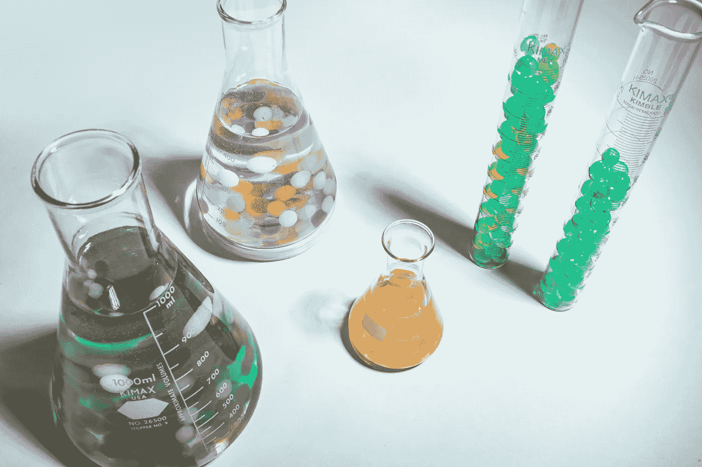

# 为什么我成为了一名数据科学家而不是数据工程师

> 原文：<https://towardsdatascience.com/why-i-became-a-data-scientist-over-a-data-engineer-968e750acf7?source=collection_archive---------5----------------------->

## 意见

## 帮助你决定你的职业


照片由[un splash](https://unsplash.com/s/photos/arrows?utm_source=unsplash&utm_medium=referral&utm_content=creditCopyText)【1】上的 [Nick Fewings](https://unsplash.com/@jannerboy62?utm_source=unsplash&utm_medium=referral&utm_content=creditCopyText) 拍摄。

# 目录

1.  介绍
2.  产品利益相关者协作
3.  Python 优于 SQL
4.  面向实验
5.  摘要
6.  参考

# 介绍

长话短说，当然，比起数据工程师，我更喜欢做数据科学家，但是为什么呢？也许我将分享的这些来自我个人经历的原因可以与你的想法联系起来，或者至少可以帮助你决定是否要追求其中的一条道路，或者重新考虑转换到另一个角色。虽然这两个角色有着相同的第一个单词，但是这两个位置之间有着巨大的差异。

很容易将数据工程视为之前，将数据科学视为之后。我们将深入探讨这一说法，但从本质上讲，数据工程师提供了数据科学赖以发展并从中获益的基础和结构。需要注意的是，有些职位的要求是重叠的，有些公司甚至将这两种角色结合在一起。然而，我认为最好假设这些是独立的角色，因为它们的关注点有很大的不同。话虽如此，让我们看看数据科学优于数据工程的原因。

# 产品利益相关者协作


由[杰森·古德曼](https://unsplash.com/@jasongoodman_youxventures?utm_source=unsplash&utm_medium=referral&utm_content=creditCopyText)在[Unsplash](https://unsplash.com/s/photos/meeting?utm_source=unsplash&utm_medium=referral&utm_content=creditCopyText)【2】上拍摄的照片。

在某种程度上，数据科学家有点像产品经理，这在您的决策或推理中可能是赞成或反对的。我喜欢定义问题陈述、确定数据在哪里以及如何获取数据(*通常由数据工程师*协助)、特征工程、模型比较、最终模型部署以及对产品用户影响的分析。

> 以下是**一些**数据科学家关于产品利益相关者协作的经验，你可能喜欢，也可能不喜欢:

*   识别用户面临的产品缺陷
*   用算法开发解决方案
*   在应用程序的前端和中心查看您的产品变化
*   分析你对企业及其用户的影响，并以此为荣
*   更多地与产品团队合作
*   更多地关注产品战略

当然，这些角色之间总是会有一些重叠，即使有上面讨论的这些经历。然而，数据工程师更关注数据本身，而数据科学家往往更关注产品项目。

数据工程师的用户往往也是工作场所的雇员，因为数据科学家可能是数据工程产品 pr 项目的用户。对于数据科学家来说，情况通常相反，产品倾向于面对更多的外部用户，即客户，但数据科学家仍然可以使用内部工具。

# Python 优于 SQL


戴维·克洛德在 [Unsplash](https://unsplash.com/s/photos/python?utm_source=unsplash&utm_medium=referral&utm_content=creditCopyText) 上拍摄的照片。

这些编码语言非常不同，大多数公司通常希望你精通这两种语言，不管你是数据科学家还是数据工程师。但是，对于数据工程师来说，重点通常是 SQL，而对于数据科学家来说，则是 Python ( *或 R* )。也就是说，如果您不喜欢 SQL 或查询，但仍然喜欢数据本身并使用它，那么您很可能属于数据科学的阵营。

> 以下是数据科学家如何使用 Python 以及何时使用 SQL 的一些示例:

*   Python 在流行的库中使用
*   包含大部分数据科学部分的 Python 库——机器学习算法
*   Python 也可以用于部署
*   SQL 通常用于预先查询数据集，或者 SQL 用于查询模型的结果，但是，有些查询可以在 Python pandas 查询库模块中完成

同样，你可能会在两种职业中都用到这两种语言，但不同的是在日常工作中你更喜欢用哪一种。如果您只关注模型本身，有时您可能会两周不使用 SQL，而其他时候您可以每小时使用一次 SQL。

# 面向实验



[少女在](https://unsplash.com/@girlwithredhat?utm_source=unsplash&utm_medium=referral&utm_content=creditCopyText)[Unsplash](https://unsplash.com/s/photos/experiment?utm_source=unsplash&utm_medium=referral&utm_content=creditCopyText)【4】上带着红色帽子的照片。

作为一名数据工程师，你当然可以进行关于时间消耗、内存、成本等方面的实验。，但我所讨论的实验是传统的想法。

> 作为一名数据科学家，以下是您可能会做的一些实验:

*   具有重要意义的传统 AB 测试
*   特征/重要性的比较
*   模型比较
*   准确性或误差度量的比较
*   业务指标比较(*KPI—关键绩效指标*
*   以图形/视觉方式比较以上所有内容
*   比较非常适合与利益相关者和非数据科学家用户进行讨论

这些实验是数据科学工作的核心，实验和比较可以应用于几乎任何工作，但对于算法和静力学来说，实验是关键。

# 摘要

无论你更喜欢产品方面而不是严格的工程方面，更喜欢 Python 而不是 SQL，并且喜欢测试实验情况，那么数据科学可能比数据工程更适合你。

> 总而言之，以下是我更喜欢数据科学而不是数据工程的一些原因，也许这些与您的想法不谋而合，或者对您来说可能是新的:

```
* Product Stakeholder Collaboration* Preference for Python over SQL* Experimentation Oriented
```

我希望你觉得我的文章既有趣又有用。如果您同意或不同意这些选择数据科学的理由，请在下面随意评论。为什么或为什么不？你认为我们还可以讨论哪些重要的原因或情况？这些当然可以进一步澄清，但我希望我能够阐明一些更独特和具体的为什么我选择数据科学而不是数据工程。感谢您的阅读！

***我不属于这些公司中的任何一家。***

*请随时查看我的个人资料、* [Matt Przybyla](https://medium.com/u/abe5272eafd9?source=post_page-----968e750acf7--------------------------------) 、*和其他文章，并通过以下链接订阅接收我的博客的电子邮件通知，或通过点击屏幕顶部的订阅图标* ***点击关注图标*** *的订阅图标，如果您有任何问题或意见，请在 LinkedIn 上联系我。*

**订阅链接:**[https://datascience2.medium.com/subscribe](https://datascience2.medium.com/subscribe)

# 参考

[1]照片由[缺口编号](https://unsplash.com/@jannerboy62?utm_source=unsplash&utm_medium=referral&utm_content=creditCopyText)在[防溅板](https://unsplash.com/s/photos/arrows?utm_source=unsplash&utm_medium=referral&utm_content=creditCopyText)上拍摄，(2018)

[2]Jason Goodman 在 [Unsplash](https://unsplash.com/s/photos/meeting?utm_source=unsplash&utm_medium=referral&utm_content=creditCopyText) 上拍摄的照片，(2019)

[3]照片由[大卫·克洛德](https://unsplash.com/@davidclode?utm_source=unsplash&utm_medium=referral&utm_content=creditCopyText)在[Unsplash](https://unsplash.com/s/photos/python?utm_source=unsplash&utm_medium=referral&utm_content=creditCopyText)(2018)上拍摄

[4]照片由[带着红色帽子的女孩](https://unsplash.com/@girlwithredhat?utm_source=unsplash&utm_medium=referral&utm_content=creditCopyText)在[un splash](https://unsplash.com/s/photos/experiment?utm_source=unsplash&utm_medium=referral&utm_content=creditCopyText)(2021)上拍摄