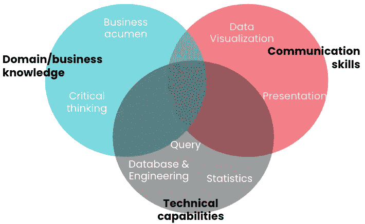

# 为什么我选择全栈数据分析作为我的职业道路

> 原文：<https://towardsdatascience.com/why-i-choose-full-stack-data-analytics-as-my-career-path-d7b3986e0285?source=collection_archive---------17----------------------->

埃斯特万·洛佩兹在 [Unsplash](https://unsplash.com?utm_source=medium&utm_medium=referral) 上的照片

## 不是数据科学家，不是 ML 工程师，也不是统计学家。只是一个普通的白色分析扭曲。

类似于寻找伴侣，我认为职业道路是非常**私人的事情**。没有唯一完美的答案，这完全取决于你的特点、需求、偏好、目标和使命。但是你可以做研究，向其他已经找到配偶的人学习——合适伴侣的特征，并思考这些是否是你自己想要的。

作为数据领域的新人，我最初是一名分析师，与产品经理、业务开发/战略团队以及其他数据英雄一起工作:数据工程师、数据科学家、统计学家、机器学习工程师和数据产品经理。

在观察和体验了几年数据角色的实际工作和行业最佳实践后，我决定追求 [**(全栈)数据分析**](/how-does-a-remarkable-data-analyst-look-like-dd0e4326c670) **路径**。不是作为一名数据科学家(尽管被大肆宣传为 21 世纪最性感的工作)，也不是作为一名 ML 工程师(尽管报酬更高)，也不是任何其他与数据相关的角色。

我所指的全栈数据分析师是指能够利用数据处理、统计和机器学习方法来提供战术见解并解决产品或业务问题的人。他知道各种数据处理技术，从查询和数据可视化到高级推理统计和机器学习，并且能够利用适当的 T21 来处理某些数据集。他还对业务环境有着广泛的理解，因此能够识别相关的数据点和要提供的见解。

它超越了回答像“*我们上个月的销售额是多少”这样的直接描述性问题。*"对于类似于"*的**诊断性、预测性和规范性问题**，客户满意度的驱动因素是什么？*"和"*我们如何立即识别滥用/欺诈客户？*”。

# 作为一名全栈数据分析师，我喜欢的 4 件事

## 1.广泛曝光和动态

数据分析是一个广阔的领域，不同的组织对此角色有不同的期望，他们也有不同的角色命名。它们可以出于不同的目的存在于组织中的不同部门。一般来说，这项工作包括以下内容:

*   识别与业务问题相关的数据(**领域知识**)
*   收集、操作、综合和总结数据(**技术知识:查询、统计、数据建模等**
*   向利益相关者展示见解(**数据可视化、讲故事和沟通技巧**)
*   将洞察作为数据产品实施——数据工具、启发式、模型部署(**技术:工程和机器学习**)

考虑到工作的广泛性，很自然地，你需要掌握许多不同的技能来学习和**探索**。我一直很享受这条职业道路提供的商业和技术知识、硬技能和软技能的混合。

数据分析技能集(作者提供图片)

商业敏锐度和领域知识因你所工作的团队而异。作为一名数据分析师，你与众多利益相关者密切合作解决问题。你的利益相关者会有所不同，从产品团队、工程团队，到战略、营销或设计团队。为了理解他们的问题，你需要了解他们的背景。当你是产品增长的数据分析师时，你可能会熟悉营销渠道、数字营销，甚至不同的产品促销方案。当您是运营团队的数据分析师时，您可能会熟悉业务流程和效率指标。有趣的是，因为利益相关者需要数据来进行重大决策，**你将获得利益相关者方面发生的事情的第一手资料**。

数据分析师的技术暴露差异很大。它肯定涵盖了基本的数据库、查询、描述性统计和数据可视化。当你进行全栈时，你可以一直进行推理统计、机器学习和产品集成。作为一名数据分析师，**除了创建报告/仪表板和生成见解**，我还一直在开发自己的技术知识，以进行**启发式规则集和简单的预测建模**。*这并不仅限于书面见解，我还有机会将它们应用到产品实现中！*

## 2.走进未知，获得灵感！

在某些方面，数据分析工作就像侦探工作。可能会有一些犯罪现场、演员或证据等待检查和审问，但你永远不知道你是否会得到那个谜的“答案”。同样，在数据分析中，有大量的数据有待发现，而在你探索这些数据之前，你不知道你会从中获得什么。

(众多的)利益相关者会带着不同的问题来找你。即使在同一个领域，随着市场的发展，业务问题也是动态的。我总是对研究新问题感到兴奋，一头扎进数据中，探索转换单个数据集的无限方法。一旦开始，**好奇号**将开始继续探索，并在途中揭开洞见。

图片来源:[https://image . free pik . com/free-vector/cat-monster-realistic-composition _ 1284-23966 . jpg](https://image.freepik.com/free-vector/cat-monster-realistic-composition_1284-23966.jpg)；有修改

你最有可能期待的是对利益相关者来说非常鼓舞人心的见解，一些以前没有想过的有趣的东西。不是所有的数据分析结果都是这样的，不管你用的是哪种技术。这完全没问题，因为洞察力可以以多种形式出现。洞察可以是**新信息**，可以**拒绝/验证假设**的事实，甚至只是一个非结论性的结果，证实**你没有正确的数据**来回答问题。当我得到最后一个数据时，我将考虑一个数据代理，并研究如何为我的下一次数据探索获得正确的数据:)

## 3.速度和实用性

引用[凯西·科济尔科夫](https://kozyrkov.medium.com/?source=post_sidebar--------------------------post_sidebar-----------) [这里](/data-sciences-most-misunderstood-hero-2705da366f40)，*最好的分析师是闪电般快速的程序员，他们能快速浏览大量数据集，比其他专家说的“白板*”更快地遇到并展现潜在的见解。与数据科学中的其他角色相比，数据分析项目的**生命周期要快得多**。统计学家将需要不同的统计测试来达到一定的置信水平，而 ML 工程师将需要多个过程和培训来提供一个健壮的数据模型。另一方面，数据分析师可以快速浏览当前数据并获得见解，而不会影响质量，因为他们实际上只是强调事实。

我曾在一家超高速发展的初创公司工作过，那里的事情变化非常快，问题需要马上得到回答。

> 作为一名数据分析师，我能够**始终如一地产生影响，即使市场在发展**。

当然，这只能通过我在过程中确定的一些策略来实现:有更多的**战术分析块**(而不是宏大的基础分析)，并且总是**使分析可重复——**保存查询并记录下来，或者更好的是，您可以使用 Python/R Notebook 快速重新运行。

我还对分析结果带来的直接和无形影响着迷。在大多数情况下，数据分析师的交付成果是一组可操作的见解，用于利益相关方的决策。*一些关键的决策可以改变一个组织的整体方向，想象一下它来自于你的探索！*

也有可能可交付成果是一组启发性的规则，用于改进当前的系统。实施变更后，您可以直接看到您的工作以及工程和运营工作对组织的影响。

## 4.做桥梁和翻译

我开始意识到技术人员(主要是工程师)和非技术人员(商业、管理、创意等)之间存在偏见。通常这些技术人员生活在他们自己的世界里，很难沟通。作为一名对技术感兴趣的工科毕业生，我正在通过成为一名数据分析师来消除这些偏见。

如上所述，数据分析师需要具备多种技术专长。他们需要知道如何使用数据库(PostgreSQL、MySQL、BigQuery，随便你怎么说！)、统计编程语言和库(Python/R)、数学和计算术语、多种数据处理软件(从老好人 Stata 到 Tableau)。可以肯定地说他们是技术人员，但是他们也被期望以一种易于理解的方式向非技术利益相关者交付他们的工作。

为了能够以正确的方式交付，您需要很好地了解您的利益相关者——他们是谁，他们的需求是什么，他们已经知道了什么。通过这种方式，你对他们和他们的问题感同身受，让你对组织的现实问题有所了解。最终，你可以通过数据故事来实现 ***洞察。***

图片来源:[https://image . free pik . com/free-vector/statistics-concept-illustration _ 114360-172 . jpg](https://image.freepik.com/free-vector/statistics-concept-illustration_114360-172.jpg)

在某些情况下，可以使用数据模型或其他工程工作进一步扩展洞察交付，作为数据分析师，您可以成为**促成协作的推动者**。您可以用*“人类”语言*向业务涉众解释问题和潜在收益，用*“技术”语言*与数据工程师和/或数据科学家讨论架构解决方案。

# 结束语

我想再次重申，职业道路的选择确实是个人偏好和决定。而且有时候角色名相同的人在不同的组织里可以做非常不同的事情(好吧，片头戏可不是闹着玩的！).在我的职业生涯中，我一直在一家高速增长的初创公司和一家科技巨头中从事全栈数据分析，这是我真正喜欢的事情。

令我沮丧的是，数据分析的作用被大大低估了，而且还有一些情况下[分析被视为二等公民，这肯定会伤害组织和整个行业。](/data-sciences-most-misunderstood-hero-2705da366f40)这可能是由于**组织没有能力很好地利用他们的分析功能**，以及**不想发展自己的数据分析师** —学习更多数据建模和工程方面的知识。

我分享这些东西是因为我觉得分析*(做得好)*与我的个性产生了难以置信的共鸣，我非常确定它也可以与其他人相匹配。我建议每个进入数据科学领域的人考虑自己的个人适合度，不要被某些数据科学角色的宣传所拖累。毕竟，你将不得不长期坚持和发展你的工作，所以不妨做一些让你兴奋的事情，对吗？:)