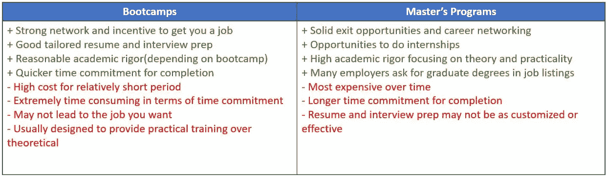

# 为什么我选择了数据科学硕士学位而不是训练营

> 原文：<https://towardsdatascience.com/why-i-chose-a-data-science-masters-degree-over-a-bootcamp-e538bb305962?source=collection_archive---------32----------------------->

## 如何驾驭决策过程

维多利亚诺·伊斯基耶多在 [Unsplash](https://unsplash.com?utm_source=medium&utm_medium=referral) 上的照片

在我意识到我想转向一个更加以数据为中心的职业之前，我在本科毕业后的专业领域工作了两年。我当时是一名 IT 风险顾问，就前景和发展而言，这是一份很棒的工作，但这不是我的长期激情所在。

我当时的角色有点技术性，但我没有接触到我想要的那么多数据和编程。因此，我做出了艰难的决定，去寻找其他机会，让我在数据科学和分析领域打下坚实的技术基础。让我告诉你，我当时从培养这些技能的渠道方面考虑了一切，包括数据科学训练营、硕士课程和免费在线课程(MOOCs)。最终，我参加了一个我认为最适合我的情况和目标的认证硕士项目，但在这个决定过程中，我花了很多时间来权衡我的不同选择。

为了理解我的决策，我将分享我采取的步骤和考虑。我的希望不是为那些考虑从事数据职业的人指定一条特定的道路，而是分享我的经验以及可以补充或帮助你自己做出决定的东西。

## 不要重新发明轮子——去寻找那些经历过的人

首先要做的是——尽可能多地了解潜在的训练营，并从其他人那里获得硕士学位。当你没有那么多选择或信息需要筛选时，做决定是容易的，但这并不总是意味着你做出了最好的决定。

通过一个项目的网站在网上寻找信息是很容易的，但是你的研究不应该就此停止。如果一个训练营或大学有一个开放参观或信息会议，试着去参加，准备好几个问题。最好的问题是那些能给你新信息或让你听到个人观点的问题，这些观点是你在阅读小册子或网站时无法找到的。例如，我在纽约市参加了许多训练营的开放会议，在那里当前的成员向未来的雇主、网络和像我一样的未来候选人展示他们的最终项目。这让我对学生们完成的工作和他们的背景有了一种感觉。这也让我可以直接联系他们，并在最后问他们一些具体的问题，比如:

> “你在寻找什么样的工作机会，这个项目具体如何帮助你与招聘公司取得联系？”

现在——不是每个人都能轻松参加这样的现场活动(尤其是在全球疫情期间),但幸运的是，我们生活在一个日益数字化和虚拟化的世界。尝试参加任何提供的虚拟会议，或者至少参加一次——在 LinkedIn 上联系你感兴趣的项目的前校友或现学生。具体来说，我每天的目标是在 LinkedIn 上联系至少 3 个我正在关注的项目中的人，他们目前在我感兴趣的公司工作或担任我感兴趣的角色。我甚至在我的日历上安排了一个每日事件来让我掌握它。一开始，在网上接触陌生人似乎有点冷漠和不真诚，大多数时候你会被拒绝，但你会惊讶地发现，如果被适当地询问，有很多人愿意分享他们的经验或联系。

这是我在 LinkedIn 上发给某人的一条真实信息:

作者图片

幸运的是，这一信息导致了与校友成员的直接对话，在那里我解释了我的背景和考虑该项目的兴趣，并了解了他们的经验。最后，那个人强烈反对我参加这个项目。很多时候，像这样的负面消息实际上比支持你确认偏见的正面消息更有帮助。

## 比较选项，找到那些壕沟

在过去的 10 年中，数据科学和以数据为中心的职业越来越受欢迎，随之而来的是迎合这一领域的新学术项目和训练营的数量增加。实际上，这也使得人们越来越难以根据各种项目提供的好处来区分它们。然而，在看了足够多的这些之后，就每一个提供的优点和缺点而言，有一些共同的主题:

作者创建的表格

这个列表并不详尽，我遇到的每一个都有很多其他的好处，但是这真的取决于你正在看的具体项目。例如，许多训练营似乎非常适合已经拥有行业经验和强大的工程师技术背景的专业候选人，或者拥有相关博士学位并希望补充技能以适应特定职业的专业候选人。然而，也有训练营，在那里你可以学到初级技能，它们可以适合任何人，不管你以前有什么经验。

也就是说，我所做的(也是我所建议的)是看一看所有的利弊，确定哪些好处对我来说是最有价值的，然后仔细比较两条路径，以了解哪些确实有突出的好处，而如果我选择另一条路径，则无法轻松实现或根本无法实现。我的意思是每一个的护城河是什么。**护城河**是由非常成功的投资者沃伦·巴菲特推广的一个术语，指的是一家公司(或本案例中的数据科学机构)相对于竞争对手的明显竞争优势。

举例来说，虽然训练营可以在项目和与行业专家一起工作方面提供更多实践经验，但我在参加硕士课程时，难道不能多花一点努力来培养这种能力吗？如果是这样的话，我真的不认为这是训练营独有的护城河。通过为我的顶点选择一个特定的项目，与一位教授合作研究应用程序，或者完成实习，我也可以获得实际的现实生活中的数据科学应用。

## **评估什么最适合你**

一旦你很好的理解了不同的优点和缺点，根据你的首要任务来确定什么是最适合你的。对我来说，我最优先考虑的事情，没有特定的顺序，是:

> a)获得真实和实用的行业经验
> 
> b)能够同时工作并维持财政支持
> 
> c)在数学和技术上挑战自我

对于 A-boot camps 是高度激励的，让我在最后得到一份工作，但没有一个是有保证的，再加上工作是在我的经历结束时得到的，我可能喜欢也可能不喜欢。另一方面，提前在研究生项目实习来试驾特定角色的想法非常有吸引力。对 B 来说——读研是一件很容易的事，因为我看到的大多数训练营每天都有紧张的日程安排，很少或根本没有时间工作或承担其他真正的责任。对 C 来说，它实际上只是提供更多理论和统计课程的学术项目，这是我在旅程中的薄弱领域。

## 最后几轮决定

一旦你决定了你想走什么样的渠道，剩下要做的就是找到你最感兴趣的学校并申请。成本、时间表、课程设置、声望和地点都是需要考虑的重要因素。请记住，在旅程结束时，没有一种方法可以让你成为数据科学家、机器学习工程师或“插入你想要的头衔”。希望这能帮助你更好地找到最适合你的方法。

## 参考

[1]勇敢，克里斯。(2019 年 7 月 7 日)。*什么是经济护城河？*收自 http:[http://www . investopedia . com/articles/investing/022415/ten-worst-missons-beginner-investors-make . ASP](https://www.investopedia.com/ask/answers/05/econohmicmoat.asp)