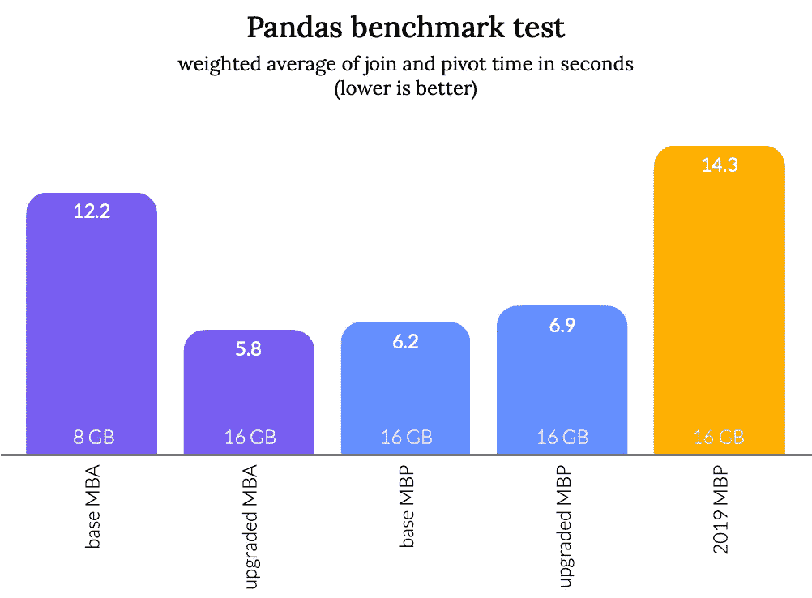
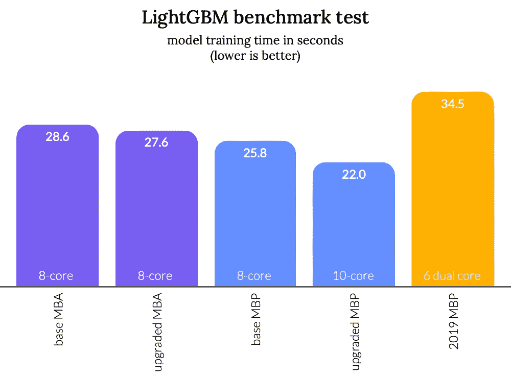
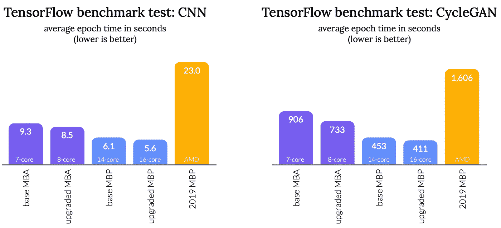
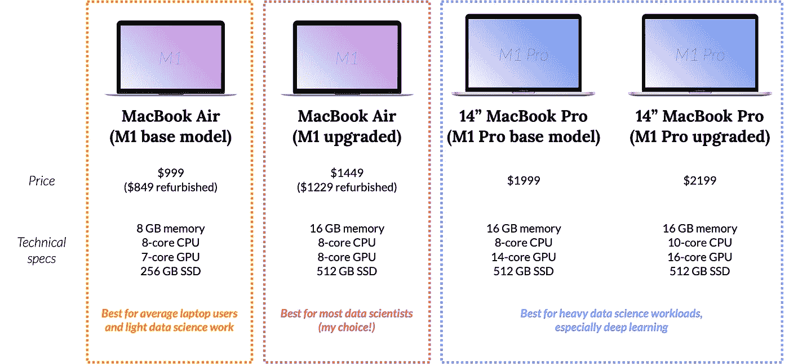

# 作为一名数据科学家，我为什么选择 MacBook Air 而不是 MacBook Pro

> 原文：<https://towardsdatascience.com/why-i-chose-the-macbook-air-over-the-macbook-pro-as-a-data-scientist-9207f309db0c?source=collection_archive---------0----------------------->

## 基准测试和其他考虑因素，帮助您在最新和最好的苹果笔记本电脑之间做出选择

在 [Unsplash](https://unsplash.com?utm_source=medium&utm_medium=referral) 上由 [Iewek Gnos](https://unsplash.com/@imkirk?utm_source=medium&utm_medium=referral) 拍摄的照片

目前是升级到新 Mac 的好时机，因为苹果正在推出他们改变游戏规则的苹果硅(M1)芯片。我最近想买一台新笔记本电脑，主要竞争对手是 **2020 MacBook Air** 和 **2021 MacBook Pro。**

在本文中，您将从数据科学家的角度找到 MacBook Air 和 MacBook Pro 的详细比较，包括一些常见数据相关任务的基准测试。这篇文章的标题破坏了结尾(我选择了空气)，但我会提供如何决定哪个选项适合你的建议。

# 我的背景

为了建立背景，这里有一些关于我的信息，以及我对个人笔记本电脑的期望。

*   我喜欢在空闲时间从事与数据相关的项目([有时候我会写一些关于它们的东西！](https://medium.com/@djcunningham0))。这通常意味着大量的数据处理、数据分析，有时还需要复杂的机器学习模型。
*   我的项目通常涉及足够小以适合内存的数据集。我很少会在我的个人项目中使用真正庞大的数据集。
*   我不经常使用深度学习模型。偶尔我会训练一个深度神经网络，但我通常使用更传统的建模技术。稍后我会解释为什么这会影响你的决定。
*   除了业余爱好数据项目，我还做大量的照片编辑，偶尔做一些小的视频编辑。我不会用我的笔记本电脑玩任何严肃的游戏或者其他太费事的事情。
*   我使用苹果生态系统已经很多年了，所以我没有认真考虑过任何其他选择。抱歉，所有的 Windows 或 Linux 爱好者。

*注意:我也是一名专业的数据科学家，但我是在购买一台个人笔记本电脑，而不是为了工作。你是购买个人电脑还是专业电脑也会影响你的决定。*

# 竞争者

苹果在过去一年左右发布了两款出色的笔记本电脑:采用 M1 芯片的 **2020 MacBook Air** 和采用 M1 Pro 或 M1 Max 芯片的 **2021 MacBook Pro** 。与前几代 MacBook 使用的英特尔芯片相比，苹果硅芯片已经表现出巨大的性能和效率改进。

这些机器有大量可能的配置选项，我不会一一列举(前往[苹果网站](https://www.apple.com/mac/compare/?modelList=MacBook-Air-M1,MacBook-Pro-14,MacBook-Pro-16-2021)亲自探索)。相反，我将它缩小到四个选项，我认为这四个选项将满足大多数人的需求，包括大多数数据科学家。以下是这四个选项及其相关的技术规格:

这四个选择之一很可能是你理想的笔记本电脑。图片作者。储存来自 [Pixabay](https://pixabay.com/illustrations/apple-macbook-pro-laptop-mockup-6306824/) 的笔记本电脑图片。

*注意:Air 和 Pro 之间还有其他的区别，我没有包括在上表中。其中一些可能会影响你的决定。我将在本文后面讨论这些差异。*

**MacBook Air 总结:**苹果阵容中最便宜的笔记本电脑(虽然起价 999 美元，但还是挺贵的)。它也是最小最轻的 MacBook。但不要认为它很弱——由于 M1 芯片，它的性能优于前几代的高端 MacBooks。我列出的“升级”选项是内存、CPU 和 GPU 的最高配置。

**MacBook Pro 总结:**苹果最强大的笔记本电脑，但是哇它太贵了…它*起价*1999 美元。如果你愿意，你可以将规格(和价格)推得更高，尤其是如果你选择 M1 Max 芯片的话。它有 14 英寸和 16 英寸两种尺寸，可用的规格和价格都非常相似——你是喜欢便携性还是更大的屏幕，这取决于你。

**缺什么？如果你熟悉苹果的产品系列，你会注意到我没有提到 M1 Max MacBook Pro。如果你主要使用笔记本电脑进行数据科学/工程任务，你可能不需要 M1 Max 芯片的所有功能。或者，如果你这样做了，你花在 M1 最大的额外的钱可能花在其他地方更好。我还忽略了 2020 年的 M1 MacBook Pro，因为我认为它对任何人来说都不是一个好的选择——它的规格与 MacBook Air 非常相似，但价格要高出几百美元。**

# 基准测试

让我们带着每台笔记本电脑转一圈，看看这些规格如何转化为性能。我购买了所有四种配置，并对它们进行了一系列基准测试。(然后我把不想要的退了——感谢你的轻松退货流程，苹果！)

由于我计划将我的笔记本电脑用于数据科学项目，所以我在设计基准测试时考虑了数据科学任务。具体来说，我测试了三个常用于数据科学任务的 Python 库:

*   **熊猫:**测试一些基本的数据操作。具体来说，将一些大型数据框架连接在一起，然后旋转一个大型数据框架。测量每个操作需要多长时间。 ***这主要是一项记忆密集型任务。***
*   **LightGBM:** 使用 LightGBM 库在大型数据集上训练多类分类模型。测量模型训练时间。 ***这主要是一个 CPU 密集型的任务。***
*   **TensorFlow:** 使用 TensorFlow 库拟合神经网络，该库允许在 MAC 上进行 GPU 加速。具体来说，在知名的 MNIST 数据集上训练一个卷积神经网络(CNN)，在 horse2zebra 数据集上训练 [CycleGAN](https://junyanz.github.io/CycleGAN/) 模型。测量每个时期的平均时间。 ***这主要是一个 GPU 密集型的任务。***

你可以在 GitHub 上找到测试[的全部细节，包括你自己运行测试的所有源代码和指令。](https://github.com/djcunningham0/m1_benchmarks)

## 结果

下面的图表显示了我测试的五台笔记本电脑的性能。以下是轴标签的关键字:

*   **基础 MBA:**M1 基础型号 MacBook Air(见上图)
*   **升级版 MBA:**M1 升级版 MacBook Air(见图)
*   **底座 MBP:**M1 Pro 底座型号 MacBook Pro(见图示)
*   **升级版 MBP:**M1 Pro 升级版 MacBook Pro(见图)
*   **2019 年 MBP:**16 英寸 MacBook Pro，配有 16 GB 内存和英特尔 i7 6 核 CPU 和 AMD 镭龙 Pro 5300m GPU——这是上一代英特尔的一款相当高性能的 MacBook(这是我的工作笔记本电脑)

让我们一个一个地检查每个测试的结果。

注释显示 RAM 的数量。图片作者。

Pandas 基准测试要求在内存中存储和操作大型数据帧。三台 16 GB 内存的 M1 机器(升级版 MBA、基本版 MBP 和升级版 MBP)的性能比 8 GB 内存的机器(基本版 MBA)高出约 50%。不要太在意确切的数字——由于 RAM 被机器上的其他任务使用，所以会有一些差异。你应该认为这三种中间型号的性能是一样的。

一个非常有希望的结果是，base M1 MacBook Air 在这次测试中的表现优于 2019 年的 16 英寸 MacBook Pro，*即使旧机器的内存是旧机器的两倍。似乎 8 GB 内存的 M1 芯片将击败 16 GB 内存的英特尔芯片。太神奇了。*

**要点提示:**加倍你的记忆使记忆密集型任务的速度(大约)比预期的快两倍。如果 Air 和 Pro 具有相同的内存容量，它们的性能将相同。M1 踢了英特尔的屁股。

注释显示 CPU 核心的数量。图片作者。

LightGBM 适合大型数据集上的梯度增强树分类模型。这是一项 CPU 密集型任务——在运行测试时，所有 CPU 内核都达到了极限。

让我们从 M1 Pro MacBook Pro 的测试结果开始。升级后的 MBP 内核数量增加了 25%，性能提升了 15%。有些收益递减，但是增加 CPU 内核对性能有非常好的线性影响。

现在让我们来看看 MacBook Air 的测试结果。虽然 Air 和 base Pro 都有 8 核 CPU，但它们并不相同-Air 有 4 个性能和 4 个效率核心，而 Pro 有 6 个性能和 2 个效率核心。这有多大的区别呢？嗯，基准测试表明，差异是可测量的，但并不巨大。base Pro 的性能比 Air 高出约 8%。换句话说，两款 Pro 机型的差距是 Air 和 base Pro 机型差距的两倍。

**要点:**增加 CPU 内核以可预测的方式提高性能。尽管有效率和性能核心分布，MacBook Air 的性能仍在 MacBook Pro 的 8%以内。再说一次，即使是最弱的 M1 芯片也比英特尔芯片强。

注释显示了 GPU 核心的数量。图片作者。

我将两个 TensorFlow 测试合并到同一个总结中，因为它们讲述了相同的故事。在这两个测试中，神经网络模型都是在数据集上训练的。TensorFlow 能够在 MAC 电脑(M1 和英特尔)上使用 GPU 加速，因此这主要是对 GPU 的测试。

同样，这些结果与我们从规格中得到的预期非常接近。升级后的 MBP GPU 比基本的 MBP 多 14%的内核，而基本型号慢 10%。基础 MBP 的内核是基础 MBA 的两倍，MBA 慢 75%(两次测试的平均结果)。虽然回报有所减少，但正如预期的那样，增加 GPU 核心的数量可以提高基准测试的性能。

这是我们看到的 M1 和英特尔机器之间的最大区别。所有的 M1 机器主宰了 2019 年的英特尔 MacBook Pro。(我预计随着时间的推移，这种差异会变得更加明显——tensor flow*在 M1 的 GPU 上工作*，但它可能还没有优化。我期待 TensorFlow 库的一些改进，这将在未来几年内逐步提高 M1 机器的性能。)

我没有在任何 M1 Max 机器上测试，但它们显然会实现更好的性能。你可以指定 M1 最大 32 GB 的 GPU 核心(如果你愿意花超过 3100 美元)。您可以从 TensorFlow 基准测试图表中推断出该芯片的性能。

这里值得注意的另一点是，MacBook Air 没有风扇。这通常没有关系，因为 M1 芯片的效率使温度得到控制，但在长期工作负载下(如训练深度神经网络)，计算机会变热。很有可能你会在某个时候看到一些热节流，这将在某种程度上减慢速度。我的基准测试运行的时间不够长，没有注意到任何节流，所以我无法评论影响会有多大。MacBook Pro 有一个风扇，所以它受节流的影响较小。

**关键要点:**增加 GPU 核心以可预测的方式提高 TensorFlow 性能，因此这是 MacBook Pro 的一大胜利，与 MacBook Air 相比，它的 GPU 更大。与旧款 MAC 电脑相比，所有芯片的性能都非常好。

*相关说明:*并不是所有流行的库都集成了 M1 GPU。例如，PyTorch 目前不支持 Mac (M1 或英特尔)上的 GPU 集成，也不清楚他们未来是否会添加支持。如果你是 PyTorch 用户，这是你必须解决的问题，要么使用 TensorFlow，要么购买云计算资源，要么购买单独的 Linux 机器和 GPU 进行机器学习。

# 技术规格之外的其他考虑

在提出建议之前，我想确认一些可能会影响你选择笔记本电脑的其他因素，因为我们大多数人并不使用笔记本电脑*只是*来处理数据。

很明显，苹果为从事密集图形设计、3D 渲染、视频工作等的人设计了最新的 MacBook Pro。他们将从 M1 Pro 和 M1 Max 芯片的强大功能中获益最多。这些用户应该为升级型号付费，因为市场上没有更好的替代产品。如果你除了数据科学之外还做(很多)这类工作，你会想要一台 MacBook Pro。否则，很有可能你并不真的需要那些权力。

MacBook Pro 上的 Liquid Retina XDR 屏幕比 MacBook Air 上的 LED 屏幕大了一英寸，远远好于后者。对于从事照片和视频工作的人来说，这是一个巨大的卖点，但对于看电影等日常任务来说也很好。Pro 的网络摄像头分辨率也更高(1080p 对 720p)，这对参加大量视频通话的用户来说可能很重要。

MacBook Pro 有一个 HDMI 端口、一个 SD 卡插槽和一个 MagSafe 充电端口，因此连接永远不是问题 MacBook Air 仅限于两个 Thunderbolt/USB-C 端口。Pro 可以连接多个外部显示器，而 Air 只能连接一个。可能不是交易破坏者，但这些功能有价值。

记住 MacBook Air 也有一些优点。它的电池续航时间更长，而且比 Pro 更轻(2.8 磅，而 14 英寸 Pro 为 3.5 磅)。而且这是个人喜好，不过我觉得 MacBook Air 的楔形设计比新款 MacBook Pro 好看多了。

MacBook Air 没有风扇既有利也有弊——一方面，你可能偶尔会遇到一些热量节流，但另一方面，你永远不会被嘈杂的笔记本电脑风扇所困扰。

当然还有价格！所有这些笔记本电脑都很贵，但 MacBook Pro 真的很贵。你必须决定是真的花那么多钱买一台笔记本电脑，还是把钱花在别的地方更好。

图片作者。

MacBook Air 已经有一年的历史了，所以你现在可以在 T2 找到从苹果翻新而来的产品，这是一笔更划算的交易。我买了我的翻新，我很高兴我这样做了。而且有时候不直接从苹果买也能找到交易(比如从亚马逊)。

# 推荐

终于到了推荐几款笔记本电脑的时候了！下面的建议考虑了基准测试的结果和我描述的其他考虑因素。

## 选择 MacBook Air (M1 芯片),如果…

您有轻度到中度的数据科学工作负载。如果你的大部分工作是数据操作和清理，基本的数据分析，和/或拟合非深度学习模型，你很可能就是这种类型的用户。我属于这一类(如果你想了解更多细节，请重读“我的背景”一节)。

MacBook Air 将为您提供充足的动力，并且可能比您升级的任何笔记本电脑都要快。7 核或 8 核 GPU 对于一些深度学习工作来说已经足够强大了——如果你正在做大量这种类型的工作，并且决定你真的需要你的模型训练得更快，你只需要考虑升级到 MacBook Pro。

轻度用户可以使用基本型号和 8 GB 内存，但对于大多数数据科学家来说，升级到 16 GB 内存可能是值得的。您最常执行的任务，如转换大型数据集，将会更快，您的工作效率也会更高。

如果你同意 256 GB 的硬盘，我会继续使用基本的 7 核 GPU 选项。如果你想要 512 GB 或更大的硬盘，那么我会建议升级到 8 核 GPU 选项，这只会多花 50 美元。

## 选择 MacBook Pro (M1 Pro 芯片),如果…

您有非常繁重的数据科学工作负载，并且/或者您有非数据科学需求，这些需求将受益于更强大的 GPU。如果你始终如一地利用 M1 Pro 芯片中强大的 GPU，你将获得足够的回报。在数据科学中，这可能意味着你要进行大量的深度学习。在数据科学之外，如果你做大量需要强大 GPU 的设计或视频工作，你可以证明这一购买是合理的。

10 核 CPU，16 核 GPU 的机型是否值得升级，就看你自己了。它比基本型号增加了 200 美元，并且在性能上有了微小但可测量的提高(参考基准测试)。你还可以对这台机器进行更多的升级，但是价格也会相应提高。

## 选择 MacBook Pro (M1 Max 芯片)如果…

您有需要强大 GPU 的非数据科学需求，例如设计或视频工作。我不认为 M1 Max 是大多数数据科学家的正确选择。

你可能会认为，如果你做了大量的深度学习，M1 Max 将是一个伟大的选择，你会是正确的…某种程度上。显然，M1 Max 是最适合 GPU 优化模型训练的 MacBook。但是这将花费你很多钱——24 核 GPU 选项的最低价格为 2899 美元，如果你进行任何其他升级，价格会更高。

对于繁重的深度学习工作负载，我建议你购买更便宜的 Mac 电脑(Air 或 M1 Pro)，并在需要时使用节省下来的资金购买云计算资源。您的笔记本电脑仍然能够胜任较小规模的工作，当您确实需要额外的功能时，您可以支付资源费用，并且仍然可能在成本方面领先。记住，有些东西，比如 PyTorch，不能在任何 Mac 上很好地工作，即使是 M1 Max，所以你无论如何都要把工作卸载到其他地方。或者，考虑买一个 Linux 盒子和 Nvidia GPU，用于机器学习。

(如果你想了解更多关于深度学习硬件的信息，请查看来自 Nir Ben-Zvi 的[这份令人敬畏的指南](/another-deep-learning-hardware-guide-73a4c35d3e86)。他说的一件事是“深度学习笔记本电脑已经不存在了”——你最好使用云资源或建立一个桌面。)

## 如果出现以下情况，请选择较旧的 MacBook Pro(英特尔芯片)

您确实希望避免对现有环境、工作流或数据管道造成中断。如果您正在从英特尔 Mac 迁移，这种转变不会是一帆风顺的。由于新 MAC 的 ARM64 和旧 Intel 型号的 x86 架构之间的差异，你将不得不重新安装许多东西。例如，您需要安装新版本的 Python、Conda 和其他工具，并且需要将软件包重新安装到您的环境中。期望做一些故障排除。

也就是说，对于大多数人来说，这种改变是值得的。在过渡阶段之后，你将拥有一台更好、更快的机器。对于中断可能会中断生产代码的专业用例来说，兼容性问题可能更值得关注。您可以在短期内使用 [Rosetta](https://support.apple.com/en-us/HT211861) 来运行专为英特尔处理器/x86 架构设计的应用和程序。

## 选择其他东西(非苹果笔记本电脑),如果…

你想要更差的操作系统和用户体验。(开个玩笑！)

不要太在意个人对操作系统的偏好，在数据科学用例中，MAC 有一些缺点。比如 PyTorch 就没有对 MAC 的 GPU 支持。如果你做了大量的深度学习，特别是如果你使用 PyTorch，你可能会更好地服务于 Windows 或 Linux 机器与 Nvidia GPU。(或者反正弄个 Mac，花钱买云计算资源！)

# 结论

我希望这次讨论可以帮助您决定哪种笔记本电脑适合您，或者至少让您更好地了解您应该寻找什么样的笔记本电脑。综上所述，这是之前的同一张图，但添加了一些建议:

图片作者。储存来自 [Pixabay](https://pixabay.com/illustrations/apple-macbook-pro-laptop-mockup-6306824/) 的笔记本电脑图片。

到目前为止，我对自己选择的 MacBook Air 非常满意。是的，MacBook Pro 在性能方面确实更好，但我宁愿多花 1000 美元(或更多！)别处。老实说，我多年来一直期待这款 MacBook Pro 的发布，但它最终并不是我的正确选择。这是一台很棒的电脑，但 Air 更能满足我的需求。我想很多人会得出和我一样的结论，但是你会对这个系列中的任何一台电脑感到满意。

【2022 年 4 月更新:苹果翻新的 MacBook Pro 现已上市。你可以在原价的基础上节省 200 美元，这可能会让它更有吸引力。如果你想要 MacBook Pro，我肯定会买翻新的。然而，我认为更便宜的 M1 MacBook Air 对大多数人来说仍然是更好的选择。

[成为媒体会员](https://medium.com/@djcunningham0/membership)访问成千上万作家的故事！