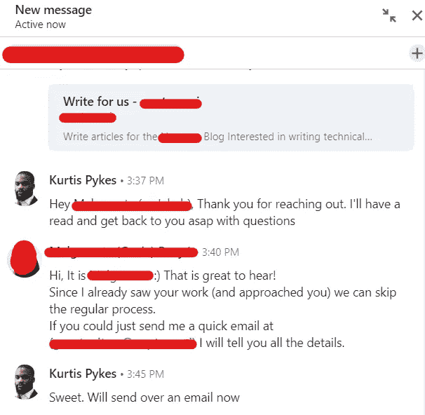

# 为什么我停止申请数据科学的工作

> 原文：<https://towardsdatascience.com/why-i-stopped-applying-for-data-science-jobs-7b93b3b8153b?source=collection_archive---------3----------------------->

## 以及为什么你应该考虑效仿

本·怀特在 [Unsplash](https://unsplash.com?utm_source=medium&utm_medium=referral) 上的照片

九月已经来临，现在是 2020 年；新冠肺炎疫情仍然完全有效。雇主的自由休假期即将结束。从 10 月份开始，所有公司都必须为所有被解雇的员工支付全薪的 20%到 80%——如果他们想留住这些员工的话。

我是一名无薪工人。

我记得 HR 联系过我……”不幸的是，Kurtis，我们得出了一个结论，你作为机器学习工程师的角色将被解雇——“从那时起，我完全迷失了方向。

**该死！**

我在那里度过了过去的 18 个月，却没有任何表现。我可以指责，因为从来没有任何计划将数据驱动的决策引入公司的工作流程，但我很愿意为我的失误负责。此外，新冠肺炎严重打击了公司。他们没有豪华员工的空间。我是一名奢侈品员工。

够疯狂的是，我早就在考虑离开。我知道我在那里的日子屈指可数，但我只是没想到会这么快，或者以这种方式。

我想我可以多拿几张薪水支票，同时为我即将做出的决定做好准备。老实说，我觉得我的直线经理打卡了。在办公室的最后几天里，他情不自禁地注意到了我时尚感的转变。

"*哇，KP…好漂亮的鞋子。那就不再买高级运动鞋了？他会脸上带着假笑说。*

不管怎样，这是最终决定。我不可能匆忙回到一份新工作中。就好像我刚从一段有害的关系中走出来——我还没准备好再次做出承诺。

深度学习和自然语言处理在我 2020 年的“学习”清单上排在前列。也许这是上天给我们的一个信号，让我们认真对待，不要再拖拖拉拉了——我的 LinkedIn 收件箱正被自由职业者的机会所困扰，这可能证实了这一点。

我跟着直觉走。

自从我上次做全职工作以来，已经过去了几个月。我添加了一些很酷的新项目来美化我的 [Github 组合](https://github.com/kurtispykes)，利用我在 Coursera 上参加深度学习专业化和自然语言处理专业化所学到的新技能。

我记得我告诉我的朋友“在我的一生中，我从来没有像现在这样觉得自己已经做好了工作的准备”。终于是回到全职工作的时候了。

那不会持续很久…

我只花了 15 份申请就开始了我的下一次冒险，然后我突然意识到…

> "*也许申请工作不一定是成为数据科学家的最佳方式*"

我知道这听起来适得其反。听我说完。

# 为了得到一份工作，得到关注

毫无疑问，数据科学工作的需求很大——看看一个工作角色上传到 LinkedIn 上时收到的申请数量。我曾经和一位招聘人员交谈过，他们告诉我他们每天收到 150-250 份工作申请**。**

</getting-a-data-science-job-is-harder-than-ever-fb796aae1922>  

这让我大致了解了我所面临的情况，但同时，这也让我想知道我如何才能在所有这些申请人中脱颖而出。

有些人选择不同的配色方案，而不是传统的黑白简历。有些人会向他们认为可能对招聘过程有影响的人发送一堆冷冰冰的电子邮件和电子邮件(LinkedIn)——有趣的是，我也遇到过这样的情况。要是他们知道就好了。

一般来说，人们有很多方法试图让他们的应用程序脱颖而出。

> 在我看来，我相信获得一份数据科学的工作就是让你在招聘人员面前脱颖而出。

你是否是这份工作的合适人选取决于看你申请的人的理解——少谈影响他们当天决策的各种其他因素。

当我说一份简历永远不能真实地反映一个人能带来什么时，我不相信我是唯一的一个。然而，我意识到让公司去见每一个递交申请的人会适得其反。

## 那你怎么让自己脱颖而出呢？

如果我回想我做过的每一份自由职业，我会发现一个非常有趣的模式正在形成…

**我从来没有申请过任何一个！**

我只是做我的生意，在 LinkedIn 上与人交流，分享我出于个人兴趣而不是希望找到工作而创作的内容和项目。在我知道之前，人们来敲我的门要求我的服务。

一开始，我并没有刻意采用这种策略，因此它导致了许多随机的工作机会。当我意识到人们只是根据他们对我的看法来接近我，而我根据我分享的内容来决定人们在网上对我的看法时，我创造了一种策略，这种策略更专注于我实际想要解决的问题类型。

这个故事的寓意是，分享你正在做的令人兴奋的事情，人们就会来找你。此外，对你分享的内容尽可能深思熟虑总是好的。

> **注**:下面这篇文章深入探讨了这种方法。它最初是出于自由职业的考虑而创建的，但通过实施这一策略，我也收到了相当一部分永久性的邀请(我没有接受，因为这不是我想要的)。

<https://medium.datadriveninvestor.com/5-ways-to-attract-freelance-data-science-clients-to-you-b79fdb76eab>  

# 自由职业的兴起

自由职业已经存在很长时间了，但是今天，它在工作中变得越来越普遍。人们决定做自由职业者的原因有很多，从创造自己的工作时间的灵活性，赚取额外现金的能力，在某些情况下比全职工作赚得多得多，以及决定你希望从事的项目类型的能力。

雇主们也见证了雇佣自由职业者而不是全职员工的诸多好处。因此，市场上这类机会稳步上升。

</freelancing-may-be-the-best-way-to-do-data-science-in-2021-4f04e76da0b6>  

最初，自由职业只是我在没有全职工作的那几个月里为了经济上过得去而做的事情。我从未申请过自由职业，也不知道如何申请，因此我不禁对自己的未来感到不安。

*“如果他们终止合同怎么办？”*

*“如果我做不了这份工作怎么办？”*

*“我得到差评怎么办？”*

*“那我的员工福利呢？”*

一开始，我没有当员工时一半的安全感——当然，现在我知道这只是一种幻觉——但随着时间的推移，我在 LinkedIn 的收件箱里继续收到越来越多的自由职业邀请。

一个在 LinkedIn 上联系我的人的例子——Idententy 因为保密而被模糊化了；作者图片

我知道我非常幸运有人带着工作来找我，我永远感激我在这个位置上。然而，不言而喻，我已经做了大量的工作，把自己放在这个位置上，即使是现在，我也一直在想办法提高自己，以吸引更好的机会。

有了这样的选择，我究竟为什么要决定通过申请工作来给自己施加压力呢？

哦，我忘了补充…我现在做自由职业者比做全职工作时挣得多… **我少工作了 20 个小时。**

# 逆向法则

这个原因给这个混合体注入了一点哲理…

反向定律，或称反向努力定律，是由哲学家艾伦·瓦茨提出的。它传达了一个想法，你越是追求感觉更好，你就越不满足，因为追求一些东西只会强化你首先缺乏它的事实。例如，如果你极度渴望变得富有，那么不管你目前挣多少钱，你都可能会感到更加贫穷和不值得。

> “当你试图停留在水面上时，你会下沉；但是当你试图下沉时，你会浮起来”——艾伦·沃茨

话虽如此，但毫无疑问，我想成为一名数据科学家。想到与真正聪明的人一起从事令人兴奋的数据科学项目，他们分享了我让世界变得更美好、更安全的热情，这足以让我去健身房锻炼。

落后定律强调，由于过于关注结果，我们最终会把结果放在一个基座上；从本质上说，专注于你渴望的东西只会强化你的潜意识，让你知道你目前正缺少那个东西。

相反，我们应该更加关注实现目标所需的行动。这在我们的脑海中建立了一个潜意识的自我形象，与实现目标的人相对应，因此，我们会像我们想成为的人一样思考和行动——这意味着它在现实世界中出现只是时间问题。

把它放在上下文中…

通过将我的注意力集中在数据科学家执行的动作上，并持续执行相应的动作，我将为我的潜意识提供足够的证据，以形成我已经成为我希望成为的数据科学家的信念——与希望让世界变得更好、更安全的真正聪明的人一起从事令人兴奋的项目——这将影响我的行动以及思维模式，从而采取相应的行动，直到它在现实世界中真正实现。

# 最终想法

我知道我的情况与其他可能阅读这篇文章的人不同。我并不是说每个人在构建自己的职业生涯时都应该遵循我的策略。一天结束时，这一切都归结为什么策略最适合你，什么让你感觉最平静。

对一些人来说，向大量的职位空缺提交大量的申请可能是一件令人愉快的事情——尽管我还没有遇到真正喜欢这个过程的人。对我来说，这种方法不太受欢迎。如果你喜欢以你一直在做的方式成功，那么你也可以继续，但如果不是，那么也许是时候改变了。

感谢您的阅读！

在 LinkedIn 和 T2 Twitter 上与我保持联系，了解我关于数据科学、人工智能和自由职业的最新消息。

## 相关文章

<https://medium.datadriveninvestor.com/how-freelance-data-science-has-changed-my-life-4c387aa6164d>  </5-tips-for-beginner-freelance-data-scientists-e2b421f239d>  </3-traits-all-great-data-scientist-have-c43ab2de6e64> 