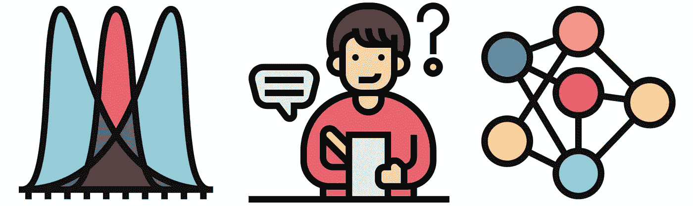

# 我为什么写数据科学

> 原文：<https://towardsdatascience.com/why-i-write-about-data-science-75667a5ef0ae?source=collection_archive---------39----------------------->

## 撰写数据科学文章的 6 大好处

今天是我在 Medium 上发表第一篇数据科学文章的一周年。它做得出乎意料的好，最初的成功给了我很大的动力。从那以后，我又发表了 11 篇文章。不幸的是，很明显，当其他人做得不好的时候，我成了新手运气的牺牲品。即便如此，我还是坚持不懈地撰写和发布文章。这是因为我不仅受到观点的激励，也受到写作的许多其他好处的激励。

来源: [flaticon](https://www.flaticon.com/premium-icon/note_3200644?term=writing&page=1&position=12&page=1&position=12&related_id=3200644&origin=search)

## 学习和提高技术技能

第一个好处是，它帮助我了解了更多关于数据科学的知识。当你离开大学时，你失去了所有的结构，你必须把你的教育掌握在自己手中。写文章是我做这件事的方式。无论我想学习一些新的理论还是如何应用 python 框架，我都把一篇文章作为一种目标。在学习新概念时，它给了我一些急需的指导。

我是说真正的学习！阅读和应用概念是一回事；解释它们是另一回事。当你试图把你的想法写下来时，你会意识到你理解中的所有漏洞。我经常发现，在我能把一个概念用语言表达出来之前，我不得不回过头去试着正确地理解它。最终，文章提供了学习的方向和对我理解的检验。

## 提高沟通技巧

当你进入职场，你首先会意识到的一件事就是沟通技巧非常重要。他们在 STEM 学位中经常被忽视。你可以学习编码，但不知道如何解释代码是如何工作的。在现实中，你必须一直这样做。更糟糕的是，你试图向其解释的人通常没有技术背景。显示编码或给出数学函数不会削减它。

同样，当我写作的时候，我想接触尽可能多的读者。这些人不一定是机器学习方面的专家，但他们仍在学习。无论是使用可视化还是书面解释，我必须找到直观的方式来解释事情。这是在我的日常工作中解释技术概念的很好的练习。老实说，我认为这些改进的沟通技巧比我获得的任何技术技能都更有价值。

沟通和技术技能的交集是编写干净、可读的代码。编写有效的代码是一回事，但编写人类能够理解的代码是另一回事。我的几篇文章是编码教程。我花了很多精力让代码变得容易理解，每一次教程，我都觉得自己在进步。这再次帮助了我的日常工作。当你在团队中工作时，能自我解释的代码会节省你很多努力。

## 建立工作关系网

我不只是在 medium 上发文章。我也在推特和 Instagram 上分享它们。我已经慢慢发展了一批追随者，并与同样对数据科学感兴趣的人建立了联系。这已经带来了一些机会。就我的写作而言，他们给了我一些有价值的反馈，我经常能得到新文章的好主意。比如下面 Instagram 上的问题，很多人用“情绪分析”回复。于是，我以为题写了一篇[教程。](/introduction-to-sentiment-analysis-f623f7d40bfa)

来源:[作者](https://www.instagram.com/conorosullyds/)

## 建立你的声誉

写作可以帮助你脱颖而出。通过写关于一个主题的文章，你正在确立自己作为专家的地位。文章是你知道某件事并能解释它的证据。这些技术和沟通技能在你的简历上看起来不错。这一点，加上上面提到的更大的关系网，可以帮助你打开许多机会。

## 你可以赚钱

更多的机会可以带来更高收入的工作，但也有直接的经济利益。特别是，在媒体上，你可以通过写作赚钱。在你兴奋之前，它不是很多。我想如果我必须计算每小时写作的收入，我的收入会远远低于最低工资。这仍然是一笔不错的奖金，而且是被动收入。一旦你写了一篇文章，它就可以永远继续赚钱。希望随着我的观众人数的增长，这个数字会变得更大。

## 创意出路

到目前为止，提到的好处可能并不那么令人惊讶。我没想到的一点是，我真的很喜欢写作本身。开始的时候，很难，我的话感觉很笨拙。通过练习，我发现我的想法更容易地在指尖流动。我觉得我还有很长的路要走，但我已经发现表达自己更容易了。将来，我想写一些我的其他兴趣。甚至可能是一点虚构。

回想起来，我很高兴我开始写作。我从中学到了很多东西，我觉得它让我成为了一名更全面的数据科学家。重读我的第一篇文章，我觉得去年我进步了很多。希望一年后我会有同样的感觉。如果你对那篇文章感兴趣，你可以在下面阅读它。

</the-power-of-feature-engineering-b6f3bb7de39c>  

## 图像来源

所有图片都是我自己的或从[www.flaticon.com](http://www.flaticon.com/)获得的。在后者的情况下，我拥有他们的[高级计划](https://support.flaticon.com/hc/en-us/articles/202798201-What-are-Flaticon-Premium-licenses-)中定义的“完全许可”。